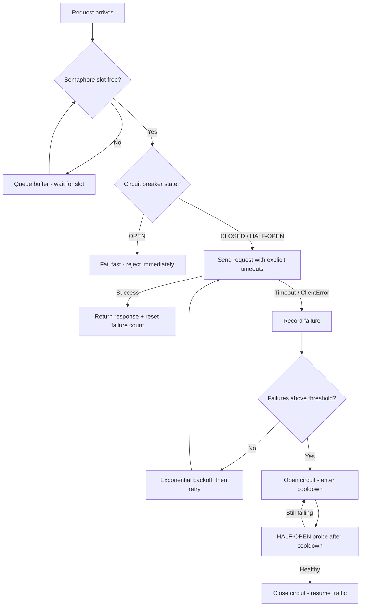

| Difficulty | Channel | Tags |
|---|---|---|
| advanced | backend | asyncio, aiohttp, concurrency |

By 2011, Netflix's API was absorbing more than 1 billion incoming calls per day — every one fanning out to dozens of subsystems that together peaked at more than 100,000 dependency requests per second. The team realized that a single slow or failing dependency could saturate every Tomcat request thread in seconds, and that 30 dependencies each at 99.99% uptime still multiplies into over two hours of downtime per month [1]. If you run async Python services on aiohttp, the exact same failure dynamics are waiting inside your connection pool. This post walks through how Netflix fought cascade failure [1], and how you can bring that same resilience to aiohttp with a semaphore, exponential backoff, and a circuit breaker of your own.

---

> ### Real-World Case — Netflix
>
> By 2011 the Netflix API was receiving more than 1 billion incoming calls per day, fanning out 1:6 to dozens of underlying subsystems at peaks above 100k dependency requests per second. The team realized that a single latent or failing dependency could saturate every Tomcat request thread in seconds and take down the entire API, and that 30 dependencies each at 99.99% uptime multiplies into 2+ hours of downtime per month.
>
> | | |
> |---|---|
> | **Challenge** | How to keep the streaming API alive when any one of dozens of downstream services became slow or timed out, without letting that dependency's failure cascade across the whole system. The arithmetic was brutal: even 0.01% downtime per dependency meant the aggregate was unavailable hours per month unless engineers hardened the whole chain with timeouts, isolation, and graceful degradation. |
> | **Solution** | Netflix built DependencyCommand, the precursor to Hystrix, wrapping every dependency call with a combination of exactly the patterns in this topic: aggressive network timeouts and retries, per-dependency thread pools with semaphores (non-blocking tryAcquire, not blocking locks) as a second isolation layer, and circuit breakers that tripped at roughly a 50% error rate in a 10-second rolling window to shed load and fail fast. Every failure path — timeout, pool/semaphore rejection, or open circuit — routed through fallback logic (custom fallback, fail-silent, or fail-fast) so users got a degraded-but-working response instead of a hung request. |
> | **Outcome** | Within a year Hystrix was executing tens of billions of thread-isolated and hundreds of billions of semaphore-isolated calls per day at Netflix with a dramatic, company-wide improvement in uptime. During a real incident where the API began throttling its own database with too much traffic, 157 of 200 servers automatically tripped the DB circuit and served a local query cache fallback — and video views per second stayed essentially flat, meaning members barely noticed. |
> | **Lesson** | Reliability is an aggregate problem: near-perfect dependencies still multiply into hours of monthly downtime. The counterintuitive ops insight Netflix documented is that when a circuit opens, the wrong reaction is to inflate your timeouts, thread pools, or queue sizes to 'give it breathing room' — those limits are the protection. The right move is to let it fail fast and fix the root cause, because retry loops and enlarged pools just become a self-inflicted DDoS on the ailing dependency. |

---

## Hook — The ceiling you hit when your connection pool becomes a bottleneck, not a helper

Pull up your favorite metrics dashboard and watch what happens when an upstream service slows from 20ms to 3 seconds. The symptom starts innocuous: a couple of red lines on a latency chart. Then queues grow, sockets pile up, and pretty soon every worker async task is staring at a stalled connection that will not return. Sound familiar? It should — this is cascade failure, and it is the reason your 'just add more connections' instinct is exactly backwards.

Adding connections to a system that is already saturated does not make it faster; it makes the failure bigger, because every new request simply joins the traffic jam. Before touching a line of code, the thing to internalize is that resilience is not a tuning exercise. It is an architectural decision about what fails cheaply and what fails loudly.

## Problem — When one slow dependency takes your whole service hostage

Here is the trap: modern services rarely call one backend. Production Python services stitch together databases, caches, auth providers, payment gateways, and data pipelines — each with its own latency, its own throughput ceiling, and its own unexploded failure modes. Now do the arithmetic. Ninety-nine-point-nine-nine percent uptime sounds heroic, until you string 30 dependencies together, because the reliability of the whole is the product of the parts — and the product of 30 nearly-perfect services lands you at roughly 99.6% overall, which is more than two hours of downtime every month [1].

For an aiohttp application, the problem compounds at the connection level. A default ClientSession opens a fresh connection for each request unless the connector is tuned; a saturated pool makes requests wait on sockets parked in a slow response; and a burst of timeouts turns every retry into a fresh stampede. The pool is where systemic risk becomes a line of Python — and most pools are one misconfiguration away from turning a single degraded endpoint into a platform-wide meltdown.

> ⚠️ **Watch Out:** aiohttp's default timeout is total inactivity on the connection, not the whole request — and the default connector has no keepalive tuning, so timeouts plus churn can quietly exhaust file descriptors.

## Real-World Case — Netflix's Hystrix is a library and a cautionary tale

With over a billion calls per day and fan-outs beyond 100,000 dependency requests per second, Netflix reached a brutal conclusion in 2011: one latent dependency could consume every Tomcat request thread within seconds and take the entire API down — and no amount of '5-nines' from individual subsystems could protect them [1]. Their response was Hystrix, and it introduced three ideas that reshaped how the industry thinks about fault tolerance: thread isolation so one dependency could not eat the shared pool, semaphore isolation for the hottest paths, and an automatic circuit breaker that tripped when failures crossed a threshold [2].

The impact was dramatic. Within a year, Hystrix was executing tens of billions of thread-isolated calls and hundreds of billions of semaphore-isolated calls per day, with a company-wide improvement in uptime [1]. The most telling moment came during a real incident: the API began throttling its own database with too much traffic, and 157 of 200 servers automatically tripped the DB circuit and served a local query-cache fallback. The metric that mattered — video views per second — stayed essentially flat. Members barely noticed.

That is the real goal of graceful degradation: not avoiding failure, but making it invisible.

## Deep Dive — The three-layer defense your aiohttp pool actually needs

Building on the Netflix story, the transferable architecture is three coordinated layers, each solving a different failure mode.

First, the semaphore. asyncio.Semaphore caps how many requests are in flight at once, which is the async equivalent of Hystrix's thread isolation — it guarantees one slow dependency cannot silently consume unbounded resources [7]. Second, exponential backoff. When a request fails, retry with delays that grow geometrically (100ms, then 200ms, then 400ms), so the retry storm subsides instead of amplifying [4]. Third — the layer Netflix bet the company on — the circuit breaker. Once failures cross a threshold, stop sending requests to that dependency for a cooldown window and fail fast, giving it room to recover instead of drowning it in traffic [5].

The state machine is deceptively simple: CLOSED, OPEN, HALF-OPEN. Closed means traffic flows. Open means requests are rejected immediately, protecting both the downstream service and your own pool from further damage. Half-open is the probe state, where a single trial request tests whether the dependency has revived before closing the circuit again [3].

Many developers stop at the semaphore, assuming pooling is only about concurrency limits. The plot twist: healthy pools are opinionated about what happens on **failure**, not just about how many connections they allow.

| Strategy | What it optimizes | Failure mode it misses | When to reach for it |
|---|---|---|---|
| Semaphore limiting | Resource ceilings | Slow-but-not-saturated dependencies | Always, as the base layer |
| Exponential backoff | Retry storms | Can still hammer a dead service while guessing | Transient errors, rate limits |
| Circuit breaker | Systemic cascades | Adds complexity; masks real problems if thresholds are wrong | Long-running production services |

> 🔥 **Hot Take:** the retry loop is the most dangerous code in your app. Retries without a circuit breaker are how a 2-second blip becomes a 2-hour self-inflicted outage — every timed-out caller retries into the same dead endpoint at the same moment [4].

A balanced pool uses all three — the semaphore for containment, backoff for recovery, and the breaker as the last line of defense. Skip the breaker and you are trusting luck that the failing service recovers before your retries finish the job.

## Workflow — From request to graceful fallback in five defensive moves

With the theory in place, the operational flow is best understood as a pipeline. Requests arrive, the semaphore decides who gets a slot, the breaker decides whether the fight is worth fighting, and timeouts plus backoff govern recovery. The diagram below tells the whole story in one glance.

1. **Contain** — acquire a semaphore slot; excess requests wait in an internal queue instead of piling up as sockets.
2. **Assess** — check the breaker; if OPEN, reject immediately with a clear error. Failing fast beats failing obscurely.
3. **Send** — issue the request with explicit connect, read, and total timeouts, because aiohttp's defaults will sit and wait far longer than your users will.
4. **Recover** — on timeout or client error, record the failure, apply exponential backoff, and retry up to the configured budget.
5. **Trip** — when failures cross the threshold, open the circuit, let it cool down, then probe readiness with a HALF-OPEN request before closing [3].

Each step is cheap to build, but the ordering matters: containment before retry, retry before circuit-breaking, and circuit-breaking before chaos.

> 🎯 **Key Point:** the semaphore protects your pool, but only the circuit breaker protects your **dependency**. Do not ship the first without the second.

## Code Example — A production-leaning aiohttp pool with a real circuit breaker

The moment of truth: wiring these ideas into a class you could actually ship. The example below builds a ConnectionPoolManager with three ingredients — a semaphore that enforces the concurrency ceiling, a small CircuitBreaker with CLOSED / OPEN / HALF-OPEN states, and a retry loop running exponential backoff under explicit timeouts. It is deliberately compact so the pattern stays visible, and every decision maps back to a failure mode from the deep dive.

## Lessons Learned — Battle scars from teams who learned this the hard way

Every pool eventually tells a war story. Here is what the painful ones have in common:

- **Connection leaks are silent killers.** A response you never close is a socket you leaked, and leaked sockets eventually exhaust the pool. Always close responses or fully consume them inside the handler.
- **Defaults are optimism, not engineering.** aiohttp will happily wait far longer than your users will. Set explicit connect, read, and total timeouts — and keep them shorter than your SLA, not equal to it.
- **skipping session.close() on shutdown is not optional.** An abrupt interpreter exit skips pending cleanup, which is exactly when background tasks pile up and reset order corrupts [6].
- **A circuit breaker without observability is a blind spot.** Log when the breaker trips and when it closes; the Netflix team built entire dashboards around these transitions [2].
- **Validate the retry budget.** Three retries with backoff buys resilience against flaky connections. Infinite retries quietly turn an outage into a self-inflicted DDoS [4].

> 💡 **Insight:** a well-tuned pool feels like magic because it removed the boring work — queues, backoff, state transitions — from your hot path. The dependency outages still happen; they just stop being your problem.

If this feels like a lot, you are not alone — every production-grade pool is the product of broken weekends. Start small. Tomorrow, do three things: give the TCP connector an explicit limit and keepalive_timeout [9] [10], wrap writes in a semaphore, and log the first failure of every burst so you can spot the trend before the dashboard goes red.

---

## Connection Pool Resilience Flow

<strong>Original Interview Question</strong>

**Q:** How would you implement a connection pool manager for aiohttp that handles graceful degradation under high load and connection timeouts?

**A:** Implement a connection pool manager for aiohttp using a semaphore to limit concurrent connections, exponential backoff for retrying failed requests, and circuit breaker pattern to gracefully degrade under high load and connection timeouts.

## Conclusion

Every service you call is a dependency with an opinion about reliability — and as Netflix proved, tying them all back to a single pool is an arithmetic catastrophe waiting to happen [1]. The fix is not exotic: a semaphore to contain, a backoff strategy to recover, and a circuit breaker to decide when to stop fighting. Start small: instrument your current pool, find the conversations it holds when one dependency slows, and add the breaker with a deliberately generous threshold first. The moment your service survives its first dependency outage with users barely noticing is the moment all of this infrastructure work becomes worth it. That is a story worth sharing with your team tomorrow — so ship the breaker.

---

## References

1. [Netflix incident report](https://netflixtechblog.com/fault-tolerance-in-a-high-volume-distributed-system-91ab4faae74a) — article
2. [Netflix/Hystrix - latency and fault tolerance library](https://github.com/Netflix/Hystrix) — documentation
3. [CircuitBreaker - Martin Fowler](https://martinfowler.com/bliki/CircuitBreaker.html) — blog
4. [Exponential backoff - Wikipedia](https://en.wikipedia.org/wiki/Exponential_backoff) — documentation
5. [Circuit breaker design pattern - Wikipedia](https://en.wikipedia.org/wiki/Circuit_breaker_design_pattern) — documentation
6. [asyncio - Asynchronous I/O (Python documentation)](https://docs.python.org/3/library/asyncio.html) — documentation
7. [asyncio synchronization primitives incl. Semaphore](https://docs.python.org/3/library/asyncio-sync.html) — documentation
8. [aio-libs/aiohttp - Async HTTP client/server for asyncio](https://github.com/aio-libs/aiohttp) — documentation
9. [aiohttp client quickstart and reference](https://docs.aiohttp.org/en/stable/client_quickstart.html) — documentation
10. [RFC 7230 - HTTP/1.1 Message Syntax and Routing (persistent connections)](https://datatracker.ietf.org/doc/html/rfc7230) — documentation

---

**Author:** Satishkumar Dhule — [GitHub](https://github.com/satishkumar-dhule) · [LinkedIn](https://linkedin.com/in/satishkumar-dhule) · [Website](https://satishkumar-dhule.github.io)
