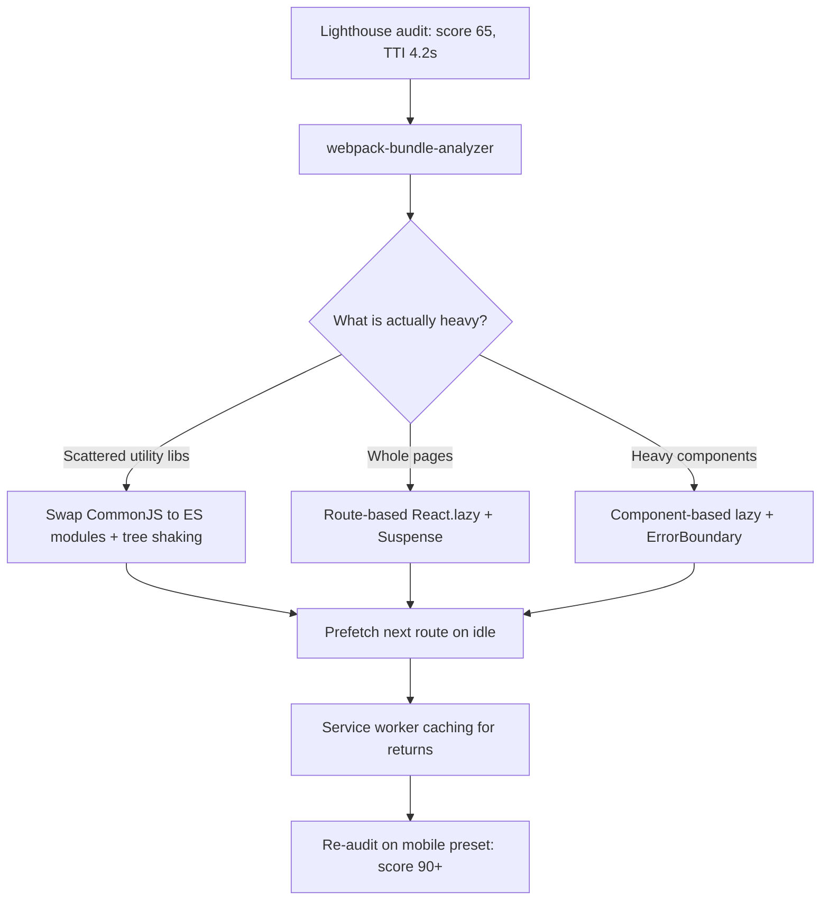

| Difficulty | Channel | Tags |
|---|---|---|
| intermediate | frontend | lighthouse, bundle, lazy-loading |

Netflix's logged-out landing page — a plain marketing page by every measure — needed about 7 seconds to become interactive on a simulated 3G connection [1]. Roughly 300kB of JavaScript, most of it React, Lodash, and hydration data, stood between users and the sign-up form. Netflix engineers cut Time-to-Interactive by more than 50%, dropping it below 3.5 seconds and shrinking the bundle by ~200kB [1]. This is the story of how they did it — and the exact playbook you can apply when Lighthouse hands your React app a failing grade.

---

> ### Real-World Case — Netflix
>
> Netflix's logged-out landing page at netflix.com was performing poorly — profiling with Chrome DevTools and Lighthouse on a simulated 3G connection showed it took ~7 seconds to load and become interactive, yet it was just a simple landing page. The page shipped roughly 300kB of JavaScript, including client-side React (~45kB), Lodash, and state-hydration data needed to bootstrap the SPA.
>
> | | |
> |---|---|
> | **Challenge** | Cut Time-to-Interactive and payload on the critical landing page without breaking the much larger React single-page signup flow that users navigate into next — the framework and app code required for later pages was dragging down the first load. |
> | **Solution** | The team audited bundle composition and TTI impact, then removed React, Lodash and other client-side libraries from the landing page entirely, trimming the JavaScript bundle by over 200kB. React was kept only for server-side rendering of the initial HTML. While users lingered on the landing page, Netflix prefetched React and the rest of the SPA code for the subsequent signup flow, so the heavier, interactive pages loaded fast when navigated to. |
> | **Outcome** | Time-to-Interactive for the logged-out desktop homepage improved by more than 50% — from ~7 seconds on 3G to under 3.5 seconds on desktop (validated in Lighthouse). JavaScript bundle was reduced by ~200kB, and prefetching the next page's resources further cut TTI by ~30% for subsequent navigations. |
> | **Lesson** | The framework itself is often the single biggest cost on the critical path — even a 'small' library like React adds meaningful parse and execution overhead. Use Lighthouse and real metrics to question whether every dependency belongs in the first-load bundle, defer or strip heavy code from initial load, and prefetch what's genuinely needed for the next step. The counterintuitive takeaway: the fastest JavaScript is often the JavaScript you don't ship (or defer) on the critical path. |

---

## Hook — a 7-second landing page and the customers it cost

Picture this: no movie trailers, no video player, no login wall — just a simple marketing page with a sign-up form. And yet it takes 7 seconds before anyone can actually click anything. That was the reality at Netflix, where the logged-out homepage shipped roughly 300kB of JavaScript: client-side React (~45kB), Lodash, and state-hydration data needed to bootstrap the SPA [1]. Every extra second on that page is a customer back-clicking to Google. The fix wasn't a faster server fleet or a bigger CDN check — it was disciplined JavaScript dieting. Here is the thing though: most React developers are shipping the same mistake Netflix shipped; they just haven't met their Lighthouse audit yet.

## Problem — when 2.1MB of JavaScript becomes the bottleneck

You know the ticket: take the Lighthouse score from 65 to 90+. The bundle is 2.1MB, Time to Interactive is 4.2 seconds, and the business wants it fast yesterday. Sound familiar? Many developers reach for a CDN or 'just get a beefier server.' But on a throttled connection, your real enemy is already sitting in your own bundle. Every script goes through download → parse → compile → execute, and only then does the page become interactive — parsing and compiling are CPU-heavy work that runs on the main thread, the very same thread that renders your UI [8]. The stakes are brutally mathy: each additional 100kB of JavaScript on the main thread adds roughly half a second of processing on average mobile hardware, and real users are far less forgiving than your CI pipeline [8]. Moreover, this isn't just a startup problem. When a 2.1MB bundle meets a slow connection, you are effectively telling a chunk of your audience: 'this app is not for you.' The question is not whether to optimize, but where to start without breaking everything.

## Real-World Case — Netflix teaches the internet a lesson

To see the playbook in action, you only need to look at how Netflix's engineers fixed essentially this exact problem [1]. Profiling with Chrome DevTools and Lighthouse on a simulated 3G connection exposed the painful truth: the logged-out desktop homepage took ~7 seconds to load and become interactive — on a page that was functionally a form. The team stripped the page bare: they removed unnecessary libraries, server-rendered the critical content, and deferred everything that didn't matter for first paint [1]. The numbers that followed were staggering. Time-to-Interactive improved by more than 50%, from ~7 seconds on 3G to under 3.5 seconds on desktop, validated in Lighthouse [1]. The JavaScript bundle shrank by ~200kB. Consequently, a page that once felt broken on slow connections became snappy. But the plot doesn't end there — Netflix also prefetched the next page's resources, which cut TTI for subsequent navigations by roughly another 30% [1]. So when your audit says 65, remember: the gap between 65 and 90+ is usually not hardware. It's bytes, and when they arrive.

## Deep Dive — the mechanics that make lazy loading actually work

Building on the Netflix numbers, you need to understand the machinery before touching a single import statement. The headline insight: you optimize 'what ships on the initial path,' not just 'total size.' Route-based splitting uses React.lazy to defer entire pages until the user asks for them [2], while component-based splitting defers heavy UI like charts, editors, and media players until they are about to mount [5]. Each lazy component becomes its own chunk, requested on demand — and Suspense hands you a fallback while that request is in flight [5]. However — and here is the plot twist — dynamic imports only work if your bundler actually respects the boundaries. Tree shaking, in particular, quietly does nothing unless you are using true ES modules (import/export), because bundlers cannot safely strip unused CommonJS exports [7]. Specifically, a single `require('lodash')` can pull in the entire library, while `import { debounce } from 'lodash-es'` ships just debounce. Here is a comparison worth pinning to your monitor: route-based splitting splits whole pages, suits any app with multiple routes, and its main cost is an extra round-trip on navigation; component-based splitting targets heavy UI like charts and players, shines when one page has a monster component, and risks a flash-of-unstyled-content without a solid Suspense fallback; library extraction pulls stable vendors into their own chunk, which helps HTTP cache invalidation but can multiply round-trips if over-done. Teams that skip the analysis step make the classic mistake: splitting everything in sight, creating dozens of micro-chunks that each cost a round-trip — sometimes slower than the monolith they started with. Therefore, measure first, split second. And once the hydration data is no longer bundled into the initial payload, cache the rest: a service worker can pre-cache previously visited code so returning users pay almost nothing [9].

## Workflow — the repeatable ritual from 65 to 90+

Once the trade-offs are clear, the process becomes a loop, not a one-off scramble. First, establish a brutal baseline: run Lighthouse with its mobile preset so CPU throttling and a simulated slow 4G connection decide your fate [6]. Second, visualize the problem with webpack-bundle-analyzer — it renders your bundle as a treemap, so the 800kB monster hiding inside a seemingly innocent import becomes obvious at a glance [4]. Third, purge: remove unused dependencies, migrate heavy CommonJS libs to ESM aliases, and confirm tree shaking is active in your build config [7]. Fourth, split: start with route-based lazy loading, then component-based lazy loading for anything visually heavy [2][5]. Fifth, load smart: lazy-load images and iframes below the fold, and prefetch the next route while the user reads the current one — the same trick Netflix used to shave another ~30% off subsequent navigations [1]. Finally, cache: give your service worker a hydration strategy so returning visitors skip most of the network entirely [9]. The whole loop (see the flowchart below) is what turns a guessed experiment into a repeatable engineering practice: audit from 65, open the analyzer, identify what is heavy, swap CommonJS for ESM and tree-shake, split routes and heavy components with React.lazy plus error boundaries, prefetch the next route on idle, and finish with service worker caching — then re-audit on the mobile preset and watch the dial land at 90+.

## Code Example — route-based and component-based splitting in practice

This is where theory meets the keyboard. The example below shows the production pattern: lazy routes wrapped in Suspense [5], an error boundary so a failed chunk (think: flaky network, redeploy mid-session) can't blank-screen the entire app [3], and lazy heavy components scoped to the page that actually needs them [2].

## Lessons Learned — what the audit taught the people who fixed it

Pull the threads together and a few battle scars emerge worth sharing. One: split deliberately, not surgically — component-level splitting of a sub-10kB card is overhead with no payoff; split things that cost real pixels and real milliseconds [5]. Two: tree shaking is a fragile promise; it silently dies on CommonJS, on barrel files that re-export everything, and on side-effect-laden imports — verify it in your bundle analyzer or your 'optimization' never shipped [7][4]. Three: lazy loading moves work but does not delete it — an unresolved lazy import doubles as a first-paint risk, which is precisely why good Suspense fallbacks and prefetch strategies matter [5][1]. Four: your Lighthouse screenshot on a desktop fiber connection means nothing; run the mobile preset, throttle CPU 4x, and let Slow 4G be the judge [6]. Many developers discover the hard way that a 2.1MB bundle is not a performance problem until it is measured — by which point the marketing team is already unhappy. The playbook, in one line: analyze, purge, split, prefetch, cache, re-measure. Apply it once and the 90+ score stops being a milestone and starts being a baseline.

---

## Performance optimization workflow

<strong>Original Interview Question</strong>

**Q:** You're tasked with improving a React app's Lighthouse performance score from 65 to 90+. The bundle size is 2.1MB and Time to Interactive is 4.2s. What specific steps would you take to optimize the bundle and implement lazy loading?

**A:** Implement code splitting with React.lazy() and Suspense, analyze bundle composition with webpack-bundle-analyzer to identify largest chunks, remove unused dependencies and optimize imports, add dynamic imports for heavy components and third-party libraries, implement route-based splitting for better initial load times, and utilize tree shaking with proper ES module configuration.

## Conclusion

The moral of the Netflix story is that a fast page is a tiny page on the right path at the right time — not a bigger server. Tomorrow, run one real audit on the mobile preset, open the bundle analyzer, and find the single largest chunk you can cut [6][4]. Defer it with React.lazy, wrap it in Suspense, and prefetch what comes next [2][5]. Then re-audit and watch the score climb — because the reminder this whole journey leaves behind is simple: your users on 3G do not care how hard your bundle worked; they only care how fast your page works. Make that the sentence you share with your team on Monday.

---

## References

1. [Netflix incident report](https://medium.com/dev-channel/a-netflix-web-performance-case-study-c0bcde26a9d9) — article
2. [React.lazy — React reference](https://react.dev/reference/react/lazy) — documentation
3. [Dynamic import - MDN Web Docs](https://developer.mozilla.org/en-US/docs/Web/JavaScript/Reference/Operators/import) — documentation
4. [webpack-bundle-analyzer](https://github.com/webpack-contrib/webpack-bundle-analyzer) — documentation
5. [Suspense — React reference](https://react.dev/reference/react/Suspense) — documentation
6. [Lighthouse — Chrome for Developers](https://developer.chrome.com/docs/lighthouse/overview/) — documentation
7. [Tree shaking — webpack guides](https://webpack.js.org/guides/tree-shaking/) — documentation
8. [Core Web Vitals — web.dev](https://web.dev/articles/vitals) — documentation
9. [Service Worker API - MDN Web Docs](https://developer.mozilla.org/en-US/docs/Web/API/Service_Worker_API) — documentation

---

**Author:** Satishkumar Dhule — [GitHub](https://github.com/satishkumar-dhule) · [LinkedIn](https://linkedin.com/in/satishkumar-dhule) · [Website](https://satishkumar-dhule.github.io)
