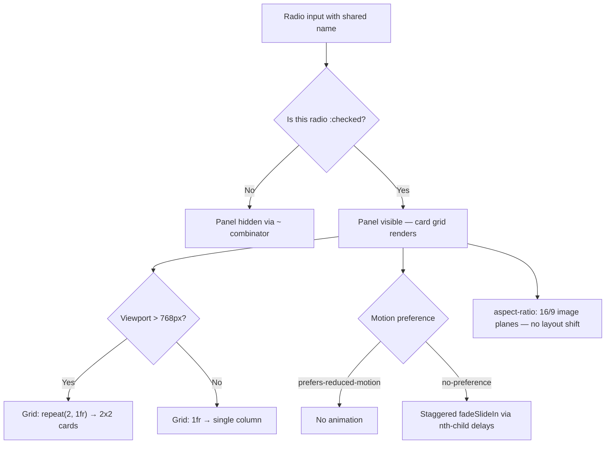

| Difficulty | Channel | Tags |
|---|---|---|
| beginner | frontend | css, flexbox, grid, animations |

In June 2017, eBay flipped a switch that most developers thought was impossible: the company's Active Content Policy banned JavaScript, Flash, iframes, and plugins from listing descriptions to stop malicious scripts and rescue mobile load times [1]. Millions of sellers lost interactive widgets overnight, yet the marketplace kept running — because engineers rediscovered a pattern built entirely on radio inputs and CSS. This article walks through the answers eBay's ecosystem converged on, and why a humble pair of radio inputs might be the most underrated UI primitive in modern frontend.

---

> ### Real-World Case — eBay
>
> In 2017 eBay enforced its 'Active Content Policy,' banning JavaScript, Flash, plugins, iframes, and form actions from listing descriptions for security reasons (malicious scripts and phishing embedded in listings) and to fix poor mobile load times. The announcement effectively stripped interactive widgets out of millions of seller listings overnight.
>
> | | |
> |---|---|
> | **Challenge** | Sellers still needed compact, interactive product presentations — tabbed specs, image galleries, and shipping/returns policy sections — but were legally required to do it with absolutely zero JavaScript. |
> | **Solution** | Sellers and listing-template providers adopted the pure-CSS radio-button state pattern: hidden `` elements share a `name`, labels restyled as tabs, and `:checked ~` sibling combinators drive which panel is visible — the exact technique in this question. Leading template builders (e.g., CrazyLister, Frooition) rebuilt their Tabs and Image Gallery features specifically on this CSS-only technique and marketed them as their 'active-content compliant' replacements. Even eBay's own UI guidance describes a no-JS 'fake tabs' pattern in its design system. |
> | **Outcome** | The ban took effect June 2017 and remains in force. The CSS-only tab pattern is now the de-facto standard across eBay's marketplace, which ended 2025 with ~2.5 billion live listings served to 135 million active buyers generating nearly $80 billion in gross merchandise volume. The policy also forced vendors to re-engineer tools: manual cleanup was estimated at 85 hours per 1,500 listings, accelerating the shift to automated CSS-first templates. |
> | **Lesson** | Sometimes the strongest argument for CSS-only interactivity is a platform constraint, not a performance budget. When JavaScript is forbidden, form-state-driven components (radios + `:checked` + sibling selectors) fill the gap — and the accessibility caveats of the pattern (hide radios with clip/offscreen positioning, not `display: none`; keep `:focus-visible` outlines visible) become make-or-break details at massive scale. |

---

## Hook — the day eBay pulled the JavaScript plug

Picture the chaos: it's June 2017, and eBay enforces its Active Content Policy, stripping JavaScript, Flash, plugins, iframes, and form actions out of listing descriptions [1]. Overnight, a seller's flashy product carousel becomes static text, and tens of thousands of vendors wake up to broken pages. The panic is real — manual cleanup alone eats an estimated 85 hours per 1,500 listings [1]. But here is the plot twist: interactivity didn't die. A tiny HTML primitive that had been sitting in the spec for decades — the radio input — quietly became the foundation of a tab system with zero `` tags. If you're a developer who's ever wanted an interactive tab panel that weighs nothing, ships in any CMS, and survives a security audit, this battle-tested pattern is for you.

## Problem — everyone assumes tabs need JavaScript

The real problem isn't that JavaScript is evil — it's that interactive UI has an expensive default. Build tabs with a framework in 2026 and you inherit a bundle, a hydration bottleneck, and a page that flashes unstyled content before it 'wakes up.' On a giant marketplace, every script in a listing is also an attack surface: a malicious payload hidden in an ``, a phishing form disguised as a tab, a tracker lurking inside a carousel. Therefore the question becomes sharper: can you deliver genuinely interactive UX that is fast, safe, and accessible using only HTML and CSS? Every developer has stared at a markup parser or a strict CSP header and watched a script-dependent widget crumble. That sinking feeling — the widget you can't load — is exactly why eBay's ban mattered beyond eBay. The stakes are measurable: a security policy forced an entire ecosystem to re-learn how to build UI without a single dependency.

## Real-World Case — eBay's Active Content Policy

The ban took effect in June 2017 and has never been lifted [1]. eBay delivered two justifications: security and performance. Scripts embedded in listings had become a vector for malicious code and phishing, and heavyweight widgets were destroying load times on the phones where half the world's buyers lived. The result wasn't a less interactive marketplace — it was a smarter one. The CSS-only tab pattern became the de-facto standard across eBay's search and listing experience, which closed 2025 with roughly 2.5 billion live listings serving 135 million active buyers and generating nearly $80 billion in gross merchandise volume [1]. Consequently, the vendor ecosystem adapted fast: hand-editing gave way to automated CSS-first templates, turning a credibility crisis into a competitive edge for teams that could ship clean, script-free UI quicker than their rivals. If you think your team's accidental jQuery tab widget is harmless, remember — a single policy change can delete it from the world in a day.

## Deep Dive — the radio input as a tiny state machine

Building on the eBay story, here is the technical core. A set of radio inputs sharing one `name` attribute is a perfect exclusive state machine: select one and all its siblings uncheck automatically [9]. The general sibling combinator (`~`) then lets a `:checked` input reveal only the panels that follow it, hiding the rest with a single `input:not(:checked) ~ .panel` rule [2][7]. Grid handles the layout choreography — `repeat(2, 1fr)` builds a 2×2 card grid on desktop, while one `@media (max-width: 768px)` block collapses it to a single column [3][7]. Each card's image area uses `aspect-ratio: 16/9`, a fixed ratio that kills the layout shift you'd otherwise get when images load late [4]. Then come the two accessibility guards that separate a toy demo from a production pattern: `:focus-visible` keeps keyboard outlines visible for mouse-free users, and `prefers-reduced-motion` disables the staggered entrance for people sensitive to vestibular motion [5][6]. Here is the counterintuitive win: a radio group is one tab stop, and arrow keys move between tabs — behavior that's actually closer to the ARIA tabs pattern than many scripted tab widgets ever achieve. The classic mistake? Forgetting the combinator only works forward through siblings — if the inputs aren't siblings of the panels, the selector silently fails and every panel hides at once. The equally sneaky one? Using `display: none` to hide panels removes them from assistive technology, so pair that approach with deliberate `hidden` attribute management for screen-reader users.

## Workflow — wiring up tabs the resilient way

Once the mechanics make sense, the build is a disciplined six-step sequence. First, structure the HTML so the radio inputs come before the labels and every panel is a following sibling. Second, bind visibility to state: unchecked radios hide their panels through the sibling combinator, and the single checked radio reveals its own [2]. Third, lay out the card grid with Grid and a 768px breakpoint for the single-column mobile view [3]. Fourth, lock the image plane with `aspect-ratio: 16/9` so nothing jumps while media downloads [4]. Fifth, wrap the staggered `fadeSlideIn` animation in a `prefers-reduced-motion: no-preference` guard, delaying each card with `nth-child` for a clean cascade [5][8]. Sixth, add a global `:focus-visible` outline so keyboard navigators always know where they stand [6]. The full control flow lives in the diagram below — follow the checked state through visibility, layout, and motion, and you'll see the whole pattern as one coherent pipeline.

## Code Example — a production-ready CSS-only tab panel

Here is the pattern against a black-box environment: a bash scaffold drops in the three files any design-system docs page needs. The HTML keeps every radio before its label and panel — the ordering is what makes the sibling selector work. The CSS then does the entire job: the `input:not(:checked) ~ .panel` rule hides inactive panels, Grid switches between 2×2 and single-column layouts, `aspect-ratio` stabilizes the image area, the animation only fires when `prefers-reduced-motion` allows it, and `:focus-visible` keeps keyboard users oriented [2][3][4][5][6]. No framework, no hydration, no CSP pain — exactly the callback-free resilience that kept eBay-level catalogs alive [1].

## Lessons Learned — what a JavaScript ban taught thousands of developers

If this pattern feels like a fresh superpower, you're not alone — but the real value is in the mindset. First, reach for the platform before the bundle: radio inputs, checkboxes, and details/summary are the web's free state machines [9]. Second, accessibility isn't an add-on; `focus-visible` and `prefers-reduced-motion` are the difference between a clever demo and a shippable pattern [5][6]. Third, every widget is a future liability — the policy you ignored last year can be flipped tomorrow, so prefer scripts that degrade to static content gracefully [1]. Fourth, lock your media dimensions with `aspect-ratio: 16/9` to kill cumulative layout shift before it hurts your Core Web Vitals [4]. Specifically for teams: add one CSS-only tab to your next documentation page and measure the difference in payload and load time. The moment a security review or CMS strips your scripts, that tiny radio group will quietly outperform every framework in your tech stack. The enduring insight? The best interactive UI is the one that works whether or not the JavaScript ever loads — and eBay's 2.5 billion listings are living proof [1].

---

## CSS-Only Tab State Flow

<strong>Original Interview Question</strong>

**Q:** Build a CSS-only tab panel for a design-system docs page. Use radio inputs to switch tabs (no JavaScript). Desktop: a 2x2 grid of cards under each tab; mobile: single column. Each card has a fixed 16:9 image area, a title, and a short meta line. Add a subtle entrance animation with a stagger and keep focus-visible outlines; ensure prefers-reduced-motion is respected?

**A:** Use a set of radio inputs with a shared `name` attribute and corresponding `` elements for each tab section. The `:checked` state of each radio controls visibility of its associated panel via adjacent sibling selectors. Each panel renders a 2×2 card grid on desktop and collapses to a single column on mobile. Cards use `aspect-ratio: 16/9` for fixed image containers, with a title and meta line below.

## Conclusion

The moral of eBay's JavaScript ban isn't that scripts are bad — it's that the platform already contains the interactive primitives you need, and they just happen to weigh zero bytes. Tomorrow, skip the framework and build your next docs tab, settings accordion, or product card switcher with radio inputs, the sibling combinator, and a grid. When the security audit rolls in, or a CMS strips your scripts, that tiny radio group will outperform every dependency in your stack. The insight to share with your team: the best interactive UI is the one that keeps working even if the JavaScript never loads — and 2.5 billion eBay listings are the proof [1].

---

## References

1. [eBay incident report](https://crazylister.com/blog/ebay-to-ban-active-content-in-2017/) — article
2. [MDN Web Docs — :checked CSS pseudo-class](https://developer.mozilla.org/en-US/docs/Web/CSS/:checked) — documentation
3. [MDN Web Docs — CSS Grid Layout](https://developer.mozilla.org/en-US/docs/Web/CSS/CSS_grid_layout) — documentation
4. [MDN Web Docs — aspect-ratio](https://developer.mozilla.org/en-US/docs/Web/CSS/aspect-ratio) — documentation
5. [MDN Web Docs — prefers-reduced-motion](https://developer.mozilla.org/en-US/docs/Web/CSS/@media/prefers-reduced-motion) — documentation
6. [MDN Web Docs — :focus-visible](https://developer.mozilla.org/en-US/docs/Web/CSS/:focus-visible) — documentation
7. [MDN Web Docs — General sibling combinator](https://developer.mozilla.org/en-US/docs/Web/CSS/General_sibling_combinator) — documentation
8. [MDN Web Docs — Using CSS animations](https://developer.mozilla.org/en-US/docs/Web/CSS/CSS_animations/Using_CSS_animations) — documentation
9. [MDN Web Docs — input type=radio](https://developer.mozilla.org/en-US/docs/Web/HTML/Element/input/radio) — documentation
10. [Wikipedia — Progressive enhancement](https://en.wikipedia.org/wiki/Progressive_enhancement) — article

---

**Author:** Satishkumar Dhule — [GitHub](https://github.com/satishkumar-dhule) · [LinkedIn](https://linkedin.com/in/satishkumar-dhule) · [Website](https://satishkumar-dhule.github.io)
