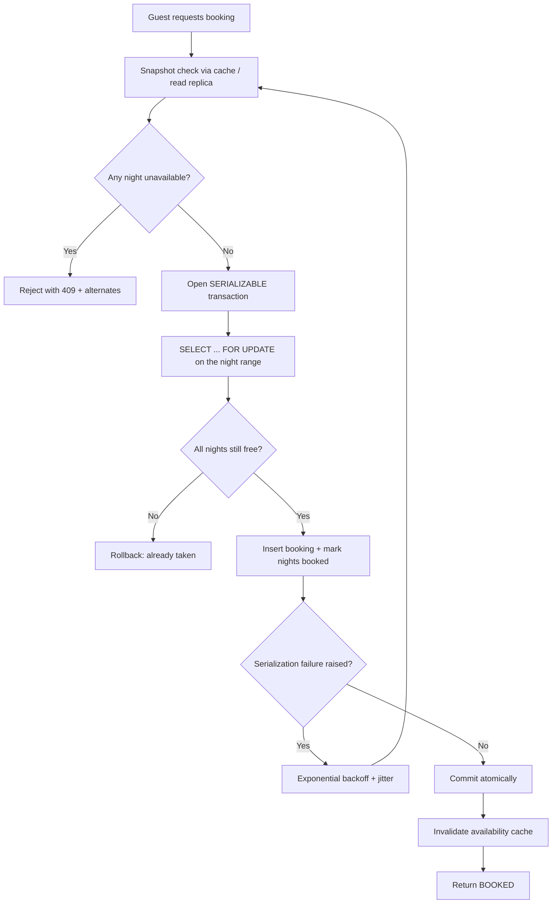

| Difficulty | Channel | Tags |
|---|---|---|
| intermediate | database | acid, isolation-levels, mvcc |

In 2011, PostgreSQL promised the impossible: true serializable isolation on a live, high-traffic database. In 2020, the Jepsen project stress-tested that promise with its Elle checker across five released versions and found the guarantee had never actually held once [1]. Meanwhile, your booking system is about to let two guests rent the same cabin on the same weekend. This article walks through why even PostgreSQL stumbled, and how you can design transaction handling that turns double bookings into a distant memory.

---

> ### Real-World Case — PostgreSQL
>
> PostgreSQL, the relational database behind countless booking, ticketing, and payment systems, has claimed to offer true serializable isolation since version 9.1 (2011) via Serializable Snapshot Isolation (SSI) with MVCC. In 2020, Jepsen stress-tested that guarantee on PostgreSQL 12.3 using its generative transaction-isolation checker, Elle.
>
> | | |
> |---|---|
> | **Challenge** | Prevent G2-item / write-skew anomalies — the exact class of anomaly where two concurrent transactions each read a shared resource, both conclude it is available, and both commit a conflicting write (i.e., a double booking) — even when running at the strongest SERIALIZABLE isolation level on a healthy, single-node database. |
> | **Solution** | Jepsen's Elle checker generated randomized read/append transactions and inferred Adya-style write-write, write-read, and read-write dependencies, searching the resulting graph for cycles. It found G2-item cycles at SERIALIZABLE that SSI is specifically designed to forbid. Root cause: with three concurrent transactions, PostgreSQL's conflict-detection misidentified an updating transaction's XID as responsible for both the original and the updated tuple version, so a transaction could commit without ever observing a prior transaction's insert. Peter Geoghegan and PostgreSQL contributors wrote a patch to flag the correct XID and added a regression test. |
> | **Outcome** | The bug existed in every version tested — 9.5.22, 10.13, 11.8, 12.3, and 13 — meaning no released PostgreSQL had ever truly guaranteed serializability. It was patched and shipped in the August 13, 2020 minor release. The same report confirmed PostgreSQL's 'repeatable read' is actually snapshot isolation, which permits G2-item write skew by design, and found roughly 140 anti-dependency cycles per minute under repeatable read. |
> | **Lesson** | Never assume the strongest isolation level prevents the race you fear — verify it against your actual workload. A serializability bug survived nine years in one of the most battle-tested databases despite an extensive hand-written isolation test suite, because hand-picked examples only cover known anomalies. For booking systems, enforce the invariant structurally (unique or exclusion constraints on dates, explicit row locks) instead of trusting the isolation level alone. |

---

## Hook — Two guests, one cabin, zero refunds

Picture this: it is a beautiful Saturday and your booking platform is seeing record traffic. Two guests refresh the same mountain cabin listing within 300 milliseconds of each other. Both hit "Reserve now." Both cards are charged. There is exactly one cabin, and it is now double-booked. You get the support ticket, then the chargeback, then a furious host, then a one-star review that was not even about the cabin.

Sound familiar? This is the double-booking problem, and it lives in the database layer — invisible to your UI, your load balancer, and your metrics dashboard. Repeat this failure a few hundred times and the platform stops being trustable, and trust is the entire product.

Here is the twist you probably do not expect: even PostgreSQL, the database holding up countless booking, ticketing, and payment systems, shipped a serializability guarantee for nine years that it could not actually keep. Jepsen proved it in 2020 [1]. If the referee can be wrong, what does your transaction actually guarantee?

## Problem — The race condition hiding in plain sight

Building on that uneasy feeling, let us get precise about what is actually breaking. The core challenge is a race condition dressed up as a routine database query. Two transactions each read the same availability row, both see "free," both insert a booking, and both commit. Congratulations: overbooked. Databases have a name for this — a lost update — and it is exactly what isolation levels were designed to prevent [2].

But here is the tension that makes this genuinely hard: high availability demands you serve thousands of read requests per second for popular listings, while correctness demands you serialize writes to a single row of a single table. You cannot lock everything — at that point you may as well sell tickets by fax machine. You cannot skip locking — overbooking at scale is a reputation death spiral. Avoidance is not an option either: in a system that must be atomic, consistent, isolated, and durable, every one of those properties is on the line in a single booking click [8].

The engineering challenge, therefore, is designing transaction handling that threads this needle: consistent under contention, fast under load. Get it right and the double booking never happens. Get it wrong and you will only find out after the chargebacks arrive.

## Real-World Case — PostgreSQL's nine-year isolation mirage

However, before writing a single locking statement, it is worth studying a real casualty of this exact battle. In 2020, the Jepsen project turned its generative transaction-isolation checker, Elle, loose on PostgreSQL to verify its headline feature: Serializable Snapshot Isolation (SSI), the mechanism behind the claim of true serializable isolation since version 9.1 [1].

The results were brutal. Every version tested — 9.5.22, 10.13, 11.8, 12.3, and even the then-unreleased 13 — exhibited a serializability bug. That means no released PostgreSQL had ever truly guaranteed serializability: every production database had the theoretical capacity to commit transactions that, in any strictly serial order, could never have happened [1].

There is a second plot twist buried in the same report. PostgreSQL's "repeatable read" is actually snapshot isolation, which by design permits G2-item write skew — Jepsen measured roughly 140 anti-dependency cycles per minute under that level [1][7]. Two guests reading "free" and both booking is precisely the shape of a cycle like that. The fix shipped quietly in the August 13, 2020 minor release [1]. The takeaway is not that PostgreSQL is untrustworthy — it is that guarantees are only as real as the tests that prove them.

## Deep Dive — What SERIALIZABLE actually does under the hood

This leads to the practical question: if a database this battle-hardened can wobble, what does a correct booking transaction actually look like? Start with the mental model. Under the hood, PostgreSQL stores multiple versions of every row rather than overwriting in place; readers see a consistent snapshot while writers lock and update. That is multiversion concurrency control, and it is why plain reads rarely block plain writes [3].

Add SERIALIZABLE on top, and the database gains a detective step. SSI tracks read-write dependencies between concurrent transactions and watches for the dangerous cycle pattern — precisely the "both read free, both book" shape [4]. The moment one forms, SSI aborts one of the transactions [2]. That abort is not a failure; it is a favor. Without it, the double booking commits silently.

But the isolation level is only half the design. Specifically, the data model matters just as much. Instead of locking the whole property row, teams separate the availability calendar into its own table of per-night rows. A booking then becomes a small, targeted SELECT ... FOR UPDATE on exact night ranges [5]. This is the Airbnb-style pattern, and it leads to a genuine trade-off you have to make consciously:

| Approach | Safety | Throughput | What you trade |
|---|---|---|---|
| SERIALIZABLE (SSI) | Highest — aborts true conflicts | Lower under heavy contention, smooth under normal load | Aborts plus retry logic you must build [4] |
| READ COMMITTED + row locks | High, via explicit FOR UPDATE | Higher | More application code and phantom-range edge cases [5] |
| READ COMMITTED, no locks | Lowest — lost updates | Highest | Correctness. Non-negotiable for bookings |

Many developers optimize for the third row and learn the hard way. Optimistic concurrency control with version columns is the compromise: you read a version number, write only if it is unchanged, and retry on mismatch [6]. Combined with SSI watching your back, it makes the thin race window effectively un-squeezable.

## Workflow — Six steps from "Reserve" to a committed booking

With the theory settled, the actual booking flow becomes a recipe with six moving parts. Teams that skip one of these are the ones writing "why did we overbook again" into their incident logs. Here is the order that works:

1. **Fast-path availability check** — serve the "is it free?" question from cache or a read replica snapshot, keeping the hot property page fast.
2. **Open a SERIALIZABLE transaction** — set it explicitly; do not rely on your ORM's default.
3. **Lock the exact date range** — SELECT ... FOR UPDATE on the per-night availability rows for just those nights [5].
4. **Re-validate every night is free** — the lock guarantees nothing has changed since you grabbed it.
5. **Insert the booking and flip the nights to booked in one atomic commit** — all-or-nothing, no orphan reservations.
6. **Handle the abort** — on a serialization failure, retry with exponential backoff plus jitter; on success, invalidate the availability cache.

The Booking Conflict Resolution Flow diagram below shows the full journey, including the retry loop that turns SSI aborts from a panic into a feature.

## Code Example — A booking transaction that survives the stampede

Now bring it home. Here is the production-shaped pattern using psycopg2 against PostgreSQL, with SERIALIZABLE isolation, per-night row locks, and a retry loop with exponential backoff and jitter [5][6].

## Lessons Learned — Battle scars, best practices, and the one sentence to share

So what do you take away from PostgreSQL's decade-long stumble and the Airbnb-style race it shadows? After watching teams debug this pattern, here is what separates the survivors from the incident reports:

- **Start from SERIALIZABLE and only relax after measuring.** SSI aborts are a safety net, not a bug — every abort is a double booking that did not happen [2].
- **Lock the smallest unit that makes sense.** Per-night availability rows, never the whole property. Locking a whole row serializes every booking on a hot property and tanks your throughput [5].
- **Retries are mandatory, and so is jitter.** Exponential backoff without random jitter is how a cleared contention spike turns into a thundering herd.
- **Cache only the fast path.** Read replicas and cache answer "is it free?"; the write path must always go to the source of truth.
- **Never assume snapshot isolation is serializable.** The 140 anti-dependency cycles per minute Jepsen measured under repeatable read are your double bookings waiting for a busy weekend [1].

Battle scar to remember: several teams shipped this without the re-validation step after the lock. It looks correct in unit tests and fails on the first genuinely concurrent load test. If this feels like a lot to keep straight, you are not alone — concurrency is where perfectly reasonable engineers make perfectly unreasonable assumptions.

Finally, the one-line insight to carry back to your team: **serializable does not mean slow — it means you locked the right rows and retried with respect.**

## Workflow — Six steps from "Reserve" to a committed booking

With the theory settled, the actual booking flow becomes a recipe with six moving parts. Teams that skip one of these are the ones writing "why did we overbook again" into their incident logs. Here is the order that works:

1. **Fast-path availability check** — serve the "is it free?" question from cache or a read replica snapshot, keeping the hot property page fast.
2. **Open a SERIALIZABLE transaction** — set it explicitly; do not rely on your ORM's default.
3. **Lock the exact date range** — SELECT ... FOR UPDATE on the per-night availability rows for just those nights [5].
4. **Re-validate every night is free** — the lock guarantees nothing has changed since you grabbed it.
5. **Insert the booking and flip the nights to booked in one atomic commit** — all-or-nothing, no orphan reservations.
6. **Handle the abort** — on a serialization failure, retry with exponential backoff plus jitter; on success, invalidate the availability cache.

The Booking Conflict Resolution Flow diagram below shows the full journey, including the retry loop that turns SSI aborts from a panic into a feature.

---

## Booking Conflict Resolution Flow

<strong>Original Interview Question</strong>

**Q:** You're building a booking system for Airbnb where multiple users can reserve the same property simultaneously. How would you design the transaction handling to prevent double bookings while maintaining high availability?

**A:** Use SERIALIZABLE isolation with optimistic concurrency control. Implement row-level locks on property availability tables, use MVCC snapshot reads for checking availability, and apply application-level validation to ensure atomic booking operations.

## Conclusion

Nine years ago, PostgreSQL promised a guarantee the research community later proved it never actually delivered — a grounding reminder that isolation guarantees are not marketing, they are physics plus vigilance [1]. For your booking system, the lesson is simple: never trust a transaction to be correct without proving it. Set the isolation level explicitly, lock the smallest unit you can (per-night rows, not the whole property), re-validate after the lock, and treat serialization failures as free protection by retrying with backoff and jitter. Tomorrow, run a two-guest-one-cabin load test against staging and watch SSI abort the second booking in real time. Once you see the double booking you designed get caught, you will never build an inventory system any other way. And the one line to share with your team: serializable does not mean slow — it means you locked the right rows and retried with respect.

---

## References

1. [PostgreSQL incident report](https://jepsen.io/analyses/postgresql-12.3) — article
2. [PostgreSQL Documentation: Transaction Isolation](https://www.postgresql.org/docs/current/transaction-iso.html) — documentation
3. [Multiversion Concurrency Control](https://en.wikipedia.org/wiki/Multiversion_concurrency_control) — documentation
4. [Serializable Snapshot Isolation](https://en.wikipedia.org/wiki/Serializable_snapshot_isolation) — documentation
5. [PostgreSQL Documentation: Locking and Row-Level Locks](https://www.postgresql.org/docs/current/explicit-locking.html) — documentation
6. [Optimistic Concurrency Control](https://en.wikipedia.org/wiki/Optimistic_concurrency_control) — documentation
7. [Elle: Checking for the Blindness of Distributed Databases](https://arxiv.org/abs/2003.01903) — paper
8. [ACID (Atomicity, Consistency, Isolation, Durability)](https://en.wikipedia.org/wiki/ACID) — documentation

---

**Author:** Satishkumar Dhule — [GitHub](https://github.com/satishkumar-dhule) · [LinkedIn](https://linkedin.com/in/satishkumar-dhule) · [Website](https://satishkumar-dhule.github.io)
