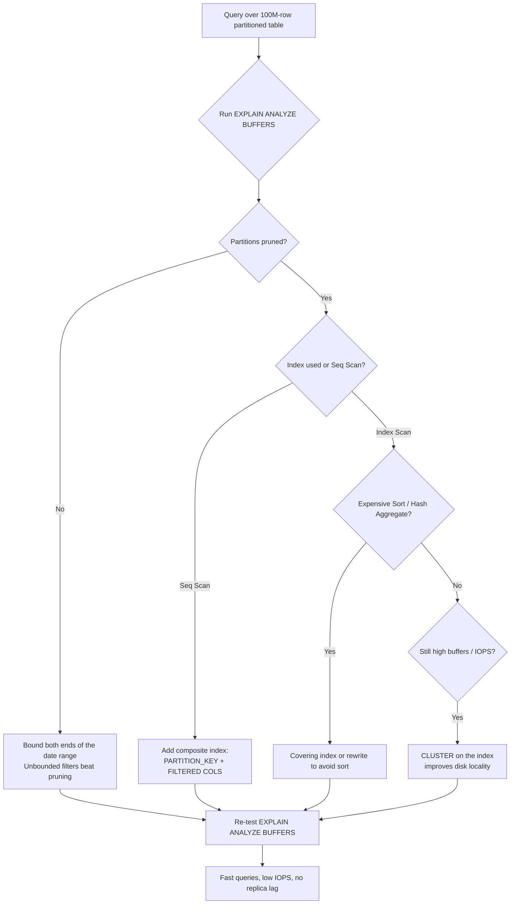

| Difficulty | Channel | Tags |
|---|---|---|
| intermediate | database | explain, query-plan, partitioning |

CoinGecko's hourly crypto price table grew past 1TB over eight years, and average queries dragged on for more than 30 seconds while replica lag crept in during traffic spikes [1]. After partitioning the table, their p99 response time dropped from 4.13 seconds to 578ms — an 86% improvement — and IOPS fell 20%. Then one query regressed anyway, scanning every partition including ones that were completely empty. This is the story of why date partitioning is a trap, how you diagnose it with EXPLAIN, and where that sinking "still slow after partitioning" feeling comes from.

---

> ### Real-World Case — CoinGecko
>
> CoinGecko's hourly crypto price table grew past 1TB over 8 years of data, and average queries took over 30 seconds. The table was critical across all their applications, and heavy IOPS on the primary caused replica lag during traffic spikes.
>
> | | |
> |---|---|
> | **Challenge** | The 1TB+ PostgreSQL table (hosted on Amazon RDS) could not be fixed by simply adding indexes because the hot query used a JSONB column keyed by supported currencies, and indexing every key for every application was impractical. The team needed queries to touch only a few months of data at a time. |
> | **Solution** | They converted the table to declarative RANGE partitioning by month on the timestamp column, so queries filtering a timestamp range prune to at most ~4 partitions. They also had to make the partition key part of the primary key, pre-warm the new partitions' cache (using a foreign data wrapper to backfill without saturating production IOPS), and dual-write via a trigger during a near-zero-downtime switchover. |
> | **Outcome** | p99 response time dropped from 4.13s to 578ms (about 86% reduction), IOPS fell 20% (multiplied across replicas for cost savings), and replica lag disappeared. However, one query regressed: it was written as `created_at > ?` with no upper bound, so it scanned all partitions, including future empty ones. Rewriting the query to include a bounded date range fixed it. |
> | **Lesson** | Partitioning only helps when the planner can actually prune, which requires the partition key to be present in the WHERE clause with proper bounds. A query lacking a lower (or upper) bound can scan every partition and perform worse than on the original monolithic table — so you must audit query patterns and read EXPLAIN plans before and after partitioning. |

---

## Hook — The query that should have been fast

It usually starts the same way. A table grows, quietly, for years — nobody notices until the day an endpoint starts crawling. CoinGecko saw exactly this: after eight years of accumulating hourly crypto price data, their table crossed the 1TB mark and the average query took over 30 seconds [1]. More requests meant more IOPS, request queues began building, and the Apdex score started sliding. The team even bumped IOPS to 24K as a stopgap — and the alerts still fired every single day [1].

Here is the plot twist though: partitioning fixed most of it. Queries got 6-8x faster, replica lag vanished, and p99 dropped from 4.13s to 578ms [1]. Yet one query — written as `created_at > ?` with no upper bound — got *worse*, forcing a scan across all partitions, including as-yet-empty future ones [1]. If you have ever added a partition key and expected magic, this is your warning: partitioning is a tool, not a spell. The real skill is reading the EXPLAIN plan well enough to see what the planner is actually doing, and why it is doing it.

## Problem — Partitioning promises speed, and then betrays you

Partitioning splits one giant table into many smaller physical tables while keeping a single logical view. Get it right, and a whole-month query touches one partition instead of a terabyte of dead weight. That is the theory, and it is taught in every database class. Consequently, many developers treat partitioning as a one-way ticket to speed.

The reality is messier. Partitioning only helps when four things all line up: the partition key matches your query pattern, the optimizer actually prunes partitions, an index is used instead of a full scan, and no expensive sort or hash aggregate sneaks in on top. Miss any one of them and you are back to a slow query — now with extra moving parts. The stakes are real: heavy IOPS on the primary can cascade into replica lag, which is how latency spikes turn into pager-worthy outages. You might think a bigger machine saves you, but throw money at IOPS and you still get alerted every day, as CoinGecko learned [1].

## Real-World Case — CoinGecko

CoinGecko has multiple tables storing crypto prices, but one hourly-price table became the problem child: over 8 years it exceeded 1TB, and queries averaged north of 30 seconds [1]. The table was so widely used that every application felt it, and traffic spikes caused heavy IOPS on the primary — which in turn produced replica lag [1]. Plain indexes were considered and rejected: the table leaned on a JSONB column with currency keys, so an index would only ever help one application while bloating writes for everyone else [1]. Partitioning by range on the timestamp won, because nearly every query filters by a time range and the team rarely needs more than four months of data at once [1].

During the migration, a temporary database was used for a dry run — the team found data copying took 3+ days and IOPS could spike to 6,000 even in isolation, and pre-warming partitions was essential to avoid a cold-cache catastrophe [1]. The switch used a foreign data wrapper trick to copy data without starving production IOPS, and a rename flip as a low-downtime cutover [1]. The results: p99 fell from 4.13s to 578ms (about 86%), IOPS dropped 20% — multiplied across every replica, meaning real cost savings — and replica lag disappeared [1].

Then came the regression. One query written as `created_at > ?` had no upper limit, so it scanned all partitions — including the empty future ones the team had pre-created for 2025 [1]. Rewriting the query with a bounded date range fixed it immediately [1]. It is the single most instructive moment in the whole incident: the exact same query performed fine on the unpartitioned table, and partitioning made it slower [1].

## Deep Dive — Reading EXPLAIN like a detective

Building on that incident, the diagnostic skill you actually need is reading an `EXPLAIN (ANALYZE, BUFFERS)` plan without glazing over. The planner emits a tree of nodes, and each one reveals a different failure mode [3]. There are three questions to answer, in order.

First, is partition pruning working? Run a bounded range query and look for lines like `Partitions removed by: Prune`. If you see all partitions being scanned — or a `Seq Scan` on the parent — pruning did not happen [2]. Specifically, PostgreSQL prunes when the filter is on the partition key and the clause is restrictive; an unbounded condition like `created_at > ?` defeats it because the planner assumes any later value is possible [1][2]. A bounded range then becomes the cheapest fix you will ever make.

Second, is an index used? A `Seq Scan` over a partitioned month means you are reading everything. If you filter on `status` but only index the date, the planner may estimate that scanning beats hopping through the index — and it might be right at small scale, which is precisely why it looks fast in staging and slow in production. The fix is a composite index whose leading column is the partition key and whose trailing columns match the rest of the `WHERE` clause (e.g., `(event_date, status)`), which the planner's statistics machinery rewards with far better row estimates [4][8].

Third, what happens after the scan? Look for `Sort`, `Hash Aggregate`, or `Gather Merge`. An `ORDER BY` on a different column than the scan order forces a sort of everything you just filtered — often the true bottleneck hiding behind a deceptively fast index. A composite index ordered the way the query needs can eliminate the sort entirely [4]. The trade-off is a real one:

## Workflow — The diagnostic path to a fast partitioned query

The investigation naturally follows a funnel: verify pruning, then indexing, then expensive operations, and only then reach for physical-order tricks. Here is the sequence that works, step by step.

1. **Run EXPLAIN (ANALYZE, BUFFERS)** on the slow, real query. Never trust plain EXPLAIN — the ANALYZE profile shows actual rows and buffers touched, while BUFFERS reveals the IOPS impact that replica-lag incidents are made of [3].
2. **Confirm pruning.** Check `Partitions removed by` and confirm only the partitions covering your range appear. If not, the WHERE clause is the problem — bound both ends of the range [2][1].
3. **Inspect the scan node.** A `Seq Scan` on a large partition points at a missing or badly-shaped index; switch to a composite index that covers the partition key plus filtered columns [4].
4. **Look above the scan.** Any `Sort` or `Hash Aggregate` becomes the next target — the fix is often a covering index or rewriting the query to avoid fetching columns you do not need [4].
5. **Consider CLUSTER only last.** Reordering physical rows by an index improves disk locality and cuts read amplification, but it is expensive and locks the table, so treat it as a maintenance-time optimization, not a hot fix [5].

The diagram below maps this exact decision flow so you can follow it while staring at your own plan.

## Code Example — Diagnosing and fixing the slow partitioned query

Now is where theory becomes keystrokes. Here is a battle-tested sequence you would actually run, from investigation to fix. The comments explain what each block proves — and note the final guard against CoinGecko's exact regression.

## Lessons Learned — What the CoinGecko war story teaches you

The journey from 30-second queries to a 578ms p99 wraps up with a handful of hard-won truths [1]. Keep these near your terminal:

- **Partitioning follows the query, not the table.** Pick a range, list, or hash scheme based on how your WHERE clauses actually filter — for time-series workloads, range on the timestamp wins almost every time [2][7].
- **A partition key must be part of the primary key.** In PostgreSQL, the partitioning column has to be included in every unique constraint — CoinGecko had to move to composite keys, and so will you [1][2].
- **Bounds are non-negotiable.** Queries like `created_at > ?` silently defeat pruning and scan empty future partitions. Bound both ends [1].
- **Explain ANALYZE before you optimize.** You cannot skip verification: the buffers and row counts tell you whether pruning, indexing, or sorting is the real blocker [3][8].
- **Warm your caches.** A freshly switched table has no PostgreSQL cache, and a cold table is catastrophically slow — prewarm partitions (pg_prewarm is your friend) before you flip traffic to them [1].
- **Dry-run everything.** CoinGecko rehearsed the entire migration on a clone first, which caught the 6,000-IOPS copying spike before it ever touched production [1].

The takeaway is deceptively simple: read the plan before you change the table. If you remember one thing, remember this — the difference between 4.13 seconds and 578ms was not heroics; it was bounded queries, composite indexes, and an EXPLAIN output read with patience [1]. Start tomorrow by running `EXPLAIN (ANALYZE, BUFFERS)` on your slowest query and looking for `Seq Scan`, `Sort`, and `Partitions removed by: Prune`. The answer is usually already sitting in the plan.

---

## Partitioned Query Diagnostic Flow

<strong>Original Interview Question</strong>

**Q:** You have a PostgreSQL table with 100M rows partitioned by date. A query filtering on a specific date range is still slow. What would you check in the EXPLAIN plan and how would you optimize it?

**A:** Check partition pruning effectiveness, index utilization patterns, and expensive sort operations. Create composite indexes on (date, filtered_columns) and evaluate clustering strategies for optimal data access.

## Conclusion

CoinGecko's 1TB table went from 30-second queries to a 578ms p99 — but only because the team bounded its ranges, built composite indexes, warmed caches, and read the EXPLAIN plan before touching anything [1]. The insight to carry into tomorrow: partitioning is a contract you sign with the query planner, and the fine print is always an unbounded range. Run EXPLAIN (ANALYZE, BUFFERS) on your slowest partitioned query today, look for the `Seq Scan`, the `Sort`, and the missing "Partitions removed by: Prune" line — the diagnosis is usually already in the plan, waiting to be read.

---

## References

1. [CoinGecko incident report](https://dev.to/coingecko/scaling-postgresql-performance-with-table-partitioning-136o) — article
2. [PostgreSQL Documentation: Table Partitioning](https://www.postgresql.org/docs/current/ddl-partitioning.html) — documentation
3. [PostgreSQL Documentation: EXPLAIN](https://www.postgresql.org/docs/current/sql-explain.html) — documentation
4. [PostgreSQL Documentation: CREATE INDEX](https://www.postgresql.org/docs/current/sql-createindex.html) — documentation
5. [PostgreSQL Documentation: CLUSTER](https://www.postgresql.org/docs/current/sql-cluster.html) — documentation
6. [PostgreSQL: Partition Management extension](https://github.com/pgpartman/pg_partman) — documentation
7. [Wikipedia: Partition (database)](https://en.wikipedia.org/wiki/Partition_(database)) — documentation
8. [PostgreSQL Documentation: How the Planner Uses Statistics](https://www.postgresql.org/docs/current/planner-stats.html) — documentation

---

**Author:** Satishkumar Dhule — [GitHub](https://github.com/satishkumar-dhule) · [LinkedIn](https://linkedin.com/in/satishkumar-dhule) · [Website](https://satishkumar-dhule.github.io)
