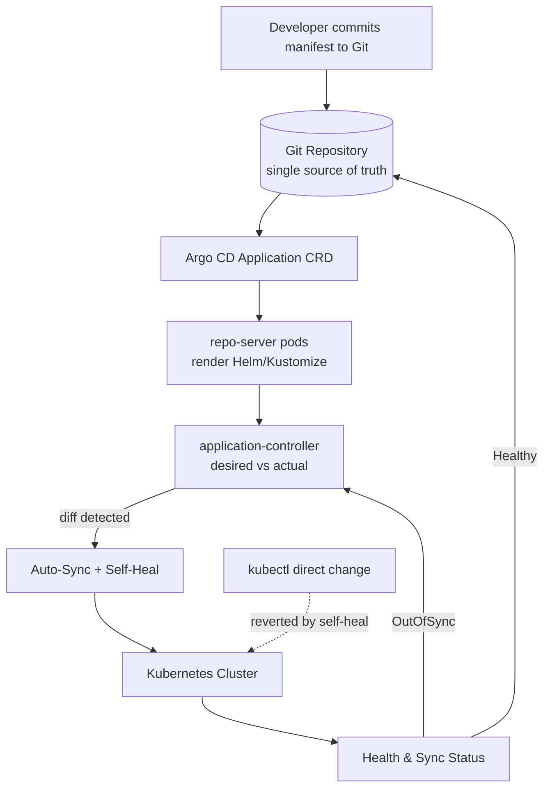

| Difficulty | Channel | Tags |
|---|---|---|
| beginner | devops | argocd, flux, declarative |

Twelve Kubernetes clusters. Every one hand-built, hand-patched, and slightly different from the next. When Okta inherited Auth0's multi-tenant identity platform, those Snowflake clusters were upgraded by hand and configured manually — fine for a dozen customers, catastrophic for the thousands of enterprises that were about to depend on them [1]. To survive, Okta had to turn a pile of fragile, manually-managed clusters into a fully reproducible GitOps platform without breaking customer isolation. The tool at the center of that transformation was Argo CD, and the philosophy behind it — declarative state in Git, continuously reconciled into the cluster — is the difference between a system that scales to 1,000 clusters and one that collapses under its own entropy.

---

> ### Real-World Case — Okta
>
> Okta inherited Auth0's multi-tenant identity platform, which ran customer environments as 'snowflake' clusters with non-automated upgrades and manual configuration. To serve thousands of enterprise customers reliably, they needed to transform dozens of manually-managed clusters into a fully reproducible GitOps platform without breaking customer isolation.
>
> | | |
> |---|---|
> | **Challenge** | Moving from 12 hand-configured clusters to over 1,000 customer clusters meant every deployment, upgrade, and configuration change had to be automated, auditable, and consistent. Their release model bundles each customer's entire software stack (service image versions, Terraform code, Kubernetes manifests, plugins, and secrets) into a single release manifest, so a naive ArgoCD auto-sync would deploy before the infrastructure and secrets were ready. |
> | **Solution** | They standardized on ArgoCD as the single GitOps control plane: each customer cluster maps to one ArgoCD Application backed by a release manifest in Git, Terraform provisions infrastructure and secrets first, then ArgoCD syncs the stack. Crucially, they deliberately disabled auto-sync for deployments because the release pipeline owns orchestration order; auto-sync is used selectively so cluster state always converges with the declared Git state. |
> | **Outcome** | Scaled from ~12 to 1,000+ Kubernetes clusters over five years, managing up to 2,000 ArgoCD Applications and over 2 million Kubernetes resources through one ArgoCD instance — running 32 application-controller pods and 24 repo-server pods. |
> | **Lesson** | Auto-sync is a feature, not an obligation: GitOps can scale to 1,000 clusters, but when releases bundle infrastructure + config + secrets, the controller must wait for dependencies (Terraform before sync), and disabling auto-sync in favor of explicitly-ordered pipelines is a deliberate, correct choice — not a compromise. |

---

## Hook — The 3 a.m. Upgrade That Never Finished

Picture this: an identity platform serving thousands of enterprise customers, where every tenant runs in its own Kubernetes cluster. Now imagine upgrading those clusters by hand — SSH into one, run commands, hope the YAML matches what someone did last quarter. That was the reality Okta inherited from Auth0, and it is a version of a story countless platform teams live every week.

Here is the uncomfortable truth: manual operations do not fail loudly. They fail quietly, one slightly-different config at a time, until an upgrade to cluster number seven behaves nothing like cluster number three. This is configuration drift, and it is the silent killer of reliability.

The fix is not "try harder" or "document more carefully." The fix is a fundamentally different way of thinking about how state gets into a cluster. Sound familiar? If your team has ever run `kubectl apply` in production and prayed, you are exactly who this article is for.

## Problem — When 'It Works On My Cluster' Becomes an Outage

The core challenge is that Kubernetes is declarative at heart, but most teams operate it imperatively. They run `kubectl edit`, `kubectl scale`, and `kubectl apply` directly against production clusters [5]. Every one of those commands mutates live state, and none of them leave a version-controlled trace.

**Why this matters:**
- **No single source of truth.** The cluster becomes the truth, and the truth changes every time someone is in a hurry.
- **Drift compounds silently.** A hotfix applied directly to prod never makes it into the manifests, so the next deploy wipes it out — or worse, reintroduces the bug it was meant to fix.
- **Rollbacks are archaeology.** Without a Git history of every desired change, reverting means guessing what the previous state actually was.
- **Customer isolation breaks.** In a multi-tenant platform, one manual tweak to a shared component can leak across tenant boundaries.

Consequently, teams that scale find themselves with hundreds of clusters that are *mostly* the same — and "mostly" is where outages live. The problem is not knowledge; it is process. Developers know Kubernetes. What they lack is an automated, auditable mechanism that keeps reality aligned with intention.

This leads to a natural question: what if the cluster could just... fix itself to match Git?

## Real-World Case — Okta and the 1,000-Cluster Bet

Okta's acquisition of Auth0 handed it a multi-tenant identity platform where customer environments ran as Snowflake clusters with non-automated upgrades and manual configuration [1]. At roughly 12 clusters, this was survivable. But identity is infrastructure — every enterprise customer expects isolation, predictable upgrades, and zero cross-tenant surprises.

The challenge was stark: transform dozens of manually-managed clusters into a fully reproducible GitOps platform without breaking the isolation guarantees customers paid for. The answer was Argo CD used as the reconciliation engine across the entire fleet.

The results were dramatic. Over five years, Okta scaled from about 12 clusters to over 1,000 Kubernetes clusters. A single Argo CD instance grew to manage up to 2,000 Applications and more than 2 million Kubernetes resources, running 32 application-controller pods and 24 repo-server pods to handle the load [1].

That last number is the real story. One Argo CD control plane orchestrating millions of resources across a thousand clusters is not magic — it is the compounding payoff of treating infrastructure as declarative data rather than a series of commands. When the desired state lives in Git, replicating a cluster stops being a project and starts being a git commit.

## Deep Dive — Declarative vs. Imperative: The Real Tradeoff

The single most important mental model in GitOps is the split between declarative and imperative management, and it is a split developers get subtly wrong all the time.

**Imperative:** you tell the system *how* to do something, step by step. `kubectl create deployment nginx --image=nginx` issues a command, and the cluster mutates [5]. The command itself is ephemeral — once it runs, the record is gone unless someone wrote it down. This is powerful for debugging and one-off tasks, which is exactly why it is dangerous as a production change mechanism.

**Declarative:** you describe *what* you want the end state to be, and a controller figures out how to get there [4]. A YAML manifest says "three replicas of this image, with these resources," and Kubernetes reconciles reality toward that description. Git becomes the source of the desired state; the cluster merely reflects it.

The twist many teams miss is that these are not opposites — they are layers. You can (and should) use imperative `kubectl` for exploration and troubleshooting, while every *durable* change flows through a declarative Git commit. The mistake is using imperative commands for durable changes.

| Dimension | Declarative (GitOps) | Imperative (kubectl direct) |
|---|---|---|
| Source of truth | Git repository [3] | Live cluster state |
| Auditability | Full history via commits | Little to none |
| Rollback | `git revert` | Manual reconstruction |
| Drift handling | Self-healing reconciliation | Silent divergence |
| Multi-cluster scaling | Template + replicate | Repeat by hand |
| Best for | Production changes | Debugging, one-offs |

💡 **Insight:** GitOps does not ban `kubectl`. It bans using `kubectl` as the *only* record of what changed.

This distinction is what lets a manifests repo drive Helm charts, plain YAML, or Kustomize overlays [7][8] — Argo CD renders whatever is in Git and reconciles the cluster against it. What matters is that the rendering is reproducible from version control alone.

## Workflow — The Reconciliation Loop, Step by Step

Building on the declarative model, here is how Argo CD actually turns a Git commit into cluster state. The mechanism is a continuous control loop, not a one-time deployment [2].

1. **Commit the desired state.** A developer merges a manifest or Helm values change into the manifests repository. This is the only sanctioned path to production change [3].
2. **Declare an Application.** An Argo CD `Application` custom resource points at the repo, the target revision, and the path containing the manifests [10]. The CRD is the contract between Git and the cluster [6].
3. **Render the manifests.** Argo CD's repo-server pods pull the repo and render Helm charts, Kustomize overlays, or plain YAML into concrete Kubernetes objects.
4. **Compare desired vs. actual.** The application-controller computes a diff between the rendered manifests and live cluster state. A mismatch sets the app to `OutOfSync`.
5. **Sync automatically.** With auto-sync enabled, Argo CD applies the diff on a configurable interval — commonly one to five minutes, with three minutes being a sane default.
6. **Self-heal drift.** If someone runs `kubectl` directly against the cluster, self-healing detects the deviation and reverts it back to the Git-declared state [2].
7. **Report health.** Sync status and resource health are surfaced continuously, so the loop never stops watching.

The diagram below captures this loop as a visual story:



🎯 **Key Point:** The loop is *closed*. Humans commit intent; Argo CD guarantees convergence. Nothing else touches the cluster, which is exactly what makes a thousand clusters tractable.

## Code Example — Wiring Up an Application CR

Now to make it concrete. The following bash script installs Argo CD, registers the Git repository, and declares an `Application` with auto-sync and self-healing enabled — the same pattern Okta scaled to 2,000 Applications [1].

```bash
#!/usr/bin/env bash
set -euo pipefail

# 1. Install Argo CD into a dedicated namespace
kubectl create namespace argocd
kubectl apply -n argocd \
  -f https://raw.githubusercontent.com/argoproj/argo-cd/stable/manifests/install.yaml

# 2. Register the Git repository as the single source of truth
argocd repo add https://github.com/acme/platform-manifests.git \
  --username git --password "$GIT_TOKEN"

# 3. Declare the Application CR — desired state lives in Git, not the cluster
cat <<'EOF' | kubectl apply -f -
apiVersion: argoproj.io/v1alpha1
kind: Application
metadata:
  name: payments-api
  namespace: argocd
spec:
  project: default
  source:
    repoURL: https://github.com/acme/platform-manifests.git
    targetRevision: main
    path: apps/payments-api/overlays/prod
  destination:
    server: https://kubernetes.default.svc
    namespace: payments
  syncPolicy:
    automated:
      prune: true      # delete resources removed from Git
      selfHeal: true   # revert manual kubectl drift
    syncOptions:
      - CreateNamespace=true
    retry:
      limit: 3
      backoff:
        duration: 30s
EOF

# 4. Verify the loop reached a healthy, synced state
argocd app wait payments-api --sync --health --timeout 300
```

**Why it works, line by line:**
- **Step 1** installs Argo CD as a set of controllers in its own namespace, isolating the control plane from your workloads.
- **Step 2** connects the repo. Argo CD can now read the manifests, but it has not changed anything yet — it is still an observer.
- **Step 3** is the heart of it. The `Application` is a *declarative* object: it describes where the desired state lives (`path`, `targetRevision`) and where it should land (`destination`).
- **`prune: true`** means if a resource is deleted from Git, Argo CD deletes it from the cluster. Without it, orphaned resources accumulate — a common source of surprise costs.
- **`selfHeal: true`** is the drift killer. A stray `kubectl edit` gets reverted automatically, which is precisely the property that made Okta's fleet reproducible [2].
- **`retry`/`backoff`** prevents tight reconciliation loops from hammering the API server during transient failures.
- **Step 4** blocks until the app reports healthy and synced, giving CI a deterministic signal instead of a hopeful sleep.

⚠️ **Watch Out:** Turning on `prune` before you trust your manifests can delete resources you forgot were only defined manually. Roll it out per-environment, not fleet-wide on day one.

## Lessons Learned — What Survives Contact With Production

The journey from a dozen Snowflake clusters to a thousand reproducible ones is not a tooling story as much as a discipline story. Here is what stands out.

- **Git is the product.** The moment a change bypasses the repo, the single source of truth dissolves. Self-healing exists precisely to defend that boundary [2][3].
- **Declarative scales; imperative does not.** Imperative commands are fine for debugging but fatal as a change-management strategy across many clusters [4][5].
- **Self-healing is a feature, not a safety net.** Treating it as optional leaves the door open for drift. Treating it as default keeps clusters honest.
- **Small intervals compound.** A three-minute reconcile cycle means a fleet of clusters converges on desired state in minutes, not quarters.
- **Observability is non-negotiable at scale.** With 2 million resources, sync and health status are not nice-to-haves — they are how operators keep their sanity [1].

🔥 **Hot Take:** Most "we need a platform team" problems are really "our changes are untracked" problems. GitOps does not just deploy software — it makes intent auditable.

If this feels overwhelming, you are not alone. Start small: one application, auto-sync on, self-heal on, and watch what happens the first time someone edits the cluster by hand. That single loop teaches the entire philosophy.

---

## GitOps Reconciliation Loop


<details>
<summary><strong>Original Interview Question</strong></summary>

**Q:** You're setting up GitOps for a microservices deployment. How would you configure ArgoCD to automatically sync changes from your Git repository to Kubernetes, and what's the difference between declarative and imperative approaches in this context?

**A:** I'd configure ArgoCD by setting up a Git repository containing Kubernetes manifests or Helm charts, creating an Application CRD that points to the Git repository, enabling auto-sync with a health check interval of 3 minutes, and implementing self-healing to automatically revert any manual changes. The declarative approach involves defining the desired state in Git through YAML manifests, Helm charts, or Kustomize configurations, where ArgoCD continuously reconciles the actual state with the desired state. In contrast, the imperative approach uses kubectl commands to make direct changes to the cluster, bypassing the Git repository as the single source of truth.

</details>

## Conclusion

Okta's climb from 12 clusters to more than a thousand is the clearest proof of a simple idea: infrastructure that lives as data in Git can be replicated, audited, and healed; infrastructure that lives as a sequence of commands cannot. Do one thing differently tomorrow — move a single production change out of your shell history and into a repo, then let Argo CD reconcile it with auto-sync and self-healing enabled. Watch what happens the first time someone edits the cluster by hand and the system quietly puts it back. That moment is the entire lesson: the loop does not just deploy software, it protects intention. If you remember only one thing, remember this — stop applying changes, start declaring them.

---

## References

1. [Okta incident report](https://thenewstack.io/how-okta-scaled-from-12-to-1000-kubernetes-clusters-with-argo-cd) — article
2. [Argo CD Documentation — Overview](https://argo-cd.readthedocs.io/en/stable/) — documentation
3. [GitOps](https://en.wikipedia.org/wiki/GitOps) — documentation
4. [Kubernetes — Declarative Management of Kubernetes Objects Using Configuration Files](https://kubernetes.io/docs/tasks/manage-kubernetes-objects/declarative-config/) — documentation
5. [Kubernetes — Managing Kubernetes Objects Using Imperative Commands](https://kubernetes.io/docs/tasks/manage-kubernetes-objects/imperative-command/) — documentation
6. [Kubernetes — Custom Resources](https://kubernetes.io/docs/concepts/extend-kubernetes/api-extension/custom-resources/) — documentation
7. [Helm Documentation](https://helm.sh/docs/) — documentation
8. [Kubernetes — Declarative Management of Kubernetes Objects Using Kustomize](https://kubernetes.io/docs/tasks/manage-kubernetes-objects/kustomization/) — documentation
9. [Flux — GitOps for Kubernetes](https://fluxcd.io/flux/) — documentation
10. [Argo CD — Application Specification](https://argo-cd.readthedocs.io/en/stable/user-guide/application-specification/) — documentation

---

**Author:** Satishkumar Dhule — [GitHub](https://github.com/satishkumar-dhule) · [LinkedIn](https://linkedin.com/in/satishkumar-dhule) · [Website](https://satishkumar-dhule.github.io)
