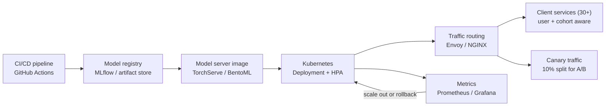

| Difficulty | Channel | Tags |
|---|---|---|
| beginner | devops | mlops, deployment |

Every day, Netflix's centralized model serving platform moves more than one million inference requests per second [1]. What surprises most engineers is that the hard part was never training the models — it was routing each request to the right model instance, on the right cluster shard, for the right user and the right A/B test cohort [1]. This is the story of model serving done right, and it is the exact problem your team will eventually face whether you serve a dozen predictions a day or a dozen million.

---

> ### Real-World Case — Netflix
>
> Netflix runs hundreds of ML model types and versions (recommendations, search, fraud, artwork ranking) for 250M+ members. As of 2025, their centralized model serving platform handles over 1 million requests per second, but the challenge wasn't training models — it was routing each request to the right model instance, on the right cluster shard, for the right user and A/B test cohort.
>
> | | |
> |---|---|
> | **Challenge** | Off-the-shelf routing solutions (AWS API Gateway, standalone service meshes) couldn't handle ML-specific needs: decoupling client services from model-to-VIP mapping, dynamic A/B traffic splitting, canary rollouts for new model versions, client overrides, and instant rollback when a model version breaks — all at 1M RPS. |
> | **Solution** | Netflix first built Switchboard, a custom proxy layer in the hot path that resolved requests to routing rules and shifted traffic between model versions for experimentation. When Switchboard hit scaling limits — a single point of failure in the critical path, 10-20ms added latency from payload serialization-deserialization, and tail latency amplification — they refactored it into Lightbulb: a lightweight metadata service (off the request path) that resolves routing keys, while actual routing moved onto the existing Envoy proxy layer which maps routingKey headers to cluster VIPs with minimal overhead. |
> | **Outcome** | The evolved architecture keeps a simple abstraction for 30+ client services at 1M+ requests per second while removing Switchboard from the request path entirely, eliminating the added 10-20ms serialization latency and the single-point-of-failure risk, while preserving real-time traffic splitting for canary deployments and A/B experiments. |
> | **Lesson** | A centralized routing service abstracts away ML complexity and accelerates iteration, but putting it in the hot path trades away latency and availability. Decoupling the metadata resolution (what model to call for this user/use case) from the actual routing (Envoy mapping routingKey headers to cluster VIPs) is the pattern that scales — serving-layer concerns like request routing, versioning, and rollbacks are often the real bottleneck, not the models themselves. |

---

## Hook — the million-request problem

One million requests per second. Pause on that number for a second. At that scale, every millisecond of routing overhead becomes years of compute time, and every assumption about "how the system works" gets stress-tested by 250 million members clicking, searching, and streaming at the same moment [1]. Netflix runs hundreds of model types — recommendations, search, fraud detection, artwork ranking — and each one exists in multiple versions scattered across dozens of cluster shards [1]. Here is the plot twist: nobody at Netflix loses sleep over training pipelines. The nightmare is the 10 to 20 milliseconds of serialization latency hiding between a request and the model that must answer it [1]. Sound familiar? Your models are probably fine. The plumbing around them is the real monster. So pull up a chair — this is the story of what it takes to get a model from "works in a notebook" to "answering production traffic without falling over."

## Problem — deployment vs. serving: the great conflation

Most developers use the words "deployment" and "serving" as if they were interchangeable. They are not, and the difference costs teams real outages. Deployment is the assembly line: CI/CD pipelines, container images, infrastructure-as-code, and registry plumbing that move your model artifact into a production environment [2]. Serving is what happens after the assembly line ends — the moment a real user request hits your model and the clock starts ticking. Think of deployment as building the restaurant; serving is rush hour on a Saturday night. A perfect kitchen is worthless if you cannot seat people and clear orders fast enough to make money. Therefore, the two concerns demand completely different tools and mental models. Moreover, teams that conflate them optimize the wrong thing: flawless canary rollouts for a model that answers in 900 milliseconds, while nobody watches p99 latency during a traffic spike. Many developers discover this the hard way — staring at a 500 error at 2am because a loaded model object was garbage-collected during an idle period. This leads to a question that shapes entire ML platforms: who owns the request path, and how do you make it fast, correct, and resilient at the same time?

## Real-World Case — Netflix

Now zoom out to the largest managed inference surface in streaming. Netflix's serving platform forwards more than one million requests per second across 30-plus internal client services [1]. As of 2025, the architecture went through a subtle but profound evolution: the team removed the Switchboard component from the request path entirely [1]. Switchboard had spent years doing the unglamorous work of routing each request to the right model instance, on the right shard, for the right user and experiment cohort. Why rip it out? Two reasons. First, it added 10 to 20 milliseconds of serialization latency on every single hop — a massive tax at 1M+ requests per second. Second, a centralized router is a single point of failure, and in request routing a SPOF is catastrophic by definition [1]. Consequently, the new design pushes routing responsibility closer to the model servers themselves while preserving real-time traffic splitting for canary deployments and A/B experiments [1]. The lesson here is counterintuitive: the "boring" routing layer, not the models, is where the biggest wins and the biggest risks both live.

## Deep Dive — the two worlds, side by side

Building on that, let's map the two concerns so you can see where your own stack falls. Deployment tools move work forward: Kubernetes deployments give you declarative rollout and rollback semantics [2], MLflow tracks experiments and weaves together a registry of artifacts [7], and infrastructure-as-code keeps environments reproducible. Serving tools, in contrast, are built for the request path: TensorFlow Serving [4] and TorchServe [5] handle model loading, version pinning, and batched inference; BentoML [6] packages models into production-ready services with autoscaling targets; and routing layers like Envoy or NGINX split traffic between them. The trade-offs will make or break your design. First, latency versus throughput: enforce a <100ms budget for interactive predictions and a <1s budget for batch jobs — but note that serving frameworks can shave latency precisely because they batch requests, trading one metric for the other. Second, batch versus real-time: real-time inference demands warm model instances and warm networks, while batch workloads tolerate cold starts and favor saturation. Third, cold starts: an autoscaling event that spins up a pod mid-spike is the enemy of p99 — the Kubernetes HorizontalPodAutoscaler scales on observed load, so your model server must expose meaningful metrics (requests per second, GPU memory, queue depth) rather than idle CPU [3]. Here is the thing, though: none of these tools make the ordering decision for you. Netflix discovered that the routing decision — which version, which shard, which cohort — is a business decision with a technical price tag measured in milliseconds [1].

| Dimension | Deployment | Serving |
|---|---|---|
| Core job | Get the artifact to production safely | Answer production requests before the deadline |
| Typical failure | Pipeline breaks, image never builds | 500s, latency spikes, cold pods |
| Primary tools | Kubernetes [2], MLflow [7], Terraform | TF Serving [4], TorchServe [5], BentoML [6] |
| Scaling driver | PR merges and release schedules | Live request load via HPA [3] |
| Unit of measurement | Builds and rollouts per day | QPS, p99 latency, GPU memory |

💡 **Insight:** Many developers treat "the notebook ran fine" as done. Serving is where that illusion dies — the best model in the world is worthless if the routing layer loses it.

🔥 **Hot Take:** You do not need a bespoke inference platform. A boring routing layer plus a solid model server gets you everything Netflix needed — minus the serialization tax [1].

🎯 **Key Point:** Latency budgets are contracts. Design the margin first, then the model, then the scaling story.

⚠️ **Watch Out:** Auto-scaling purely on CPU while the real bottleneck is GPU memory is how teams end up with a flood of cold pods exactly when traffic spikes.

## Workflow — from git push to live traffic

This leads to the concrete path your team can adopt tomorrow — and the diagram below tells the whole story in one glance, following the journey from commit to canary.

1. **Commit** — a merged PR triggers the CI pipeline (GitHub Actions or Jenkins).
2. **Register** — the trained artifact lands in the MLflow model registry, capturing version, metrics, and lineage [7].
3. **Package** — a build step wraps the artifact in a model-server image using TorchServe [5], TensorFlow Serving [4], or BentoML [6].
4. **Deploy** — Kubernetes applies the Deployment manifest, your declarative contract for rollout, rollback, and liveness probes [2].
5. **Scale** — a HorizontalPodAutoscaler watches live serving metrics and adds or removes replicas [3].
6. **Route** — the traffic layer (Envoy/NGINX) splits requests between versions, sending a controlled slice to the canary.
7. **Observe** — Prometheus scrapes latency, QPS, and error rates; Grafana turns them into dashboards that make rollbacks obvious before users file tickets.

Notice the loop: metrics flow back into HPA decisions and into release decisions. Serving is not a pipeline — it is a closed loop with feedback, and the teams that treat it that way are the ones that survive traffic spikes.

## Code Example — a serving gateway with canary traffic splitting

Step 6 — routing — is the deceptively hard part, and it is exactly where Netflix's lesson applies: keep it simple, fast, and cohort-aware [1]. Here is a minimal FastAPI gateway that implements sticky canary routing at the edge, the kind of thing your team might build before graduating to an orchestrator like BentoML [6].

## Lessons Learned — battle scars and the way forward

After all this, what should you do differently tomorrow? Start with these lessons, hard-won by teams who learned them at 2am.

- **Separate the pipeline from the request path.** Deployment bugs break rollouts; serving bugs break users. Instrument them separately and own them separately.
- **Instrument the request path like revenue depends on it.** If you export p99 latency, error rate, and queue depth to Prometheus [8], you will know the moment a new version degrades — before the ticket queue does.
- **Enforce latency budgets with alerts, not vibes.** A <100ms budget is meaningless unless a 150ms p99 pages someone at 3am.
- **Make traffic splitting a first-class feature.** Sticky canaries — the same user always sees the same version — keep A/B tests statistically sound and rollbacks reversible [1].
- **Deploy first, then serve.** Nail deployment faithfulness (image, artifact, config) before you tune the serving layer; a perfect router fighting a wrong artifact is theater.

Here is the battle scar everyone wishes they had been warned about: batching and streaming are where serving throughput quietly dies. gRPC streams multiplex over HTTP/2 for low-overhead transport [9], but a naive batch that waits too long to fill makes your latency budget blow up silently. Warm your workers before traffic arrives, keep versions pinned, and remember that an autoscaled pod that cold-starts mid-spike is worse than no pod at all — it arrives late and hungry, adding memory pressure to the very shard under load [3].

The one-liner worth sharing with your team: "You deploy a model once. You serve it millions of times. Invest accordingly."

---

## Model Deployment to Serving Pipeline

<strong>Original Interview Question</strong>

**Q:** Explain the key differences between model serving and model deployment in ML systems, including specific technologies, scaling considerations, and real-world implementation patterns?

**A:** Deployment encompasses CI/CD pipelines, infrastructure setup, and monitoring using tools like Kubernetes, MLflow, and SageMaker. Serving focuses on runtime inference APIs with frameworks like TensorFlow Serving, TorchServe, or BentoML, handling request routing, model versioning, and autoscaling. Key trade-offs include latency vs throughput, batch vs real-time inference, and cold start optimization.

## Conclusion

Netflix's platform serves more than one million requests per second, and it does not run on magic [1]. It runs on routing decisions made 10 to 20 milliseconds at a time, on infrastructure that treats traffic splitting and rollback as first-class citizens instead of afterthoughts [1]. The journey from deployment to serving is not about picking the shiniest ML framework — it is about respecting the difference between getting your model to production and keeping it alive under real traffic. Tomorrow, open your logs and ask three questions: What is the p99 of the request path? Does your canary routing keep cohorts stable? Would removing 10 to 20ms of serialization overhead be worth the investigation [8]? Then start measuring — because the models were never the bottleneck. The plumbing was.

---

## References

1. [Netflix incident report](https://netflixtechblog.com/state-of-routing-in-model-serving-16e22fe18741) — article
2. [Kubernetes Deployment concepts](https://kubernetes.io/docs/concepts/workloads/controllers/deployment/) — documentation
3. [HorizontalPodAutoscaler walkthrough](https://kubernetes.io/docs/tasks/run-application/horizontal-pod-autoscale/) — documentation
4. [TensorFlow Serving](https://github.com/tensorflow/serving) — documentation
5. [TorchServe](https://github.com/pytorch/serve) — documentation
6. [BentoML](https://github.com/bentoml/BentoML) — documentation
7. [MLflow](https://github.com/mlflow/mlflow) — documentation
8. [Prometheus](https://github.com/prometheus/prometheus) — documentation
9. [RFC 9113 — HTTP/2](https://datatracker.ietf.org/doc/html/rfc9113) — documentation

---

**Author:** Satishkumar Dhule — [GitHub](https://github.com/satishkumar-dhule) · [LinkedIn](https://linkedin.com/in/satishkumar-dhule) · [Website](https://satishkumar-dhule.github.io)
