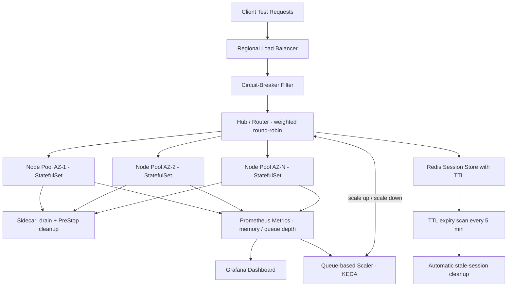

| Difficulty | Channel | Tags |
|---|---|---|
| advanced | system-design | selenium, webdriver, grid |

It was the kind of scaling wall every test-infra team dreads. Volvo Cars engineers watched their Selenium Grid on Kubernetes grind to a crawl because the Horizontal Pod Autoscaler - the tool everyone trusts - is completely blind to browser-test demand [1]. Browser pods burn wildly variable CPU depending on what the test does, so the grid stayed saturated while pods never scaled up, and scale-downs casually killed pods mid-test, torching live sessions. This article walks through the architecture that fixed it: a grid that scales from 0 to 80+ replicas on pure queue demand, drains gracefully, and hits 99.9% uptime across multiple data centers.

---

> ### Real-World Case — Volvo Cars
>
> Volvo Cars engineers were running a Selenium Grid on Kubernetes for their web UI test suites and hit a nasty scaling wall: the standard Kubernetes Horizontal Pod Autoscaler (HPA) is blind to browser-test demand. Because browser pods consume wildly variable CPU depending on the test, HPA never triggered scale-ups even when the grid was saturated, so tests piled up in the queue; and on scale-down Kubernetes kills pods at random — frequently terminating pods mid-test and causing connection failures. Volvo needed a grid that scaled precisely on demand without ever severing a live session.
>
> | | |
> |---|---|
> | **Challenge** | Make a Kubernetes-hosted Selenium Grid auto-scale reliably: CPU/memory-based HPA cannot see session queue depth, and scale-down terminates nodes with running tests, breaking sessions and wasting developer time on flaky runs. |
> | **Solution** | Volvo Cars collaborated with SeleniumHQ to build the KEDA Selenium Grid scaler, an event-driven autoscaler that queries the Grid's GraphQL endpoint and provisions exactly one browser pod per pending session request (divided by max sessions per node), scaling down to zero when idle. To guarantee zero lost sessions, they combined Kubernetes PreStop hooks with Selenium Grid's drain endpoint and a 3,600-second terminationGracePeriodSeconds: on terminate, the node stops accepting new sessions, finishes its current test, and only then shuts down. |
> | **Outcome** | The grid now scales from 0 to 80+ browser replicas purely on live queue demand instead of CPU guesses, scales to zero when idle to save infrastructure cost, and pods drain gracefully so tests no longer die from random scale-down. Their scaler became the de facto standard, is maintained jointly by Volvo Cars and SeleniumHQ, and its drain-plus-PreStop pattern is now the documented best practice for every Kubernetes Selenium Grid. |
> | **Lesson** | For browser-testing workloads, never scale on generic resource metrics — scale on session queue depth (event-driven) — and make graceful termination part of the design: a node must finish its in-flight session before it is allowed to disappear, or you'll trade raw capacity for broken, flaky tests. |

---

## Hook - The 2 a.m. realization that CPU-based scaling is a lie

Picture this: it is 2 a.m., the release pipeline is green, and you are about to push the biggest feature of the quarter. Then the test suite - 10,000 browser sessions strong - starts backing up. Sessions queue for minutes, time out, and fail. Nobody touched a single line of product code. The grid is the bottleneck. Here is the uncomfortable truth many developers discover the hard way: a Selenium Grid is not a normal web service, and the scaling tools you were taught to use on it quietly betray you. When browser pods burn variable CPU - a scrolling session might sip 0.1 CPU while a rendering-heavy test hammers 3 full cores - any CPU-based autoscaler will trigger at the wrong time, or never trigger at all. The stakes? Every stalled session costs your team velocity, your CI money, and your release discipline. This problem scales right along with your ambition.

## Problem - Why your autoscaler is blind to what actually matters

The core tension is simple: demand on a Selenium Grid is measured in queued sessions, not CPU usage. Standard Kubernetes Horizontal Pod Autoscaling (HPA) watches resource metrics like CPU and memory - those are great proxies for a typical API service, but a disaster for browser automation [2]. Why? Because a busy-but-healthy node pool can sit at 40% CPU while 300 tests wait in line, and a single chaotic test can spike one pod to 400% while the rest idle. CPU-based rules either over-provision (wasting money on idle browsers) or under-provision (letting a test queue stew). Then comes the second betrayal: scale-down. Kubernetes decides to shed a pod, and it kills whichever one it likes at random - mid-test. The browser crashes, the session dies, and the test reports a flaky failure that wastes a developer's hour debugging a ghost. Moreover, the memory story is just as grim: browser processes leak. Every session that ends without clean teardown leaves a husk of a Chrome process behind, and over hours the node pool quietly bloats until a node goes OOM at the worst possible moment. This is the moment when naive architecture meets real-world production: you need demand-based scaling, graceful drains, and automatic session lifecycle cleanup - all at once. Sound familiar?

## Real-World Case - Volvo Cars hit the wall so you do not have to

Volvo Cars ran exactly this gauntlet. Their web UI suites ran on a Selenium Grid in Kubernetes, and the standard HPA could not keep up: browser pods consumed wildly variable CPU depending on the test, so HPA never triggered scale-ups even while the grid was saturated, and tests piled up in the queue [1]. On the flip side, scale-down picked pods at random, frequently terminating pods mid-test and generating connection failures that wrecked the run. Their fix was not a bigger cluster - it was a smarter scaler. The team built a scaler that reads the live session queue and scales the grid from 0 to 80+ browser replicas purely on demand, scales to zero when idle to save infrastructure cost, and drains pods gracefully so tests stop dying from random scale-down [1]. The drain-plus-PreStop pattern they pioneered is now the documented best practice for every Kubernetes Selenium Grid, and the scaler is maintained jointly by Volvo Cars and SeleniumHQ [1]. The plot twist? Every team chasing this architecture should aim for the same endpoint: a grid where capacity follows the queue like a shadow, not a thermometer reading CPU.

## Deep Dive - The anatomy of a grid that handles 10,000 concurrent sessions

Now that the stakes are clear, let us dig into the architecture that makes 10,000 concurrent sessions with 99.9% uptime feel routine. The foundation is the classic hub-node pattern, but modernized: a central router (the hub) distributes work to browser nodes running as Kubernetes StatefulSets, spread across multiple availability zones so a single data center failure cannot take the grid down [3]. Every node runs a browser plus a sidecar container whose only job is life: draining sessions on shutdown, cleaning up leaked processes, and scraping metrics. Session state lives in a Redis cluster with TTL-based expiration - a session that exceeds its lease is automatically reaped by a periodic scan, turning memory leaks into a solved problem [5]. Resource allocation is aggressively capped: each pod gets a hard limit of 2GB RAM and 1 CPU, and the grid scales via queue depth, not CPU guesses - this is the KEDA-style external-metrics approach, which scales on events and queue lengths rather than resource percentages [4]. The numbers shake out clean: 10,000 sessions at 50 sessions per node means 200 nodes minimum; at 2GB each that is 400GB baseline, plus a 30% safety buffer, for roughly 520GB of cluster memory. Regional load balancing keeps P99 session initiation under 2 seconds, and weighted round-robin routing favors the node with the most spare capacity and the fastest response time. Health checks? A /status probe every 10 seconds, immediate node removal after three consecutive failures, and Hystrix-style circuit breakers that quarantine a flaky node for a 30-second recovery window before letting traffic back in [7]. Canary releases with traffic splitting ensure a bad new node image becomes a blip rather than an outage [9], and leader election guards the hub against split-brain across regions [10]. Each one of these layers is defensive - none of them assumes the infrastructure is friendly, because production is not.

## Workflow - From bare cluster to a grid that self-heals

Building this out step by step, the team's workflow looks like a well-choreographed pipeline - and the diagram below maps the journey from test request to gracefully released browser. First, deploy the hub as a regional load-balanced service, with the node pools as StatefulSets in overlapping availability zones. Next, stand up the session store: a Redis cluster with key expiration and a background scan that sweeps stale entries every five minutes [5]. Then wire observability: Prometheus scrapes every node's memory, session duration, and queue depth, feeding a Grafana dashboard you actually watch [6]. Only then do you connect the brain - the queue-based scaler that grows or shrinks the grid - plus circuit breakers, Pod Disruption Budgets (which enforce a minimum 85% of capacity during evictions), and canary-rollout traffic splitting for new node images [8]. Finally, codify the graceful drain: on shutdown, a node enters drain mode, stops accepting new sessions, waits for active ones to finish, and runs a PreStop hook that terminates browsers cleanly. Scale-down no longer murders tests; it politely asks them to finish. That final pattern - drain-plus-PreStop - is the single practice that separates a grid that survives from one that randomly fails [1].



## Code Example - Writing the scaler that reads the queue, not the CPU

The heart of the whole system is the custom metric exporter - the piece that tells the autoscaler 'there are 143 tests waiting, spawn more browsers.' Here is a production-style Python exporter that reads live queue depth from Redis and exposes it as a Prometheus metric that KEDA or a custom HPA can consume. It is the exact mechanism Volvo Cars' scaler uses to drive replicas from 0 to 80+ on demand [1].

```python
"""Queue-depth exporter for a Selenium Grid.
Exposes waiting-session depth as a Prometheus gauge so a queue-based autoscaler
(KEDA or custom HPA) scales browser replicas on demand instead of CPU guesses [4].
"""
import os
import time

import redis
from prometheus_client import Gauge, start_http_server

# Gauges the autoscaler watches
RUNNING = Gauge("grid_sessions_running", "Active sessions")
QUEUED = Gauge("grid_sessions_queued", "Waiting sessions")
SWEEP = Gauge("grid_session_ttl_sweeps", "Stale sessions reaped")

client = redis.Redis.from_url(
    os.environ.get("REDIS_URL", "redis://session-store:6379/0"),
    socket_connect_timeout=2,
)
SWEEP_INTERVAL = 300  # scan every 5 min, matching TTL policy [5]

def reap_stale(prefix: str = "session:") -> int:
    """Delete orphaned sessions that outlived their lease -- the leak-killer."""
    swept = 0
    for key in client.scan_iter(match=f"{prefix}*", count=100):
        if client.ttl(key) == -1:  # no lease set: orphaned browser husk
            client.delete(key)
            swept += 1
    return swept

def main() -> None:
    start_http_server(int(os.environ.get("EXPORTER_PORT", 9113)))
    while True:
        try:
            # running sessions live in a hash, waiting ones in a queue
            RUNNING.set(sum(int(v) for v in client.hgetall("grid:running").values()))
            QUEUED.set(client.llen("grid:queue"))
            SWEEP.set(reap_stale())
        except redis.ConnectionError:
            # hold replicas steady during Redis hiccups; never guess
            QUEUED.set(0)
        finally:
            time.sleep(SWEEP_INTERVAL)

if __name__ == "__main__":
    main()
```

## Lessons Learned - What the Volvo playbook teaches every test-infra team

If there is one idea to carry away, it is this: capacity on a Selenium Grid must follow the queue, not the CPU meter [1]. The battle scars from teams that ignore this are consistent - CPU-based scaling thrashes, random scale-down kills live sessions, and leaked browser processes silently consume memory until a node dies. Therefore, adopt these habits starting tomorrow: first, scale on queue depth with KEDA or a custom external metric, and let your grid scale to zero when idle - the cost savings on unused browsers are immediate [4]. Second, make graceful drain non-negotiable: configure Pod Disruption Budgets to protect 85% capacity, and wire PreStop hooks so a terminating node finishes active sessions before it dies [8]. Third, treat memory as a lifecycle problem, not a monitoring wish: TTL-expiring session keys with a five-minute sweep in the session store, hard 2GB pod limits, 80% memory alerts, and weekly rolling restarts prevent leaks from ever compounding [5]. Finally, isolate failure aggressively - circuit breakers quarantine a sick node for a recovery window, and canary deployments with traffic splitting make a bad node image a blip, not an outage [7]. If this feels like a lot, you are not alone - most teams retrofit this exactly one incident at a time. The transformation is real: Volvo's grid went from saturated queues and random session deaths to demand-driven scaling with zero mid-test kills [1]. Applied to your stack, this is the difference between a grid you babysit and a grid that babysits itself.

---

## Queue-Driven Scaling Flow


<details>
<summary><strong>Original Interview Question</strong></summary>

**Q:** Design a scalable Selenium Grid architecture to handle 10,000 concurrent test sessions with 99.9% uptime, ensuring zero memory leaks through automatic session lifecycle management, real-time monitoring, and graceful node failure recovery across multiple data centers?

**A:** Deploy Kubernetes cluster with auto-scaling node pools, Redis session store with TTL policies, Prometheus metrics for memory monitoring, circuit breakers for node isolation, and sidecar containers for session cleanup. Implement health checks, resource quotas, and rolling updates.

</details>

## Conclusion

The moral of the story: your Selenium Grid's capacity chart should mirror the test queue, not the CPU thermometer. Volvo Cars proved that a queue-aware scaler, graceful drain hooks, TTL-based session cleanup, and circuit-breaker isolation turn a chaotic grid into a self-healing one [1]. Tomorrow, do three things: (1) switch your scaling trigger from CPU to queue depth with KEDA or a custom metric, (2) add a PreStop drain hook and a Pod Disruption Budget so scale-down stops killing sessions, and (3) put a TTL on every session key with a five-minute reap scan. The memorable insight to take back to your team: the infrastructure should never be the reason a test fails - scale on demand, drain with grace, and let the queue be the boss.

---

## References

1. [Volvo Cars incident report: Scaling Selenium Grid on Kubernetes with KEDA](https://www.selenium.dev/blog/2022/scaling-grid-with-keda) — blog
2. [Horizontal Pod Autoscaling - Kubernetes Documentation](https://kubernetes.io/docs/tasks/run-application/horizontal-pod-autoscale/) — documentation
3. [StatefulSets - Kubernetes Documentation](https://kubernetes.io/docs/concepts/workloads/controllers/statefulset/) — documentation
4. [KEDA - Event-driven scaling for Kubernetes, Concepts](https://keda.sh/docs/2.10/concepts/scaling-deployments/) — documentation
5. [Redis EXPIRE command reference](https://redis.io/docs/latest/commands/expire/) — documentation
6. [Prometheus Overview](https://prometheus.io/docs/introduction/overview/) — documentation
7. [Circuit breaker design pattern - Wikipedia](https://en.wikipedia.org/wiki/Circuit_breaker_design_pattern) — article
8. [Pod Disruption Budgets - Kubernetes Documentation](https://kubernetes.io/docs/tasks/run-application/configure-pdb/) — documentation
9. [Canary release - Wikipedia](https://en.wikipedia.org/wiki/Canary_release) — article
10. [Split-brain (computing) - Wikipedia](https://en.wikipedia.org/wiki/Split-brain_(computing)) — article
11. [Selenium Grid - Official Documentation](https://www.selenium.dev/documentation/grid/) — documentation

---

**Author:** Satishkumar Dhule — [GitHub](https://github.com/satishkumar-dhule) · [LinkedIn](https://linkedin.com/in/satishkumar-dhule) · [Website](https://satishkumar-dhule.github.io)
