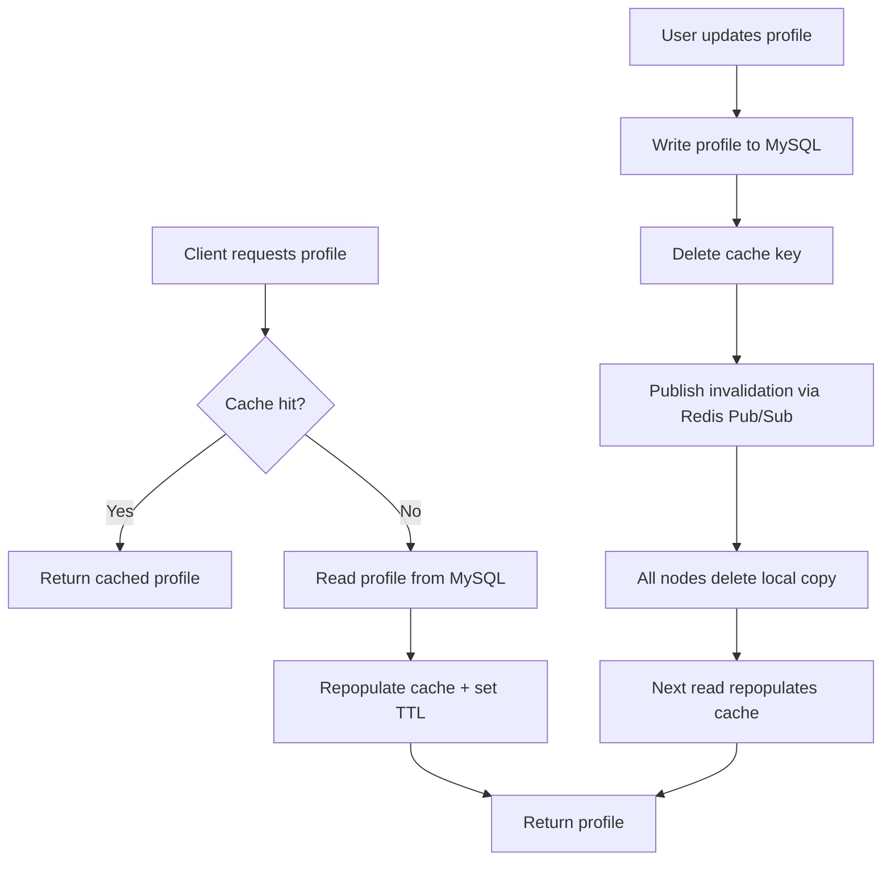

| Difficulty | Channel | Tags |
|---|---|---|
| beginner | backend | redis, memcached, cache-invalidation |

Meta's social graph — every profile, friend edge, like, and comment — was served from a lookaside Memcached tier in front of MySQL [1]. As the company pushed past interactive scale, that flat key-value cache started to crack: stale data leaked into feeds, race conditions surfaced as visible bugs, and thousands of PHP servers each carried their own hand-rolled cache-consistency logic [1]. The database was never the bottleneck. The cache tier was. That is why cache invalidation — a topic most interviews skim in thirty seconds — is the quiet superpower behind one of the largest systems on Earth.

---

> ### Real-World Case — Meta (Facebook)
>
> Facebook's social graph — every user profile, friend edge, like, and comment — was cached in a lookaside Memcached tier in front of MySQL. As the site grew past interactive scale, serving profile data with a flat key-value cache collapsed: updating a cached item required client-driven invalidation, cache-consistency logic was duplicated across thousands of PHP web servers, and race conditions produced visible bugs.
>
> | | |
> |---|---|
> | **Challenge** | Cache invalidation at massive scale. A single edge change (e.g., a new like) forced invalidation of the entire cached list key, tanking hit rates. When a hot profile key expired, thousands of clients simultaneously missed and stampeded MySQL (thundering herd). There was no distributed coordination to coalesce misses, and read-after-write consistency was nearly impossible with async MySQL replication across data centers. Net result: user-visible stale data and performance fires. |
> | **Solution** | Facebook built TAO ('The Associations and Objects'), a write-through, graph-aware cache replacing the raw memcache/MySQL lookaside pattern. It moved cache-control logic out of the clients and into the cache tier itself: a two-tier hierarchy of memcached 'followers' (serve reads) and 'leaders' (own each shard, talk to MySQL). All writes funnel through one leader per shard, which coalesces concurrent misses into a single DB query (killing thundering herds), then propagates version-numbered invalidation/refill messages to followers — delivered via the MySQL replication stream so cache updates land exactly when the DB commit is visible. |
> | **Outcome** | TAO handles over a billion read requests and millions of write requests per second (a ~500:1 read-to-write skew), with roughly 96% of reads served straight from cache RAM — MySQL only sees a few percent of the graph's read traffic. The cache tier, not the database, proved to be the real scaling wall. |
> | **Lesson** | Cache-aside with client-side invalidation doesn't scale once hot keys and edge lists dominate. Centralize cache-control in the cache tier, coalesce misses onto a per-shard coordinator to absorb stampedes, cache data shaped like your access patterns (edges and counts, not opaque blobs), and use versioned invalidation messages so concurrent updates can't reintroduce stale reads. |

---

## Hook — The real bottleneck was never the database

What if the most fragile part of your system is also the part you trust most? At Meta, the cache tier handled over a billion read requests and millions of write requests per second — a roughly 500:1 read-to-write skew — with about 96% of reads served straight from cache RAM, while MySQL saw only a few percent of the graph's traffic [1]. That is the dream scenario for any performance engineer. And yet Meta's team discovered that the cache itself, not the database, was the real scaling wall [1]. The moment a user edits their profile, all of that blazing-fast cached data quietly becomes a lie waiting to happen. Sound familiar?

## Problem — The stale-data trap waiting for every profile update

Imagine this: a user updates their profile picture, then refreshes the page and sees the old photo. Their friend's app shows the new one. A search result shows yet another version. Every developer has been here — staring at three different answers to the same simple question and wondering which layer betrayed them. The core problem is that caching is a bargain with entropy. Reads become nearly free, but every write introduces a window where some node holds data that no longer reflects reality. Many developers think adding a TTL solves everything. It reduces the window, sure. But a 30-minute TTL means a profile can stay stale for half an hour — an eternity in a product where users expect instant feedback. The deeper issue is coordination: when you scale to many app servers, each holding its own cached copy, who tells them all to refresh? Opting out of a cache because of this complexity is worse, because the read traffic genuinely needs it at that scale. Consequently, the real question is not 'should you cache' but 'how do you keep many copies in sync without destroying your latency'.

## Real-World Case — Meta (Facebook)

By the time Meta documented the story in 2013, its social graph had long outgrown interactive scale. Picture a lookaside tier: thousands of memcached instances fronting MySQL, with every profile, friend edge, and comment passing through a flat key-value store [1]. The design worked beautifully — until it didn't. Because invalidation was client-driven, each of the thousands of PHP web servers had to remember which keys to delete on which nodes, duplicating cache-consistency logic across the fleet [1]. Race conditions were common: a write to MySQL could be followed by a read that repopulated the cache with the old value, an ordering hazard known as the stale-read problem. The result was a hospitality of subtle, visible bugs and a ceiling you could feel: the team estimated the read-heavy workload was stretching the cache tier to its limits while the underlying database sat mostly idle [1]. Their fix, a storage layer called TAO, kept the lookaside philosophy but built the graph knowledge directly into the cache tier, so invalidation could flow through it automatically rather than depending on every app server getting it right. The lesson was not to abandon caching. It was to treat invalidation as a first-class engineering problem, not an afterthought.

## Deep Dive — Write-through caching, TTLs, and the Redis vs. Memcached trade-off

Building on Meta's story, the durable fix is a pattern called write-through caching: updates go to the database first, then to the cache, and the old key is deleted rather than overwritten in place [2]. Deleting beats overwriting because it avoids transient windows where a reader sees partially updated data. TTLs act as a safety net, guaranteeing the cache never holds a zombie value forever — 5 to 30 minutes is the sweet spot for profile data, trading a bounded consistency window against database load [3]. The cache-aside pattern, meanwhile, governs reads: check the cache, on a miss fetch from the primary store and repopulate [2]. Now for the fork in the road: Redis or Memcached? Teams often pick Memcached for its simplicity — lower memory overhead per key, dead-simple horizontal scaling [5]. Its weakness is coordination: because it has no native pub/sub, invalidating a key across many nodes requires manually tracking which node holds which key, which is precisely the burden that crushed Meta's fleet [1]. Redis, by contrast, ships pub/sub out of the box, letting every node subscribe to invalidation events and clear its local copy automatically [4]. It also offers persistence and richer data structures, at the cost of higher per-key overhead [4]. For a profile service spanning multiple servers, the coordination advantage of Redis usually wins; for a pure internal lookup on a single box, Memcached's lean footprint still shines [5]. Here is the real trade-off, concretely:

## Workflow — A step-by-step plan for cache invalidation that survives scale

The strategy breaks down into five repeatable steps. First, choose your primary store and make it the source of truth — the cache never decides what is correct. Second, adopt cache-aside for all reads: try the key, fall through to the database on a miss, and repopulate with a TTL. Third, on every write, update the database first, then delete the cache key rather than overwriting it — deletion avoids serving torn reads. Fourth, if you run multiple application nodes, use Redis pub/sub to broadcast an invalidation event so every node drops its stale copy in one coordinated sweep [4]. Fifth, wrap everything in monitoring: track cache hit rates, eviction counts, and the ratio of invalidations to reads, because a falling hit rate is the first symptom of a design mistake [8]. This is the same progression Meta followed: naive lookaside first, client-driven invalidation as the painful middle step, and finally a coordinated, storage-aware model [1]. The diagram below maps the full flow, from request to invalidation broadcast, so you can see where each pattern slots in.

## Code Example — A production-shaped write-through implementation

Here is the pattern in concrete form. This Python example uses Redis for both caching and pub/sub, with a placeholder database for clarity, and it mirrors exactly the write-through plus deletion plus broadcast flow described above.

## Lessons Learned — What Meta's war story teaches your profile service

Step back and the pattern is clear: cache invalidation is a coordination problem masquerading as a performance problem. The biggest battle scar in this territory is the delete-versus-overwrite mistake — overwriting in place feels logical but leaves readers exposed to half-written values, while deleting and letting the next read repopulate keeps everyone honest. The second scar is TTL hubris: skipping TTLs 'because we invalidate properly' turns one missed invalidation into a permanent lie. And the third is choosing a cache purely on raw speed without asking who coordinates invalidation [5]. If your service talks to multiple nodes, budget for that coordination cost up front [4]. Finally, do not make the cache invisible: instrument it. Without hit-rate and invalidation metrics, you are flying blind toward the wall Meta hit [1][8]. Tomorrow, take a look at your profile service and ask three questions: who invalidates, how are they notified, and what happens if they miss? Fix those three answers and you will have learned what a billion reads a second could not outrun — you have to design invalidation before the wall finds you.

---

## Write-Through Cache Invalidation Flow

<strong>Original Interview Question</strong>

**Q:** You're building a user profile service that caches frequently accessed profiles. How would you implement cache invalidation when a user updates their profile, and what trade-offs would you consider between Redis and Memcached?

**A:** Implement write-through caching with TTL-based expiration. On profile update, invalidate the cache by deleting the key and writing new data to both the database and cache. Redis offers pub/sub for automatic distributed invalidation, while Memcached requires manual coordination across nodes.

## Conclusion

The moral of Meta's story is that your cache is not a performance optimization — it is a distributed system in its own right, and invalidation is its consistency protocol. Walk over to your profile service and audit the three weak points: who deletes the key, who gets notified, and what the TTL buys you if a notification is lost. If your cache currently updates by overwriting in place or has no TTL safety net, you are carrying the same latent race conditions that plagued thousands of Meta PHP servers [1]. Fix those, instrument your hit rate, and you gain the one thing a billion reads per second could not buy: confidence that the fastest answer in your system is also the correct one.

---

## References

1. [Meta (Facebook) incident report](https://engineering.fb.com/2013/06/25/core-infra/tao-the-power-of-the-graph/) — blog
2. [Cache (computing) — Writing policies](https://en.wikipedia.org/wiki/Cache_(computing)#Writing_policies) — documentation
3. [Cache invalidation](https://en.wikipedia.org/wiki/Cache_invalidation) — documentation
4. [Redis](https://en.wikipedia.org/wiki/Redis) — documentation
5. [Memcached](https://en.wikipedia.org/wiki/Memcached) — documentation
6. [redis/redis — GitHub repository](https://github.com/redis/redis) — documentation
7. [memcached/memcached — GitHub repository](https://github.com/memcached/memcached) — documentation
8. [AWS ElastiCache best practices](https://docs.aws.amazon.com/AmazonElastiCache/latest/red-ug/best-practices.html) — documentation
9. [MDN — HTTP caching](https://developer.mozilla.org/en-US/docs/Web/HTTP/Caching) — documentation

---

**Author:** Satishkumar Dhule — [GitHub](https://github.com/satishkumar-dhule) · [LinkedIn](https://linkedin.com/in/satishkumar-dhule) · [Website](https://satishkumar-dhule.github.io)
