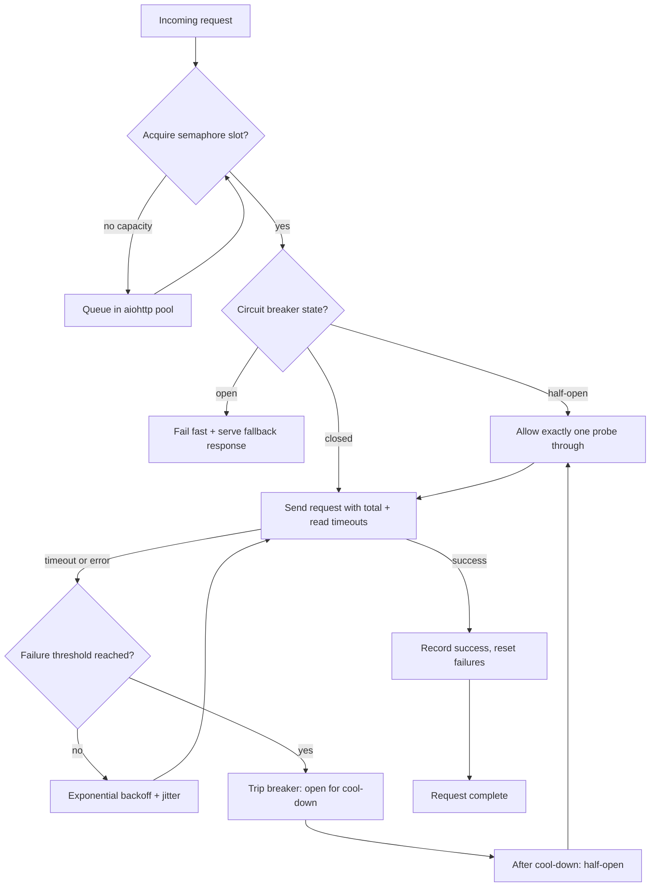

| Difficulty | Channel | Tags |
|---|---|---|
| advanced | backend | asyncio, aiohttp, concurrency |

Every second at Netflix's peak, roughly 20,000 requests hit the API — and each one fanned out to half a dozen downstream services [1]. Back in 2011, the team did the math: with ~30 dependencies running at 99.99% uptime apiece, members faced 2+ hours of degraded service every single month, and one slow endpoint could saturate every worker thread and black out the entire platform in seconds [1]. Throwing more hardware at it made things worse. The answer turned out to be a humble trio of patterns you can implement in plain Python: a capped connection pool, exponential backoff, and a circuit breaker.

---

> ### Real-World Case — Netflix
>
> In 2011-2012, Netflix's API grew to handle 1+ billion requests per day (about 20,000 requests/sec at peak), each fanning out to dozens of backend services at roughly a 1:6 ratio. With ~30 dependencies each at 99.99% uptime, the math implied 2+ hours of downtime per month, and a single slow or failing service could saturate every available request thread in seconds and take down the entire API for all members.
>
> | | |
> |---|---|
> | **Challenge** | Preventing cascade failures in a high-volume distributed HTTP API: connection/thread-pool exhaustion, connections timing out and piling up, retries amplifying load on an already-struggling dependency, and one latent (slow, not down) dependency collapsing the whole system. |
> | **Solution** | Netflix built the DependencyCommand layer that evolved into Hystrix: per-dependency thread pools and connection pools as bulkheads, semaphore-based rejection (a non-blocking tryAcquire, exactly like aiohttp Semaphore) instead of unbounded queueing, aggressive network timeouts with bounded retries tuned against the dependency's 99.5th percentile latency, and a circuit breaker that tripped at ~50% error rate over a 10-second rolling window — short-circuiting to fallbacks (fail fast, fail silent, or serve cached data) so the system shed load and gave failing services time to recover. |
> | **Outcome** | Hystrix matured into company-wide adoption, executing tens of billions of thread-isolated and hundreds of billions of semaphore-isolated calls per day at Netflix with 'a dramatic improvement in uptime and resilience.' In one documented incident, a bug caused the API to intermittently cache malformed objects, which throttled its database — the circuit breaker automatically tripped the DB circuit, 157 of 200 server instances served fallback responses from a local query cache, and short-circuited requests never touched the overloaded database, keeping members streaming. |
> | **Lesson** | Fault tolerance must be built into the application, not delegated to infrastructure: a single slow dependency can exhaust the entire connection pool in seconds (sub-second thread saturation), so each dependency needs its own bounded pool/semaphore (bulkheading), hard timeouts with capped retries, and a circuit breaker that fails fast and serves fallbacks under sustained failure so the system degrades gracefully instead of cascading. |

---

## Hook — It always starts with one endpoint going quiet

A cache stampede, a query that decides to reshape itself mid-flight, a database replica that stops answering — and suddenly every request thread in your process is parked, waiting on connections that will never complete. You might believe your service is too small for this to matter. Cascade failures, however, do not check your traffic numbers; they only need one unguarded dependency [1]. The failure always takes the same shape: capacity that looked generous becomes a captive audience for dead connections. So the real question is not whether you will see a slow dependency — it is whether you have a mechanism that keeps that single peer from eating your entire pool.

## Problem — The connection pool that quietly becomes a hostage

At the heart of the chaos sits a resource you cannot grow without bound: concurrent outbound connections. With asyncio there are no threads to saturate, but the failure mode is identical — tasks stack up, the event loop thrashes, and latencies compound until the process is doing nothing but waiting [3]. Many teams ship a plain aiohttp.ClientSession and assume it will behave sensibly under pressure. It will not. The default total timeout is a generous 5 minutes, the request pool has no safety cap by default, and retries either never happen or happen all at once in a synchronized stampede [5][7]. Add a few dependencies whose slow moments overlap, and the thundering herd writes itself. Here is the stakes, concretely: every wasted connection is a request your users actually waited for, converted into a timeout or an error page.

## Real-World Case — Netflix's 2011 drop-dead moment

Netflix's near-miss is the canonical war story for this problem, and it is remarkably well documented [1]. The API was already handling over 1 billion requests per day — roughly 20,000 requests per second at peak — and each request fanned out to six or more downstream services. The team ran the numbers: about 30 dependencies, each promising 99.99% uptime, still implies hours of combined outage for members every month. Worse, a single slow or failing service could devour every available request thread within seconds, taking down the API for every member at once [1]. The response was Hystrix, a library that did nothing exotic — it isolated calls, capped concurrency, and added circuit breakers. It matured into company-wide adoption, executing tens of billions of thread-isolated and hundreds of billions of semaphore-isolated calls per day at Netflix [2]. In one documented incident, a caching bug throttled the database; the breaker tripped on the DB circuit automatically, 157 of 200 server instances served responses from a local query cache, and every short-circuited request never touched the overloaded database [1]. Members kept streaming while an upstream service was on fire. That is what graceful degradation looks like.

## Deep Dive — The four layers between you and a meltdown

Now translate that into an asyncio world. The full resilience stack is layered, and each layer covers the blind spot of the one below it.

Start with concurrency. A semaphore caps how many requests can be in flight at once — your version of thread isolation [4]. The plot twist: aiohttp's TCPConnector already ships one built in, via the limit parameter, so a slow peer starves only its share of the pool rather than the world. Many teams reimplement the semaphore in app code and never set the connector's native limit, leaving a second, ungoverned pool underneath their throttle [5].

Above that sit timeouts — and one number is never enough. ClientTimeout(total=30) bounds the whole exchange, but sock_read and sock_connect bound its pieces; a peer that accepts a connection then goes silent is a different failure than a peer that never answers [5].

Then come retries, where most homegrown loops accidentally fistfight the very service they are trying to help. Linear retries fire on identical cadences, turning a trickle of failures into a synchronized stampede. Exponential backoff with jitter spreads retries across time instead [7][9]. Backoff is patience; jitter is randomization — you need both.

The top layer is the circuit breaker: a three-state machine (closed, open, half-open) that stops calling a failing service altogether rather than retrying it into the ground [6]. Half-open is the depth charge — after a cool-down, exactly one probe request gets through; success resets the breaker, failure keeps it open.

| Approach | What it protects | Failure mode |
| Naive session, no limits | nothing | one slow peer eats every worker [5] |
| Connector limit + timeout | connections and wall-clock | retries still stampede [7] |
| Semaphore + backoff | in-flight count and retry rhythm | failures keep hammering the peer |
| Full stack + fallback | the entire blast radius | needs a designed degraded path [6] |

## Workflow — From single-session script to resilience pipeline

Translating that into a plan, the sequence looks like a pipeline with a decision at every stage:

1. Measure the baseline — record current pool size, p95/p99 latencies, and connection churn before changing anything.
2. Set explicit timeouts at every layer: total, connect, read. Silence from a peer is indistinguishable from death.
3. Cap concurrency with a semaphore and the connector's native limit.
4. Add the circuit breaker and a fallback path (cached data, a default, or a fast 503). Fail fast only helps if the alternative response is designed, not improvised [8].
5. Implement retries with exponential backoff plus jitter; never auto-retry non-idempotent writes.
6. Health-check and prune dead connections during long runs.
7. Shut down cleanly — close the session on exit or every pooled socket leaks [5].
8. Watch the metrics (breaker-open duration, queue depth, backoff waits) and tune thresholds from evidence.

The flowchart below shows the runtime path. Notice the breaker check happens before the request, not after — that ordering is the difference between degrading and falling over.

## Code Example — The whole pattern in one manager class

This is the full pattern compressed into a manager that reuses a three-state breaker, gates concurrency with a semaphore, retries with exponential backoff plus jitter, and cleans up after itself. Use it as the backbone of any service that fans out to databases, caches, or third-party APIs.

## Lessons Learned — The takeaway that survives the 2am pager

After watching many teams walk this path, the lessons are consistent:

• Defaults are liabilities. A 5-minute total timeout and an unbounded pool are fine for scripts, wrong for services — set explicit numbers [5].
• Cleanup is non-negotiable. Call session.close() on shutdown; otherwise sockets accumulate and the errors you see in prod never reproduce locally [3].
• Timeouts and retries must be tuned as a pair. Over-short timeouts with aggressive retries turn 30ms blips into seconds of wasted attempts [7].
• A breaker without a fallback is just a faster failure. Design what a degraded response looks like before you need it [8].
• Half-open is not decoration. Without the probe, a recovering service gets melted by a wall of retries the instant the cool-down expires [6].

The one line to bring back to your team: you cannot prevent every dependency from failing, but you can decide in code who gets hurt when one does. That decision — not the retry count — is what allowed Netflix to keep members streaming at 20,000 requests per second [1].

---

## Request Flow: Semaphore Gate, Circuit Breaker, and Retry

<strong>Original Interview Question</strong>

**Q:** How would you implement a connection pool manager for aiohttp that handles graceful degradation under high load and connection timeouts?

**A:** Implement a connection pool manager for aiohttp using a semaphore to limit concurrent connections, exponential backoff for retrying failed requests, and circuit breaker pattern to gracefully degrade under high load and connection timeouts.

## Conclusion

The journey ends where it began: Netflix, 20,000 requests per second, and a database on fire. Nothing in that story required a miracle — only a capped pool, honest timeouts, backoff with jitter, and a breaker that knew when to say no [1]. The same arithmetic works at your scale: your slow dependency will appear eventually, and the only question you control is whether one sick service takes down your users' experience or gets politely quarantined. Start tomorrow: cap your connections, set your timeouts, add a breaker, design a fallback, and run a load test against a deliberately slow peer. When the pager does vibrate about that upstream service, your monitoring should already be watching the breaker — not explaining to leadership why everything is down. The most expensive lesson in distributed systems is the one you can pay for in three patterns and sixty lines of Python.

---

## References

1. [Netflix incident report](https://netflixtechblog.com/fault-tolerance-in-a-high-volume-distributed-system-91ab4faae74a) — blog
2. [Netflix Hystrix](https://github.com/Netflix/Hystrix) — documentation
3. [Python asyncio documentation](https://docs.python.org/3/library/asyncio.html) — documentation
4. [asyncio synchronization primitives](https://docs.python.org/3/library/asyncio-sync.html) — documentation
5. [aiohttp client reference](https://docs.aiohttp.org/en/stable/client_reference.html) — documentation
6. [Circuit breaker design pattern](https://en.wikipedia.org/wiki/Circuit_breaker_design_pattern) — documentation
7. [Exponential backoff](https://en.wikipedia.org/wiki/Exponential_backoff) — documentation
8. [RFC 6585 — Additional HTTP Status Codes (503 Service Unavailable)](https://datatracker.ietf.org/doc/html/rfc6585) — documentation
9. [MDN Glossary — Backoff](https://developer.mozilla.org/en-US/docs/Glossary/Backoff) — documentation

---

**Author:** Satishkumar Dhule — [GitHub](https://github.com/satishkumar-dhule) · [LinkedIn](https://linkedin.com/in/satishkumar-dhule) · [Website](https://satishkumar-dhule.github.io)
