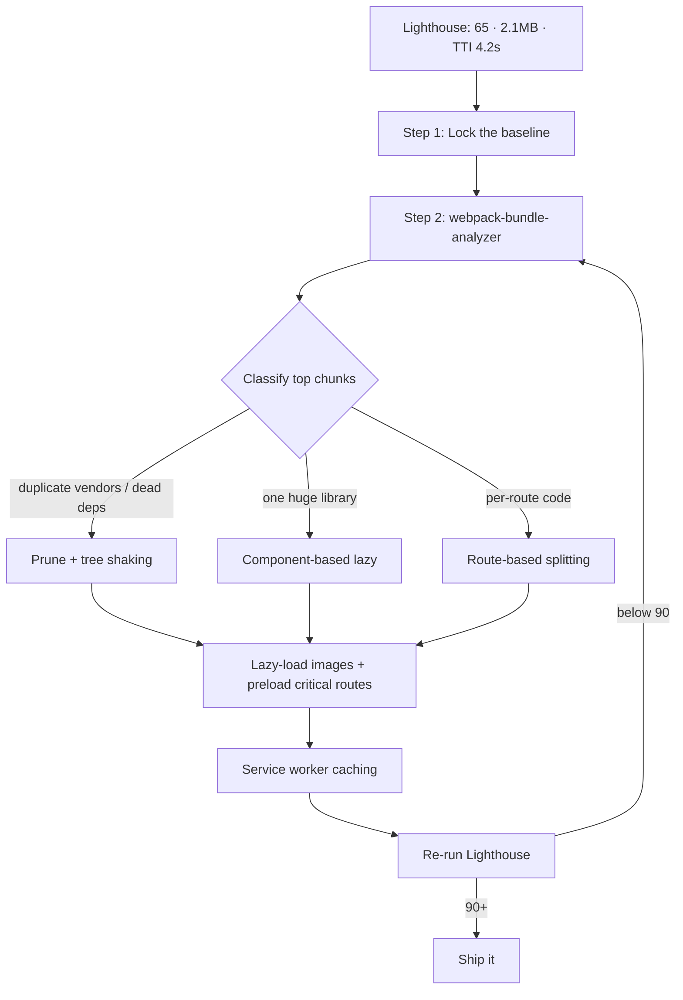

| Difficulty | Channel | Tags |
|---|---|---|
| intermediate | frontend | lighthouse, bundle, lazy-loading |

In 2017, Tinder rebuilt its entire web product as a progressive web app — and immediately discovered that a beautiful app is useless when it takes several seconds to become interactive on a Galaxy S7 over 4G [1]. A monolithic React bundle was making swipes wait, so the team got surgical with code splitting, cutting the main bundle from 166KB to 101KB and shaving a full second off load time [1]. That rescue is the blueprint for your own turnaround: moving a Lighthouse score from 65 to 90+ doesn't demand a rewrite — it demands a scalpel. This is the journey from frozen spinner to snappy swipe.

---

> ### Real-World Case — Tinder
>
> In 2017, Tinder rebuilt its entire web presence as a progressive web app ('Tinder Online') usable by 100% of users on desktop and mobile. On slow mobile hardware (a Galaxy S7 on 4G), the app's large monolithic React JavaScript bundles, containing code not needed to boot the core experience, delayed how quickly the app could load and become interactive — forcing users to wait several seconds just to start swiping.
>
> | | |
> |---|---|
> | **Challenge** | Tinder needed to cut down what was shipped at startup to reach interactivity in under 5 seconds on slow 4G connections. Their main and vendor bundles were bloated, HTTP caching was ineffective, and there was no mechanism to keep performance from regressing as the product evolved. |
> | **Solution** | They introduced route-level code splitting using React Loadable, dynamic import(), and webpack magic comments; vendor chunking via CommonsChunkPlugin; long-term asset caching (split webpack manifest, chunkhash); link rel=preload for critical first-paint chunks; service worker precaching of route bundles; webpack-bundle-analyzer to find low-hanging fruit; scope hoisting; and upgraded to React 16. Crucially, they then enforced hard performance budgets (~155KB main+vendor, ~55KB async chunks, ~35KB others, 20KB CSS) to prevent regressions. |
> | **Outcome** | Route-based splitting cut the main bundle from 166KB to 101KB and improved DCL from 5.46s to 4.69s; link rel=preload reduced load time by 1s and first paint from ~1000ms to ~500ms; scope hoisting improved initial vendor-chunk parsing by 8%; React 16 cut the vendor chunk by ~7% (to ~35KB gzipped); the site became interactive in under 5s on a Galaxy S7 over 4G. |
> | **Lesson** | Shipping less JS at startup is only half the battle — the 'plot twist' is that Tinder paired code splitting with service worker precaching (so subsequent navigations were instant) and, most importantly, hard performance budgets so the gains never silently regressed. Measure with bundle analyzers, split at the route level, and budget to stay fast. |

---

## Hook — A spinner where a swipe should be

It's a slow Tuesday evening, and somewhere a hopeful heart is staring at a loading spinner instead of a face. That was the reality of Tinder's web experience in its early PWA days: users on modest phones waited several seconds just to reach the first swipe, because the bundle shipped code the core experience never needed [1]. You'd expect the fix to be a full rewrite. Tinder shipped a scalpel instead. Every hard-won millisecond the team clawed back taught the same lesson: the fastest code is the code the browser never downloads. Here is the part worth leaning into — the playbook that saved Tinder is sitting inside your node_modules right now, half-asleep. Let's wake it up.

## Problem — The 2.1MB elephant in your performance audit

Now flip the scene to your own review board. Lighthouse reports a 65, the bundle weighs 2.1MB, and Time to Interactive crawls at 4.2 seconds. Those numbers are no longer a private embarrassment — Google's Lighthouse has become the industry's shared scorecard, one that quietly influences search visibility and user trust [9]. So who feels the pain? You do, the second a mobile visitor bounces; your product manager, when the conversion chart dips; and your infrastructure budget, when every guest drags 2.1MB across a flaky 4G tower.

The real villain is subtle. It's not React. It's not your hand-rolled CSS. It's the gap between what the browser must parse to boot the experience and everything it parses anyway. Consequently, a user who arrived for checkout pays the parsing tax for an admin-dashboard chart they will never open. Many developers respond by buying a faster CDN or requisitioning flagship phones for QA. Both are coping mechanisms. Slow is a shipping problem, not a hardware problem — and that flips the entire strategy: stop serving everything, start splitting.

## Real-World Case — Tinder's compounding performance victory

Tinder's engineers rebuilt the entire web presence ('Tinder Online') so 100% of users could use it on desktop and mobile — a genuine progressive web app, not a wrappered shortcut [1][7]. Vision delivered; numbers didn't. On a Galaxy S7 over 4G, the large monolithic React bundles — bloated with code the core experience didn't need — kept the app from becoming interactive for several long seconds [1].

What happened next reads like a masterclass in compounding wins rather than a hero sprint. First, route-based splitting cut the main bundle from 166KB to 101KB and improved DOMContentLoaded from 5.46s to 4.69s [1]. Then link rel=preload sliced load time by 1s and dropped first paint from ~1000ms to ~500ms [1]. Scope hoisting improved initial vendor-chunk parsing by 8%, and the move to React 16 trimmed the vendor chunk roughly another 7%, down to about 35KB gzipped [1]. The finish line: the site became interactive in under five seconds on that very Galaxy S7 over 4G [1].

Notice what did not happen — no silver bullet, no whiteboard physics. Just stacked optimizations, each one freeing a little more headroom for the next technique to exploit.

## Deep Dive — Code splitting isn't magic, it's arithmetic

This leads to a plot twist many developers miss: the framework is innocent. Whatever ships is whatever the browser parses, and outside trivial framework overhead, it's the dead weight you import that sinks interactivity. So the unlock is code splitting — breaking one giant bundle into chunks the browser fetches only when needed [2]. The modern toolkit is three small pieces: dynamic `import()` as the primitive, `React.lazy()` as the wrapper, and `` as the graceful fallback while the chunk downloads [2].

The critical decisions come at the cutting table, and this is where teams live or die. Route-based splitting, chunking per URL, was the source of Tinder's biggest single win [1]. Component-based splitting cuts inside a route, perfect for heavy widgets the user scrolls past. The real trade-off deserves a table:

| Strategy | Splits on | Best for | The catch |
|---|---|---|---|
| Route-based | URL | First-paint-critical apps, SPAs | Too many empty screens if fallbacks are lazy |
| Component-based | Component | Charts, editors, below-the-fold UX | Extra requests can chain into waterfalls |

Here is the counterintuitive part: splitting too aggressively is a sin too. A thousand 5KB requests create a network waterfall that can route around your monolith and beat it to the finish line [8]. Therefore the sweet spot is a small set of meaningful chunks — one vendor chunk, one per route, a couple of heavy components. And tree shaking only works when the import graph is static; CommonJS `require` quietly kills it. Configure `sideEffects` honestly in package.json and let the bundler prune everything never referenced [6]. None of this is magic. It's negotiating with your bundle: cut what's unused, defer what's heavy, cache what's shared.

## Workflow — Nine steps from 65 to 90+

Once the method is clear, the process becomes nearly mechanical. This is the battle-tested loop any team can run in an afternoon — and it maps one-to-one onto the techniques that rescued Tinder:

1. **Lock the baseline.** Record the Lighthouse 65 and the 2.1MB number. Never optimize what you can't measure [9].
2. **Run webpack-bundle-analyzer.** Render the bundle breakdown and stare at the treemap until a villain emerges [5].
3. **Classify the top chunks.** Duplicated vendors (two lodash versions, anyone?), dead dependencies, or a single 400KB chart library are the usual suspects.
4. **Split at the route level first.** This delivered Tinder's biggest single win, so take it first [1].
5. **Split heavy components second.** Anything below the fold or behind a button click becomes a `lazy()` boundary.
6. **Enable tree shaking and prune dependencies.** ES modules in, dead weight out [6].
7. **Lazy-load images and preload critical routes.** `loading="lazy"` for below-the-fold media [4], `rel=preload` for the chunks you know you'll need.
8. **Add a service worker cache.** Cached chunks mean repeat visits stop re-downloading the internet [3].
9. **Re-run Lighthouse.** Iterate until 90+, then celebrate — briefly. Performance budgets are a subscription, not a trophy.

The whole strategy reads like a pipeline, and pipelines belong in diagrams. The chart below tells the visual story of this exact flow: measure → analyze → classify → split → prune → cache → verify, looping until the number flips green.

## Code Example — The router is your first surgical incision

Putting the workflow into practice, the hottest split in any single-page app lives at the router. Wrap your routes in `React.lazy()`, let `` own the fallback, and bolt on an error boundary so a failed chunk download shows a retry button instead of a blank white void [2]. The snippet below mirrors the route-based pattern from the Tinder case — this is the exact shape you'll find in well-tuned production apps today [1].

**Walkthrough:** each `lazy()` call hands the bundler a new split point and emits a separate chunk, fetched only when the route is visited. `Suspense` renders the spinner while the network catches up. The `ChunkBoundary` class is the unsung hero — `getDerivedStateFromError` catches load failures (weak signal, server hiccup, cache eviction) and offers a human escape hatch instead of a white screen. The insight that makes this professional-grade: a route split covers the *first* paint, but a component-level split on `HeavyChart` keeps a 400KB chart library out of every user's initial parse, except the ones who actually open a report.

## Lessons Learned — What the optimization teaches about shipping

Several myths don't survive contact with Tinder's numbers, and the takeaways travel well beyond this one stack:

- **Measure before you touch anything.** Tinder knew exactly where the seconds lived because they quantified every layer first [1]. Your intuition about the 400KB library is often wrong — often it's duplicated lodash hiding in the vendor blob.
- **Stack wins instead of hunting one.** No single change got Tinder to sub-5s interactivity; splitting, preloading, scope hoisting, and a React upgrade each contributed [1]. Plan your campaign in increments, not swings.
- **Cache what doesn't change.** A service worker turns returning visitors into near-instant loads — the cheapest performance you'll ever buy [3].
- **Watch out for the over-split trap.** ⚠️ Hundreds of micro-chunks trade a monolith for a waterfall. Aim for a handful of deliberate boundaries [8].
- **Tree shaking has a secret precondition.** 🔥 It only bites when your imports are static ES modules and your `sideEffects` flag is honest. One sneaky `require()` and the tree stays firmly leaved [6].

🎯 Key Point: performance is a narrative of small, measured, compounding wins — exactly the story Tinder's 166KB-to-101KB bundle tells [1].

---

## Bundle Optimization Workflow

<strong>Original Interview Question</strong>

**Q:** You're tasked with improving a React app's Lighthouse performance score from 65 to 90+. The bundle size is 2.1MB and Time to Interactive is 4.2s. What specific steps would you take to optimize the bundle and implement lazy loading?

**A:** Implement code splitting with React.lazy() and Suspense, analyze bundle composition with webpack-bundle-analyzer to identify largest chunks, remove unused dependencies and optimize imports, add dynamic imports for heavy components and third-party libraries, implement route-based splitting for better initial load times, and utilize tree shaking with proper ES module configuration.

## Conclusion

The moral of Tinder's story is that a monolithic bundle isn't a career dead end — it's an invitation to be surgical [1]. By measuring first, splitting at the routes, deferring heavy components, enabling tree shaking, and caching with a service worker, any team can walk a 2.1MB, 4.2s-TTI app to a 90+ Lighthouse score without a single rewrite [1][6][3]. Tomorrow's first move is embarrassingly simple: open your bundle analyzer, find the biggest chunk, and ask whether every user actually needs it. Share that one insight with your team — the fastest code is the code the browser never downloads [2].

---

## References

1. [Tinder incident report](https://calendar.perfplanet.com/2017/a-tinder-progressive-web-app-performance-case-study) — article
2. [import() — dynamic import syntax](https://developer.mozilla.org/en-US/docs/Web/JavaScript/Reference/Operators/import()) — documentation
3. [Service Worker API](https://developer.mozilla.org/en-US/docs/Web/API/Service_Worker_API) — documentation
4. [Lazy loading — MDN Performance guide](https://developer.mozilla.org/en-US/docs/Web/Performance/Lazy_loading) — documentation
5. [webpack-bundle-analyzer](https://github.com/webpack-contrib/webpack-bundle-analyzer) — documentation
6. [JavaScript modules — MDN guide](https://developer.mozilla.org/en-US/docs/Web/JavaScript/Guide/Modules) — documentation
7. [Progressive web apps](https://en.wikipedia.org/wiki/Progressive_web_app) — article
8. [Single-page application](https://en.wikipedia.org/wiki/Single-page_application) — article
9. [Google Lighthouse](https://en.wikipedia.org/wiki/Google_Lighthouse) — article

---

**Author:** Satishkumar Dhule — [GitHub](https://github.com/satishkumar-dhule) · [LinkedIn](https://linkedin.com/in/satishkumar-dhule) · [Website](https://satishkumar-dhule.github.io)
