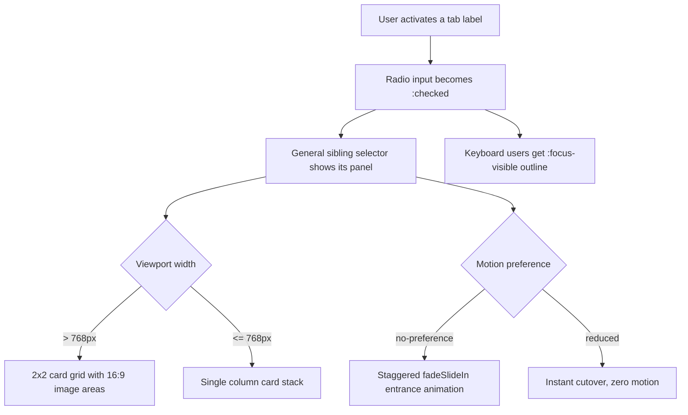

| Difficulty | Channel | Tags |
|---|---|---|
| beginner | frontend | css, flexbox, grid, animations |

Nine kilobytes. That is roughly the size of one compressed photo you would never think twice about — and yet, for the Wikimedia Foundation, shaving exactly that much JavaScript off Wikipedia's startup manifest recovered about 1.4 terabytes of bandwidth per day across 523 million daily pageviews [1]. Now run that same arithmetic against your docs site, your dashboard, and your marketing pages: every kilobyte of JavaScript you ship is a tax paid on every pageview, from every slow cellular connection, on every low-end Android device. This is the story of how a humble, CSS-only tab panel quietly dismantles that tax — no JavaScript at runtime, and your users will never notice the difference. The twist? The pattern only feels impressive once you understand exactly what Wikimedia traded away to get those bytes back.

---

> ### Real-World Case — Wikimedia Foundation (Wikipedia)
>
> Wikipedia serves over 500 million pageviews per day to a global audience, much of it on slow cellular connections and low-end Android devices where mobile data is expensive. A large portion of readers also browse without JavaScript: anonymous Tor users (JS disabled by default), browser reader modes, and Chrome on Android which silently disables JS on slow connections.
>
> | | |
> |---|---|
> | **Challenge** | A large unconditional JavaScript payload—including about 41 KB of jQuery plus a 36 KB startup manifest shipped on every page view—delayed time-to-interactive and wasted costly mobile bandwidth. The engineering team had to keep the site fully functional when JavaScript never loads, parses, or executes, and get its delivery pipeline within a strict byte budget. |
> | **Solution** | Wikimedia's architecture is no-JS-first: every page begins in "Basic mode" as server-rendered HTML with plain CSS, and interactivity is deliberately built with HTML/CSS-native mechanisms (forms, `:checked`, ``) so JS is only an enhancement. The performance team then refactored ResourceLoader so jQuery and page modules no longer block the startup path, and aggressively shrunk the startup manifest from 36.2 KB down to 27.2 KB—fitting the 28 KB budget of two network packet bursts. |
> | **Outcome** | The startup manifest reduction (about 9 KB net after compression) saves roughly 1.4 terabytes of bandwidth per day, and about 4.3 terabytes per day across the year-long effort, across 523 million daily pageviews. Removing jQuery and the extra serial request from the critical path lets JavaScript modules execute an entire server round trip earlier, improving time-to-interactive and the mwLoadEnd metric on every page view. |
> | **Lesson** | The cheapest, most resilient request is the one never made: by making HTML+CSS the default layer and treating JavaScript as progressive enhancement, a 9 KB payload trim at this scale becomes terabytes of daily bandwidth savings—and the site keeps working for the ~many users whose JavaScript never runs. |

---

## Hook — The Hidden Tax on Every Pageview

9 KB. The number feels trivial until you multiply it by 523 million pageviews a day. For the Wikimedia Foundation, that tiny payload compiled into roughly 1.4 terabytes of bandwidth burned every single day — enough to fill a small data center's worth of transfers before breakfast — and about 4.3 terabytes per day across the year-long effort [1]. Here is the uncomfortable truth this story forces into the open: every ounce of JavaScript you add to a page is a recurring cost, not a one-time purchase. Most developers never see the bill because it arrives as slow time-to-interactive on someone else's device, in an analytics chart nobody averages by connection type, or as a blank screen for a Tor reader who disabled JavaScript years ago. The stakes are not abstract. They are measured in pages that render, in data bills on low-income connections, and in the quiet seconds your users spend watching a spinner instead of reading your content. What if you could ship genuinely interactive UI — real tabs, real navigation, real animation — with exactly zero runtime JavaScript?

That question is worth more than a shrug. It is the entire point of this journey.

## Problem — The Tabs That Break When JavaScript Doesn't Run

Tabs are the workhorse of almost every interface you have ever built, yet most implementations reach for a JavaScript tab-switching library without a second thought. You might assume a tab panel is the definition of 'harmless JavaScript' — a few event listeners, a class toggle, done. But here is the catch: whenever a component cannot render its content until JavaScript downloads, parses, and executes, you have welded your UI to a round trip you do not control [1]. On a slow 3G connection, that is the difference between content appearing in half a second and content arriving in five. On a low-end device with limited memory, it is the difference between scrolling and stuttering.

The consequences are worse than slow. Anonymous Tor users browse with JavaScript disabled by default. Browser reader modes strip it out without asking. And Chrome on Android silently disables JavaScript on slow connections — no prompt, no apology, no notice to you [1]. For every one of those readers, a JavaScript-only tab panel does not degrade gracefully. It simply vanishes. The content behind the tabs becomes a locked door with no keyhole. Sound familiar? Every team building a docs site, an admin dashboard, or a marketing page ships this risk by default, because dropping a tab library takes five minutes and auditing the bytes it costs takes an afternoon nobody believes is worth it. This is the core pain: interactivity that fails loudly for the people who need it most, in the environments you will never test on your fiber-connected, M-series developer machine.

## Real-World Case — What Wikimedia Engineering Discovered About Bytes

Building on that pain, consider the team that hit the absolute frontier of it: Wikimedia Foundation, the non-profit behind Wikipedia. Their readers number in the hundreds of millions, and the conditions feel like a worst-case stress test of the modern web. Wikipedia serves over 500 million pageviews per day to a global audience, a large portion of it on slow cellular connections and low-end Android devices where mobile data is genuinely expensive [1]. A meaningful slice of that audience has no JavaScript at all — Tor users, reader modes, and the silent Chrome-on-Android fallback [1].

So Wikimedia engineers went to war with their own startup footprint. The headline result: a startup manifest reduction of about 9 KB net after compression. That sounds tiny. The math was anything but — it saves roughly 1.4 terabytes of bandwidth per day, and about 4.3 terabytes per day when spread across the year-long effort, across 523 million daily pageviews [1]. Rather than chase fancy optimizations, they did the unglamorous work: removing jQuery from the critical path and eliminating an extra serial request so JavaScript modules could execute an entire server round trip earlier, measurably improving time-to-interactive and the mwLoadEnd metric on every single page view [1].

The insight that transforms how you should build UIs is this: the fastest JavaScript is the JavaScript you never ship. If a component can deliver all of its value in HTML and CSS — including its interactivity — then every byte of JS 'saved' translates directly into faster first paint, lower data costs, and fewer failure modes. And that leads directly to a striking design question: what kinds of interfaces can you build with zero JavaScript and still feel modern?

## Deep Dive — The CSS-Only Tab Pattern Nobody Expects to Work

The CSS-only tab panel starts from an almost embarrassingly simple observation: HTML already ships the interaction primitives you need, and has for decades. Radio inputs give you exclusive-selection semantics for free — only one can be checked at a time — and a label paired with a radio gives you a click target that flips it [2]. The general sibling combinator (~) then lets CSS look 'past' each radio input and style everything that follows it [3]. The mechanism is elegant: give every tab radio the same name attribute, pair each with a label, and use the :checked state to control which panel is visible. In CSS, the rule is one line: hide any panel whose preceding radio is not checked [2].

Now for the plot twist most developers do not see coming: this pattern is often more accessible out of the box than a hand-rolled JavaScript tab system. Radio groups are natively navigable with arrow keys inside browsers, meaning keyboard users get functional navigation with zero custom code — whereas a JS library typically reimplements arrow-key handling from scratch and frequently gets it subtly wrong. What you gain is state that survives navigation: because browsers persist radio state, hitting back or refresh restores your tab, a behavior many JS tab systems lose [10].

💡 Insight: The pattern is called a 'hack' by skeptics, but it is really the web platform working as intended — semantics first, enhancement second.

Table — Option A vs Option B, the real tradeoff:

| Dimension | CSS-only radios | JS tab library |
|---|---|---|
| JavaScript shipped | Zero at runtime | Bundle + framework overhead |
| Keyboard navigation | Native radio group (arrow keys) | Custom handler required [4] |
| State after refresh/back | Radio state persisted | Often lost |
| No-JS and no-crawler risk | Fully rendered, content visible | Blank UI without JS |
| Animation control | Pure CSS, one reduced-motion guard [5] | Timers and animation libs |
| Maintenance cost | ~40 lines of CSS | Version churn and audits |

⚠️ Watch Out: the tradeoff is real. If you need true ARIA tab semantics (role="tablist", aria-selected, dynamic panel loading), a radio group is not a complete substitute — it is a different, often simpler interaction model. For a docs page with static content, the radio pattern wins on every axis that matters.

Beyond the toggle mechanism, the layout half of the pattern matters just as much. Each panel becomes a CSS Grid with grid-template-columns: repeat(2, 1fr) for a tidy 2x2 card matrix on desktop, collapsing to a single column under a 768px breakpoint [8]. Fixed 16:9 image containers use aspect-ratio — no padding-bottom hacks, no JavaScript image sliders [6]. The entrance animation leans on CSS animation-delay to stagger each card 100ms after the previous one, with the backwards fill-mode so cards sit at opacity 0 before their delay elapses [7].

🔥 Hot Take: animation is also accessibility. Many developers think guarding prefers-reduced-motion is a checkbox to tick; in reality, the stagger you love may be the exact effect that triggers motion sensitivity in a vestibular disorder [5]. One media query wraps the entire sequence — animation and delays together — so reduced-motion users get an instant, calm cutover instead of a choreographed light show.

## Workflow — Seven Steps From Blank File to Zero-JS Tabs

Now that the mechanics are clear, the implementation is a disciplined sequence rather than a clever one-off. You already know what each step buys you, so treat them as a pipeline. Figure 1 shows the entire rendering flow as a visual story — from label click to layout, with the motion guard as a final gatekeeper.

1. Mark up the model: one radio input per tab with a shared name attribute, its label, and a following section.panel. Mark exactly one radio as checked.
2. Wire the toggle: .tabs input:not(:checked) ~ .panel { display: none } — the entire interactivity budget [2][3].
3. Build the grid: .panel becomes display: grid with repeat(2, 1fr) and a 1.5rem gap [8].
4. Collapse for mobile: one media query flips the grid to a single column under 768px.
5. Fix the image areas: aspect-ratio: 16 / 9 on .card__image, no script required [6].
6. Guard the motion: wrap animation and stagger delays in @media (prefers-reduced-motion: no-preference) [5].
7. Polish focus: :focus-visible outlines respect the actual input mechanism — visible only for keyboard users [4].

The diagram below is the whole pattern in one glance: two independent decisions (viewport width, motion preference) fan out from a single :checked state.

## Code Example — Generate Static Markup, Ship Zero Runtime JavaScript

The clever part is where the JavaScript lives: at build time, not runtime. A tiny template function assembles the radios, labels, and cards into static HTML, and a companion string holds all the CSS. The browser receives only markup and stylesheets — the interactive tab behavior is already baked into the CSS :checked rule. This mirrors the Wikimedia philosophy in miniature: use tooling to produce cheap, resilient output, then never tax the client on the critical path.

The code below is the complete pattern; the walkthrough in the explanation block breaks down why each piece exists and how the pieces cooperate.

## Lessons Learned — What to Do Differently Tomorrow

If you take only one thing from this journey, let it be this: interactivity is not a synonym for JavaScript. Radio inputs, labels, sibling combinators, and a handful of modern CSS features deliver a genuinely good tab experience — responsive, animated, keyboard-ready, and motion-safe — in about forty lines of stylesheet. Wikimedia's numbers set the standard you should now use to audit your own work: every byte you delete from a page's critical path is a feature, not a nicety [1].

🎯 Key Point — the practical checklist:

- Reach for platform primitives first. Radio groups, details/summary, and :checked give you free semantics, free keyboard behavior, and zero-dependency resilience [2][10].
- Guard every animation and every stagger behind prefers-reduced-motion. Motion is a preference your users set; ignoring it is a bug, not a style choice [5].
- Never leave focus styling to the browser default or, worse, to outline: none. :focus-visible is the correct, intent-aware answer [4].
- Layout with intent: aspect-ratio for media boxes and CSS Grid for responsive matrices remove an entire class of layout bugs [6][8].
- Audit with JavaScript off. Open your docs page in reader mode, in a no-JS profile, on network throttling. If your core content survives, you have won.

Battle scar file: the classic mistakes are (1) forgetting that the very first radio needs the checked attribute, which makes every panel appear collapsed; (2) putting the animation-delay stagger outside the reduced-motion guard, so the 'safe' version still stutters; and (3) mixing radio groups across tabs so clicking one tab unchecks another tab's panel — keep one shared name per tab set.

The most memorable insight to share with your team: the best JavaScript is the JavaScript you never ship. Wikipedia has the terabytes to prove it — and your users have the milliseconds.

---

## CSS-Only Tab Rendering Flow

<strong>Original Interview Question</strong>

**Q:** Build a CSS-only tab panel for a design-system docs page. Use radio inputs to switch tabs (no JavaScript). Desktop: a 2x2 grid of cards under each tab; mobile: single column. Each card has a fixed 16:9 image area, a title, and a short meta line. Add a subtle entrance animation with a stagger and keep focus-visible outlines; ensure prefers-reduced-motion is respected?

**A:** Use a set of radio inputs with a shared `name` attribute and corresponding `` elements for each tab section. The `:checked` state of each radio controls visibility of its associated panel via adjacent sibling selectors. Each panel renders a 2×2 card grid on desktop and collapses to a single column on mobile. Cards use `aspect-ratio: 16/9` for fixed image containers, with a title and meta line below.

## Conclusion

The moral of this story is that interactivity never demanded JavaScript — it only demanded a reason to need it. Wikipedia's engineering team looked at their own startup path, deleted roughly 9 KB from the critical path, and got back 1.4 terabytes of bandwidth and measurably faster time-to-interactive on every page view [1]. You have the same lever: the next time you reach for a tab library, a carousel plugin, or an accordion component, ask what the platform already gives you for free. Tomorrow, rebuild one component with radio inputs, labels, and forty lines of CSS — then open your app in a no-JS profile, throttle the network, and watch the panels still appear. The pattern will not just survive; it will feel responsive in a way your JavaScript version never did. Share that one sentence with your team: the best JavaScript is the JavaScript you never ship. Your users feel it in milliseconds; your bandwidth bill feels it in terabytes.

---

## References

1. [Wikimedia Foundation (Wikipedia) incident report](https://techblog.wikimedia.org/2019/09/19/wikipedias-javascript-initialisation-on-a-budget/) — blog
2. [:checked — MDN Web Docs](https://developer.mozilla.org/en-US/docs/Web/CSS/:checked) — documentation
3. [General sibling combinator — MDN Web Docs](https://developer.mozilla.org/en-US/docs/Web/CSS/General_sibling_combinator) — documentation
4. [:focus-visible — MDN Web Docs](https://developer.mozilla.org/en-US/docs/Web/CSS/:focus-visible) — documentation
5. [prefers-reduced-motion — MDN Web Docs](https://developer.mozilla.org/en-US/docs/Web/CSS/@media/prefers-reduced-motion) — documentation
6. [aspect-ratio — MDN Web Docs](https://developer.mozilla.org/en-US/docs/Web/CSS/aspect-ratio) — documentation
7. [animation-delay — MDN Web Docs](https://developer.mozilla.org/en-US/docs/Web/CSS/animation-delay) — documentation
8. [CSS grid layout — MDN Web Docs](https://developer.mozilla.org/en-US/docs/Web/CSS/CSS_grid_layout) — documentation
9. [CSS — Wikipedia](https://en.wikipedia.org/wiki/CSS) — documentation
10. [input type="radio" — MDN Web Docs](https://developer.mozilla.org/en-US/docs/Web/HTML/Element/input/radio) — documentation

---

**Author:** Satishkumar Dhule — [GitHub](https://github.com/satishkumar-dhule) · [LinkedIn](https://linkedin.com/in/satishkumar-dhule) · [Website](https://satishkumar-dhule.github.io)
