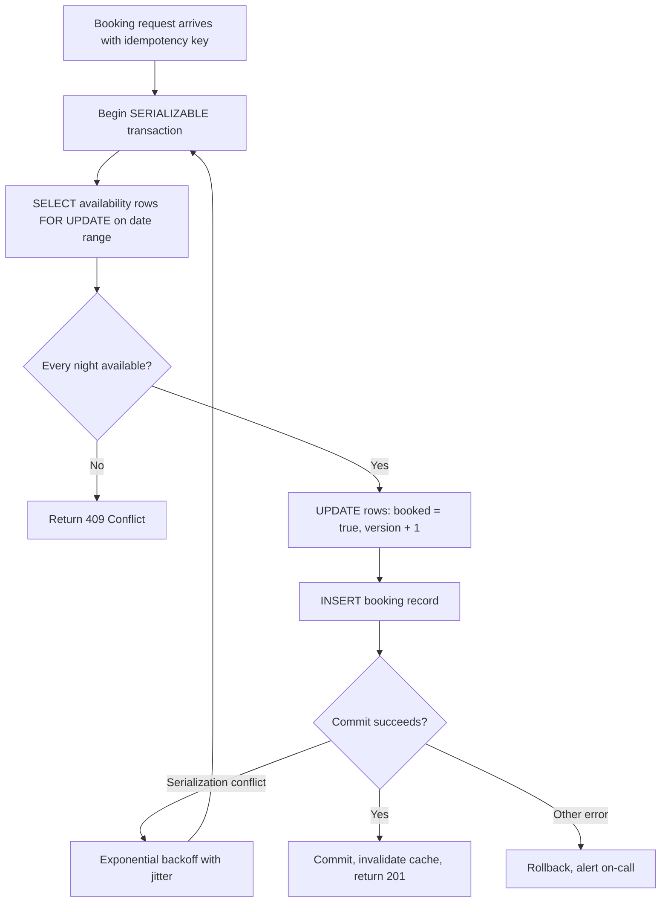

| Difficulty | Channel | Tags |
|---|---|---|
| intermediate | database | acid, isolation-levels, mvcc |

One impatient double-tap on 'Book', one flaky mobile retry — and two identical requests race toward the same property, or worse, the same credit card. Airbnb learned this the hard way: every booking triggers a distributed payments cascade across many services and databases, and duplicate requests risked charging the guest twice or paying the host twice [1]. After hardening that pipeline, Airbnb reached five nines (99.999%) of payment consistency while annual payment volume simultaneously doubled [1]. The same race condition lurks in the booking system you are probably designing right now — and the cure lives at the intersection of isolation levels, MVCC, and a healthy fear of concurrency [2].

---

> ### Real-World Case — Airbnb
>
> Every Airbnb booking triggers a distributed payments cascade — charge the guest, hold funds in escrow, pay the host, add fees and taxes — spread across many services and databases, with external card processors in the middle. When a user double-tapped the "Book" button or a flaky mobile network caused a client retry after the first request actually succeeded, identical payment requests raced through the system and risked charging the guest twice or paying the host twice.
>
> | | |
> |---|---|
> | **Challenge** | Guarantee effectively-at-most-once (idempotent) money movement in a service-oriented architecture where network calls are inherently unreliable, without adding noticeable latency and without forcing every product developer to become a distributed-systems expert. The naive fix — retry on failure — doubles payments when the first attempt succeeded, while not retrying loses legitimate payments. |
> | **Solution** | Airbnb built 'Orpheus', a general-purpose idempotency framework. Every payment API call carries an idempotency key; the server acquires a database row-level lock on that key (a lease) so concurrent duplicate requests for the same key are mutually excluded, and the same key replayed later returns the original stored result instead of executing again. Each request is split into Pre-RPC (record intent + key in one DB transaction), RPC (only the network call, no DB work), and Post-RPC (record the response and classify it retryable/non-retryable, again in one atomic transaction). Critically, idempotency reads/writes go to a sharded master database — not replicas — because just a few seconds of replica lag could let a retry slip through and execute the payment twice. This is exactly the pattern from the topic (row-level locks, atomic transactions, retry-with-backoff) applied outside the calendar: on the 'at most once' enforcement layer. |
> | **Outcome** | After launching the framework, Airbnb achieved 'five nines' (99.999%) consistency for its payments system while annual payment volume simultaneously doubled. |
> | **Lesson** | Exactly-once delivery is impossible across unreliable networks; the correct target is idempotency with lock-lease semantics so duplicates collapse onto one record. And for money/booking-critical operations, availability must not come at the cost of consistency — reading from replicas may buy speed but a few seconds of replication lag can silently turn one booking click into two charges. |

---

## Hook — The scariest bugs pass every unit test

The scariest production bugs are the ones that behave perfectly in staging. Under light load, a booking flow that reads availability, checks it, then writes the reservation looks rock solid. Then launch day hits, two guests tap 'Book' within the same 50 milliseconds, and both transactions read 'available' before either one writes [7].

Suddenly your calendar says a Tuesday night is reserved by two different guests, support inboxes overflow, and someone with a suitcase is standing on a doorstep that was never actually free. Race conditions like this do not throw errors — they return success with a lie baked in [7].

So here is the question that separates junior designs from production-grade ones: what happens in the tiny gap between checking a fact and acting on it? That gap, the time-of-check to time-of-use window, is where double bookings, double payments, and very angry customers are born. The rest of this story is about closing that gap for good.

## Problem — Why 'SELECT then UPDATE' is a trap

Building on that nightmare scenario, the naive booking implementation looks innocent: `SELECT * FROM availability WHERE date = X`, see zero conflicts, then `INSERT INTO bookings`. For years, many developers ship exactly this — and it works, right up until the day it does not.

The core challenge is concurrent transactions operating on shared state without a coordination mechanism. Under READ COMMITTED, PostgreSQL's default isolation level [2], each statement sees a snapshot taken at statement start, so two concurrent transactions can both observe the same 'free' row before either commits [3]. Neither one is wrong by its own lights; the database happily serializes two 'correct' outcomes into an incorrect one.

The stakes compound quickly:

- **Overbooked inventory**: property managers lose trust, guests lose trips, and cleanup falls on humans.
- **Cascading money movement**: bookings trigger charges, escrow holds, fees, and payouts — a single duplicate event fans out across services [1].
- **Support cost**: every incident becomes a refund, a review response, and an engineering postmortem.
- **Data repair hell**: once two bookings exist, deciding which one to cancel means touching money that has already moved.

Moreover, the problem is not unique to calendars. Seat reservations, coupon redemptions, inventory allocations, and ledger entries all share the same shape: a check, a gap, and a write. Therefore the real design question becomes: how do you make the check and the write atomic while still serving traffic at marketplace scale? That question leads straight into the world of isolation levels — and a counterintuitive truth about what 'serializable' really costs.

## Real-World Case — Airbnb's distributed payments cascade

This is not hypothetical. Airbnb's booking flow triggers a distributed payments cascade: charge the guest, hold funds in escrow, pay the host, add fees and taxes — spread across many services and databases, with external card processors in the middle [1]. When a user double-tapped 'Book', or a flaky mobile network caused a client retry after the first request had already succeeded, identical payment requests raced through the system and risked charging the guest twice or paying the host twice [1].

The damage model is worth pausing on. A duplicate booking is bad; a duplicate payment is worse, because money crossed a process boundary. External card processors do not care that your application 'meant' to send the request only once. Every retry looks like a legitimate new intent unless the system itself proves otherwise [1].

Airbnb's answer was to treat idempotency and consistency as first-class design constraints rather than afterthoughts. After launching their framework for avoiding double payments, Airbnb achieved five nines (99.999%) of consistency for its payments system while annual payment volume simultaneously doubled [1]. Five nines leaves roughly five minutes of tolerance per year — an almost absurd bar for a system spanning dozens of services and third-party processors.

🔥 Hot Take: volume doubling while consistency improves is the real flex. Most teams treat reliability and throughput as a seesaw; Airbnb treated duplicate-request handling as a multiplier that made growth safer, not slower.

The lesson for your booking system: the race does not stop at your database boundary. If your transaction spans a queue, a cache, or a payment provider, you need deduplication keys and atomic state transitions at every hop. Which raises the next question — which database guarantees actually buy you that atomicity, and what do they cost?

## Deep Dive — Isolation levels, MVCC, and locking trade-offs

Now that the stakes are clear, consider the toolbox. ACID transactions give you atomicity, consistency, isolation, and durability as a package [3], but 'isolation' is not one setting — it is a spectrum, and each rung trades correctness for throughput [9].

| Isolation level | What it prevents | Typical cost | When to use it |
|---|---|---|---|
| READ COMMITTED (Postgres default) | Dirty reads | Low overhead | Mostly-read workloads, non-critical writes |
| REPEATABLE READ | Non-repeatable reads; some write skew | Moderate | Stable snapshots for reporting |
| SERIALIZABLE | Phantom reads, write skew, all anomalies | Highest — conflicts surface as serialization failures [2] | Money movement, inventory, bookings |
| Snapshot / MVCC reads | Readers never block writers | Read scaling, storage overhead for old versions [4] | Availability checks on hot tables |

Here is the plot twist many developers miss: raising isolation does not remove contention — it makes contention visible. Under SERIALIZABLE, conflicting transactions do not silently corrupt data; one of them fails with a serialization error and must retry [2]. That is a feature. Silent corruption is what keeps engineers up at night.

The pattern that survives production usually combines three layers:

- **Pessimistic locking at the row level**: `SELECT ... FOR UPDATE` on just the date rows in the requested range, so unrelated properties never contend [5].
- **Optimistic concurrency control with version columns**: every write bumps a version, so stale readers can detect that the world moved underneath them [6].
- **Application-level validation inside the same transaction**: the check, the version bump, and the booking insert commit as one atomic unit.

However, locking has a dark side. Hold a row lock too long — say, while calling a payment API inside the transaction — and a hot property becomes a queue that backs up your connection pool. Therefore, keep transactions short: lock, validate, write, commit, and talk to external services only after commit, with idempotency keys covering the gap [1].

⚠️ Watch Out: read replicas help availability checks only if you accept replication lag. A replica saying 'free' can be stale by hundreds of milliseconds — exactly the window a competitor needs to grab the night. Use replicas for exploratory searches; use the primary (or a lock) for the final commit decision.

## Workflow — The booking transaction, step by step

With the theory in place, here is the sequence that turns those ideas into a reliable pipeline. The diagram below maps the full flow — from the first request to cache invalidation:



Walking the flow:

1. **Deduplicate first.** Generate or accept an idempotency key derived from guest, property, and dates so client retries collapse into one intent [1].
2. **Open a short SERIALIZABLE transaction** on the primary database — never on a replica.
3. **Lock only the rows you touch**: `FOR UPDATE` on the exact date range, ordered deterministically to avoid deadlocks [5].
4. **Validate in the application**: every night in the range must be free; partial ranges are a conflict, not a partial win.
5. **Write atomically**: flip `booked`, bump `version`, insert the booking — one commit, one truth.
6. **Handle conflicts with backoff**: serialization failures sleep with exponential backoff plus jitter, then retry from step 2 [2].
7. **Invalidate after commit**: only now does the cache drop the old availability snapshot, so readers never see an uncommitted promise.

Consequently, the window between check and write shrinks to the duration of one transaction, and two guests racing for the same night resolve into exactly one winner and one honest 409. But diagrams do not ship — code does. So what does this look like in practice?

## Code Example — A race-proof booking function

Diagrams are nice, but the devil is in the transaction. The function below implements the workflow with PostgreSQL: a row-level lock, an optimistic version bump, serialization-failure retries, and jittered backoff — the same shape used in production booking and payments paths.

```python
import random
import time
import psycopg2
from psycopg2 import errors

class BookingConflict(Exception):
    """Raised when a requested night is already taken."""

class TooManyRetries(Exception):
    """Raised when serialization conflicts exhaust the retry budget."""

MAX_ATTEMPTS = 5

def book_property(conn, property_id, guest_id, check_in, check_out):
    """Atomically reserve a date range; safe under concurrent writers."""
    for attempt in range(MAX_ATTEMPTS):
        try:
            with conn:  # each attempt is one fresh transaction
                with conn.cursor() as cur:
                    # 1. Lock only the availability rows in the range.
                    #    FOR UPDATE blocks competing writers until commit.
                    cur.execute('''
                        SELECT date, booked, version
                        FROM property_availability
                        WHERE property_id = %s
                          AND date >= %s AND date < %s
                        ORDER BY date
                        FOR UPDATE
                    ''', (property_id, check_in, check_out))

                    rows = cur.fetchall()
                    if len(rows) == 0:
                        raise BookingConflict('missing calendar rows')
                    # 2. Application-level validation: every night must be free.
                    if any(booked for _, booked, _ in rows):
                        raise BookingConflict('night already booked')

                    # 3. Optimistic guard: version bump detects stale writers
                    #    and gives caches a clear invalidation signal.
                    cur.execute('''
                        UPDATE property_availability
                        SET booked = TRUE,
                            version = version + 1,
                            updated_at = now()
                        WHERE property_id = %s
                          AND date >= %s AND date < %s
                    ''', (property_id, check_in, check_out))

                    # 4. Insert the booking while the lock is still held,
                    #    so check + write commit as one atomic unit.
                    cur.execute('''
                        INSERT INTO bookings
                            (property_id, guest_id, check_in, check_out, status)
                        VALUES (%s, %s, %s, %s, 'confirmed')
                        RETURNING id
                    ''', (property_id, guest_id, check_in, check_out))
                    return cur.fetchone()[0]

        except errors.SerializationFailure:
            # Another transaction committed first; retry with
            # exponential backoff plus jitter to avoid stampedes.
            delay = (2 ** attempt) * 0.05 + random.uniform(0, 0.05)
            time.sleep(delay)
        except BookingConflict:
            raise  # a real conflict, not a transient race — do not retry

    raise TooManyRetries(property_id)
```

Step by step:

- **Lines with `with conn`**: each loop iteration is a brand-new transaction, so a rollback never leaks locks from a failed attempt.
- **The `FOR UPDATE` select**: acquires pessimistic row locks on just the requested nights, ordered by date to keep lock acquisition consistent and deadlock-free [5].
- **The validation branch**: mirrors the business rule — one taken night fails the whole range; no partial bookings.
- **The version bump**: layers optimistic concurrency on top of the lock [6], giving caches and audit trails a monotonic signal that the row changed.
- **The insert under lock**: the actual double-booking window closes here, because the competing transaction cannot pass its own `FOR UPDATE` until this commit finishes.
- **`SerializationFailure` handling**: under SERIALIZABLE isolation the database surfaces lost races as errors rather than corruption [2]; exponential backoff with jitter gives hot properties a cooling-off period instead of a thundering herd.
- **`BookingConflict` re-raised immediately**: distinguish 'someone else won' (return 409) from 'temporary race' (retry) — retrying a genuine conflict just burns latency.

In production, pair this with connection-pool timeouts and a circuit breaker on the hottest properties, so a viral listing cannot starve the rest of the fleet.

## Lessons Learned — Battle scars worth stealing

After walking through the design — and watching teams rediscover these lessons the hard way — a few patterns keep resurfacing:

- **Retries must be idempotent.** Without an idempotency key, your retry logic becomes the duplicate-payment bug you were trying to prevent [1].
- **Short transactions, always.** Every external API call made while holding a row lock multiplies contention; commit first, then call out.
- **SERIALIZABLE is not free, but silence is worse.** Serialization failures cost retries; invisible write skew costs trust [2].
- **Cache invalidation belongs after commit.** Invalidate too early and readers resurrect stale 'available' flags; invalidate never and the cache lies forever.
- **Order your locks.** Two transactions locking date ranges in different orders will deadlock — sort by date (or property id) and move on.
- **Measure lock contention.** Track wait events, retry rates, and p99 booking latency; a rising retry count is the early-warning system for a hot property.
- **Read replicas are for reading.** Replication lag reintroduces the exact TOCTOU gap you just closed [4].
- **Test with real concurrency.** Unit tests with a single connection will never find this bug — race it in CI with parallel workers or a chaos harness.

⚠️ Watch Out: one more scar — blanket-locking an entire properties table 'to be safe' turns Black Friday traffic into a global queue. Scope locks to the rows in the date range, and let MVCC snapshot reads handle the rest [4][5].

So what should change tomorrow? Start by auditing every check-then-write path in your codebase: bookings, seats, coupons, ledger entries. For each one, ask what happens when two identical requests arrive in the same 10 milliseconds — and if the answer is not 'exactly one wins', you have found your next incident in slow motion.

---

## Booking Transaction Flow


<details>
<summary><strong>Original Interview Question</strong></summary>

**Q:** You're building a booking system for Airbnb where multiple users can reserve the same property simultaneously. How would you design the transaction handling to prevent double bookings while maintaining high availability?

**A:** Use SERIALIZABLE isolation with optimistic concurrency control. Implement row-level locks on property availability tables, use MVCC snapshot reads for checking availability, and apply application-level validation to ensure atomic booking operations.

</details>

## Conclusion

Airbnb's story ends where it began: one double-tap, one retry, two identical intents racing through a system that could not tell them apart [1]. The transformation from race-prone to five nines did not require exotic technology — it required treating every duplicate request as inevitable, every check-then-write as a liability, and every transaction boundary as a place to prove exactly one winner. Tomorrow, audit your own check-then-write paths: bookings, seats, coupons, ledger rows. Give each one a row lock or a version column, keep the transaction short, retry only serialization failures with jittered backoff, and move external calls outside the lock. The memorable insight to share with your team: correctness under concurrency is not about preventing races — it is about making the losing race fail loudly, cheaply, and on purpose.

---

## References

1. [Airbnb incident report](https://medium.com/airbnb-engineering/avoiding-double-payments-in-a-distributed-payments-system-2981f6b070bb) — article
2. [PostgreSQL Transaction Isolation documentation](https://www.postgresql.org/docs/current/transaction-iso.html) — documentation
3. [ACID (computer science) — Wikipedia](https://en.wikipedia.org/wiki/ACID) — documentation
4. [Multiversion concurrency control — Wikipedia](https://en.wikipedia.org/wiki/Multiversion_concurrency_control) — documentation
5. [PostgreSQL Explicit Locking documentation](https://www.postgresql.org/docs/current/explicit-locking.html) — documentation
6. [Optimistic concurrency control — Wikipedia](https://en.wikipedia.org/wiki/Optimistic_concurrency_control) — documentation
7. [Race condition — Wikipedia](https://en.wikipedia.org/wiki/Race_condition) — documentation
8. [Two-phase locking — Wikipedia](https://en.wikipedia.org/wiki/Two-phase_locking) — documentation
9. [Isolation (computer science) — Wikipedia](https://en.wikipedia.org/wiki/Isolation_(computer_science)) — documentation

---

**Author:** Satishkumar Dhule — [GitHub](https://github.com/satishkumar-dhule) · [LinkedIn](https://linkedin.com/in/satishkumar-dhule) · [Website](https://satishkumar-dhule.github.io)
