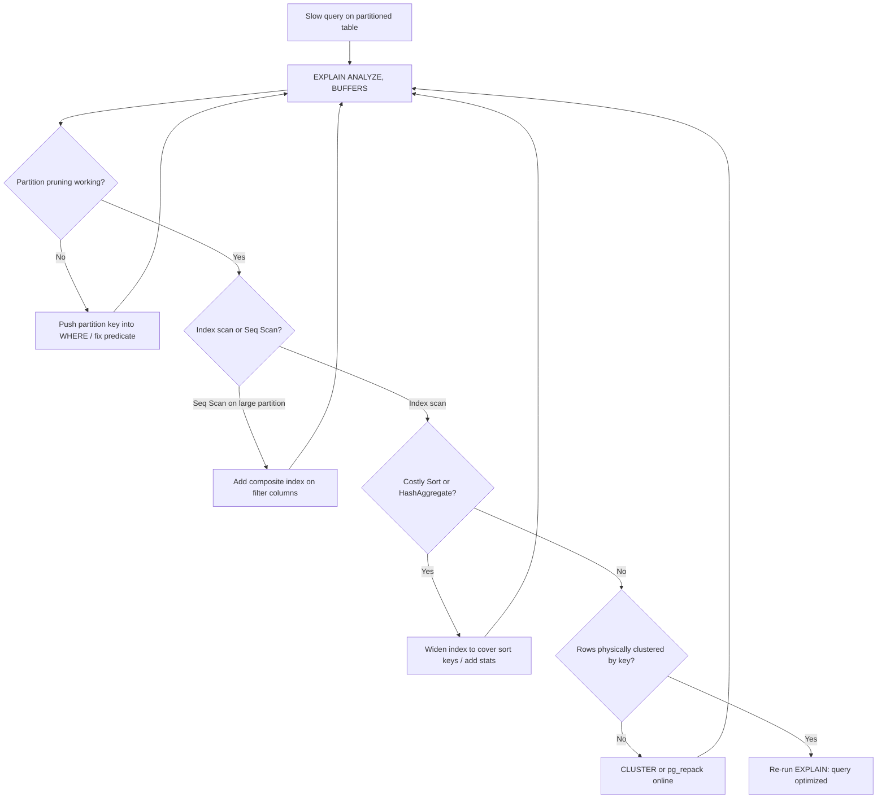

| Difficulty | Channel | Tags |
|---|---|---|
| intermediate | database | explain, query-plan, partitioning |

Picture this: your date-range queries should be fast — you partitioned the table, after all — yet they crawl past 30 seconds while IOPS alarms scream and replicas fall behind. That is exactly what happened at CoinGecko, whose 8-year-old hourly crypto prices table on Amazon RDS PostgreSQL ballooned past 1TB, dragging average query times to 30+ seconds and breaching daily IOPS ceilings even at 24K IOPS [1]. Partitioning alone did not save them; what saved them was reading the query plan like a detective and fixing what the EXPLAIN output actually revealed [1]. So what does a slow plan on your own 100M-row partitioned table really look like, and what do you do about it?

---

> ### Real-World Case — CoinGecko
>
> CoinGecko's hourly crypto prices table grew past 1TB over 8 years on Amazon RDS PostgreSQL, causing average query times of 30+ seconds, daily IOPS breaches even after scaling to 24K IOPS, rising request queues, dropping Apdex scores, and replica lag during traffic spikes.
>
> | | |
> |---|---|
> | **Challenge** | Diagnose why queries filtering on timestamp ranges were still slow at 1TB+ scale — and ensure partition pruning, index utilization, and query predicates actually aligned so that a partitioned table wouldn't scan every child partition. |
> | **Solution** | Analyzed query patterns and chose monthly RANGE partitioning on the timestamp key (most queries filter date ranges spanning at most 4 months), rebuilt the table with a composite primary key including the partition key, prewarmed partitions, used foreign data wrappers to backfill without spiking production IOPS, then fixed a regression where one query lacking a lower date bound (created_at > ? with no upper limit) scanned all partitions — including empty future ones — by rewriting the predicate and removing excess future partitions. |
> | **Outcome** | p99 response time cut 86% from 4.13s to 578ms, IOPS reduced 20%, replica lag eliminated, queries 6-8x faster in dry runs (30s+ averages before), and average query time dropped from 30+ seconds to sub-second on the hot path. |
> | **Lesson** | Partitioning only pays off when the planner can prune — a single query missing a date-range bound can scan every partition and perform worse than the original unpartitioned table; always verify pruning in EXPLAIN and match the partition key to actual WHERE-clause patterns. |

---

## Hook — It Wasn't the Database. It Was the Plan.

Everyone loves the magic trick: "We partitioned the table, so queries are fast now." Then reality shows up. A filter on a single day's slice of a 100M-row partitioned table still takes seconds — sometimes tens of seconds — and your dashboard keeps spinning.

Here is the tension: partitioning only prunes work the planner can see. If your WHERE clause does not line up cleanly with the partition key, or if the surviving partitions still need full scans and sorts, you get the illusion of optimization with none of the benefit [3]. The stakes are real — every slow query compounds into queue buildup, replica lag, and paging alerts at the worst possible moment. So before you add another index blindly, there is one command that tells you the whole story: EXPLAIN.

## Problem — Partitioned But Still Slow: The Hidden Work Inside a "Fast" Query

The core challenge is that partitioning solves one problem — scanning the wrong data — but leaves several others untouched. A date-range query can still be slow for reasons that have nothing to do with how many partitions exist.

Here is what you need to know:

- Partition pruning might not fire: if you compare against the partition key using an expression or type the planner cannot simplify, every partition stays in the plan [3].
- Indexes might be the wrong shape: a single-column index on `event_date` does nothing useful once you also filter on `status`, forcing a scan-plus-filter pass [4].
- Sorting and hashing can dominate: even with perfect pruning, sorting millions of rows or building hash aggregates can dwarf the actual read time [2].
- Physical order is random: rows spread across pages mean the same logical range touches many random I/Os — brutal on IOPS budgets like the 24K-IOPS ceiling CoinGecko hit [1][6].

Many developers discover this the hard way: the table is partitioned, the index exists, and the query is STILL slow. The problem is not that you did nothing — it is that you did the obvious things without checking whether the planner agreed with you.

## Real-World Case — CoinGecko: 1TB of Crypto Prices and 30-Second Queries

CoinGecko's hourly crypto prices table had been accumulating data for 8 years on Amazon RDS PostgreSQL, crossing 1TB [1]. Average query times ballooned past 30 seconds, daily IOPS limits were breached even after scaling to 24K IOPS, request queues grew, Apdex scores fell, and replicas lagged during traffic spikes [1][6].

The fix was not a bigger instance. It was a systematic read of query behavior — verifying partition pruning, reworking indexes to match the actual filter patterns, and reducing unnecessary data movement. The results were dramatic: p99 response time dropped 86% (4.13s → 578ms), IOPS fell 20%, replica lag disappeared, and hot-path queries went from 30+ seconds to sub-second — 6-8x faster in dry runs [1].

What makes this story instructive is the pattern. Scaling hardware first is the reflex move; it bought headroom but not a solution [6]. The durable win came from understanding what the planner was doing — which is exactly the muscle this article builds. If a production crypto data platform needed this discipline, your 100M-row table almost certainly does too.

## Deep Dive — Reading an EXPLAIN Plan Like a Forensic Tool

Building on that case: what exactly do you look for when you run EXPLAIN? PostgreSQL's EXPLAIN shows the plan the optimizer chose; adding ANALYZE actually runs it and reports real timings, while BUFFERS shows cache hits versus disk reads — the metric that maps directly to IOPS pain [2].

Walk the plan top-down and interrogate each node:

- **Pruning:** Does the plan show only the relevant partitions, or every child table? If all partitions appear, the partition key predicate is not being pushed down [3].
- **Scan type:** Seq Scan on a hot, narrow partition is sometimes fine (tables are read page-by-page anyway [9]); Seq Scan on a large partition with a selective filter means missing or unusable indexes [4].
- **Sort method:** `Sort Method: external merge Disk` is a red flag — the sort spilled to disk. That is memory pressure and extra I/O you did not budget for [2][7].
- **Rows estimate vs actual:** A 10x misestimate means stale statistics; the planner may be choosing a plan that looks elegant on paper and crawls in production [2].

Here is the plot twist many teams miss: composite indexes on `(date, filtered_columns)` only help when the leftmost column matches how the planner seeks. And if your workload is mostly append-and-scan by date, a BRIN index can be a fraction of the size of a B-tree for the same job [8]. Meanwhile, even a perfect index does not guarantee sequential physical reads — that is where CLUSTER or pg_repack earns its keep by rewriting rows into index order [5].

The deeper principle: partitioning decides which files to open; indexes decide which pages within them; clustering decides the order pages are touched. Optimize them in that order, or you will keep polishing the wrong layer.

## Workflow — A Five-Step Triage for Any Slow Partitioned Query

Therefore, turn diagnosis into a repeatable workflow rather than a late-night guessing game. The following flow mirrors how a seasoned engineer triages a slow date-range query — and it is the same sequence that surfaced CoinGecko's wins [1]:

1. **Capture the truth:** run `EXPLAIN (ANALYZE, BUFFERS)` on the real query with production-like parameters [2].
2. **Verify pruning:** confirm only the partitions you need appear in the plan [3].
3. **Audit access paths:** note whether each partition uses an index scan, and whether sorts or hash aggregates dominate total time [2][7].
4. **Match indexes to predicates:** create composite indexes covering the WHERE clause columns in filter order [4].
5. **Fix physical layout if needed:** cluster (or online-repack) so matching rows are co-located, then re-measure [5].

The diagram below traces that exact decision path — bookmark it; it is the same checklist you will run at 2am when the pager goes off:



Notice the loops: every fix gets re-measured. Optimization without re-measurement is just optimism.

## Code Example — From Blind Guessing to a Measured Fix

Here is the runnable triage script that implements the workflow. It captures the plan, greps for the classic red flags, applies a composite index without blocking writes, and re-measures:

```bash
#!/usr/bin/env bash
# Triage a slow date-range query on a PostgreSQL partitioned table.
# Requires: psql on PATH, DATABASE_URL env var pointing at your DB.
set -euo pipefail

# Step 1: Capture the real plan with timings and buffer usage [2]
psql "$DATABASE_URL" -X -c \
  "EXPLAIN (ANALYZE, BUFFERS) SELECT * FROM events
   WHERE event_date BETWEEN '2024-01-01' AND '2024-01-31'
     AND status = 'completed';" | tee explain_output.txt

# Step 2: Surface the red flags: seq scans, disk spills, aggregates, total time
grep -E 'Seq Scan|Sort Method|HashAggregate|Execution Time' explain_output.txt
# 'Sort Method: external merge Disk' => sort spilled to disk; tighten the index [2][7]

# Step 3: Composite index matching the predicate order (date first, then filter)
# CONCURRENTLY keeps writes flowing during the build [4]
psql "$DATABASE_URL" -X -c \
  "CREATE INDEX CONCURRENTLY IF NOT EXISTS idx_events_date_status
   ON events (event_date, status);"

# Step 4: Re-run and compare Execution Time and Buffers before vs after
psql "$DATABASE_URL" -X -c \
  "EXPLAIN (ANALYZE, BUFFERS)
   SELECT count(*) FROM events
   WHERE event_date BETWEEN '2024-01-01' AND '2024-01-31'
     AND status = 'completed';"

# Step 5 (optional): if rows are scattered and IOPS remain high,
# physically reorder them using the new index [5]
# psql "$DATABASE_URL" -X -c "CLUSTER events USING idx_events_date_status;"
```

**Walkthrough:** Step 1 is non-negotiable — ANALYZE turns a guess into measurements, and BUFFERS maps reads to real I/O cost [2]. Step 2 automates pattern recognition so you do not eyeball 40-line plans under pressure [7]. Step 3 builds the composite index in filter order — `event_date` leads because it matches both partition pruning and selectivity [3][4]; CONCURRENTLY avoids locking writers out during long builds. Step 4 closes the loop with fresh numbers. Step 5 is deliberately optional: CLUSTER rewrites the table, so on a production system prefer an online option like pg_repack unless you have a maintenance window [5]. Each stage feeds the next, and the final re-run tells you whether you actually won — the same measure-then-fix discipline behind CoinGecko's 86% p99 drop [1].

## Lessons Learned — What to Do Differently Tomorrow

The journey from "partitioned but slow" to sub-second queries is not about one clever trick — it is about trusting measurements over assumptions [1][2]. Take these scars from teams who learned the hard way:

- **Battle scar:** shipping a partition strategy without checking pruning. Always confirm the plan lists only the partitions you expect [3].
- **Battle scar:** single-column indexes on multi-column filters. Match index columns to actual predicates — composite `(date, filtered_columns)` first [4].
- **Battle scar:** treating CLUSTER as a routine online job. It takes an exclusive lock; measure first, schedule carefully, or use pg_repack [5].
- **Battle scar:** scaling IOPS before reading the plan. Hardware bought CoinGecko headroom, but plan-level fixes delivered the 6-8x speedup [1][6].
- **Battle scar:** forgetting `ANALYZE`. Plans built on stale row estimates are fiction [2].

Tomorrow, pick your slowest date-range query, run `EXPLAIN (ANALYZE, BUFFERS)`, and answer three questions: Did pruning fire? Is an index doing the work? Is anything spilling to disk? That ten-minute habit will catch more performance bugs than any dashboard.

One memorable insight to share with your team: **partitioning decides which data to touch — the query plan decides how fast you touch it.** Read the plan first, always.

---

## Slow Query Triage Workflow


<details>
<summary><strong>Original Interview Question</strong></summary>

**Q:** You have a PostgreSQL table with 100M rows partitioned by date. A query filtering on a specific date range is still slow. What would you check in the EXPLAIN plan and how would you optimize it?

**A:** Check partition pruning effectiveness, index utilization patterns, and expensive sort operations. Create composite indexes on (date, filtered_columns) and evaluate clustering strategies for optimal data access.

</details>

## Conclusion

Partitioning was never the finish line — it was the starting line. CoinGecko's 1TB table still crawled at 30+ seconds per query until someone read the plan, fixed pruning and indexes, and only then reached 578ms p99 and sub-second hot paths [1]. The journey you just walked — hook, problem, real-world failure, deep dive, workflow, code — all points to one habit: run EXPLAIN (ANALYZE, BUFFERS) before you touch anything [2]. Tomorrow, pick your slowest date-range query, verify pruning, check the scan type, and look for disk-spilling sorts. Share this with your team: partitioning decides which data to touch, but the query plan decides how fast you touch it — and the plan never lies.

---

## References

1. [CoinGecko incident report](https://amree.dev/2025/06/13/scaling-postgresql-performance-with-table-partitioning/) — article
2. [PostgreSQL Documentation: Using EXPLAIN](https://www.postgresql.org/docs/current/using-explain.html) — documentation
3. [PostgreSQL Documentation: Partitioning](https://www.postgresql.org/docs/current/ddl-partitioning.html) — documentation
4. [PostgreSQL Documentation: Indexes](https://www.postgresql.org/docs/current/indexes.html) — documentation
5. [PostgreSQL Documentation: CLUSTER](https://www.postgresql.org/docs/current/sql-cluster.html) — documentation
6. [Amazon RDS User Guide: Query Performance](https://docs.aws.amazon.com/AmazonRDS/latest/UserGuide/CHAP_QueryPerformance.html) — documentation
7. [DigitalOcean: Exploring the PostgreSQL EXPLAIN Command](https://www.digitalocean.com/community/tutorials/exploring-the-postgresql-explain-command) — article
8. [PostgreSQL Documentation: BRIN Indexes](https://www.postgresql.org/docs/current/brin-intro.html) — documentation
9. [PostgreSQL — Wikipedia](https://en.wikipedia.org/wiki/PostgreSQL) — documentation

---

**Author:** Satishkumar Dhule — [GitHub](https://github.com/satishkumar-dhule) · [LinkedIn](https://linkedin.com/in/satishkumar-dhule) · [Website](https://satishkumar-dhule.github.io)
