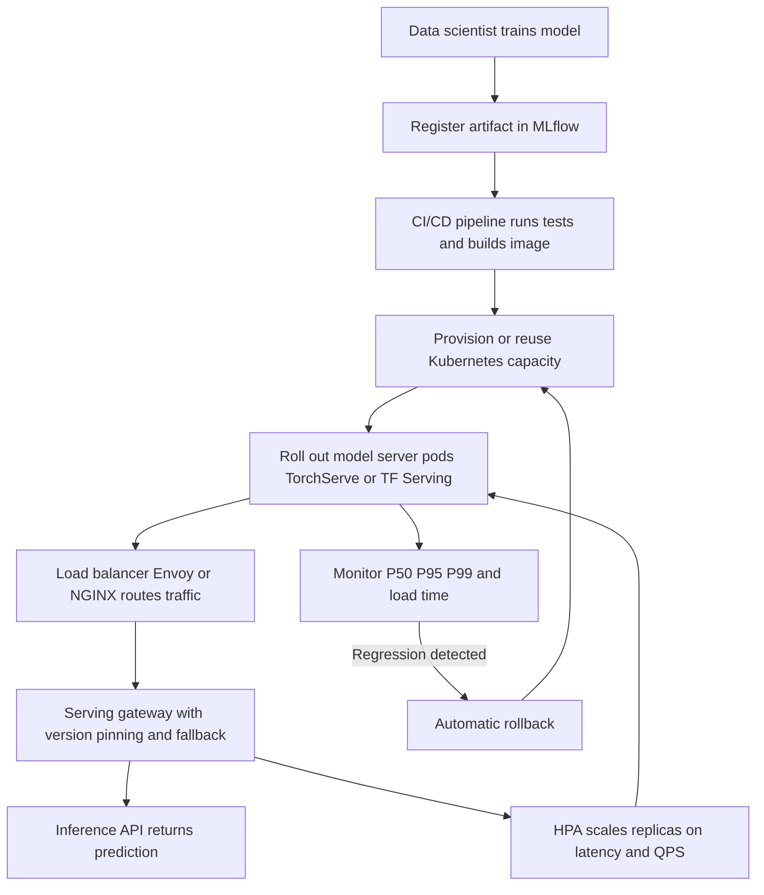

| Difficulty | Channel | Tags |
|---|---|---|
| beginner | devops | mlops, deployment |

Picture a platform quietly handling 250,000 predictions per second at under 5ms P95 latency — then picture a well-intentioned refactor almost wrecking it. That is exactly what happened at Uber, where the Michelangelo team swapped their custom protobuf model serialization for standard Spark MLlib pipeline serialization to gain flexibility, only to watch model load times balloon from competitive to 8x-44x slower [1]. The near-miss exposes a distinction most developers blur: model deployment and model serving are separate disciplines with separate tooling, separate failure modes, and separate consequences when you confuse them. This is the story of where that line sits, why it bites at scale, and how to draw it in your own stack.

---

> ### Real-World Case — Uber
>
> Uber's Michelangelo platform supports thousands of production models, but its in-house custom protobuf model serialization blocked data scientists from using arbitrary Spark MLlib pipelines or bringing models trained outside Michelangelo. The team decided to switch to standard Spark MLlib pipeline serialization to gain deployment flexibility and interoperability — not realizing it would nearly break their millisecond-scale online serving.
>
> | | |
> |---|---|
> | **Challenge** | Native Spark model loading was built for batch jobs, not serving: it used sc.textFile and distributed RDD read/select/sort operations to load tiny metadata and Parquet files, making model load times 8x-44x slower than Uber's custom format. Excessive load times threatened p99 millisecond-latency SLAs for fraud detection and marketing models, and degraded multi-tenant serving agility during deployments, health checks, and cold starts. |
> | **Solution** | They added an OnlineTransformer trait with a lightweight scoreInstance API that bypasses Spark's Catalyst optimizer for single-row predictions, then tuned Spark's I/O directly: replaced sc.textFile with plain Java I/O for transformer metadata, swapped sparkSession.read.parquet for direct ParquetUtil.read/getRecord calls, coalesced tree-ensemble node files on save to avoid many small files, and stopped idle SparkContexts that hurt serving latency. |
> | **Outcome** | Model load time dropped from 8x-44x slower than custom protobuf to just 2x-3x (a 4x-15x speed-up), which Uber deemed acceptable; the standard Spark representation has run in production for over a year. Michelangelo serves 250,000+ predictions per second with P95 latency under 5ms (under 10ms with Cassandra feature lookups), and Uber filed an SPIP/JIRA to open-source the Spark MLlib changes. |
> | **Lesson** | Deployment flexibility and serving performance are distinct, competing concerns: a serialization format that's great for deployment standardization and model interchange can be disastrous for serving unless the runtime load path is independently tuned — at serving scale, tiny I/O details (running one-line metadata files through Spark's RDD machinery) dominate latency more than the models themselves. |

---

## Hook — The refactor that almost broke 250,000 predictions per second

Everyone wants interoperability. Data scientists want to train anywhere — Spark MLlib, PyTorch, XGBoost — and ship everywhere. So when Uber's Michelangelo team discovered that their in-house protobuf serialization was locking out arbitrary Spark MLlib pipelines and models trained outside the platform, the fix looked obvious: switch to the standard Spark representation [1]. Flexibility gained, problem solved — except the switch nearly crushed the millisecond-scale online serving path that Uber's marketplace depends on. Model load time degraded so severely that the team had to rethink the entire trade-off before shipping.

That story should make any developer uneasy, because the same confusion lives in your stack. You ship a model through CI/CD, green checks pass, dashboards are quiet — and then the first real traffic hits and latency explodes. The deploy was fine. The serving was not. Those are two different systems, and treating them as one is one of the most common MLOps maturity traps [10].

🎯 Key Point: A successful deployment proves your model can exist in production. Only serving proves it can answer real users in time.

## Problem — Two words, two different jobs

Here is the thing though: deployment and serving fail in completely different ways, yet most interview answers (and most architecture docs) mash them into a single bullet called "getting the model into production."

**Deployment** is everything that happens before a user request arrives: CI/CD pipelines, infrastructure provisioning, container builds, rollout strategy, monitoring wiring, and rollback plans. It is the world of Kubernetes, Terraform, Docker, MLflow, SageMaker, GitHub Actions, and Jenkins. Success looks like: the artifact is live, the pods are healthy, the dashboards exist.

**Serving** is everything that happens after the request arrives: request routing, model loading into memory, batch assembly, response serialization, version pinning, and autoscaling under load. It is the world of TensorFlow Serving, TorchServe, BentoML, FastAPI, gRPC, NGINX, and Envoy [5][6][7][9]. Success looks like: P95 stays under budget while traffic doubles.

The stakes are asymmetric. A broken deployment is usually caught by a health check before users notice. A slow serving path is caught by your customers — or your pager. Many developers discover this the hard way: their pipeline is rock-solid, and their latency graph looks like a heart attack.

| Dimension | Deployment | Serving |
| --- | --- | --- |
| Core question | "Is the model live?" | "Is the model fast?" |
| Failure signature | Pods crash-loop, rollout stalls | P95 spikes, timeouts, cold starts |
| Primary tools | Kubernetes, Terraform, MLflow [2][4] | TorchServe, TF Serving, BentoML [5][6][7] |
| Scaling lever | Replicas, cluster size | GPU memory, batching, warm pools |
| Owning team | Platform / DevOps | Inference / ML platform |

⚠️ Watch Out: If your team's definition of "done" ends at a green CI check, you are measuring deployment while your users are paying for serving.

## Real-World Case — Uber Michelangelo

Building on that distinction, Uber's Michelangelo platform is the perfect stress test: thousands of production models, serving 250,000+ predictions per second with P95 latency under 5ms (under 10ms when Cassandra feature lookups are in the path) [1]. At that scale, model load time is not a startup nuisance — it is a cold-start tax paid every time a pod reschedules, every time a canary spins up, every time autoscaling adds replicas under a traffic spike.

The team's goal was legitimate. In-house protobuf serialization meant data scientists could not bring in arbitrary Spark MLlib pipelines or models trained outside Michelangelo — a real interoperability tax. So they migrated to standard Spark MLlib pipeline serialization [1]. The plot twist: standardization on the deployment side nearly broke the serving side. Load times dropped to 8x-44x slower than the custom format initially, which at Michelangelo's latency budget was potentially catastrophic.

The resolution is instructive rather than dramatic. Through optimization work, load time settled at roughly 2x-3x the custom protobuf path — a 4x-15x speed-up from the worst case — which Uber judged acceptable against the flexibility gained. The standard Spark representation has run in production for over a year, and Uber filed an SPIP/JIRA to open-source the Spark MLlib changes [1].

🔥 Hot Take: Uber did not abandon standardization. They measured the serving cost of a deployment-side decision, decided the trade was worth it, and shipped with eyes open. That is maturity. The alternative — swapping serialization formats without load-time benchmarks — is how platforms discover their real latency budget the hard way.

## Deep Dive — Where deployment ends and serving begins

With Uber's near-miss in mind, the technical landscape gets sharper. Deployment answers "where does this artifact live?" Serving answers "what happens in the 50 milliseconds after a request lands?"

**The deployment stack.** Containers package the model and its runtime; orchestrators place them; pipelines promote them. Kubernetes Deployments manage pod lifecycle, rolling updates, and rollback strategy [2], while infrastructure-as-code tools like Terraform provision the clusters underneath. Model registries such as MLflow track lineage — which dataset, which parameters, which signature — so a promotion is auditable [4]. Managed platforms like SageMaker collapse much of this into a single control plane [8]. None of these tools, on their own, guarantee a fast first inference.

**The serving stack.** Dedicated model servers handle the hot path: TensorFlow Serving and TorchServe optimize graph and TorchScript execution, batching, and dynamic batching windows [5][6]; BentoML packages models behind consistent HTTP/gRPC APIs [7]. Around them sit load balancers — NGINX or Envoy — doing request routing, retries, and traffic splitting for canaries and A/B tests [9]. FastAPI or raw gRPC endpoints act as the thin gateway where version pinning and fallback logic live.

**The scaling considerations.** The trade-offs are where junior answers stop and production answers start:

- **Latency vs throughput:** real-time paths target sub-100ms (often sub-50ms), while offline batch jobs happily trade latency for cost efficiency. Batching raises throughput and can increase per-request latency — you choose which SLO wins.
- **Horizontal vs vertical scaling:** horizontal scaling adds pod replicas through container orchestration [2][3]; vertical scaling adds GPU memory or CPU to a single instance. Horizontal scaling hits diminishing returns when the bottleneck is model load time — exactly Uber's problem.
- **Cold starts:** serialization format, image size, and model load time determine how expensive a new replica is. Optimizing load time directly shrinks autoscaling response time [3].
- **A/B testing and rollouts:** traffic splitting at the load balancer lets you compare model versions with real traffic before committing [9].

💡 Insight: Latency budgets are a zero-sum pie. Every millisecond spent deserializing, loading, or routing is a millisecond stolen from inference itself.

| Trade-off | Optimize for latency | Optimize for throughput |
| --- | --- | --- |
| Batch size | 1 request at a time | Dynamic batching windows |
| Transport | gRPC / binary protocols | HTTP + compression |
| Scaling | Warm pools, preloaded replicas | Aggressive consolidation |
| Typical target | <100ms P95 real-time | <1s batch, high QPS |

Here is the counterintuitive part: the fastest inference engine in the world cannot save you if your pods take 40 seconds to load the model — because every scale-out event, every node rebalance, every spot-instance interruption pays that toll again.

## Workflow — From commit to first inference

This leads to the practical question: what does a healthy pipeline actually look like when deployment and serving are treated as distinct stages with a hard contract between them? The flow below traces a model from training to live traffic, with the serving-only concerns called out explicitly:

Read it as two zones. Everything from training through rollout is **deployment** territory [2][4]. Everything from load balancer through autoscaling loop is **serving** territory [3][9]. The registry in the middle is the contract: a promoted version, a digest, a signature — and, as Uber learned, a serialization format with a measured load-time cost [1].

Step by step:

1. **Register** the model with lineage and an artifact digest in MLflow [4].
2. **Build and test** in CI: validate schema, run shadow inference, bake the container image.
3. **Roll out progressively** via canary or rolling update; health checks gate promotion [2].
4. **Route** production traffic through the load balancer, splitting by version header for A/B tests [9].
5. **Scale** on serving signals — P95 latency, QPS, queue depth — not just CPU [3].
6. **Watch load time** as a first-class metric; if cold starts grow, autoscaling stops being a safety net [1].

## Code Example — A 50ms serving gateway with version pinning

Talk is cheap at 250,000 QPS, so here is the thin serving layer that sits between your load balancer and versioned model servers. It does three things Uber's story makes non-negotiable: pins the model version per request, enforces a hard latency deadline, and falls back instead of failing the user. The full snippet lives in `codeExample` below — walk through it in order: model server registry (deployment's output), a 50ms timeout budget (serving's contract), version-header routing for gradual rollouts, fallback to the previous stable version on timeout, and per-request latency emission for your SLO dashboard.

The key design decision is the timeout. At 0.05 seconds, the gateway treats the latency budget as a hard resource — if the primary model server cannot answer in time, traffic shifts to the known-good version rather than hanging the request. That single line is the difference between a degraded experience and an outage. Many developers skip it because local benchmarks look fine; production cold starts after a node reschedule are where that assumption dies.

## Lessons Learned — What to steal from Uber's near-miss

The journey ends where it began: at a serialization decision that looked pure deployment-side and turned out to be a serving-side performance event [1]. The takeaways you can apply tomorrow:

- **Treat model load time as a serving metric, not a build detail.** Benchmark cold start before adopting any serialization or packaging format. Uber's 8x-44x degradation was survivable only because they measured it [1].
- **Keep the deployment/serving contract explicit.** The registry handoff should include artifact digest, input signature, expected load time, and latency budget [4].
- **Scale on serving signals.** CPU-based autoscaling misses GPU memory pressure and latency spikes; wire P95 and QPS into your HPA or equivalent [3].
- **Design fallback before you need it.** Version pinning plus automatic rollback turns a bad model into a blip instead of a post-mortem [2][9].
- **Batch and real-time are different products.** Sub-100ms interactive paths and sub-1s batch pipelines want opposite optimizations — do not share an autoscaling policy [10].

⚠️ Watch Out — common battle scars: promoting a model because CI was green (measures deployment, not serving); ignoring serialization overhead until the first traffic spike; sharing one deployment pipeline for batch jobs and real-time APIs; shipping A/B tests without traffic-splitting rollback.

So what should change tomorrow morning? Before your next model promotion, ask two questions in order: "Is it deployed correctly?" and "What is its cold-start and P95 cost under production traffic?" If your team cannot answer the second one, you do not have a serving strategy — you have a deployment pipeline with a prayer. That gap is exactly where Uber almost fell, and closing it is the whole game.

---

## Deployment-to-Serving System Flow

<strong>Original Interview Question</strong>

**Q:** Explain the key differences between model serving and model deployment in ML systems, including specific technologies, scaling considerations, and real-world implementation patterns?

**A:** Deployment encompasses CI/CD pipelines, infrastructure setup, and monitoring using tools like Kubernetes, MLflow, and SageMaker. Serving focuses on runtime inference APIs with frameworks like TensorFlow Serving, TorchServe, or BentoML, handling request routing, model versioning, and autoscaling. Key trade-offs include latency vs throughput, batch vs real-time inference, and cold start optimization.

## Conclusion

Uber almost learned the hard way that a deployment-side decision can detonate on the serving side — a serialization format chosen for interoperability pushed model load times 8x-44x slower on a path budgeted in single-digit milliseconds [1]. They survived because they measured the cost, optimized it down to an acceptable 2x-3x, and shipped with open eyes. The lesson generalizes: deployment proves your model can live in production; serving proves it can think in time. Tomorrow, add cold-start time and p95 latency to your promotion checklist, wire fallback routing before you need it, and scale on inference signals rather than CPU. The teams that treat those two words as one job find out which is which during an incident — the rest of you get to find out during a design review.

---

## References

1. [Uber incident report](https://www.uber.com/en-US/blog/michelangelo-machine-learning-model-representation) — article
2. [Kubernetes Deployments](https://kubernetes.io/docs/concepts/workloads/controllers/deployment/) — documentation
3. [Kubernetes Horizontal Pod Autoscaling](https://kubernetes.io/docs/tasks/run-application/horizontal-pod-autoscale/) — documentation
4. [MLflow Documentation](https://mlflow.org/docs/latest/index.html) — documentation
5. [TorchServe](https://github.com/pytorch/serve) — documentation
6. [TensorFlow Serving](https://github.com/tensorflow/serving) — documentation
7. [BentoML](https://github.com/bentoml/BentoML) — documentation
8. [What Is Amazon SageMaker?](https://docs.aws.amazon.com/sagemaker/latest/dg/whatis.html) — documentation
9. [Envoy Proxy Documentation](https://www.envoyproxy.io/docs/envoy/latest/intro/intro) — documentation
10. [MLOps — Wikipedia](https://en.wikipedia.org/wiki/MLOps) — documentation
11. [Python asyncio — Coroutines and Tasks](https://docs.python.org/3/library/asyncio.html) — documentation

---

**Author:** Satishkumar Dhule — [GitHub](https://github.com/satishkumar-dhule) · [LinkedIn](https://linkedin.com/in/satishkumar-dhule) · [Website](https://satishkumar-dhule.github.io)
