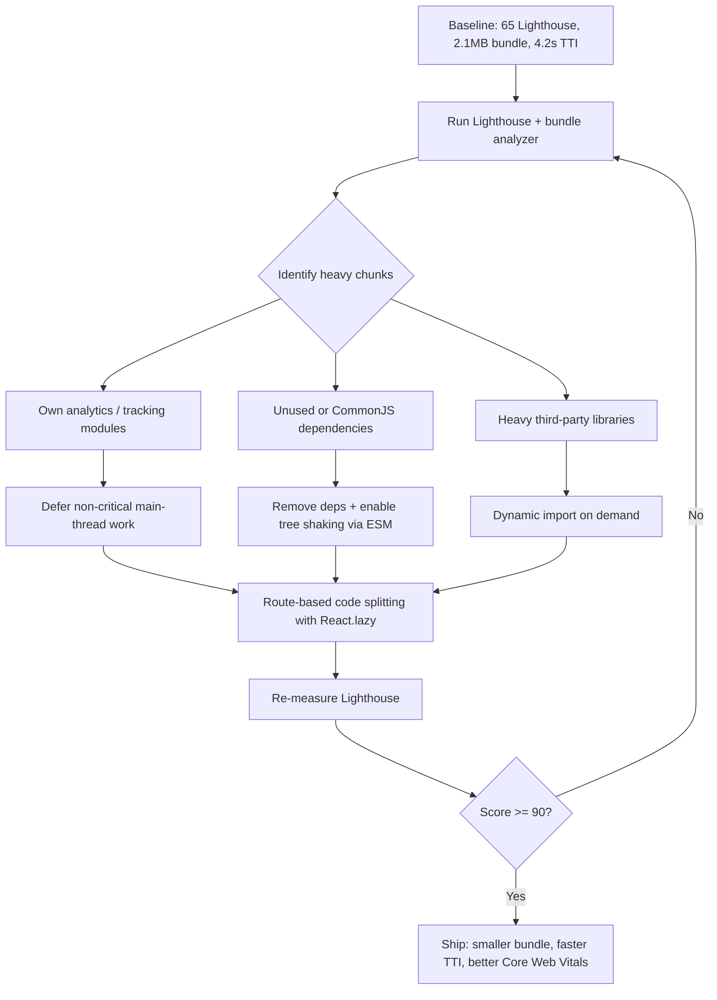

| Difficulty | Channel | Tags |
|---|---|---|
| intermediate | frontend | lighthouse, bundle, lazy-loading |

Your Lighthouse score sits at 65. The Time to Interactive creeps past 4.2 seconds. Users are abandoning ship before your hero section even renders — and you suspect the culprit is hiding in plain sight: your JavaScript bundle. Mercado Libre's frontend team discovered exactly this kind of villain lurking in their product detail pages — a 950KB main bundle and a Max Potential First Input Delay of 1710ms, with roughly two seconds of main-thread blocking traced largely to their own internal analytics module [1]. Their fix — systematic bundle analysis plus code splitting — cut bundle size by 16% and improved real-user FID by 9% in the Chrome User Experience Report [1]. Your 2.1MB bundle is twice that size. Let's find out what's eating it and how to fight back.

---

> ### Real-World Case — Mercado Libre
>
> Mercado Libre's frontend architecture team discovered that product detail pages had a 950KB main JavaScript bundle and a Max Potential First Input Delay of 1710ms (marked red in Lighthouse), with roughly two seconds of main-thread blocking on real devices traced largely to their own internal analytics/tracking module.
>
> | | |
> |---|---|
> | **Challenge** | Reduce Total Blocking Time and improve Core Web Vitals (FID/TBT) across a high-traffic e-commerce platform serving millions of users, where a bloated monolithic bundle kept the main thread busy and delayed interactivity. |
> | **Solution** | They used WebPageTest to identify which scripts blocked the main thread, then webpack-bundle-analyzer to find bloat: replaced full Lodash imports with per-method requires plus lodash-webpack-plugin, removed a CPU-heavy non-critical task from the analytics module (2% site-wide JS reduction), and applied Babel optimizations (@babel/plugin-transform-runtime, babel-plugin-search-and-replace to drop a large config file from the bundle, babel-plugin-transform-react-remove-prop-types). They subsequently added component-level code splitting to further divide the JavaScript into smaller lazily-loaded chunks. |
> | **Outcome** | Bundle size reduced ~16%, consecutive long tasks cut from 2 seconds to 1 second, Lighthouse Max Potential FID reduced by 57% in the first phase and an additional 60% after code splitting — translating to a 9% FID improvement in the Chrome User Experience Report for real users. |
> | **Lesson** | Even first-party code you write yourself (analytics, tracking, config) can be the biggest main-thread blocker — bundle analyzers find third-party bloat, but WebPageTest/Lighthouse waterfall analysis finds what's actually executing on the critical path. Systematic measurement before optimization is essential. |

---

## Hook — Picture This: Your Best Feature Is Your Slowest

Picture this. A shopper taps a product link on their phone. The loading spinner spins. Two seconds. Three seconds. By 4.2 seconds, they're gone — bounced back to a competitor whose page was already painted. That's not a hypothetical: Time to Interactive above 4 seconds is where conversion rates start falling off a cliff, and a 65 Lighthouse score means you're failing Core Web Vitals on real devices. Here's the uncomfortable part. Most of those milliseconds aren't network latency or server slowness. They're your own code, downloaded, parsed, and executed on the main thread before a single button responds. The bundle isn't just big — it's a 2.1MB tax on every single user, on every single visit. And many teams don't even know what's inside it.

## Problem — The Bundle You Never Audited

A 2.1MB JavaScript bundle with 4.2s TTI is a symptom, not a disease. The disease is that bundles grow by accretion: someone adds a date library, someone else pulls in a full icon pack, an analytics SDK sneaks into the main chunk during a refactor, and six months later every user downloads all of it to render a login screen. The stakes are concrete. First Input Delay and its successor, Interaction to Next Paint, directly measure how long your app blocks the main thread — and blocking is exactly what heavy, un-split bundles cause. Search engines use these signals, and users feel every millisecond. Moreover, the problem compounds: larger bundles mean longer parse and compile times even on fast networks, so shaving bytes helps offline 4G users and fiber users alike. So the first question isn't 'how do I lazy load?' — it's 'what's actually in here?' Without that answer, every optimization is a guess.

## Real-World Case — Mercado Libre's Main-Thread Nightmare

Mercado Libre, one of Latin America's largest e-commerce platforms, faced this exact scenario on their product detail pages. The frontend architecture team found a 950KB main JavaScript bundle and a Max Potential First Input Delay of 1710ms — flagged red in Lighthouse. Tracing main-thread activity on real devices revealed the surprise villain: their own internal analytics and tracking module, blocking the main thread for roughly two consecutive seconds. The fix unfolded in phases. First, they identified and deferred the non-critical analytics work, cutting consecutive long tasks from 2 seconds to 1 second and reducing Max Potential FID by 57%. Then, code splitting delivered an additional 60% reduction. In total, bundle size dropped about 16%, and Chrome User Experience Report data showed a 9% FID improvement for real users [1]. The plot twist: it wasn't a bloated third-party framework — it was their own code. Many teams obsess over trimming moment.js while their proprietary modules silently dominate the main thread. The lesson before you touch React.lazy: measure first, because your worst offender may have your company's name on it.

## Deep Dive — Code Splitting, Tree Shaking, and the Real Tradeoffs

Building on Mercado Libre's diagnosis, let's unpack the four levers that actually move the needle. First: code splitting. Route-based splitting loads only the code for the route a user visits, while component-based splitting isolates heavy widgets — charts, editors, maps — into their own chunks loaded on demand. React's `lazy()` and `` make this declarative, but each lazy chunk is an extra network round-trip, so indiscriminate splitting can hurt perceived performance on slow connections. That's the trade-off: fewer initial bytes versus more requests. Second: tree shaking, which eliminates unused exports — but only works reliably with ES module (`import`/`export`) syntax; CommonJS `require()` defeats it entirely [2]. Many developers discover that switching a single library to its ESM build shaves tens of kilobytes with zero code changes. Third: dynamic imports for third-party libraries. That 300KB markdown parser used only in the admin panel shouldn't ship to shoppers — `await import()` it when the panel opens. Fourth: analysis. Tools like webpack-bundle-analyzer visualize composition so you optimize facts, not folklore [3]. Comparison time:

## Workflow — A Battle-Tested Optimization Sequence

However, knowing the levers isn't the same as pulling them in the right order. Rush in with React.lazy before analyzing, and you'll split the wrong things — a classic battle scar. The reliable sequence is: (1) measure a baseline Lighthouse run on throttled mobile; (2) analyze bundle composition to find the actual heavy chunks; (3) remove or replace unused dependencies; (4) apply route-based splitting; (5) apply component/dynamic splitting for remaining heavy hitters; (6) re-measure after each phase so you can attribute wins. Mercado Libre's phased approach — fix the main thread first, then split — produced two separate, measurable gains [1] for exactly this reason. The flow below maps the whole loop:

## Code Example — Route Splitting with Suspense and Error Boundaries

Here is the production pattern teams reach for first: route-based lazy loading wrapped in Suspense, plus an error boundary so a failed chunk download doesn't white-screen the app. Walk through it section by section in the explanation below — pay attention to why the error boundary exists; after debugging failed dynamic imports on flaky mobile networks, you'll appreciate it more than you expect.

## Lessons Learned — What to Tell Your Team Tomorrow

So what's the takeaway from this journey from a 65 score to 90+? Bundle optimization is a measurement discipline, not a one-shot refactor. Start here tomorrow: run webpack-bundle-analyzer (or your bundler's equivalent) before writing a single `lazy()` call [3]; audit for dependencies that ship CommonJS when ESM builds exist [2]; treat your own internal modules — analytics, feature flags, A/B tooling — as prime suspects, since Mercado Libre's biggest win came from their own code [1]; split by route first, then by heavy component; and re-run Lighthouse after every phase so each win is attributable. The mistake to avoid: splitting everything eagerly 'just in case' — over-fragmenting creates request waterfalls that trade one performance problem for another. One memorable insight to share with your team: a 90+ Lighthouse score isn't about downloading less JavaScript — it's about executing less JavaScript before the user's first interaction. Bundle size is the fuel; main-thread blocking is the fire. Optimize both, and the score follows.

---

## Bundle Optimization Workflow

<strong>Original Interview Question</strong>

**Q:** You're tasked with improving a React app's Lighthouse performance score from 65 to 90+. The bundle size is 2.1MB and Time to Interactive is 4.2s. What specific steps would you take to optimize the bundle and implement lazy loading?

**A:** Implement code splitting with React.lazy() and Suspense, analyze bundle composition with webpack-bundle-analyzer to identify largest chunks, remove unused dependencies and optimize imports, add dynamic imports for heavy components and third-party libraries, implement route-based splitting for better initial load times, and utilize tree shaking with proper ES module configuration.

## Conclusion

Mercado Libre didn't win by guessing — they measured, found their own analytics module blocking the main thread, fixed it in phases, and re-measured every step, cutting Max Potential FID by over 90% cumulatively and lifting real-user FID by 9% [1]. Your 2.1MB bundle and 4.2s TTI deserve the same discipline. Tomorrow: run a bundle analyzer, delete one unused dependency, and split your heaviest route with React.lazy — then re-run Lighthouse. The memorable insight: you don't need a smaller app, you need a smarter loading strategy. Bundle size is the fuel; main-thread blocking is the fire — extinguish both and a 90+ score is not luck, it's arithmetic.

---

## References

1. [Mercado Libre incident report](https://web.dev/case-studies/how-mercadolibre-optimized-web-vitals) — article
2. [JavaScript modules — import and export | MDN](https://developer.mozilla.org/en-US/docs/Web/JavaScript/Reference/Statements/import) — documentation
3. [webpack-bundle-analyzer](https://github.com/webpack-contrib/webpack-bundle-analyzer) — documentation
4. [React — Code-Splitting](https://react.dev/reference/react/lazy) — documentation
5. [Suspense | React](https://react.dev/reference/react/Suspense) — documentation
6. [Web performance — MDN](https://developer.mozilla.org/en-US/docs/Web/Performance) — documentation
7. [Lighthouse | web.dev](https://developer.chrome.com/docs/lighthouse/overview) — documentation
8. [Tree shaking | webpack](https://webpack.js.org/guides/tree-shaking/) — documentation

---

**Author:** Satishkumar Dhule — [GitHub](https://github.com/satishkumar-dhule) · [LinkedIn](https://linkedin.com/in/satishkumar-dhule) · [Website](https://satishkumar-dhule.github.io)
