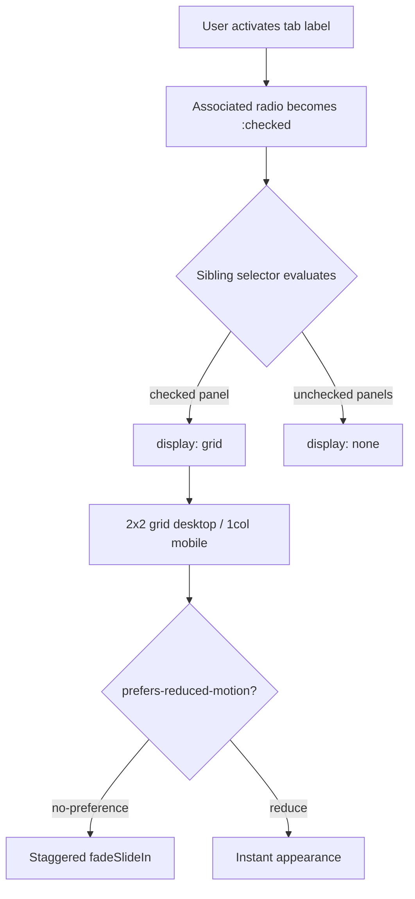

| Difficulty | Channel | Tags |
|---|---|---|
| beginner | frontend | css, flexbox, grid, animations |

Wikipedia made a bold engineering bet: strip JavaScript out of core interactions and drive them with pure CSS checkbox hacks instead [1]. The goal was simple — cut payload and keep navigation working everywhere. The result? Billions of pages got faster, but screen-reader users inherited a bizarre accessibility tree full of raw radio and checkbox semantics — and the fix turned out to be just as dramatic as the original hack.

---

> ### Real-World Case — Wikimedia Foundation (Wikipedia)
>
> Wikipedia's MediaWiki platform adopted a CSS-only "checkbox hack" across its Vector and MinervaNeue skins to drive core interactivity — the collapsible sidebar, navigation/menu dropdowns, and the table of contents — with no JavaScript required for the interaction to work. Wikipedia is among the most-visited sites on the web, so every byte of JS avoided is real load-time and infrastructure savings across billions of pages. The engineering intent was stated explicitly in the ticket that kicked off the pattern's adoption: "In an effort to cut down on JavaScript usage".
>
> | | |
> |---|---|
> | **Challenge** | Build reliable interactive components (dropdowns, collapsible menus, ToC) that function with JavaScript disabled or blocked, on a codebase served to a top-5 global website, without reimplementing widget logic in JS for every page view. |
> | **Solution** | They built a pure-CSS state machine: a visually hidden checkbox input plus its label acts as the toggle, and the :checked pseudo-class combined with sibling combinators (~ / +) reveals or hides target content — the same family of technique as radio-based CSS tabs. MediaWiki standardized it as the "checkbox hack" in core (CheckboxHack.js/less), with JS reduced to progressive enhancement: dynamically setting aria-expanded, role="button", and label association for screen readers while the core show/hide remains pure CSS. |
> | **Outcome** | Core navigation works with and without JavaScript across Wikipedia skins, with JS demoted to an accessibility enhancement layer. But the pattern produced a documented plot twist: the hidden inputs leaked raw "checkbox"/"radio button" semantics into the accessibility tree, aria-expanded had to be telegraphed, and Wikimedia ran a formal accessibility investigation (T243126) that eventually drove a migration toward native / (T333394) — which itself uncovered real Chrome crashes when the details element is used. |
> | **Lesson** | CSS-only form-control state machines are a legitimate, production-grade way to ship no-JS interactivity on high-traffic sites, but you inherit the semantics of the control you hide: screen-reader announcements, aria state, and focus-visible outlines all still need intentional handling — and even the 'semantically correct' modern replacement () has its own browser landmines to test against. |

---

## Hook — Every Byte of JS Costs Something

Picture a docs page with four tabs, each holding a grid of cards. The obvious move: sprinkle on a little JavaScript. But every script tag is a download, a parse, a execution on a thread someone is staring at on a slow 3G connection. Multiply that across billions of page views and suddenly the "tiny" tab script becomes real infrastructure cost. The question lurking underneath every frontend interview question about CSS-only tabs is really this: how much interactivity can you squeeze out of the browser's built-in form primitives before you need a single line of JS? And what happens when you push that idea too far?

## Problem — Interactive UI Without a Runtime

Design-system docs pages need tab panels everywhere — component galleries, pattern libraries, API references. The tension is that tabs are, fundamentally, stateful: one panel visible, the rest hidden, switched on user intent. Without JavaScript, you have to smuggle that state somewhere. The classic escape hatch is a set of radio inputs sharing a `name` attribute, with labels acting as the clickable tabs and sibling selectors deciding which panel renders. The catch? You now own three problems at once: keyboard navigation still has to work, focus outlines must not vanish, and any motion you add has to respect `prefers-reduced-motion`. Miss one and you ship a tab panel that looks clever but locks out assistive-tech users — exactly the failure mode Wikipedia ran into later [1].

## Real-World Case — Wikimedia Foundation's CSS-Only Gamble

MediaWiki's Vector and MinervaNeue skins adopted a CSS-only checkbox hack to drive the collapsible sidebar, navigation dropdowns, and the table of contents — with no JavaScript required for the interaction to work [1]. The engineering ticket was blunt about the motive: "In an effort to cut down on JavaScript usage." Wikipedia is one of the most-visited sites on earth, so every byte of JS avoided compounds across billions of page loads. Core navigation kept working with and without JS; JavaScript was demoted to an accessibility enhancement layer. But here is the plot twist: hidden inputs leaked raw "checkbox" and "radio button" semantics straight into the accessibility tree, `aria-expanded` had to be manually telegraphed, and Wikimedia eventually ran a formal accessibility investigation (T243126) that pushed them toward native ``/`` (T333394) — a migration that itself uncovered real Chrome crashes when the details element was used. The lesson cuts both ways: CSS-only interactivity is a legitimate performance tool, and it is also a liability you must budget for.

## Deep Dive — Grid, Sibling Selectors, and the Accessibility Tax

Three concepts carry the whole pattern, and each one has a sharp edge. First, CSS Grid handles the responsive card layout: `grid-template-columns: repeat(2, 1fr)` gives you the 2×2 desktop grid, and a `max-width: 768px` media query collapses it to a single column [2]. Second, the radio/label toggle: `:checked` on a radio drives `display: none` on its siblings' panels via `~` combinators — pure declarative state, zero runtime [3]. Third, `aspect-ratio: 16/9` locks the image container without hard-coding heights, which is far more resilient than the old padding-hack trick [4].

However, the accessibility story is where beginners get burned. `:focus-visible` keeps keyboard outlines visible without punishing mouse users [5], and wrapping animations in `@media (prefers-reduced-motion: no-preference)` is the polite way to offer motion [6]. The deeper trade-off Wikipedia surfaced: radio inputs inside a tablist can announce themselves as form controls rather than tabs, because the ARIA Tabs pattern expects `role="tab"`, `role="tabpanel"`, and `aria-selected` — none of which native radios carry for free [7]. You might think the checkbox hack is a free lunch; actually, it trades JavaScript bytes for ARIA bookkeeping.

Here is a quick comparison of the realistic options:

| Approach | JS Required | ARIA Fidelity | Motion Control | Maintenance Cost |
|---|---|---|---|---|
| Radio + CSS siblings | None | Low — needs manual roles | Full via media queries | Low code, high audit cost |
| JS tab controller | Yes | High — easy `role="tab"` | Full | Medium |
| Native `` | None (mostly) | Medium — semantic but quirky | Full | Low, but browser bugs exist [1] |

## Workflow — Building the Panel in Five Moves

The build follows a predictable sequence, visualized in the diagram below:

1. Emit one radio input per tab, all sharing `name="tabs"`, marking the default with `checked`.
2. Pair each input with a `` so clicks and keyboard focus land on the right control.
3. Place each `` immediately after its label so the `~` sibling selector can reach it.
4. Style the panel as a 2×2 grid on desktop, single column under 768px, with `aspect-ratio` image wells.
5. Gate the stagger animation behind `prefers-reduced-motion: no-preference`, then add `:focus-visible` outlines last so they are never forgotten.



Notice what the diagram makes obvious: state flows one direction, from input to CSS to layout, with no callbacks and no re-renders. Consequently, the whole interaction survives a JavaScript failure — which is precisely the resilience Wikipedia was buying.

## Code Example — A Production-Shaped Tab Panel

The snippet below implements the full pattern: radio-driven tabs, responsive grid, aspect-ratio images, reduced-motion-aware stagger, and focus-visible outlines.

```html
<div class="tabs">
  <!-- Radios come first so ~ can reach every panel -->
  <input type="radio" id="tab-overview" name="tabs" checked>
  <label for="tab-overview">Overview</label>
  <input type="radio" id="tab-tokens" name="tabs">
  <label for="tab-tokens">Tokens</label>

  <section class="panel" id="panel-overview">
    <article class="card">
      <div class="card__image"></div>
      <h3 class="card__title">Color Primitives</h3>
      <p class="card__meta">Updated 2 days ago · 12 swatches</p>
    </article>
    <article class="card">
      <div class="card__image"></div>
      <h3 class="card__title">Type Scale</h3>
      <p class="card__meta">Updated 5 days ago · 8 styles</p>
    </article>
  </section>
</div>
```

```css
/* Panel grid: 2 columns on desktop */
.tabs .panel {
  display: grid;
  grid-template-columns: repeat(2, 1fr);
  gap: 1.5rem;
}
/* Collapse to one column on small screens */
@media (max-width: 768px) {
  .tabs .panel { grid-template-columns: 1fr; }
}
/* Hide every panel whose radio is NOT checked */
.tabs input:not(:checked) ~ .panel { display: none; }
/* Fixed 16:9 image well — no magic numbers */
.card__image { aspect-ratio: 16 / 9; background: #eee; }
/* Only animate when the user has not asked for less motion */
@media (prefers-reduced-motion: no-preference) {
  .card { animation: fadeSlideIn 0.3s ease-out backwards; }
  .card:nth-child(2) { animation-delay: 0.1s; }
  .card:nth-child(3) { animation-delay: 0.2s; }
  .card:nth-child(4) { animation-delay: 0.3s; }
}
@keyframes fadeSlideIn {
  from { opacity: 0; transform: translateY(10px); }
  to   { opacity: 1; transform: translateY(0); }
}
/* Keyboard users get a clear ring; mouse users are spared */
:focus-visible { outline: 2px solid currentColor; }
```

Walkthrough: the radios and labels sit as siblings ahead of every panel, so the general sibling combinator `~` can toggle visibility purely from `:checked` state [3]. The `.panel` grid uses `repeat(2, 1fr)` for the two-column card layout and a `768px` breakpoint for the mobile collapse — a common responsive threshold in component libraries [2]. `aspect-ratio: 16/9` reserves the image box before anything loads, eliminating layout shift [4]. The `@media (prefers-reduced-motion: no-preference)` wrapper is the critical detail: animations (and their staggered `nth-child` delays) only run when the operating system has not requested reduced motion [6]. Finally, `:focus-visible` guarantees a visible outline for keyboard navigation without flashing rings on every mouse click [5]. The one thing to bolt on for production: add `role="tablist"`, `role="tab"`, `role="tabpanel"`, and `aria-selected` manually — or accept that screen readers will announce form controls instead of tabs, the exact wart Wikipedia documented [1] [7].

## Lessons Learned — What Wikipedia's Detour Teaches You Tomorrow

The journey from radio hack to production component reveals a handful of durable truths:

- CSS-only state is genuinely zero-JS, which matters when your budget is measured in kilobytes per page view [1].
- Every hidden-input pattern carries an accessibility tax — budget time for ARIA roles or plan a migration to native semantics [7].
- `aspect-ratio` beats padding hacks for fixed media boxes; the image box exists before the image loads [4].
- Animations belong inside `prefers-reduced-motion: no-preference`, not behind a JS check — it is simpler and impossible to forget at runtime [6].
- `:focus-visible` is the modern default for keyboard outlines; plain `:focus` ruins the mouse experience [5].

⚠️ **Watch Out:** Wikimedia's investigation showed hidden radios leak "radio button" announcements into screen readers. If you ship this pattern, run a real screen-reader pass — VoiceOver and NVDA will not be impressed by unlabeled roles [1].

🔥 **Hot Take:** "No JavaScript" is a performance goal, not a religion. Wikipedia itself concluded that native `` was the better long-term bet — and even that had browser bugs. Ship the simplest thing that survives an audit.

🎯 **Key Point:** The interview question is not really about tabs. It is about whether you understand the full contract of a UI pattern — layout, state, motion, focus, and assistive tech — or just the happy path.

So what should you do differently tomorrow? Next time a docs page needs tabs, prototype the radio pattern, then immediately wire up the ARIA roles and run one screen-reader smoke test before calling it done. The memorable insight to share with your team: every byte of JavaScript you remove from the critical path is a byte you just moved into manual accessibility work — plan for it up front, or you will meet it again in a Phabricator ticket.

---

## CSS-Only Tab Panel Flow


<details>
<summary><strong>Original Interview Question</strong></summary>

**Q:** Build a CSS-only tab panel for a design-system docs page. Use radio inputs to switch tabs (no JavaScript). Desktop: a 2x2 grid of cards under each tab; mobile: single column. Each card has a fixed 16:9 image area, a title, and a short meta line. Add a subtle entrance animation with a stagger and keep focus-visible outlines; ensure prefers-reduced-motion is respected?

**A:** Use a set of radio inputs with a shared `name` attribute and corresponding `` elements for each tab section. The `:checked` state of each radio controls visibility of its associated panel via adjacent sibling selectors. Each panel renders a 2×2 card grid on desktop and collapses to a single column on mobile. Cards use `aspect-ratio: 16/9` for fixed image containers, with a title and meta line below.

</details>

## Conclusion

The trip from Wikipedia's checkbox hack to a production-ready CSS tab panel tells one clear story: removing JavaScript buys real performance, but every hidden input invoices you later in accessibility work. You have now seen the full arc — radio state driving sibling selectors, a 2×2 grid collapsing to one column, aspect-ratio image wells, motion gated behind prefers-reduced-motion, and focus-visible outlines that keep keyboard users oriented [2] [3] [4] [5] [6]. Tomorrow, prototype the no-JS tab, then immediately add role="tab", role="tabpanel", and aria-selected — or consciously accept the audit debt. The one insight worth repeating to your team: progressive enhancement is not about writing less code; it is about knowing exactly which layer owns which responsibility.

---

## References

1. [Wikimedia Foundation (Wikipedia) incident report](https://phabricator.wikimedia.org/T243126) — article
2. [CSS Grid Layout — MDN Web Docs](https://developer.mozilla.org/en-US/docs/Web/CSS/CSS_grid_layout) — documentation
3. [:checked — MDN Web Docs](https://developer.mozilla.org/en-US/docs/Web/CSS/:checked) — documentation
4. [aspect-ratio — MDN Web Docs](https://developer.mozilla.org/en-US/docs/Web/CSS/aspect-ratio) — documentation
5. [:focus-visible — MDN Web Docs](https://developer.mozilla.org/en-US/docs/Web/CSS/:focus-visible) — documentation
6. [prefers-reduced-motion — MDN Web Docs](https://developer.mozilla.org/en-US/docs/Web/CSS/@media/prefers-reduced-motion) — documentation
7. [Tabs (ARIA) — MDN Web Docs](https://developer.mozilla.org/en-US/docs/Web/Accessibility/ARIA/Roles/tab_role) — documentation
8. [Details — HTML | MDN Web Docs](https://developer.mozilla.org/en-US/docs/Web/HTML/Element/details) — documentation

---

**Author:** Satishkumar Dhule — [GitHub](https://github.com/satishkumar-dhule) · [LinkedIn](https://linkedin.com/in/satishkumar-dhule) · [Website](https://satishkumar-dhule.github.io)
