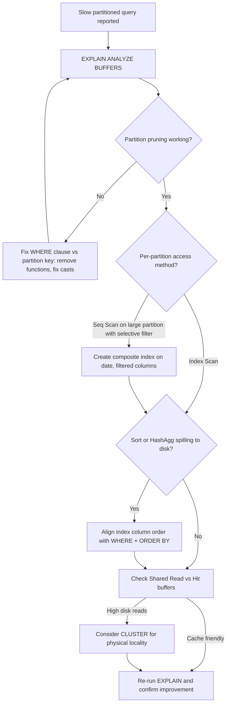

| Difficulty | Channel | Tags |
|---|---|---|
| intermediate | database | explain, query-plan, partitioning |

Picture this: your PostgreSQL table crosses 1TB, queries that once took milliseconds now crawl past 30 seconds, and your IOPS alarm is screaming at 24,000 every single day. That was CoinGecko's reality with an 8-year-old hourly crypto prices table on Amazon RDS — until they diagnosed the problem with EXPLAIN and partitioned their way to an 86% p99 latency drop [1]. The same trap awaits any team running partitioned tables: partitioning alone doesn't make you fast. What happens inside each partition — pruning, indexes, sorts — decides whether you ship or stall.

---

> ### Real-World Case — CoinGecko
>
> CoinGecko's hourly crypto prices table on Amazon RDS PostgreSQL grew past 1TB over 8 years, causing average query times to exceed 30 seconds, daily IOPS threshold breaches at 24K provisioned IOPS, rising request queues, declining Apdex scores, and replica lag during traffic spikes. Adding indexes first failed because the hot query filtered a JSONB currency column where per-key indexes would only benefit one consumer.
>
> | | |
> |---|---|
> | **Challenge** | Diagnose why date-range queries on a 100M+-row scale partitioned table remained slow, verify partition pruning and index utilization in EXPLAIN plans, and cut IOPS and p99 latency without breaking production. |
> | **Solution** | They analyzed query patterns, confirmed nearly all reads carried a timestamp range in WHERE (typically ≤4 months), then range-partitioned the table by month so the planner could prune to a handful of partitions. During rollout they used EXPLAIN-style plan analysis to catch regressions: one query lacked a lower date bound and scanned every partition (worse than the unpartitioned table), and another used created_at > ? with no upper bound, scanning empty future 2025 partitions. Both were rewritten with bounded date ranges, and surplus future partitions were dropped. |
> | **Outcome** | p99 response time dropped 86% from 4.13s to 578ms; IOPS fell 20% (savings multiplied across replicas); replica lag disappeared after the switch; dry-run benchmarks showed 6-8x faster queries on the same workload. |
> | **Lesson** | Partitioning only pays off when the planner can actually prune — a date-range query missing a lower (or upper) bound can scan all partitions and perform worse than the original unpartitioned table. Always verify pruning in the plan and keep partition-key predicates fully bounded. |

---

## Hook — When Partitioning Isn't Enough

It was the kind of afternoon every database engineer dreads. CoinGecko's hourly crypto prices table had ballooned past 1TB over eight years on Amazon RDS PostgreSQL. Average query times exceeded 30 seconds. Daily IOPS breached the 24K provisioned threshold. Request queues piled up, Apdex scores sagged, and replicas lagged behind during traffic spikes [1]. The obvious move — slap on more indexes — failed outright. The hot query filtered a JSONB currency column, and per-key indexes would only benefit a single consumer of that data. Sound familiar? You partitioned the table, you followed the docs, and yet the query is still slow. Here is the uncomfortable truth: partitioning is a routing mechanism, not a performance guarantee. The real story lives in your EXPLAIN plan — and most developers never read it carefully enough.

## Problem — Your 100M-Row Partitioned Table Is Still Slow

Consider the canonical case: a PostgreSQL table with 100M rows partitioned by date. A query filtering on a specific date range still takes forever. The stakes are real — every second of latency compounds into degraded Apdex scores, replica lag, and IOPS bills that scale across every replica you operate [1].

Many developers assume partitioning automatically equals speed. However, partitioning only narrows the scan surface; it does not guarantee that each partition is scanned efficiently. Three failure modes dominate:

- **Partition pruning is not happening.** If the planner cannot prove your WHERE clause aligns with partition bounds — often because of implicit casts, functions on the partition key, or mismatched data types — it scans every partition anyway.
- **Indexes inside partitions go unused.** A filter on `status = 'completed'` without a composite index forces sequential scans per partition, which is fine for one partition and brutal for eighty.
- **Expensive sorts and hash aggregates dominate.** Even with perfect pruning, an `ORDER BY` that spills to disk can dwarf everything else in the plan.

Consequently, you end up with a table that is technically partitioned but behaves like one giant unindexed heap. The question is not whether to partition — it is whether your EXPLAIN plan proves the partitioning is working.

## Real-World Case — CoinGecko's 1TB Wake-Up Call

CoinGecko's incident is a masterclass in what happens when a partitioned-looking workload outgrows naive optimizations. Their hourly crypto prices table accumulated eight years of data on RDS PostgreSQL. Query times crossed 30 seconds, and the provisioned 24K IOPS ceiling was breached daily — meaning every spike queued requests and dragged replica lag upward during exactly the moments traffic mattered most [1].

The first fix attempt — adding indexes — failed because the hot query filtered a JSONB currency column. Per-key indexes would only accelerate one consumer's access pattern while bloating write costs for everyone else. The team instead evaluated table partitioning as a structural change.

The results were dramatic:

- **p99 response time dropped 86%**, from 4.13s to 578ms.
- **IOPS fell 20%**, and because the savings multiplied across replicas, the cost impact was larger than the single-number suggests.
- **Replica lag disappeared** after the switch.
- **Dry-run benchmarks showed 6–8x faster queries** on the same workload [1].

🔥 Hot Take: CoinGecko's story proves that indexes are a local optimization while partitioning is a global one. When your table is 1TB, the architecture decision beats the micro-optimization every time — but only if pruning and per-partition indexes actually work.

## Deep Dive — Reading the EXPLAIN Plan Like a Detective

Building on CoinGecko's outcome, the diagnostic process matters as much as the fix. PostgreSQL's `EXPLAIN (ANALYZE, BUFFERS)` is your microscope; without it, you are guessing. Here is what to scrutinize, in order of impact.

**1. Partition pruning effectiveness.** Look for a `Partitions Removed` line (or absence of per-partition subplans). If the plan lists every partition in a Append node, pruning failed. Common culprits: the partition key wrapped in a function (`WHERE lower(event_date) = ...` defeats pruning), an implicit cast between `date` and `text`, or a prepared statement whose parameters were not customized per partition [2].

**2. Index utilization patterns.** Inside each surviving partition, check for `Index Scan` versus `Seq Scan`. A sequential scan on a 10M-row partition with a selective filter is a red flag. However, note the nuance: for queries touching most of a partition, a seq scan is genuinely cheaper — the planner is often right [3]. The problem is when selectivity is high (say, filtering `status = 'completed'` at 5% of rows) and you still see seq scans.

**3. Expensive sorts and hash aggregates.** Watch for `Sort Method: external merge Disk: ...` or `HashAgg` spilling to disk. These appear at the top of `Execution Time` contributions even when pruning is perfect. A composite index matching both the WHERE clause and the ORDER BY eliminates the sort entirely.

**4. Buffers and cache hit ratios.** `Shared Read` versus `Shared Hit` tells you whether you are burning IOPS on cold pages — the exact failure mode that pushed CoinGecko past 24K provisioned IOPS [1].

⚠️ Watch Out: `EXPLAIN` without `ANALYZE` shows the planner's *estimate*, not reality. If estimated rows diverge wildly from actual rows, your statistics are stale — run `ANALYZE` before trusting any plan.

This leads to a critical trade-off most teams never articulate explicitly:

| Approach | Pruning Helped? | Write Cost | Best When |
|---|---|---|---|
| Partition only | Partial | Low | Data lifecycle (TTL, archival) matters most |
| Composite index on (date, status) | Yes, within partitions | Moderate | High-selectivity filters per partition |
| CLUSTER on the composite index | Yes, plus physical locality | High (rewrites table) | Read-heavy, rarely updated tables |
| Per-key JSONB indexes | No pruning help | High on writes | Single-consumer access patterns only |

The plot twist: CLUSTER physically reorders rows to match the index, which helps sequential-range reads but is invalidated by subsequent updates — a maintenance trap if you do not schedule re-clustering.

## Workflow — A Five-Step Diagnosis You Can Run Today

However, knowing the concepts is half the battle. Here is the repeatable workflow that separates systematic optimizers from guessers:

1. **Capture a real plan.** Run `EXPLAIN (ANALYZE, BUFFERS)` on a production-representative query — not the sanitized version from your test fixtures.
2. **Verify pruning.** Count the partitions in the Append node. If the count equals total partitions, fix the WHERE clause alignment first; no index will save you otherwise [2].
3. **Audit per-partition scans.** For each surviving partition, confirm the access method matches the selectivity. Seq scan on a tiny partition is fine; seq scan on a 10M-row partition with a 1% filter is not.
4. **Hunt sorts and spills.** If `Sort Method` shows disk usage, build a composite index whose column order matches both equality predicates first, then range, then ORDER BY [3].
5. **Validate with buffers.** Re-run and confirm `Shared Read` drops and execution time holds under load — exactly the IOPS reduction CoinGecko measured at scale [1].

The following diagram maps the decision flow:

{{diagram}}

## Code Example — Diagnose, Index, and Reorganize

The following walkthrough mirrors the production pattern: diagnose with a buffered EXPLAIN, add a concurrent composite index, then evaluate clustering for physical locality.

```sql
-- Step 1: Diagnose with real execution stats and buffer usage
-- BUFFERS reveals whether you are burning IOPS on cold pages
EXPLAIN (ANALYZE, BUFFERS)
SELECT * FROM events
WHERE event_date BETWEEN '2024-01-01' AND '2024-01-31'
  AND status = 'completed';
-- Look for: partitions removed, Index Scan vs Seq Scan, sort spills

-- Step 2: Build a composite index matching the WHERE clause
-- CONCURRENTLY avoids locking writes during the build
CREATE INDEX CONCURRENTLY idx_events_date_status
ON events (event_date, status);
-- Column order matters: equality/range on event_date first,
-- then the secondary filter status, so the planner can skip
-- index entries across the date range efficiently

-- Step 3: Refresh statistics so the planner picks the new index
ANALYZE events;

-- Step 4: For read-heavy tables, physically cluster rows to the index
-- This rewrites the table: schedule it in a maintenance window
CLUSTER events USING idx_events_date_status;
-- Re-run CLUSTER after heavy UPDATE volume invalidates physical order

-- Step 5: Confirm the win — compare execution time and buffers
EXPLAIN (ANALYZE, BUFFERS)
SELECT * FROM events
WHERE event_date BETWEEN '2024-01-01' AND '2024-01-31'
  AND status = 'completed';
```

**Walkthrough.** Step 1 captures ground truth: `ANALYZE` populates actual row counts and timing, while `BUFFERS` exposes whether pages are read from disk (your IOPS bill) or served from shared buffers. Step 2 builds the composite index concurrently — critical in production, because a blocking `CREATE INDEX` on a 100M-row table can stall writers long enough to trigger exactly the request-queue pileup CoinGecko experienced [1]. The column order encodes the query's access pattern: range predicates on `event_date` come first so the index naturally aligns with partition boundaries, and `status` sits second to filter within the date window without a separate sort. Step 3 forces the planner to notice — stale statistics are the silent killer of index adoption [3]. Step 4 clusters physically, trading a full table rewrite for locality that pays off on range scans; the comment flags the trade-off, since updates scatter rows again. Step 5 closes the loop by re-measuring, ensuring the optimization shows up in execution time and buffer counts rather than just in theory.

## Lessons Learned — What to Do Differently Tomorrow

Tying this back to CoinGecko's 86% p99 improvement [1], the journey from a 30-second query to a sub-600ms one is not about knowing more SQL tricks — it is about reading evidence instead of intuition. Here is what to take into your next incident:

- **Prove pruning before touching indexes.** If the plan scans every partition, a perfect index on a single partition is irrelevant. Fix the WHERE-clause/partition-key alignment first [2].
- **Match indexes to the full filter, not one column.** A single-column index on `event_date` leaves `status = 'completed'` to be filtered row-by-row; the composite `(event_date, status)` eliminates that work entirely [3].
- **Treat CLUSTER as a scheduled ritual, not a one-time fix.** Physical order decays under updates — re-run it on a cadence or skip it for write-heavy tables.
- **Measure buffers, not just milliseconds.** CoinGecko's 20% IOPS reduction multiplied across replicas [1]; wall-clock time alone hides the infrastructure savings.
- **Beware the JSONB index trap.** Per-key indexes inside JSONB solve one consumer's problem and tax every writer — a pattern that stalled CoinGecko's first fix attempt [1].

Battle scars worth remembering: running `EXPLAIN` without `ANALYZE` and trusting stale estimates; building indexes non-concurrently and blocking production writes; assuming partitioning alone guarantees fast queries. Every one of these has burned teams running tables far smaller than 100M rows.

The single insight to share with your team tomorrow: **partitioning decides which rows are candidates; your EXPLAIN plan decides whether those candidates are actually read efficiently.** If you cannot show the plan, you have not fixed the query.

---

## Partitioned Query Diagnosis Flow



<details>
<summary><strong>Original Interview Question</strong></summary>

**Q:** You have a PostgreSQL table with 100M rows partitioned by date. A query filtering on a specific date range is still slow. What would you check in the EXPLAIN plan and how would you optimize it?

**A:** Check partition pruning effectiveness, index utilization patterns, and expensive sort operations. Create composite indexes on (date, filtered_columns) and evaluate clustering strategies for optimal data access.

</details>

## Conclusion

CoinGecko went from 4.13s p99 to 578ms — an 86% drop — not by adding one clever index, but by making partition pruning, per-partition access paths, and buffer usage all tell the same story [1]. Tomorrow, take your slowest partitioned query, run EXPLAIN (ANALYZE, BUFFERS), and count the partitions actually scanned. If every partition appears, no index will save you until the WHERE clause matches the partition key. Then layer the composite index, refresh statistics, and re-measure buffers — not just milliseconds. The memorable insight to carry forward: partitioning decides which rows are candidates; your EXPLAIN plan decides whether those candidates are read efficiently. You cannot fix what you have not measured, and you cannot claim a win you cannot show in the plan.

---

## References

1. [CoinGecko incident report](https://dev.to/coingecko/scaling-postgresql-performance-with-table-partitioning-136o) — article
2. [PostgreSQL EXPLAIN Documentation](https://www.postgresql.org/docs/current/using-explain.html) — documentation
3. [PostgreSQL Index Types](https://www.postgresql.org/docs/current/indexes-types.html) — documentation
4. [PostgreSQL Partitioning Documentation](https://www.postgresql.org/docs/current/ddl-partitioning.html) — documentation
5. [Amazon RDS for PostgreSQL Documentation](https://docs.aws.amazon.com/AmazonRDS/latest/UserGuide/CHAP_PostgreSQL.html) — documentation
6. [PostgreSQL CLUSTER Documentation](https://www.postgresql.org/docs/current/sql-cluster.html) — documentation
7. [PostgreSQL CREATE INDEX Documentation](https://www.postgresql.org/docs/current/sql-createindex.html) — documentation
8. [PostgreSQL EXPLAIN Documentation](https://www.postgresql.org/docs/current/using-explain.html) — documentation

---

**Author:** Satishkumar Dhule — [GitHub](https://github.com/satishkumar-dhule) · [LinkedIn](https://linkedin.com/in/satishkumar-dhule) · [Website](https://satishkumar-dhule.github.io)
