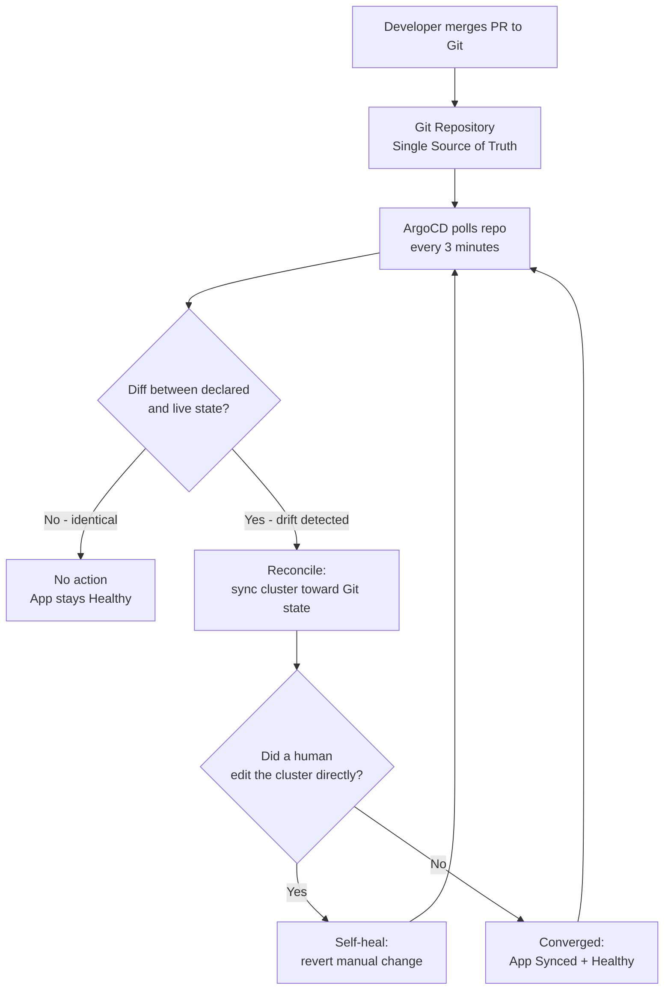

| Difficulty | Channel | Tags |
|---|---|---|
| beginner | devops | argocd, flux, declarative |

By 2021, Intuit had bet its entire product portfolio — TurboTax, QuickBooks, Credit Karma, even MailChimp — on Kubernetes. Then the team hit a wall: an ArgoCD setup that hummed along for a few dozen apps collapsed into minutes-long reconciliation delays under hundreds of workloads across dozens of clusters [1]. If a company whose survival literally depends on April 15 running flawlessly can be blindsided by config drift, so can yours. The fix isn't a shinier dashboard or a better intern — it's a fundamental shift in how you declare, review, and reconcile cluster state.

---

> ### Real-World Case — Intuit
>
> As Intuit migrated to cloud and adopted Kubernetes across their product portfolio (TurboTax, QuickBooks, Credit Karma, MailChimp), their initial straightforward ArgoCD implementation only worked for a couple of clusters and a few dozen applications. Managing hundreds of applications across dozens of Kubernetes clusters exposed serious performance bottlenecks in ArgoCD's reconciliation pipeline.
>
> | | |
> |---|---|
> | **Challenge** | Scale their GitOps deployment pipeline so that ArgoCD could continuously reconcile desired state from Git with live cluster state across hundreds of microservices — without reconciliation times ballooning to minutes, and while eliminating configuration drift from ad-hoc imperative kubectl changes that bypassed version control. |
> | **Solution** | Intuit built ArgoCD as an internal project (later open-sourced under CNCF) using an Application CRD pointing to Git as the single source of truth, with auto-sync, health checks, and self-heal to revert manual cluster changes. They redesigned the Application Controller, added repository-side caching for kustomize/helm YAML generation, and removed reconciliation bottlenecks to support massive multi-cluster scale. |
> | **Outcome** | Reduced application reconciliation time from minutes to seconds while managing hundreds of applications across dozens of Kubernetes clusters; ArgoCD became the industry-standard GitOps tool adopted by Red Hat, Google, and thousands of organizations. |
> | **Lesson** | Declarative Git-as-single-source-of-truth only works at scale if the reconciliation loop itself is fast and cache-efficient — and self-healing that reverts imperative kubectl drift is what makes GitOps trustworthy for compliance and auditability. |

---

## Hook — The deploy looked fine. Then the drift started.

Somewhere around cluster number twenty, the scene plays out like clockwork. A developer runs `kubectl scale deployment payments --replicas=12` to cope with a traffic spike, forgets to tell anyone, and two weeks later the autoscaler is fighting a ghost. Meanwhile, another engineer hotfixes a secret directly in the cluster, bypassing the review process entirely — a change that is now guaranteed to vanish on the next release. These are the quiet failures that never light up a pager at 3am. They rot slowly: a config that only exists in production, a deployment that can't be reproduced, an audit trail with a giant hole labeled 'someone typed it in.' Stare at Kubernetes long enough and you'll notice the same truth every GitOps team eventually hits — a cluster will happily drift toward whatever human hands have touched it, and there is no command called `kubectl undo-reality`.

## Problem — Kubernetes gives you power, and the imperative world takes it personally

Here is the blunt version: `kubectl apply` and `kubectl scale` work great for one person in one terminal — and they are the enemy of everything after that. Every imperative command you type is a mutation that exists only in the cluster's memory, living nowhere in version control, visible to no one in review, and reproducible by nobody. Consequently, the same three failure modes appear in every team that starts small and grows: configuration drift between environments, a 'works on my cluster' culture, and rollbacks that demand forensic archaeology instead of a single git revert [5]. You might think this only bites teams with hundreds of services. Then a trickle of clusters becomes a stream, a dozen apps becomes a hundred, and the interface that worked for your demo day is now staring down a reconciliation backlog measured in minutes [1]. That's the exact moment teams discover the distinction this whole article hinges on: declarative versus imperative.

## Real-World Case — Intuit

Few companies embody the stakes better than Intuit. As the company migrated TurboTax, QuickBooks, Credit Karma, and MailChimp to Kubernetes, their ArgoCD rollout started the way most do — straightforward, a couple of clusters, a few dozen applications [1]. It worked beautifully right up until it didn't. Managing hundreds of applications across dozens of Kubernetes clusters exposed serious performance bottlenecks in ArgoCD's reconciliation pipeline, with application synchronization taking minutes instead of seconds. The team discovered that reconciliation — the constant checking of 'is live state equal to Git state' — is not a background luxury; it is the heartbeat of the entire GitOps model. Their work to shave that pipeline from minutes to seconds didn't just unblock Intuit. Iterating in the open, their fixes flowed back into ArgoCD itself, which went on to be adopted by Red Hat, Google, and thousands of organizations — and became the de facto industry-standard GitOps tool [1]. The lesson embedded in that journey: GitOps at one scale teaches you nothing about GitOps at the next.

## Deep Dive — Declarative vs Imperative: the plot twist no one sees coming

The counterintuitive insight is that declarative isn't just 'YAML instead of commands.' It is a complete inversion of responsibility. In the imperative world you tell the system *how* to change: scale now, delete that, patch this [6]. The system obeys and forgets. In the declarative world you tell the system *what you want to be true*: 'these 12 replicas, this image, these env vars' — and then the system owns the endless job of making reality match [5]. ArgoCD operationalizes that philosophy. It watches your Git repository continuously, compares the desired state to live cluster state, and reconciles any difference — automatically syncing changes on commit and, critically, self-healing when someone mutates the cluster out-of-band [2]. The comparison below is the real tradeoff, not the marketing version:

## Workflow — From Git commit to converged cluster in seven steps

The ArgoCD workflow reads like a relay race: with each passing of the baton, human intent becomes machine behavior. Start with a Git repository where every manifest or Helm chart is a candidate for production. From there, the loop runs on its own — no cron, no babysitting, no 'did the latest push take?' Slack question. The Mermaid diagram below, **ArgoCD Reconciliation Flow**, traces the full journey:

## Code Example — Standing up your first GitOps loop

Enough theory — here is what bootstrapping this actually looks like. The pattern is deliberately boring, which is exactly the point. First, install ArgoCD in its own namespace, then declare your first Application as a declarative object in Git — ArgoCD eats its own dog food:

## Lessons Learned — What drifting into the wall teaches you

Intuit's scaling story, and every team that followed the same arc, converges on a handful of lessons you can apply tomorrow: 

- **Start declarative from day one.** Retrofitting GitOps onto a cluster full of imperative mutations is grief; starting declarative is momentum [5][6].
- **Treat the sync interval as a safety knob, not a performance meter.** Three minutes gives humans a window to catch a bad commit before machines propagate it [2].
- **Protect main and gate self-healing behind it.** Remove self-heal, or you've built an autopilot for bad merges [4].
- **Watch the reconciliation pipeline, not just the UI.** When sync latency climbs from seconds to minutes, you're one poor query or oversized app manifest away from Intuit's bottleneck [1].
- **Marry GitOps with review culture.** PR review, audit trails, and git revert as rollback — these are the features that make declarative safe at scale [3].

Take one action today: pick a namespace where the only writes to the cluster happen through Git, declare it as an Application, and turn off write access for humans. The moment a teammate tries `kubectl scale` and watches ArgoCD calmly undo it, the model clicks — not as a tool, but as a contract about who owns the truth. That is the memorable insight: **GitOps doesn't stop people from changing things. It makes every change visible, reviewable, and reversible.**

---

## ArgoCD Reconciliation Flow

<strong>Original Interview Question</strong>

**Q:** You're setting up GitOps for a microservices deployment. How would you configure ArgoCD to automatically sync changes from your Git repository to Kubernetes, and what's the difference between declarative and imperative approaches in this context?

**A:** I'd configure ArgoCD by setting up a Git repository containing Kubernetes manifests or Helm charts, creating an Application CRD that points to the Git repository, enabling auto-sync with a health check interval of 3 minutes, and implementing self-healing to automatically revert any manual changes. The declarative approach involves defining the desired state in Git through YAML manifests, Helm charts, or Kustomize configurations, where ArgoCD continuously reconciles the actual state with the desired state. In contrast, the imperative approach uses kubectl commands to make direct changes to the cluster, bypassing the Git repository as the single source of truth.

## Conclusion

The through-line of this whole story is that Intuit's bottleneck wasn't a bug — it was the proof that reconciliation is the most important job your platform team has, and the least glamorous [1]. Treat sync time as an SLO. Protect your main branch like the airlock of a spaceship, then switch on self-heal with confidence. And every time a teammate reaches for `kubectl scale`, remember what the tool is really saying: that they've found a way to change the cluster that leaves no trace. GitOps doesn't reduce your ability to act — it makes acting deliberate, visible, and reversible. The single most valuable thing you can do this week is declare one namespace in Git and stop accepting random writes to the cluster. When the pager eventually goes off — and it will — you'll be able to answer the question that every on-call engineer dreads: 'What changed?' Except this time, the answer is sitting in your repo.

---

## References

1. [Intuit incident report](https://blog.argoproj.io/doing-gitops-at-scale-6313f5889775) — article
2. [Argo CD Documentation](https://argo-cd.readthedocs.io/en/stable/) — documentation
3. [Argo CD GitHub Repository](https://github.com/argoproj/argo-cd) — documentation
4. [GitOps - Wikipedia](https://en.wikipedia.org/wiki/GitOps) — documentation
5. [Kubernetes: Declarative Management of Kubernetes Objects](https://kubernetes.io/docs/tasks/manage-kubernetes-objects/declarative-config/) — documentation
6. [Kubernetes: Imperative Management of Kubernetes Objects](https://kubernetes.io/docs/tasks/manage-kubernetes-objects/imperative-command/) — documentation
7. [Helm Documentation](https://helm.sh/docs/) — documentation
8. [Kustomize GitHub Repository](https://github.com/kubernetes-sigs/kustomize) — documentation

---

**Author:** Satishkumar Dhule — [GitHub](https://github.com/satishkumar-dhule) · [LinkedIn](https://linkedin.com/in/satishkumar-dhule) · [Website](https://satishkumar-dhule.github.io)
