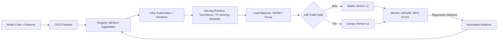

| Difficulty | Channel | Tags |
|---|---|---|
| beginner | devops | mlops, deployment |

Uber's Michelangelo platform handles over one million predictions per second across fraud detection, marketing, and ETAs — but a seemingly minor decision nearly broke its latency guarantees. The team wanted to serve standard Spark MLlib PipelineModels, yet loading them took 8x–44x longer than their custom protobuf format, blowing past millisecond-level p99 SLAs [1]. That gap between 'the model works' and 'the model serves' is where most ML teams hit a wall. Understanding the divide between model deployment and model serving might be the difference between your launch and your postmortem.

---

> ### Real-World Case — Uber
>
> Uber's Michelangelo ML platform serves thousands of production models powering fraud detection, marketing, ETAs, and Uber Eats — over one million predictions per second. To support flexible model pipelines, the team wanted to serve standard Spark MLlib PipelineModels instead of their custom protobuf format, but found that loading Spark's native format in the online prediction path was prohibitively slow for p99 latency SLAs measured in milliseconds.
>
> | | |
> |---|---|
> | **Challenge** | Native Spark pipeline model load latency was 8x-44x slower than Uber's custom protobuf representation. Loading via a local Spark session behaved like spinning up a small cluster on a single host — excessive memory overhead and load time that broke millisecond-scale p99 SLAs for real-time fraud and marketing use cases, and degraded server resource agility and health monitoring during deployments in their multi-tenant serving setup. |
> | **Solution** | Uber reframed model serialization as a serving-runtime concern, not just a training/deployment artifact: they mapped Spark transformers to lightweight 'OnlineTransformer' classes, replaced Spark's RDD-based sc.textFile metadata reads with direct Java I/O for local files, and tuned the model load path while keeping a standard representation for training-serving consistency — all on top of Michelangelo's deployment control plane (rolling model loads into prediction containers behind load balancers across data centers). |
> | **Outcome** | Reduced native Spark model load time from 8x-44x slower than custom protobuf down to just 2x-3x — a 4x-15x speedup — making standard Spark models viable for online serving. Michelangelo ultimately powers 1M+ predictions/second at sub-5ms P95 latency (when features are local) across hundreds of machines behind load balancers. |
> | **Lesson** | Deployment and serving have fundamentally different performance constraints: a model format that's fine for training and CI/CD rollout can be catastrophically slow at the serving layer's model-load/cold-start path. Optimizing serialization, model loading, and in-memory serving is a distinct discipline from packaging and rolling out models — and getting it wrong silently breaks latency SLAs during every deployment event. |

---

## Hook — One Million Predictions, Five Milliseconds

Picture this: your model scored 95% accuracy in testing. Leadership is thrilled. The demo crushed it. Then you ship it, and the first real traffic arrives — and your API times out. This is not a hypothetical. It is the moment teams discover that getting a model into production is two entirely different problems wearing one word: 'deployment.' You have infrastructure to stand up, pipelines to wire, and then — separately — a live system that must answer inference requests in single-digit milliseconds, under load, forever. The stakes? Every degraded p99 tick is lost revenue, frustrated users, or fraud slipping through. Many developers discover this divide the hard way, usually at 2am.

## Problem — One Word, Two Very Different Jobs

The core pain: teams treat 'deploying a model' as a single task, then wonder why production feels cursed. In reality, you are solving two coupled but distinct challenges. Deployment is the world of CI/CD pipelines, infrastructure provisioning, monitoring, and rollback strategies — the plumbing that gets artifacts from a laptop to a cluster [2]. Serving is the runtime: the inference API, request routing, model loading, versioning, and autoscaling that turn a stored artifact into answers. Conflating them creates classic failure modes. A pipeline can 'succeed' while the serving layer silently drops requests under real concurrency. Or autoscaling pods spin up fast but take 30 seconds to load a 2GB model — cold starts that eat your latency budget. Consequently, teams end up debugging the wrong layer: tuning GPU allocation when the real bottleneck is a synchronous model load blocking the first request.

## Real-World Case — Uber's Michelangelo Speedup

Uber's Michelangelo platform powers thousands of production models — fraud detection, marketing, ETAs, Uber Eats — at over one million predictions per second [1]. The engineering challenge: support flexible pipelines by serving standard Spark MLlib PipelineModels instead of a bespoke protobuf format. The obstacle: loading Spark's native format in the online prediction path was prohibitively slow for p99 SLAs measured in milliseconds — 8x to 44x slower than their custom representation [1]. The fix reduced that gap to 2x–3x, a 4x–15x speedup, making standard Spark models viable for online serving. Today Michelangelo delivers sub-5ms P95 latency (when features are local) across hundreds of machines behind load balancers [1]. The lesson is sharp: their deployment infrastructure was fine — it was the serving path's model-loading cost that nearly made the architecture unworkable. A 44x regression lives entirely on the serving side of the ledger.

## Deep Dive — Deployment vs Serving: The Real Trade-offs

Building on Uber's story, it helps to map the boundary precisely. Deployment owns the 'before traffic' lifecycle; serving owns 'during traffic' behavior. Here is the lay of the land:

| Concern | Deployment | Serving |
|---|---|---|
| Primary tools | Kubernetes, Docker, Terraform, MLflow, SageMaker, Vertex AI [2][3] | TensorFlow Serving, TorchServe, BentoML, FastAPI, gRPC |
| CI/CD | GitHub Actions, Jenkins | Model version rollout, traffic splitting |
| Scaling | Cluster provisioning, node autoscaling | Pod replicas, request routing, GPU memory [4] |
| Failure mode | Pipeline fails, stale infra | Cold starts, tail-latency spikes, OOM |
| Success metric | Deploy frequency, rollback time | p95/p99 latency, QPS, error rate |

The trade-offs you will actually negotiate:

- **Latency vs throughput**: batching more requests raises throughput but adds queueing delay — fine for offline jobs, fatal for a 100ms interactive SLA.
- **Batch vs real-time**: fraud scoring needs synchronous answers; nightly recommendations do not. Choosing wrong doubles your GPU bill.
- **Cold starts**: serverless and scale-from-zero patterns are cheap until a 2GB model takes 20 seconds to load [5]. Warm pools or preloaded sidecars help.
- **A/B testing**: gradual rollouts and traffic splitting [4] let you catch regressions before 100% of users do — but only if your serving layer supports multiple live versions.

🔥 Hot Take: Most 'model performance' incidents are actually serving-layer incidents. The weights didn't change — the path to them did. Kubernetes gives you the orchestration primitives [4], but you still have to design the inference path as its own system.

## Workflow — From Commit to Live Endpoint

How should teams structure the journey? Think of it as two gears meshing: the deployment gear turns continuously (CI/CD), while the serving gear spins fast at runtime. The following diagram shows how an artifact travels from code to a latency-checked live endpoint.



Step by step:

1. **Package and register** — CI/CD builds a container and logs the model artifact to a registry [2][6].
2. **Provision infrastructure** — Terraform declares clusters, GPUs, and secrets [7].
3. **Launch serving runtime** — a model server loads weights and exposes gRPC/HTTP [8].
4. **Route traffic** — a load balancer distributes across replicas [4].
5. **Canary, then ramp** — split traffic, watch latency budgets, promote or roll back.
6. **Close the loop** — metrics feed back into the registry decision.

⚠️ Watch Out: Skipping step 5 is the most common battle scar. If you cannot shift 5% of traffic and kill a bad version in under a minute, you do not have a serving strategy — you have a prayer.

## Code Example — A Serving Path That Respects p99

The following Python example illustrates a production-shaped serving pattern: preloading the model at startup (avoiding cold starts), exposing a FastAPI inference endpoint, and tracking latency metrics so deployment and serving concerns stay separated.

```python
import time
from contextlib import asynccontextmanager
from fastapi import FastAPI
from pydantic import BaseModel

# Assume load_model() wraps TorchServe/TF Serving/BentoML or a native predictor.
# Key decision: load ONCE at startup, not on first request — this is how you
# avoid the cold-start tax that wrecked Uber's Spark load path [1].
MODEL = None

@asynccontextmanager
async def lifespan(app: FastAPI):
    global MODEL
    t0 = time.perf_counter()
    MODEL = load_model("models/fraud-xgb:v3")  # versioned artifact from registry
    load_ms = (time.perf_counter() - t0) * 1000
    print(f"model loaded in {load_ms:.1f}ms")  # alert if this exceeds your budget
    yield
    MODEL = None

app = FastAPI(lifespan=lifespan)

class PredictRequest(BaseModel):
    features: list[float]

@app.post("/predict")
async def predict(req: PredictRequest):
    start = time.perf_counter()
    # Batch calls that arrive together (throughput) without blocking (latency)
    result = MODEL.predict([req.features])
    elapsed_ms = (time.perf_counter() - start) * 1000
    # Export histogram — this is what your serving-side monitoring scrapes
    observe_latency(elapsed_ms)
    if elapsed_ms > 50:  # your p99 SLO, e.g. sub-50ms [9]
        alert("latency budget exceeded")
    return {"score": float(result[0]), "latency_ms": elapsed_ms}
```

Walking through it:

1. **`lifespan` preloads the model** before the first user request — the single highest-leverage fix for cold-start spikes.
2. **Versioned model names** (`:v3`) tie the serving process to a registry entry, enabling instant rollback by repointing, not redeploying.
3. **Per-request timing** separates serving health from deployment health: your pipeline can be green while this metric is red.
4. **The 50ms guard** encodes the latency SLA as code — the same discipline that makes sub-5ms P95 at Uber's scale achievable [1] when features are local.
5. **Batching hook** (`predict([features])`) shows where you would coalesce concurrent requests to trade a little latency for real throughput gains.

Many developers copy a training notebook's `model.predict(x)` into an API and call it done. The versioning, preloading, and latency instrumentation above are what separate a demo from a system.

## Lessons Learned — Ship the Path, Not Just the Artifact

The journey from Uber's 44x model-load problem to sub-5ms serving is really a story about respecting boundaries. What should you take into your next standup?

- **Deployment and serving are separate contracts.** Pipeline green does not mean endpoints healthy. Instrument both sides independently [2].
- **Load models at startup, version every artifact.** Preloading kills cold starts; registry-backed versions make rollback a config change, not a fire drill [6].
- **Design for the tail, not the average.** p99 tells the truth your average hides. Set budgets (sub-50ms interactive, sub-1s for tolerant paths [9]) and enforce them in code.
- **Canary before you trust.** Traffic splitting plus automated rollback [4] converts bad deploys from outages into blips.
- **Battle scar to avoid:** tuning autoscaling while your model load blocks the event loop. Measure load time first — Uber's 8x–44x gap [1] lived exactly there.

The memorable line to share with your team: **your model is only as production-ready as the slowest millisecond between request and response.** Tomorrow, pick one serving endpoint, add startup model-load timing and a p99 alert — that is the first real step toward treating inference as a system, not a function call.

---

## Deployment-to-Serving Lifecycle


<details>
<summary><strong>Original Interview Question</strong></summary>

**Q:** Explain the key differences between model serving and model deployment in ML systems, including specific technologies, scaling considerations, and real-world implementation patterns?

**A:** Deployment encompasses CI/CD pipelines, infrastructure setup, and monitoring using tools like Kubernetes, MLflow, and SageMaker. Serving focuses on runtime inference APIs with frameworks like TensorFlow Serving, TorchServe, or BentoML, handling request routing, model versioning, and autoscaling. Key trade-offs include latency vs throughput, batch vs real-time inference, and cold start optimization.

</details>

## Conclusion

Uber's story closes the loop opened at the start: a million-predictions-per-second platform nearly stalled not on model quality, but on the milliseconds between a request and a loaded model [1]. Deployment gets artifacts to the cluster; serving makes every single request answer on time — and confusing the two is how healthy pipelines mask dying endpoints. Start tomorrow by timing your model load, alerting on p99, and canarying every rollout. One metric to carry back to your team: your model is only as production-ready as the slowest millisecond on its serving path.

---

## References

1. [Uber incident report](https://www.uber.com/us/en/blog/michelangelo-machine-learning-model-representation) — article
2. [MLflow Documentation](https://mlflow.org/docs/latest/index.html) — documentation
3. [Amazon SageMaker Developer Guide](https://docs.aws.amazon.com/sagemaker/latest/dg/whatis.html) — documentation
4. [Kubernetes Documentation](https://kubernetes.io/docs/home/) — documentation
5. [Terraform Documentation](https://developer.hashicorp.com/terraform/docs) — documentation
6. [MLflow Model Registry](https://mlflow.org/docs/latest/model-registry.html) — documentation
7. [Terraform on AWS Provider](https://registry.terraform.io/providers/hashicorp/aws/latest/docs) — documentation
8. [TorchServe GitHub Repository](https://github.com/pytorch/serve) — documentation
9. [FastAPI Documentation](https://fastapi.tiangolo.com/) — documentation

---

**Author:** Satishkumar Dhule — [GitHub](https://github.com/satishkumar-dhule) · [LinkedIn](https://linkedin.com/in/satishkumar-dhule) · [Website](https://satishkumar-dhule.github.io)
