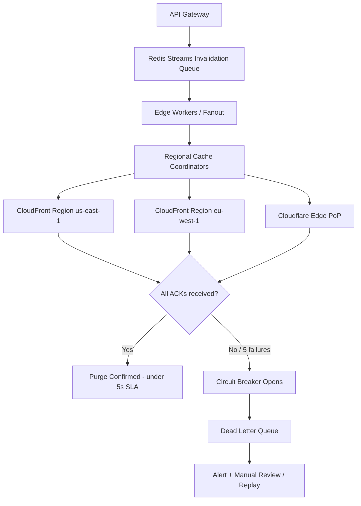

| Difficulty | Channel | Tags |
|---|---|---|
| intermediate | system-design | edge, caching, purging |

Imagine issuing a cache purge and waiting — not milliseconds, but minutes — while stale content burns across 270+ data centers. That was Cloudflare's reality: a central message queue became a bottleneck, purge history storage competed with customer cache space, and millions of daily purge API calls pushed the system to its limits [1]. The fix? Fanout workers that cut end-to-end purge latency by 50% and tripled throughput, eventually achieving P50 global purge latency under 150ms across 330 cities — a 90% improvement since May 2022 [1]. Now imagine you need to guarantee content propagation within 5 seconds while handling 10,000 concurrent invalidations per second. Here is how you would design that system.

---

> ### Real-World Case — Cloudflare
>
> Cloudflare's original cache purge system relied on central core services and a bare-metal message queue that became a bottleneck as the network grew to 270+ data centers. Purge latency degraded, storage for purge history (Quicksilver) competed with customer cache space, and thousands of customers issuing millions of purge API calls daily pushed the system to its scaling limits.
>
> | | |
> |---|---|
> | **Challenge** | Propagate cache invalidations globally in near real-time at scale: every purge must reach hundreds of data centers quickly and consistently, otherwise visitors see mixed old/new content (even breaking sites during non-backwards-compatible JS library upgrades), while purging too broadly causes thundering-herd origin outages. |
> | **Solution** | Cloudflare rebuilt purge as a fully decentralized 'coreless' system using Cloudflare Workers and Durable Objects: a Purge Ingest worker filters uncacheable/foreign URLs locally (>50% of incoming purges were superfluous), a Durable Object-backed Purge Queue tracks progress, and regional Purge Fanout workers distribute purges peer-to-peer instead of through core data centers. They replaced Quicksilver with CacheDB (Rust + RocksDB) on every machine for index-based active deletion rather than lazy expiry. |
> | **Outcome** | Fanout workers alone cut end-to-end purge latency by 50% and tripled throughput; the final system achieved P50 global purge latency under 150ms for tag/hostname/prefix purges across 330 cities in 120+ countries — a 90% improvement since May 2022 — while active deletion reduced storage needs 10x, freeing disk for better cache hit ratios. |
> | **Lesson** | Centralized control planes inevitably bottleneck distributed edge systems; moving coordination to the edge with Durable Objects and filtering invalid work before fanout (over half of purges were unnecessary) beat simply scaling the core. Also: lazy purge feels free until its storage cost crowds out the cache you're trying to keep fresh. |

---

## Hook — The Clock Is Ticking on Every Purge

Picture this: your team just shipped a critical security fix, but customers across three continents are still seeing the vulnerable version cached at the edge. Every second of delay is a window of exposure. For content delivery networks, cache invalidation is not a nice-to-have — it is the difference between shipping trust and shipping liability. The hard part? Doing it globally, in under 5 seconds, at 10,000 invalidations per second, without melting your infrastructure. Most developers have felt a smaller version of this pain: you deploy, you bust the cache, and somehow the old CSS is still loading for users in São Paulo. Sound familiar? At scale, that annoyance becomes an architectural crisis.

## Problem — Why Global Purging Breaks Naive Designs

The core challenge is deceptively simple: how do you propagate a "delete this" command to hundreds of edge locations faster than the content itself can be re-cached? However, several forces conspire against you. First, throughput: 10,000 invalidations per second means a single-threaded queue or synchronous API fan-out will collapse almost immediately — Cloudflare's own central bare-metal queue became exactly this bottleneck as they grew [1]. Second, latency: a 5-second global SLA leaves essentially zero room for serial retries or network partitions. Third, consistency: if one region lags, users see stale content, which for many workloads is worse than no cache at all. Moreover, CDN providers impose rate limits and per-call pricing on purge APIs, so blasting every invalidation individually is both slow and expensive. The stakes are real — stale pricing pages, outdated legal notices, or a leaked pre-announcement can all stem from a purge that took 30 seconds instead of 5. What is the elegant way out of this trap?

## Real-World Case — Cloudflare's Purge Overhaul

Cloudflare's original purge system relied on central core services and a bare-metal message queue that became a bottleneck as the network grew to 270+ data centers [1]. Purge latency degraded, storage for purge history (Quicksilver) competed with customer cache space, and thousands of customers issuing millions of purge API calls daily pushed the system to its scaling limits [1].

The transformation happened in stages. Fanout workers alone cut end-to-end purge latency by 50% and tripled throughput [1]. The final system achieved P50 global purge latency under 150ms for tag, hostname, and prefix purges across 330 cities in 120+ countries — a 90% improvement since May 2022 [1]. Additionally, active deletion of purge records reduced storage needs by 10x, freeing disk for better cache hit ratios [1].

The takeaway is not just "use a queue." It is that fan-out must happen close to the edge, purge history must not compete with cache, and throughput scales when you stop funneling everything through one central service. If Cloudflare — who runs the purge infrastructure itself — hit these walls, your design almost certainly will too. So how do you build the same resilience into your own multi-region purging pipeline?

## Deep Dive — Architecture, Trade-offs, and the 5-Second Budget

Building on Cloudflare's lessons, the design centers on a distributed invalidation queue feeding edge-level coordinators, with aggressive batching to satisfy both the latency and cost budgets.

**Non-functional requirements at a glance:**
- **Latency:** <5s propagation globally
- **Throughput:** 10K invalidations/sec
- **Availability:** 99.99% uptime
- **Consistency:** Strong consistency across regions [2]

**Queue choice is the first trade-off.** Redis Streams with consumer groups provide at-least-once delivery and easy horizontal scaling [3]. Alternatively, Apache Kafka offers stronger durability guarantees but adds operational weight [4]. For a 5-second SLA, Redis Streams typically wins on delivery latency; for auditability across days, Kafka wins. Many teams use Redis for the hot path and archive to Kafka or S3 for replay.

**Batching is where the economics live.** CDN purge APIs bill and rate-limit per call. Sending 100 invalidations per API call instead of 100 individual calls reduces API costs by roughly 90% and keeps you under rate limits [5]. However, batching introduces a tension: the longer you wait to fill a batch, the higher your tail latency. The sweet spot is usually a micro-batch window of 10-50ms — big enough to coalesce, small enough to stay inside your 5-second budget.

| Strategy | Latency | Cost | Complexity |
|---|---|---|---|
| Synchronous per-request purge | Low (single region) | Very high | Low |
| Central queue + worker fan-out | Medium | Medium | Medium |
| Distributed queue + edge coordinators + batching | Low globally | Low | High |

**TTL and invalidation are complementary, not competitors.** Setting `Cache-Control: max-age=2, must-revalidate` gives you a safety net: even if a purge is lost, content self-expires within 2 seconds [6]. Pattern-based purging with wildcards (for example, `/products/*`) further reduces the number of distinct invalidation keys [5].

**Failure handling is non-negotiable at 99.99% availability.** A circuit breaker that fails fast after 5 consecutive failures prevents a dead CDN endpoint from stalling the entire pipeline [7]. Failed invalidations land in a dead-letter queue for manual review, while health checks continuously monitor regional endpoints. For rate limits, exponential backoff with jitter avoids the thundering-herd problem when the CDN API recovers [8].

⚠️ **Watch Out:** The most common battle scar is treating "queue accepted the message" as "purge succeeded." Until you have an acknowledgment from every regional CDN endpoint, the purge is only in flight — not done.

## Workflow — From API Call to Global Propagation in Under 5 Seconds

Here is the end-to-end flow, step by step. The following diagram tells the visual story of how an invalidation travels from your API gateway to every edge cache:



The process unfolds as follows:
1. Your application posts invalidation patterns (for example, `/blog/*`) to the API Gateway.
2. The gateway enqueues the batch into Redis Streams, where consumer groups let multiple edge workers partition the load without duplicate processing [3].
3. Edge workers — running close to your users, similar in spirit to Cloudflare's fanout workers [1] — coalesce invalidations into batches of up to 100 per CDN API call [5].
4. Regional cache coordinators dispatch those batches to CloudFront and Cloudflare purge endpoints in parallel, not serially.
5. Each region ACKs. When all ACKs arrive, the purge is marked complete. If a region fails repeatedly, the circuit breaker opens and the batch routes to the dead-letter queue [7].
6. Meanwhile, the 2-second TTL acts as a backstop: even a purged-then-lost entry disappears on its own within seconds [6].

🎯 **Key Point:** Parallel regional dispatch is what makes 5 seconds achievable. Sequential fan-out across even 10 regions at 500ms each blows the budget before you reach region eight.

## Code Example — A Batched, Backoff-Aware Purge Worker

The following JavaScript worker demonstrates the core pattern: consume from a stream, batch invalidations, call the Cloudflare purge API, and retry with exponential backoff.

```javascript
// Batched CDN purge worker with exponential backoff and circuit breaker
const BATCH_SIZE = 100;          // Cloudflare accepts up to 30 URLs per purge; CloudFront allows 3000 paths
const MAX_RETRIES = 3;           // Give up after 3 attempts, then dead-letter
const FAILURE_THRESHOLD = 5;     // Open circuit after 5 consecutive failures

let consecutiveFailures = 0;
let circuitOpen = false;

async function purgeBatch(paths) {
  const res = await fetch('https://api.cloudflare.com/client/v4/zones/ZONE_ID/purge_cache', {
    method: 'POST',
    headers: {
      'Authorization': `Bearer ${process.env.CF_API_TOKEN}`,
      'Content-Type': 'application/json'
    },
    body: JSON.stringify({ files: paths })  // Batch: one API call, many paths
  });
  if (!res.ok) throw new Error(`Purge failed: ${res.status}`);
  return res.json();
}

async function purgeWithBackoff(paths) {
  if (circuitOpen) return deadLetter(paths);      // Fail fast when CDN is unhealthy

  for (let attempt = 0; attempt < MAX_RETRIES; attempt++) {
    try {
      const result = await purgeBatch(paths);
      consecutiveFailures = 0;                     // Reset breaker on success
      return result;
    } catch (err) {
      consecutiveFailures++;
      if (consecutiveFailures >= FAILURE_THRESHOLD) {
        circuitOpen = true;                        // Open circuit to protect downstream
        setTimeout(() => { circuitOpen = false; consecutiveFailures = 0; }, 30_000);
      }
      // Exponential backoff with jitter avoids synchronized retries
      const delay = Math.min(2 ** attempt * 100, 4000) + Math.random() * 100;
      await new Promise(r => setTimeout(r, delay));
    }
  }
  return deadLetter(paths);                        // After MAX_RETRIES, park for review
}

async function deadLetter(paths) {
  await redis.xadd('purge:dlq', '*', 'paths', JSON.stringify(paths));
  console.warn('Dead-lettered purge batch:', paths.length, 'paths');
}

// Consumer loop: pull up to BATCH_SIZE pending paths per tick
async function run() {
  while (true) {
    const paths = await takeFromStream(BATCH_SIZE); // Micro-batch: ~10-50ms window
    if (paths.length) await purgeWithBackoff(paths);
  }
}

run();
```

**Walking through the code:** The worker pulls up to `BATCH_SIZE` paths from the stream each tick, coalescing many customer invalidations into a single CDN API call — the same technique that cuts purge API costs by around 90% [5]. The `purgeWithBackoff` function wraps each call in exponential backoff with jitter [8], so when the CDN rate-limits you, retries spread out instead of stampeding. The circuit breaker trips after `FAILURE_THRESHOLD` consecutive failures [7], immediately parking traffic in a dead-letter stream for replay once health checks recover. Crucially, the 2-second TTL described earlier [6] remains your safety net: anything that reaches the DLQ still self-expires rather than serving stale content forever.

## Lessons Learned — Battle Scars and What to Do Tomorrow

Many developers assume purge is a solved problem because the CDN dashboard has a "Purge Everything" button. The Cloudflare case proves otherwise: even the vendor's internal system buckled under growth until fanout and active deletion re-architected it [1]. Here is what to take into your next design review:

- **Batch or pay.** Individual purge calls at 10K/sec will bankrupt and rate-limit you; batches of 100 cut API costs by ~90% [5].
- **Fan out at the edge, not from a single core.** Centralized queues became Cloudflare's bottleneck [1]; Redis Streams consumer groups let you partition work across regions [3].
- **Design for partial failure explicitly.** Circuit breakers after 5 consecutive failures, dead-letter queues for replay, and health checks per region are the minimum bar [7].
- **Pair invalidation with a short TTL.** `max-age=2, must-revalidate` means a lost purge self-heals in seconds rather than serving stale data indefinitely [6].
- **Measure P50 and P99, not averages.** Cloudflare tracks P50 global purge latency under 150ms [1]; if you only watch the mean, tail latency will surprise you during incidents.

⚠️ **Watch Out:** The classic mistake is skipping the dead-letter queue because "retries will handle it." Retries with a bounded budget eventually exhaust — without a DLQ, those invalidations vanish silently.

🔥 **Hot Take:** Cache invalidation is not a storage problem, it is a distributed coordination problem. Teams that treat it like a `DELETE` call end up with SLA breaches; teams that treat it like a pub/sub system with failure semantics sleep at night.

So what should you do differently tomorrow? Audit your purge path: count the API calls per invalidation, check whether retries have jitter, confirm a circuit breaker exists, and verify your TTL is short enough to cover a total purge outage. One memorable insight to share with your team: **a purge is not done when the queue accepts it — it is done when every edge ACKs, or your TTL expires.**

---

## Global Cache Purge System Flow


<details>
<summary><strong>Original Interview Question</strong></summary>

**Q:** How would you design a multi-region CDN cache purging system that guarantees content propagation within 5 seconds while handling 10,000 concurrent invalidations per second?

**A:** Implement Cloudflare API + AWS CloudFront with distributed invalidation queue, edge compute coordination, and 2-second TTL. Use batch invalidation, exponential backoff, and regional cache headers for 5-second SLA.

</details>

## Conclusion

Cloudflare's purge overhaul shows that global invalidation is a distributed coordination problem, not a storage delete: fanout workers cut latency by 50%, active deletion freed 10x storage, and P50 purge latency dropped under 150ms across 330 cities [1]. The same principles scale down to your system — batch aggressively, fan out at the edge, fail fast with a circuit breaker, dead-letter what you cannot deliver, and keep a short TTL as the safety net. Audit your purge path this week: count API calls per invalidation, confirm retries have jitter, and verify every edge sends an ACK. The memorable insight to share with your team: a purge is not done when the queue accepts it — it is done when every edge ACKs, or your TTL expires.

---

## References

1. [Cloudflare incident report](https://blog.cloudflare.com/instant-purge/) — article
2. [CAP theorem](https://en.wikipedia.org/wiki/CAP_theorem) — blog
3. [Redis Streams](https://redis.io/docs/latest/develop/data-types/streams/) — documentation
4. [Apache Kafka documentation](https://kafka.apache.org/documentation/) — documentation
5. [Amazon CloudFront invalidation documentation](https://docs.aws.amazon.com/AmazonCloudFront/latest/DeveloperGuide/Invalidation.html) — documentation
6. [MDN: Cache-Control](https://developer.mozilla.org/en-US/docs/Web/HTTP/Headers/Cache-Control) — documentation
7. [Release It! patterns overview (circuit breaker)](https://en.wikipedia.org/wiki/Circuit_breaker_design_pattern) — blog
8. [MDN: Exponential backoff guidance](https://developer.mozilla.org/en-US/docs/Web/API/Exponential_backoff) — documentation

---

**Author:** Satishkumar Dhule — [GitHub](https://github.com/satishkumar-dhule) · [LinkedIn](https://linkedin.com/in/satishkumar-dhule) · [Website](https://satishkumar-dhule.github.io)
