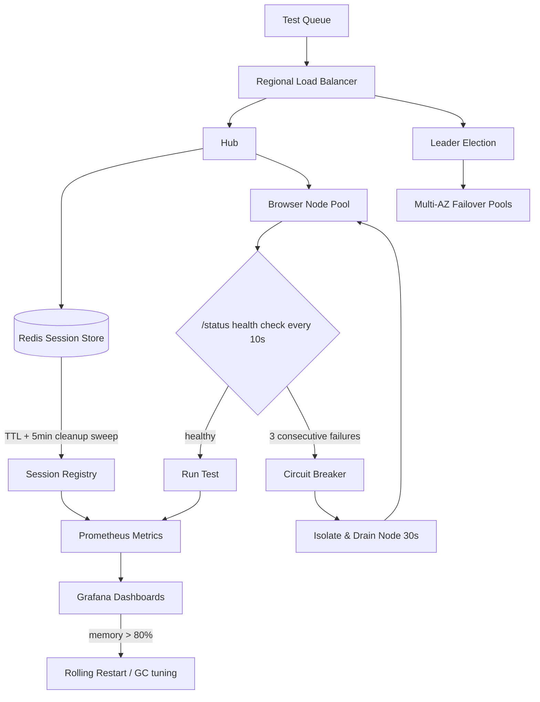

| Difficulty | Channel | Tags |
|---|---|---|
| advanced | system-design | selenium, webdriver, grid |

Picture this: it's 4 p.m. on release day and your 9,000-test UI suite has been grinding for four hours. Executors are hung, browser processes are eating RAM like it's free, and the one test you actually changed is buried somewhere in the queue. Expedia Group lived this nightmare — and the fix they built let them run 150,000 tests a day on roughly 4,500 on-demand nodes for about $80,000 a year [1]. This article is the story of that architecture: how to design a Selenium Grid that handles 10,000 concurrent sessions with 99.9% uptime and zero memory leaks — and how you can steal the blueprint starting today.

---

> ### Real-World Case — Expedia Group
>
> Expedia Group's UI automation was choking their releases: ~9,000 UI tests ran across 350+ Jenkins jobs on raw executors, taking hours with stale browsers hanging executors and no real concurrency. They needed an elastic test grid capable of running thousands of tests concurrently with fast feedback for dozens of microservice teams.
>
> | | |
> |---|---|
> | **Challenge** | How to scale Selenium Grid to handle thousands of concurrent sessions, eliminate stale-browser/memory-leak problems from long-running nodes, keep the grid available 24/7, and avoid the astronomical cost of commercial cross-browser vendors while still providing per-team, per-CI-pipeline grids. |
> | **Solution** | They built SeleniumGridScaler (Selenium Grid plus the AWS EC2 API): auto-scaling hubs that provision browser nodes on demand based on declared test count, terminate idle nodes, and use per-second billing so you only pay while tests actually run. Later they migrated to DA-Kube (EKS + Docker + Helm + Traefik) with one browser per Pod (Guaranteed QoS), on-demand ephemeral grids per pipeline, and Traefik ingress in place of manual hub lifecycle. |
> | **Outcome** | 90+ (later 100+) hubs running 150,000 tests daily, ~4,500 EC2/K8s nodes created, used, and destroyed per day on demand; test runs bound by the longest single test instead of infra limits; and a cost of ~$80,000/year versus a quoted ~$2.41M for 1,000 parallel connections from a third-party vendor. |
> | **Lesson** | Treat browser nodes as disposable, auto-scaled infrastructure: elasticity (create nodes per run, destroy on idle) plus strong session/node lifecycle management (one browser per pod, cleanup on termination) eliminates memory leaks, keeps cost pay-per-use, and is the cheapest way to reach true concurrency at scale. |

---

## Hook — The Interview Question That Feels Like a Dare

Some interview questions feel like hazing. 'Design a Selenium Grid for 10,000 concurrent test sessions, 99.9% uptime, zero memory leaks, across multiple data centers' reads less like a system design prompt and more like a dare. But here's the plot twist: this isn't a fantasy workload — it's Tuesday afternoon for a company like Expedia Group, whose UI suites routinely push 150,000 tests per day [1]. So before panicking about the scale, consider this: the hard part isn't the 10,000 sessions. The hard part is keeping them from leaking, dying, and taking your release pipeline down with them. Ever watched a flaky test eat a Friday afternoon? Then you already know the stakes.

## Problem — Why UI Test Suites Scale So Painfully

Here's the problem nobody puts in the job posting: UI test suites scale painfully. A naive setup — raw CI executors, a handful of Selenium nodes, everyone sharing one hub — hits a wall fast. 'But wait,' you might say, 'I can just throw more machines at it.' That's exactly what Expedia Group initially did, and the results were brutal: roughly 9,000 UI tests scattered across 350+ Jenkins jobs, with stale browsers hanging executors and zero real concurrency [1]. Every hour added to test runtime is an hour your developers sit idle, context-switching, waiting for feedback that should have arrived in minutes. Consequently, the real stakes are developer throughput and release velocity — and memory leaks make everything worse. A leaked browser session doesn't just fail one test; it drags down an entire node, consuming RAM until Kubernetes steps in or the node keels over. Therefore, before you can talk about 99.9% uptime, you have to solve lifecycle: sessions that start, finish, and clean up after themselves — automatically, every single time.

## Real-World Case — Expedia Group

Let's look at the case that introduced this entire design. Expedia Group's UI automation was literally choking their releases. Around 9,000 UI tests ran across 350+ Jenkins jobs on raw executors, taking hours to complete, with stale browsers hanging executors and no real parallelism [1]. The company needed an elastic test grid that could run thousands of tests concurrently and give dozens of microservice teams fast, reliable feedback. So they built a distributed automation platform powered by Selenium hubs — eventually scaling to 90+, then 100+, hubs running 150,000 tests daily. Their infrastructure spun up about 4,500 EC2/Kubernetes nodes per day on demand — created, used, and destroyed on request. Test runtime became bounded by the longest single test rather than by infrastructure limits. And the financials tell the real story: roughly $80,000 per year, against a third-party quote of about $2.41 million just for 1,000 parallel connections [1]. That's a 30x multiplier difference, driven almost entirely by elastic, on-demand capacity instead of pre-provisioned idle machines. The lesson? Elasticity — and the discipline to clean up after yourself — isn't a nice-to-have. It's the entire business case.

## Deep Dive — Hubs, Redis, Circuit Breakers, and the Memory Math

Building on that lesson, the core architecture is a hub-node pattern — but a hardened, elastic version of it. Central hubs manage browser nodes running as Kubernetes StatefulSets spread across multiple availability zones [6]. That gives you stateful browser containers — each with its own identity — orchestrated by a control plane that can restart, evacuate, and replace them.

Specifically, session management lives in Redis. Every test session is a key with a TTL-based expiration policy [4], connection pooling on top, and a sidecar that sweeps stale or orphaned sessions. This is your memory-leak insurance policy: even if a test process dies mid-run, the TTL plus the cleanup sidecar reclaims the session automatically. There is no such thing as a zombie session in this design.

Resource allocation is where the math matters. Each node pod gets a hard ceiling — say 1 CPU and 2GB of RAM — enforced by Kubernetes resource limits, and the cluster scales horizontally based on queue depth [3]. For 10,000 sessions at 50 sessions per node, you need at least 200 nodes. At 2GB each, that's 400GB of baseline memory plus a 30% headroom buffer, so roughly 520GB cluster-wide. That overprovisioning isn't waste; it absorbs bursts, garbage collection pressure, and node churn. This is the counterintuitive part: most people assume scaling to 10,000 sessions is a throughput problem. In practice, it's a memory-management problem.

Then there's failure handling — and this is where most homegrown grids die. A poisoned node — one whose browsers are leaking or whose containers are corrupted — can silently monopolize the whole queue. The fix is a circuit breaker [8]: each node exposes an HTTP /status endpoint polled every 10 seconds [2], and after three consecutive failures, the node is removed from rotation and isolated for a 30-second recovery window. Meanwhile, Prometheus scrapes metrics from every node and hub, feeding Grafana dashboards that track memory trends and session durations [5][10]. Memory alerts fire at 80% usage, triggering rolling restarts and garbage collection tuning before a leak becomes an outage. Kubernetes Pod Disruption Budgets guarantee you never drop below 85% of capacity during maintenance [7] — because three nines of uptime means your planned operations can't hurt you either.

## Workflow — Walking a Test Session Through the Grid

Now the workflow — because a resilient grid isn't a pile of components; it's a sequence of decisions executing on a loop. Here is how a test request travels through the system, and why every hop exists:

1. **Submit** — A test runner submits desired capabilities to the regional hub via a load balancer, using weighted round-robin based on node capacity and response time.
2. **Register** — The hub records the session in Redis with a TTL, then hands off to an available browser node from the pool.
3. **Execute** — The node runs the test while the cleanup sidecar and Prometheus watch memory, session duration, and queue depth (the diagram below shows this loop).
4. **Health-check** — Nodes expose /status every 10 seconds; three consecutive failures trip the circuit breaker, which drains the node and lets the scheduler re-enqueue pending tests [2].
5. **Sweep** — A cleanup job scans Redis every five minutes, expiring stale keys, while init containers remove leftover Docker volumes on restart [9].
6. **Recover** — If a node or even a whole availability zone dies, leader election prevents split-brain, and canary deployments roll out new node versions with traffic splitting so a bad build never touches the full fleet.

The Mermaid diagram below captures the whole loop at a glance — follow a session from the test queue, through the Redis registry, out to the node pool, and into the monitoring and recovery paths.

## Code Example — A Resilient Session Lifecycle Manager

Enough theory — let's make this concrete. The code below is a minimal session-lifecycle manager for a Selenium Grid client. It captures the three patterns that matter: TTL-backed session registration, a node circuit breaker, and guaranteed teardown. Drop this pattern into any Python test runner and you get 80% of the resilience of the full platform. Then, importantly, wire it into your test runner with a try/finally so release_session always runs — that finally block is the difference between 'occasionally leaks' and 'never leaks.'

## Lessons Learned — What 10,000 Sessions Taught Everyone

The journey from 'throw more executors at it' to 'an elastic fleet that cleans up after itself' comes down to a handful of rules. First, treat session lifecycle as a first-class citizen: the TTL is a contract — every session starts somewhere, and every session ends somewhere, automatically [4]. Second, monitor memory, not just pass/fail — the leak that kills your grid never shows up as a red test bar; it shows up as a memory trend line [5]. Third, make failure cheap: circuit breakers and health checks mean a bad node costs you 30 seconds, not a 40-minute retry loop. Fourth — and here's the battle scar — don't provision for peak. Expedia's $80K versus $2.41M gap exists precisely because idle capacity is the most expensive capacity you will ever own [1]. Elastic scaling based on queue depth means you pay for what you run, not what you might run. Finally, rehearse the failure, not just the happy path: canary deployments, Pod Disruption Budgets [7], and leader election exist because the worst day happens after you ship, not before.

---

## Session Lifecycle and Node Recovery Flow

<strong>Original Interview Question</strong>

**Q:** Design a scalable Selenium Grid architecture to handle 10,000 concurrent test sessions with 99.9% uptime, ensuring zero memory leaks through automatic session lifecycle management, real-time monitoring, and graceful node failure recovery across multiple data centers?

**A:** Deploy Kubernetes cluster with auto-scaling node pools, Redis session store with TTL policies, Prometheus metrics for memory monitoring, circuit breakers for node isolation, and sidecar containers for session cleanup. Implement health checks, resource quotas, and rolling updates.

## Conclusion

This is where the story loops back to the beginning. Expedia Group didn't win by buying more hardware — they won by making their test grid elastic, observable, and self-healing, cutting feedback from hours to 'bounded by the longest single test' while spending roughly $80K instead of $2.4M [1]. So what should you do tomorrow? Start small: give your test sessions a TTL, wire up /status health checks with a circuit breaker, and put memory trends on a dashboard. You don't need 10,000 sessions to adopt this architecture — you just need to stop treating your test grid like a herd of pet servers. Solve the lifecycle, and the scale takes care of itself. The one insight to share with your team? Elasticity with disciplined cleanup beats raw horsepower every single time.

---

## References

1. [Expedia Group incident report](https://medium.com/expedia-group-tech/distributed-automation-how-to-run-1000-ui-automation-tests-in-5mins-cf9a84ca32d1) — article
2. [Selenium Grid documentation](https://www.selenium.dev/documentation/grid/) — documentation
3. [Kubernetes Horizontal Pod Autoscaler](https://kubernetes.io/docs/tasks/run-application/horizontal-pod-autoscale/) — documentation
4. [Redis EXPIRE command](https://redis.io/docs/latest/commands/expire/) — documentation
5. [Prometheus overview](https://prometheus.io/docs/introduction/overview/) — documentation
6. [Kubernetes StatefulSets](https://kubernetes.io/docs/concepts/workloads/controllers/statefulset/) — documentation
7. [Kubernetes Pod Disruption Budgets](https://kubernetes.io/docs/tasks/run-application/configure-pdb/) — documentation
8. [Circuit breaker design pattern](https://en.wikipedia.org/wiki/Circuit_breaker_design_pattern) — documentation
9. [Kubernetes Init Containers](https://kubernetes.io/docs/concepts/workloads/pods/init-containers/) — documentation
10. [Grafana documentation](https://grafana.com/docs/) — documentation

---

**Author:** Satishkumar Dhule — [GitHub](https://github.com/satishkumar-dhule) · [LinkedIn](https://linkedin.com/in/satishkumar-dhule) · [Website](https://satishkumar-dhule.github.io)
