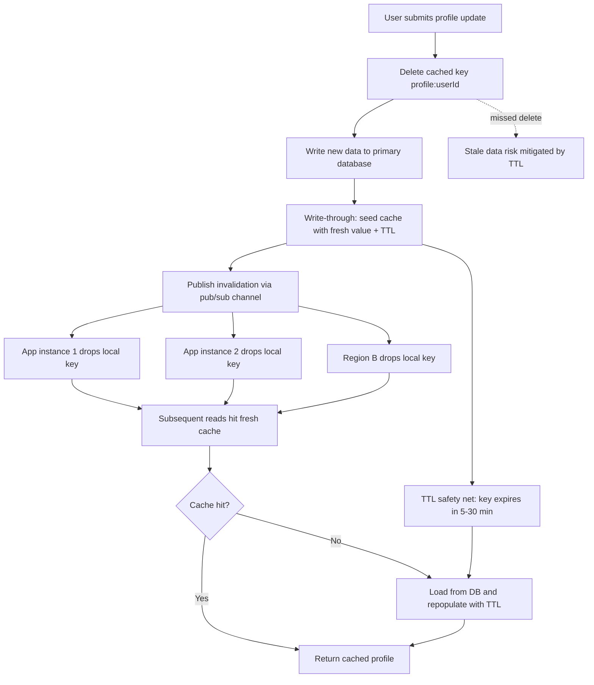

| Difficulty | Channel | Tags |
|---|---|---|
| beginner | backend | redis, memcached, cache-invalidation |

A user changes their name from 'Jason' to 'Monkey' — and half the world still calls them Jason. That's exactly what happened at Facebook, where a delete request routed to the wrong data center left Virginia serving stale profiles while California moved on, creating two permanently divergent versions of reality across thousands of Memcached servers [1]. The incident wasn't a one-off glitch; it exposed a fundamental tension in distributed caching that every backend developer eventually faces: how do you keep caches honest when your data lives everywhere? Understanding Facebook's battle with cache invalidation isn't trivia — it's a survival guide for anyone building a user profile service today.

---

> ### Real-World Case — Facebook
>
> When a user updated their profile (e.g., changing their first name), Facebook had to invalidate stale copies across thousands of memcached servers spread over multiple frontend clusters and geographically separated data centers. A classic failure mode: a user changed their name from 'Jason' to 'Monkey', but the Virginia cache tier kept serving the old value because the delete only landed in California — leaving the two regions permanently showing different names.
>
> | | |
> |---|---|
> | **Challenge** | Keeping a distributed Memcached cache consistent with the MySQL source of truth at massive scale (billions of reads/second, trillions of items, 1B+ users) while avoiding stale profile data, thundering-herd 'stale sets' repopulating the cache with old values, and unbounded packet overhead from naive invalidation broadcasts. |
> | **Solution** | Facebook deliberately chose delete-on-write invalidation over write-through: update MySQL first, then DELETE the key (deletes are idempotent and safe even if the cache evicts data). They built the mcsqueal invalidation pipeline, which tails MySQL commit logs and broadcasts batched deletes through mcrouter, plus 'leases' — a token issued on cache miss that is revoked by a concurrent delete so stale values cannot be written back. For cross-data-center consistency they appended memcache keys to SQL statements and hijacked the MySQL replication stream so secondary regions invalidated their caches when replication caught up. |
> | **Outcome** | Scaled to billions of requests per second holding trillions of items; leases cut stale sets from 6% to 0.3% without hurting hit rate, while peak database query rate during those episodes dropped to 1.3K/s; commit-log-driven invalidation produced ~18x fewer packets than naive web-server broadcast approaches, and the system avoided the former failure mode where a misrouted delete required a rolling restart of the entire Memcache infrastructure. |
> | **Lesson** | The biggest social network in the world rejected pure write-through caching: delete-on-write with database-driven invalidation is safer because deletes are idempotent and the cache is never authoritative. Redis-style pub/sub isn't required — the database's own commit/replication log is the most reliable invalidation bus, and TTLs remain the backstop for missed invalidations. |

---

## References

From Facebook's geographically split 'Jason' and 'Monkey' [1] to the everyday write-through pattern in your profile service, the journey circles back to one truth: caches fail silently, and staleness is a distributed coordination problem, not a syntax problem. The write-through-plus-TTL workflow gives you correctness with a safety net; Redis's pub/sub [3] or a custom bus handles cross-node propagation; and Memcached's lean design [4] still shines when you own the coordination layer yourself. Take one action today: add a TTL to every profile key and verify your update path publishes invalidations everywhere data lives. That single habit stands between your users and two versions of the truth.

---

## Profile Cache Invalidation Flow

<strong>Original Interview Question</strong>

**Q:** You're building a user profile service that caches frequently accessed profiles. How would you implement cache invalidation when a user updates their profile, and what trade-offs would you consider between Redis and Memcached?

**A:** Implement write-through caching with TTL-based expiration. On profile update, invalidate the cache by deleting the key and writing new data to both the database and cache. Redis offers pub/sub for automatic distributed invalidation, while Memcached requires manual coordination across nodes.

## Conclusion

Facebook's 'Jason vs Monkey' split-brain incident [1] proves that cache invalidation is a distributed coordination problem, not a one-line delete. The journey from that failure to your profile service yields three actions: invalidate before writing, publish cross-node invalidations (Redis pub/sub [3] or an equivalent), and always attach a TTL so missed messages self-heal. Audit your write paths today, add hit-rate and invalidation-lag dashboards, and choose Redis vs Memcached based on who owns coordination — not hype. The one insight to share with your team: a DELETE is only a protocol wearing a one-line disguise; treat it like distributed systems and your users will never see two versions of themselves.

---

## References

1. [Facebook incident report](https://www.usenix.org/system/files/conference/nsdi13/nsdi13-final170.pdf) — article
2. [CAP theorem — Wikipedia](https://en.wikipedia.org/wiki/CAP_theorem) — documentation
3. [Redis Pub/Sub documentation](https://redis.io/docs/latest/develop/interact/pubsub/) — documentation
4. [Memcached — Wikipedia](https://en.wikipedia.org/wiki/Memcached) — documentation
5. [Redis — Wikipedia](https://en.wikipedia.org/wiki/Redis) — documentation
6. [Redis Cluster specification](https://redis.io/docs/latest/operate/oss_and_stack/management/scaling/) — documentation
7. [Caching strategies and tips — AWS ElastiCache](https://docs.aws.amazon.com/AmazonElastiCache/latest/dg/Strategies.html) — documentation
8. [Cache invalidation — Wikipedia](https://en.wikipedia.org/wiki/Cache_invalidation) — documentation

---

**Author:** Satishkumar Dhule — [GitHub](https://github.com/satishkumar-dhule) · [LinkedIn](https://linkedin.com/in/satishkumar-dhule) · [Website](https://satishkumar-dhule.github.io)
