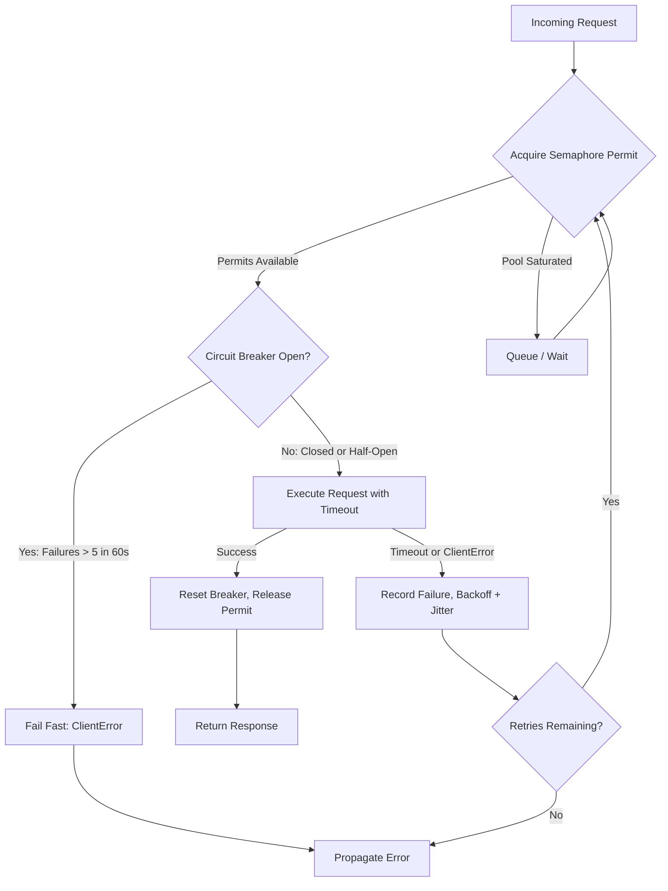

| Difficulty | Channel | Tags |
|---|---|---|
| advanced | backend | asyncio, aiohttp, concurrency |

At peak scale, Netflix's API platform discovered a brutal truth: when one slow downstream dependency started failing, the instinct to enlarge thread pools, queues, and timeouts to give the system 'breathing room' backfired spectacularly — holding roughly 2,000 connections open against an already-struggling backend and amplifying the very outage engineers were trying to contain [1]. That cascade is the nightmare every backend developer eventually faces. The fix is not more capacity; it is smarter capacity — and that is exactly what a graceful-degradation connection pool manager for aiohttp delivers.

---

> ### Real-World Case — Netflix
>
> Netflix's API platform suffered cascading failures when a single slow downstream dependency caused timeouts across the cluster. Engineers' instinctive reaction was to enlarge thread pools, queues, and timeouts to give the system 'breathing room,' which backfired by holding ~2000 connections open against the already-struggling backend and amplifying the outage.
>
> | | |
> |---|---|
> | **Challenge** | One latent dependency could exhaust shared connection/thread resources and cascade into a platform-wide streaming outage; they needed bulkhead-style concurrency limits, timeout enforcement, and circuit breakers to fail fast and let dependencies recover. |
> | **Solution** | Netflix built and rolled out Hystrix: semaphore and thread-pool isolation to cap concurrent calls per dependency, circuit breakers that short-circuit on error/latency thresholds with a half-open probe window, plus aggressive timeouts and fallbacks — the same primitives (semaphore limiting, circuit breaking, timeout-driven fail-fast) as the aiohttp pool manager pattern. |
> | **Outcome** | Operating at massive scale: 100+ Hystrix command types, 40+ thread pools per instance, 10+ billion thread-isolated and 200+ billion semaphore-isolated command executions per day; during a real incident, trip-outs confined the blast radius so only ~1/3 of the cluster opened the circuit while other circuits stayed healthy instead of cascading. |
> | **Lesson** | Adding more connection-pool capacity during a dependency outage makes it worse — fail fast, isolate bulkheads, and trip the circuit to 'release pressure' so the downstream can recover; static thresholds eventually gave way to adaptive concurrency control. |

---

## Hook — The 3am Pager Nobody Wants

Picture this: your deploy looked fine. Dashboards were green. Then one downstream service started taking 8 seconds instead of 80 milliseconds — and suddenly your async workers are piling up like cars in a tunnel. Queue depth climbs. Timeouts fire. Retries amplify the load. The service you were trying to protect is now getting hammered harder than before. Sound familiar? Many developers reach for the obvious levers first: bump max_connections, raise timeouts, add more retries. It feels like giving the system 'breathing room.' But as Netflix's platform engineers discovered when a single slow dependency threatened their entire cluster, those levers can turn a contained failure into a full-blown outage [1]. The real skill is not surviving load — it is failing gracefully under it. And that journey starts with understanding why connection pools are where most distributed systems quietly go to die.

## Problem — Why Naive Connection Management Breaks Under Pressure

At its core, the problem is a mismatch between optimism and reality. aiohttp gives you a powerful async HTTP client, but by default it will happily open as many connections as your application code requests [3]. Under normal traffic, that feels liberating. Under a dependency slowdown, it becomes a weapon pointed at your own infrastructure. Here is what actually happens when a downstream service degrades: requests take longer to complete, each in-flight connection is held open for the duration of the timeout, and because asyncio is cooperative rather than preemptive, slow coroutines accumulate while your event loop keeps accepting new work [2]. Consequently, memory grows, the ClientSession's connector saturates, and new requests queue behind stale ones. Retries without backoff compound the damage — if 1,000 clients all retry after the same fixed delay, you create a thundering herd that the struggling backend cannot absorb [5]. The stakes are concrete: connection leaks during error paths, missing SSL validation, timeouts set to a single blanket value instead of layered per-phase limits, and no cleanup on shutdown. Every one of those mistakes converts a partial failure into a total one. The uncomfortable question is: what should your system do when the backend is already drowning — queue up more requests, or deliberately shed them?

## Real-World Case — Netflix and the Art of Contained Failure

Netflix's API platform is a useful case study because the failure mode is painfully relatable [1]. When a downstream dependency slowed, the instinctive engineering response was to enlarge thread pools, queues, and timeouts. At massive scale — 100+ Hystrix command types, 40+ thread pools per instance, more than 10 billion thread-isolated and over 200 billion semaphore-isolated command executions per day — those 'breathing room' changes meant roughly 2,000 connections held open against an already-struggling backend, amplifying the outage instead of containing it [1]. The turning point was architectural, not operational: circuit breakers. During real incidents, tripped circuits confined the blast radius so that only about one-third of the cluster opened a circuit while the rest stayed healthy, stopping the cascade before it could propagate across services [1]. The lesson generalizes far beyond Netflix: more capacity is not resilience. Resilience is knowing when to stop asking. If you build nothing else into your pool manager this quarter, build the ability to say 'not right now' — because a fast failure that returns an error in 10 milliseconds beats a slow failure that ties up your event loop for 30 seconds.

## Deep Dive — Semaphore, Backoff, and Circuit Breaker as One System

Building on Netflix's lesson, a production-grade aiohttp pool manager combines three mechanisms that work together rather than in isolation. First, a Semaphore limits concurrent in-flight requests to a fixed budget [2]. Unlike a raw connection limit, the semaphore also bounds retry attempts, because retries reacquire the same permit. Second, exponential backoff with jitter spaces out retries so that recovering services are not immediately re-stomped [5]; the AWS Builders Library documents this pattern in detail — fixed delays synchronize clients, while jitter decorrelates them. Third, a circuit breaker short-circuits requests when failure rates cross a threshold, failing fast instead of queueing doomed work [4]. However, the interesting trade-offs only appear when these pieces interact. A tight semaphore protects the backend but increases your own client-side latency — so queue depth must be bounded or you simply move the bottleneck. Aggressive circuit breaking improves tail latency but risks false positives during transient blips, so half-open probing states matter. And health checks plus connection keep-alive reduce TCP and TLS handshake overhead [7], but stale connections must be pruned or they fail on first use after an idle period. The naive mental model treats these as independent knobs; the mature model treats them as a feedback loop where load shedding, retry policy, and failure detection constantly adjust what the other two are allowed to do. So how do you wire that loop up in practice?

## Workflow — From Request to Response (or Controlled Refusal)

The request lifecycle follows a deliberate sequence, visualized below in the Mermaid diagram: acquire the semaphore permit, consult the circuit breaker, attempt the request under layered timeouts, then record success or failure back into the breaker's state. Every branch exists to answer one question: should this request consume resources right now? Step 1 — Acquire: the coroutine waits on the semaphore; if the pool is saturated, it queues rather than opening unbounded connections. Step 2 — Guard: the circuit breaker checks recent failure history; when failures exceed five within a 60-second window, it refuses fast with a ClientError instead of adding load [4]. Step 3 — Execute: the request runs with a total timeout envelope so a hung TCP connect cannot pin a permit forever [3]. Step 4 — Record: success resets the breaker; timeout or ClientError increments the failure counter and timestamps it [5]. Step 5 — Release: the semaphore permit returns to the pool regardless of outcome, which is precisely where naive implementations leak. The diagram below shows how a request flows through those gates and what happens when each one closes. The remaining piece is making that lifecycle concrete in code — where most of the subtle bugs live.

## Code Example — A Pool Manager That Fails Fast and Recovers Cleanly

The implementation below wires the semaphore, circuit breaker, layered timeouts, and backoff into a single manager you can drop into an aiohttp service. Walk through it slowly: the constructor fixes the concurrency budget and breaker thresholds up front; make_request acquires the permit, consults the breaker, and executes under a total timeout; failure paths record state and release the permit through the async context manager so exceptions cannot leak connections. The retry helper adds exponential backoff with jitter between attempts, and close() drains the session cleanly on shutdown — the cleanup step teams most often skip until 2am.

## Lessons Learned — What to Take Into Your Next Incident Review

The journey from Netflix's amplified outage to a well-behaved pool manager comes down to a handful of durable principles. First: capacity without circuit breaking is just a slower way to fail — shed load before the downstream collapses [1]. Second: layer your timeouts (connect, sock-read, total) rather than relying on one blanket value [3]; a 5-second connect timeout and a 30-second total budget catch different failure modes. Third: retries need jitter, because synchronized clients create thundering herds that fixed delays cannot prevent [5]. Fourth: track permits and sessions symmetrically — every acquire must have a release, including on exception paths, or connection leaks will accumulate silently [6]. Fifth: test the breaker, not just the happy path; deliberately inject 500s and timeouts in staging and confirm the circuit opens and half-opens as designed. Tomorrow, pick one downstream dependency, instrument its failure rate, and put a circuit breaker in front of it — the next time that service hiccups, your blast radius shrinks to a third of the cluster instead of spreading across all of it. The single insight worth sharing with your team: the most resilient systems are not the ones that never fail, but the ones that choose when to stop trying.

---

## Request Flow Through Semaphore, Circuit Breaker, and Retry Loop

<strong>Original Interview Question</strong>

**Q:** How would you implement a connection pool manager for aiohttp that handles graceful degradation under high load and connection timeouts?

**A:** Implement a connection pool manager for aiohttp using a semaphore to limit concurrent connections, exponential backoff for retrying failed requests, and circuit breaker pattern to gracefully degrade under high load and connection timeouts.

## Conclusion

Netflix's cascade did not happen because the platform lacked capacity — it happened because every safety instinct (bigger pools, longer timeouts) pointed the wrong direction [1]. The journey from that outage to a graceful aiohttp pool manager is the same journey every backend team eventually takes: from optimistic connection handling to deliberate load shedding with semaphores, jittered retries, and circuit breakers. Tomorrow, audit one critical downstream path for three things: a bounded concurrency limit, layered timeouts, and a breaker that can say 'not now.' Do that, and the next slow dependency becomes a contained blip instead of a 3am page — because the most resilient system is not the one that never fails, but the one that chooses when to stop trying.

---

## References

1. [Netflix incident report — Hystrix Operations wiki](https://github.com/Netflix/Hystrix/wiki/Operations) — article
2. [Python asyncio synchronization primitives (Semaphore)](https://docs.python.org/3/library/asyncio-sync.html) — documentation
3. [aiohttp Client documentation](https://docs.aiohttp.org/en/stable/) — documentation
4. [Circuit breaker pattern](https://en.wikipedia.org/wiki/Circuit_breaker_pattern) — article
5. [AWS Builders Library — Timeouts, retries, and backoff with jitter](https://aws.amazon.com/builders-library/timeouts-retries-and-backoff-with-jitter/) — documentation
6. [aio-libs/aiohttp GitHub repository](https://github.com/aio-libs/aiohttp) — documentation
7. [RFC 9112 — HTTP/1.1 (persistent connections / keep-alive)](https://datatracker.ietf.org/doc/html/rfc9112) — documentation
8. [DigitalOcean — How To Use Asyncio in Python](https://www.digitalocean.com/community/tutorials/how-to-use-asyncio-in-python) — blog

---

**Author:** Satishkumar Dhule — [GitHub](https://github.com/satishkumar-dhule) · [LinkedIn](https://linkedin.com/in/satishkumar-dhule) · [Website](https://satishkumar-dhule.github.io)
