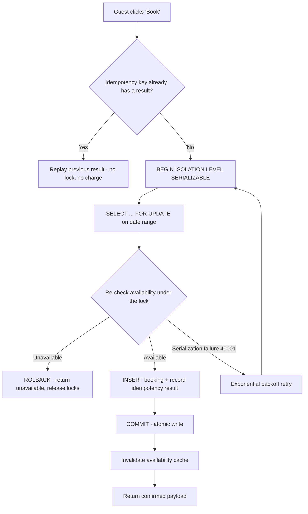

| Difficulty | Channel | Tags |
|---|---|---|
| intermediate | database | acid, isolation-levels, mvcc |

It is 2:47 AM, and a guest with shaky Wi-Fi has just smashed the “Book” button a second time because the spinner would not move. On Airbnb's side, two almost-identical requests race across a distributed payments system, both pass the availability check, and both charge the same card [1]. That is the exact double-payment nightmare Airbnb engineers documented and eliminated with idempotency keys and row-level locking. What sounds like a mundane database nuance is really a battle against race conditions that cost marketplace every night a property sits double-booked — and every guest discovers a mystery charge.

---

> ### Real-World Case — Airbnb
>
> Airbnb processes millions of financial transactions across a distributed, microservices-based payments architecture. Two everyday events—a user double-clicking the "Book" button and clients aggressively retrying after network timeouts—could fire identical requests that land on multiple service instances and produce duplicate charges or double bookings that harm both guests and hosts.
>
> | | |
> |---|---|
> | **Challenge** | Guarantee that every write, such as a reservation payment or refund, executes exactly once even when the same request is delivered multiple times or concurrently. The naive approach (dedupe in memory or by response caching) breaks the moment a retry races the original in-flight request, so Airbnb needed an application-level, strongly consistent guard that survives across shards and service boundaries. |
> | **Solution** | Airbnb built "Orpheus," a general-purpose idempotency framework. Every API call carries an idempotency key; before proceeding, the request acquires a database row-level lock on that key in the sharded MySQL master, granting it a lease (permission to proceed) that blocks duplicate concurrent attempts. The idempotency record read/write and application commits are combined into a single database transaction, and idempotency tables are sharded by key—keys have high cardinality and even distribution, making them effective shard keys. Retryable vs non-retryable exceptions are also classified so only safe retries can re-fire. |
> | **Outcome** | Row-level locking on idempotency keys eliminated the race where two identical "Book" requests both passed the availability check and both charged the guest. Airbnb reports this consistency has held across the entire payments platform since launch: idempotency is now enforced on all payment endpoints, so a retried or double-fired request returns the prior result instead of charging twice, with no double-commit risk even as shards were added for scale. |
> | **Lesson** | Double-booking prevention is not just a database isolation problem—in a distributed system you must make the business operation itself idempotent via a stable key, and turn the key into a concurrency primitive by taking a row-level lock on it before doing any work. Combining the idempotency record and the application writes into one commit guarantees the check and the write are atomic, and sharding by the key keeps the single hot path from becoming a bottleneck. |

---

## Hook — The Two Pixels That Almost Charged Twice

Picture the moment every marketplace developer dreads: a guest double-clicks the “Book” button, or a mobile client silently retries after a network timeout. Two identical requests land on different service instances. Both pass the availability check — because neither has committed yet — and both charge the guest [1]. Meanwhile, the host’s calendar shows one booking while the payments ledger shows two. The stakes are brutally simple: one duplicate charge means a chargeback and a support ticket, and one double-booked night means a host arriving at an already-occupied property. This is not a theoretical corner case; it is a daily reality for any system with a button and a network. The fix that saved the night is a combination of database techniques you already know the names of — but probably have never wired together properly.

## Problem — The Invisible Race Condition in Every Booking Flow

At its core, this is a classic race condition wearing a harmless disguise: two nearly simultaneous transactions read “available,” both write a booking, and both commit. Here is the subtle part most developers miss: under a default READ COMMITTED isolation level, each statement reads a fresh snapshot, so two transactions checking availability before either one commits can each perfectly reasonably conclude the property is free [2]. Then both insert rows. The calendar now has two tenants for one night, and no single query “lied” to either transaction. What makes this especially treacherous is that modern booking flows actively manufacture collisions. Double-click handlers, retry storms after timeouts, and load-balanced workers with no idea a sibling retried the same request [1] all multiply one human intent into many duplicate writes. Sound familiar? If you have ever stared at a duplicate webhook or a twice-fired webhook handler at 2 AM, you know exactly how this feels. The hard question is not “how do I detect a duplicate after the damage,” but “how do I make the second identical request return the first one’s result before touching any data?”

## Real-World Case — Airbnb’s War on Double Payments

Airbnb runs a distributed, microservices-based payments architecture that processes millions of financial transactions — which is a very polite way of saying there are millions of chances every day for a duplicate charge. Their engineers documented the exact failure you can probably reproduce in your sleep: a user double-clicking “Book,” or a client aggressively retrying after a network timeout, fires identical requests that land on multiple service instances and produce duplicate charges or double bookings that harm both guests and hosts [1]. Here is the part that reads like a plot twist: they did not try to stop the duplicate requests. You cannot — users will always double-click, and clients will always retry. Instead, Airbnb enforced idempotency on every payment endpoint, using randomly generated idempotency keys. Row-level locking on those keys eliminated the race where two identical requests both passed the availability check and both charged the guest. The result? A retried or double-fired request now returns the prior result instead of charging twice, with no double-commit risk — even as shards were added for scale. Consistency held across the entire payments platform since launch [1]. The lesson is counterintuitive: you cannot prevent every duplicate; you can only make duplicates harmless.

## Deep Dive — SERIALIZABLE, MVCC, and the Locking Tango

Building on that insight, the real engineering question becomes: how do you make concurrent transactions behave as if they ran back-to-back? The heavy artillery is SERIALIZABLE isolation, which guarantees that a set of overlapping transactions produces the same outcome as if they ran one after another [2]. But SERIALIZABLE has a reputation for being slow, and that reputation is mostly deserved — unless you understand why it is slow. Postgres implements MVCC [4]: every transaction sees a consistent snapshot and writes new row versions rather than mutating in place [5]. That is what lets readers never block writers. However, true serializability requires detecting when two snapshots later collide, and Postgres does this via predicate locks, which trigger serialization failures — and those failures are your friend, not your panic button. Meanwhile, row locks give you a pessimistic alternative that many platforms prefer [3]: SELECT ... FOR UPDATE grabs and holds the rows for a date range, so the second transaction literally cannot read them until the first commits. Most production booking systems end up with a pragmatic blend: optimistic checks (MVCC snapshots) for read-only availability browsing, and pessimistic row locks for the final, money-on-the-line booking write. You might think the answer is “just turn up the isolation level” — but the plot twist is that SERIALIZABLE alone does not stop a user from double-firing; idempotency stops the duplicate; locks prevent the race; and retries with backoff absorb the collisions that remain [9]. Each layer solves a different enemy.

## Workflow — The Booking Path From Click to Commit

With those layers in hand, the booking flow starts to look less like a rabbit hole and more like a pipeline with checkpoints. First, generate an idempotency key the moment the “Book” button is pressed — this is your fingerprint that survives retries [1]. Second, before doing any expensive work, check whether that key already has a result; if it does, replay the original result and walk away. Third, open a SERIALIZABLE transaction and take row-level locks (SELECT ... FOR UPDATE) on the exact date range being booked, so concurrent writers queue instead of collide [3]. Fourth, re-check availability under the lock — this second check is what catches the ghost booking. Fifth, insert the booking and the idempotency result atomically, then commit. Finally, invalidate any cached availability so subsequent reads see the truth. The diagram below maps the complete journey, including the retry path when serialization failures strike.

## Workflow — Step-by-Step Process (The Booking Pipeline)

Here is what the flow looks like, step by step, with the Mermaid diagram referenced inline below:

1. **Guard**: A Book request arrives with its idempotency key. If that key already has a stored result, replay it instantly — no lock, no charge, no write. This single gate is what Airbnb credits with killing the double-payment race [1].
2. **Lock**: Open a SERIALIZABLE transaction and lock the requested date range with SELECT ... FOR UPDATE, so any concurrent writer for the same nights blocks until you commit or roll back [3].
3. **Verify**: Re-check availability under the lock. Because you hold the rows, a conflicting booking committed before you would now be visible — this is where the second transaction loses the race.
4. **Write**: Insert the booking row and the idempotency-key result in the same transaction, then commit. Atomicity here means a partial failure can never leave a charge without a booking, or vice versa.
5. **Refresh**: Invalidate the availability cache tied to that property so the next read reflects the new reality, then return the confirmed payload.
6. **Retry**: If the database raises a serialization failure (SQLSTATE 40001), back off exponentially and retry — the collision was real, and a fresh attempt has a fair shot at winning the lock [9].

The following diagram shows exactly how a duplicate request flows through the system and why it never reaches the database write.

## Code Example — Idempotent Booking in Postgres

Enough theory — here is a production-shaped implementation in Python using psycopg2. It does three things at once: replays duplicate requests via the idempotency key, locks the date range before booking, and retries serialization failures with exponential backoff.

## Lessons Learned — What the Battlefield Taught Us

Finally, step back and ask the “so what?” question, because this journey has a moral. The first lesson is that you cannot stop duplicate requests — so stop trying. Airbnobility showed that idempotency keys plus row-level locking turn a race condition into a non-event: retries replay prior results instead of charging twice [1]. The second lesson is about isolation levels: SERIALIZABLE is not inherently slow — it is slow when your transactions are long or your predicate locks are broad, and it fails loudly by design so you can retry [2][9]. Use MVCC snapshots for reads and reserve pessimistic locks for the money moment [4][5]. Third, think in layers: idempotency handles duplicates, FOR UPDATE handles concurrency, retries handle fairness, and cache invalidation handles freshness — each layer covers a different failure, and missing any one of them reopens the hole [3]. Battle scar to share with your team: the classic mistake is locking the whole property row instead of the date range, which serializes all bookings through one row and tanks throughput for the entire calendar. Lock small, retry smart, and measure lock wait times on hot properties. And if this all feels overwhelming — you are not alone. Every developer who has shipped a booking, payment, or seat-reservation flow has paid this tuition. Start with the idempotency key; it is the highest-leverage line of code you will add this quarter.

---

## Booking Flow

<strong>Original Interview Question</strong>

**Q:** You're building a booking system for Airbnb where multiple users can reserve the same property simultaneously. How would you design the transaction handling to prevent double bookings while maintaining high availability?

**A:** Use SERIALIZABLE isolation with optimistic concurrency control. Implement row-level locks on property availability tables, use MVCC snapshot reads for checking availability, and apply application-level validation to ensure atomic booking operations.

## Conclusion

The next time someone on your team says “we can just add retries” for a booking or payment flow, remember the guest smashing the Book button at 2:47 AM — and the two requests racing toward two charges. Start with one idempotency key on the money endpoint; then layer SERIALIZABLE transactions with date-range locks and exponential backoff. You cannot stop duplication or concurrency, but you can make both harmless. The memorable insight to take to your whiteboard: idempotency makes duplicates irrelevant, locks make contracts fair, and retries make the whole system resilient — and one line of code checking a key is worth a thousand lines of duplicate detection.

---

## References

1. [Airbnb incident report](https://medium.com/airbnb-engineering/avoiding-double-payments-in-a-distributed-payments-system-2981f6b070bb) — blog
2. [PostgreSQL Transaction Isolation](https://www.postgresql.org/docs/current/transaction-iso.html) — documentation
3. [PostgreSQL Explicit Locking](https://www.postgresql.org/docs/current/explicit-locking.html) — documentation
4. [PostgreSQL Multi-Version Concurrency Control (MVCC)](https://www.postgresql.org/docs/current/mvcc.html) — documentation
5. [Multiversion concurrency control](https://en.wikipedia.org/wiki/Multiversion_concurrency_control) — documentation
6. [Isolation (database systems)](https://en.wikipedia.org/wiki/Isolation_(database_systems)) — documentation
7. [Optimistic concurrency control](https://en.wikipedia.org/wiki/Optimistic_concurrency_control) — documentation
8. [ACID](https://en.wikipedia.org/wiki/ACID) — documentation
9. [PostgreSQL Error Codes](https://www.postgresql.org/docs/current/errcodes-appendix.html) — documentation

---

**Author:** Satishkumar Dhule — [GitHub](https://github.com/satishkumar-dhule) · [LinkedIn](https://linkedin.com/in/satishkumar-dhule) · [Website](https://satishkumar-dhule.github.io)
