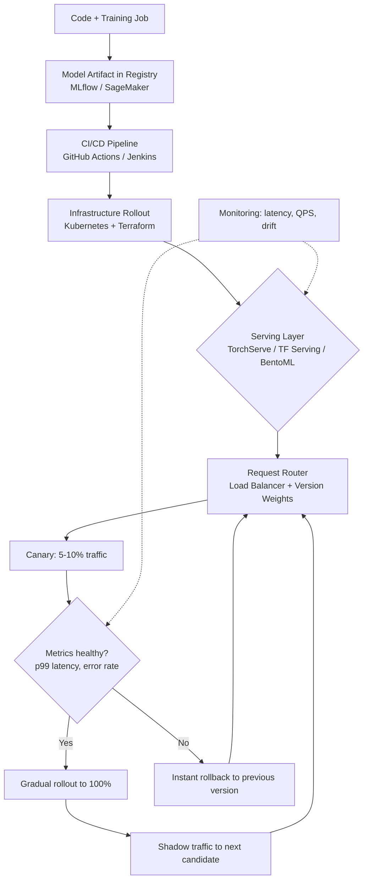

| Difficulty | Channel | Tags |
|---|---|---|
| beginner | devops | mlops, deployment |

Picture a routing layer sitting in front of every model at one of the world's largest streaming platforms — and every single prediction paying a 10-20ms tax to pass through it. Netflix's centralized ML serving platform powers title recommendations and commerce for millions of subscribers, handling over 1 million requests per second across hundreds of model types and versions. To enable rapid iteration and safe releases, they built Switchboard, a centralized routing service that all 30+ client services had to traverse to reach any model [1]. Eventually, they removed it — killing the latency hop and the single point of failure while keeping the traffic-splitting superpowers that made canaries, shadow testing, and instant rollback possible [1]. That tension — between getting a model out the door and actually serving it well — is exactly the confusion this article untangles.

---

> ### Real-World Case — Netflix
>
> Netflix's centralized ML serving platform powers personalized experiences like title recommendations and commerce, handling over 1 million requests per second across hundreds of model types and versions. To enable rapid model iteration and safe releases, they built Switchboard, a centralized routing service that all 30+ service clients had to pass through to reach any model.
>
> | | |
> |---|---|
> | **Challenge** | As the platform scaled, the centralized routing service in the critical request path became a liability: it was a single point of failure (a bug or noisy neighbor could take down all serving), added 10-20ms of latency per request from serialization-deserialization, amplified tail latency for latency-sensitive clients, and obscured visibility into client request origins needed for training data quality — an unacceptable cost for sub-100ms real-time inference SLAs. |
> | **Solution** | Netflix decoupled routing from the serving path in the Lightbulb architecture: a lightweight service now consumes minimal request context and resolves a routingKey + model config, while the actual request routing happens at the Envoy proxy layer using a header-based routingKey that maps to the model cluster VIP. This separated config resolution (a rare, cheap operation) from placement/routing (a hot-path operation), and moved single-tenant isolation into the routing layer. |
> | **Outcome** | The platform handles over 1 million requests per second and 30+ client services while eliminating the 10-20ms Switchboard latency hop and the single-point-of-failure risk, while preserving dynamic traffic splitting for canary deployments, shadow-mode testing, and instant rollback that made rapid model iteration possible. |
> | **Lesson** | The counterintuitive plot twist: centralizing model routing for fast iteration works until it doesn't — a must-pass-through routing service in the hot path trades iteration speed for latency and availability. The fix was separating the model deployment/control plane (config resolution) from the serving data plane (routing), pushing routing decisions into a minimal header consumed by an existing edge proxy (Envoy), proving that a great ML serving architecture keeps the control plane off the request-critical path. |

---

## Hook — The 3AM Question Nobody Trains You For

It was a routine release week. The pipeline was green, the artifacts were signed, the model was "deployed." Then latency alerts fired, and the on-call engineer discovered something uncomfortable: the model was deployed perfectly — and nobody had actually wired it up to serve traffic. Sound familiar? This is the hidden fault line in ML systems: teams conflate "deployment" (getting the model into infrastructure) with "serving" (answering live inference requests under load), and the gap between those two words is where production incidents live. A model can be fully rolled out through CI/CD and still fail every user-facing request because routing, versioning, and cold starts were never designed. The stakes are not theoretical — Netflix's serving platform moves over 1 million requests per second [1], and every ambiguous ownership boundary at that scale becomes an outage waiting to happen. So here is the real question: when your deploy pipeline says "success," what exactly succeeded?

## Problem — Two Words, Two Entire Disciplines

Many developers treat "deployment" and "serving" as synonyms until a postmortem forces the distinction. However, they solve fundamentally different problems, and confusing them produces a specific, painful failure mode: a green pipeline that ships a model nobody can query. Deployment is the supply chain — CI/CD pipelines, infrastructure provisioning, artifact storage, monitoring hooks, and rollback strategy [10]. Serving is the runtime — inference APIs, request routing, model loading, batching, and response optimization under real traffic. The core pain is that these two disciplines have different owners, different SLAs, and different failure modes, yet most interview answers and team charters blur them together. Consider what actually breaks when the boundary is fuzzy: infrastructure teams declare victory after the container schedules successfully, while application teams discover 500 errors only when users show up. Moreover, scaling concerns split along the same line — deployment cares that pods exist; serving cares that p99 latency stays under 100ms while they do. If you have ever stared at a dashboard where everything was "healthy" except inference, you have lived this problem. The question then becomes: what does a mature system look like when you finally separate the two?

## Real-World Case — Netflix's Routing Tax

Netflix offers the clearest public case study of deployment-versus-serving tension at extreme scale. Their centralized ML serving platform powers personalized experiences like title recommendations and commerce, handling over 1 million requests per second across hundreds of model types and versions [1]. To enable rapid model iteration and safe releases, they introduced Switchboard — a centralized routing service that all 30+ service clients had to pass through to reach any model [1]. For a while, it worked: dynamic traffic splitting unlocked canary deployments, shadow-mode testing, and instant rollback. Then the bill came due. Every request paid a 10-20ms latency hop, and a single centralized component became a single point of failure for every model in the company [1]. The impact was concrete: added latency on a path serving seven figures of requests per second, plus concentrated operational risk across 30+ client services [1]. The fix was not "abandon safe releases" — it was redesigning serving so routing intelligence lived without the centralized bottleneck, preserving canaries, shadow mode, and rollback while eliminating the hop [1]. The lesson cuts deeper than architecture: deployment tooling (how models ship) had outgrown serving design (how models answer), and scale exposed the seam. That raises a practical question for any team: which side of this seam does your system actually optimize?

## Deep Dive — Where Deployment Ends and Serving Begins

Building on Netflix's example, it helps to draw the boundary explicitly before comparing technologies. **Deployment** covers infrastructure setup, CI/CD, monitoring, and rollback strategies — the machinery that takes a model artifact from a registry to a running environment. **Serving** covers real-time inference: request routing, model loading, response optimization, and the runtime APIs that turn an HTTP or gRPC call into a prediction [10]. Here is the technology map side by side:

| Concern | Deployment Tooling | Serving Tooling |
|---|---|---|
| Runtime packaging | Docker, Kubernetes, Terraform | TensorFlow Serving [2], TorchServe [3], BentoML [4] |
| Orchestration & rollout | Kubernetes Deployments [5], GitHub Actions, Jenkins | Load balancers (NGINX, Envoy), routing layers |
| Tracking & platform | MLflow [7], SageMaker [8], Vertex AI | FastAPI/Flask/gRPC inference endpoints |
| Scaling lever | Pod replicas, HPA [6], cluster autoscaling | Batching, GPU memory, connection pooling |

Scaling considerations then diverge sharply. Horizontal scaling means pod replicas and container orchestration [5][6]; vertical scaling means GPU memory and CPU allocation. Latency requirements split the workloads: real-time paths typically target sub-100ms, while batch pipelines can tolerate seconds or minutes. A/B testing sits on the serving side — traffic splitting, gradual rollouts, and shadow evaluation — even though the deployment pipeline triggers it. **Plot twist:** many teams over-invest in deployment automation and under-invest in serving design, assuming "if it deploys, it serves." Netflix's experience shows the inverse can be true — serving routing can become the constraint that caps your entire iteration speed [1]. Cold starts are another classic trap: a freshly scheduled pod that must load a multi-gigabyte model can blow a 50ms budget before the first token of input is processed. Clipper research showed that request batching and adaptive routing can cut inference latency dramatically while preserving throughput [9]. So the real trade-off matrix is latency versus throughput, batch versus real-time, and cold-start cost versus resource utilization — and every one of those decisions lives on the serving side of the fence, even when deployment tooling triggers the change. Which raises the next question: how do you sequence the work so neither side sabotages the other?

## Workflow — A Release Path That Respects Both Sides

This leads to a practical workflow that keeps deployment and serving responsibilities crisp. The flow below traces a model from commit to canary to full traffic, marking which tool owns each step:



Step by step: (1) training produces an artifact in a registry such as MLflow [7] or SageMaker [8]; (2) the CI/CD pipeline validates, signs, and packages it — pure deployment territory [10]; (3) infrastructure tools schedule the new version alongside the old one via Kubernetes Deployments [5]; (4) the serving layer loads the model and the router splits traffic; (5) canary metrics gate promotion, and failures trigger instant rollback; (6) shadow mode evaluates the next candidate against live inputs without exposing users to it — the same pattern Netflix relied on for safe iteration [1]. Notice the handoff: deployment ends when the new version is scheduled and healthy; serving owns everything from routing to rollback-in-traffic. Battle scar alert: teams that skip the metrics gate and "just promote it" discover that deployment success says nothing about inference quality. If the diagram raises one question, make it this: where would your system's single point of failure sit — before or after the router?

## Code Example — A Serving Router With Canary and Shadow Traffic

Nothing makes the distinction stickier than a router you can actually run. The Python example below implements the serving half of the workflow: weighted canary routing, shadow evaluation, and a clean seam where a real model server (TensorFlow Serving [2], TorchServe [3], or BentoML [4]) would plug in behind a FastAPI endpoint.

```python
# serving/router.py — canary + shadow routing for a model-serving layer
from __future__ import annotations

import random
from dataclasses import dataclass, field
from typing import Callable

from fastapi import FastAPI, Request

# A predictor stands in for a gRPC/HTTP call to a real model server
PredictFn = Callable[[dict], dict]

@dataclass
class ModelVersion:
    name: str
    version: str
    predict: PredictFn
    weight: float = 1.0        # share of live traffic (0-1)
    shadow: bool = False       # receives a copy of traffic; output is discarded

@dataclass
class ServingRouter:
    """Owns runtime routing decisions — this is serving, not deployment."""
    versions: list[ModelVersion] = field(default_factory=list)

    def route(self, payload: dict) -> tuple[str, dict, list[tuple[str, dict]]]:
        # Shadow models always evaluate live inputs but never serve the client
        shadow_results = [
            (v.name, v.predict(payload)) for v in self.versions if v.shadow
        ]

        # Weighted selection among live versions implements canary splits
        live = [v for v in self.versions if not v.shadow and v.weight > 0]
        pick = random.choices(live, weights=[v.weight for v in live], k=1)[0]
        return f"{pick.name}:{pick.version}", pick.predict(payload), shadow_results

app = FastAPI(title="model-serving-router")

def model_v1(payload: dict) -> dict:
    # Stand-in for TensorFlow Serving / TorchServe behind the router
    return {"score": 0.42, "model": "recommender:v1"}

def model_v2(payload: dict) -> dict:
    return {"score": 0.61, "model": "recommender:v2"}

def shadow_candidate(payload: dict) -> dict:
    return {"score": 0.57, "model": "recommender:v3-shadow"}

router = ServingRouter(
    versions=[
        ModelVersion("recommender", "v1", model_v1, weight=0.9),
        ModelVersion("recommender", "v2", model_v2, weight=0.1),  # 10% canary
        ModelVersion("recommender", "v3", shadow_candidate, weight=0.0, shadow=True),
    ]
)

@app.post("/predict")
async def predict(request: Request) -> dict:
    payload = await request.json()
    route, output, shadow_results = router.route(payload)
    # Ship only `output` to the client; log shadow_results for offline comparison
    return {"route": route, "output": output, "shadow": shadow_results}
```

Walking through it: `ModelVersion` encodes exactly what serving cares about — version identity, traffic weight, and shadow status — while deployment tooling stays out of the picture entirely. `ServingRouter.route()` does two jobs: it evaluates shadow candidates against the same payload (so you can compare v3 to production offline) and it picks a live version via weighted random selection, which is the smallest honest implementation of a canary [1]. The FastAPI handler exposes the seam where a real model server belongs — in production, `model_v1` would be a gRPC client to TorchServe [3] or TensorFlow Serving [2], and the router itself might be NGINX, Envoy, or a service mesh. The `weight=0.1` line is deliberately boring: 10% canary is the default most teams should ship with before they get fancy. Why does this design work? Because every policy lives at request time, not deploy time — exactly the boundary Netflix's Switchboard refactor had to preserve [1]. The natural follow-up: what do you measure once traffic is splitting?

## Lessons Learned — What to Do Differently Tomorrow

The journey from Netflix's routing tax to a runnable router resolves into a handful of durable lessons. First, treat deployment and serving as separate contracts: deployment succeeds when the artifact is scheduled and healthy [5][10]; serving succeeds when p99 latency, error rate, and quality metrics hold under real traffic. Second, put routing intelligence where it cannot become a bottleneck — centralized routers buy safety features but charge rent in latency and failure concentration, exactly the trade-off Netflix paid before restructuring [1]. Third, gate promotions on serving metrics, not pipeline status: a green CI job has never once predicted inference latency. Watch out for these battle scars:

- **Cold-start blindness**: a 4GB model load can blow a 50ms budget; pre-load models or keep warm pools [9].
- **Shadow traffic without logging**: you paid the compute and learned nothing — persist shadow outputs for offline diffing.
- **Autoscaling on CPU only**: inference is often GPU-bound; HPA on the wrong metric scales at the wrong time [6].
- **One-shot rollouts**: no canary means no early warning; start at 5-10% traffic [1].
- **Registry drift**: if the serving layer and CI/CD disagree on which artifact is live, rollback becomes archaeology [7][8].

🔥 Hot Take: most "ML platform" investments are deployment investments. The serving layer is where users feel the difference — and where Netflix's million-QPS lesson still applies. 💡 Insight: the question "is it deployed?" is answered by infrastructure; "is it serving?" is answered by traffic. 🎯 Key Point: ship the router design before you ship the model. Tomorrow, audit your own stack with three questions: Where does routing live? What triggers rollback? Which metrics gate promotion? Answer those, and the deployment-versus-serving distinction stops being interview trivia and starts being architecture.

---

## Deployment to Serving Release Flow


<details>
<summary><strong>Original Interview Question</strong></summary>

**Q:** Explain the key differences between model serving and model deployment in ML systems, including specific technologies, scaling considerations, and real-world implementation patterns?

**A:** Deployment encompasses CI/CD pipelines, infrastructure setup, and monitoring using tools like Kubernetes, MLflow, and SageMaker. Serving focuses on runtime inference APIs with frameworks like TensorFlow Serving, TorchServe, or BentoML, handling request routing, model versioning, and autoscaling. Key trade-offs include latency vs throughput, batch vs real-time inference, and cold start optimization.

</details>

## Conclusion

The journey started with Netflix paying a 10-20ms tax and a single point of failure for the privilege of safe model releases [1], moved through the structural confusion that makes teams treat deployment and serving as one discipline, and ended with a router small enough to run that separates them cleanly. The moral: deployment gets the model into the world; serving decides whether anyone notices. Tomorrow, draw the boundary in your own stack — document which tools own rollout, which own request routing, and which metrics gate promotion — because the gap between "it deployed" and "it serves" is exactly where your next 3AM page will come from. If you remember one thing to share with your team: a green pipeline is a deployment claim, not a serving promise.

---

## References

1. [Netflix incident report](https://netflixtechblog.com/state-of-routing-in-model-serving-16e22fe18741) — article
2. [TensorFlow Serving (GitHub)](https://github.com/tensorflow/serving) — documentation
3. [TorchServe (GitHub)](https://github.com/pytorch/serve) — documentation
4. [BentoML (GitHub)](https://github.com/bentoml/BentoML) — documentation
5. [Kubernetes Deployments](https://kubernetes.io/docs/concepts/workloads/controllers/deployment/) — documentation
6. [Kubernetes Horizontal Pod Autoscaling](https://kubernetes.io/docs/tasks/run-application/horizontal-pod-autoscale/) — documentation
7. [MLflow (GitHub)](https://github.com/mlflow/mlflow) — documentation
8. [Amazon SageMaker Developer Guide](https://docs.aws.amazon.com/sagemaker/latest/dg/whatis.html) — documentation
9. [Clipper: A Low-Latency Online Prediction Serving System](https://arxiv.org/abs/1612.03079) — paper
10. [MLOps — Wikipedia](https://en.wikipedia.org/wiki/MLOps) — documentation
11. [Load balancing (computing) — Wikipedia](https://en.wikipedia.org/wiki/Load_balancing_(computing)) — documentation
12. [An Introduction to Docker — DigitalOcean](https://www.digitalocean.com/community/tutorials/an-introduction-to-docker) — documentation

---

**Author:** Satishkumar Dhule — [GitHub](https://github.com/satishkumar-dhule) · [LinkedIn](https://linkedin.com/in/satishkumar-dhule) · [Website](https://satishkumar-dhule.github.io)
