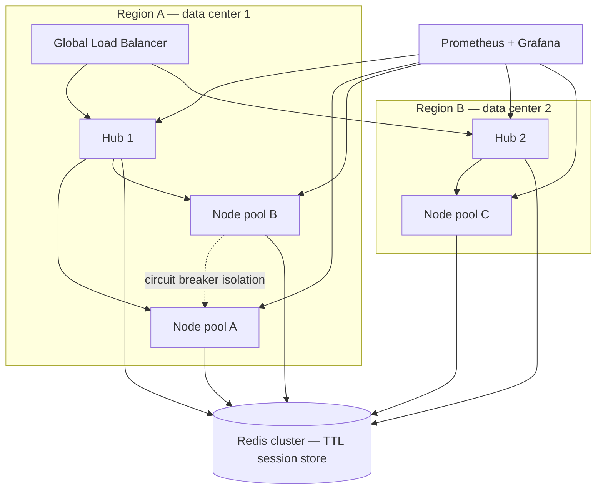

| Difficulty | Channel | Tags |
|---|---|---|
| advanced | system-design | selenium, webdriver, grid |

For years, Expedia ran roughly 9,000 UI automation tests across 350+ Jenkins jobs directly on build executors — suites took hours, browsers silently hung, and true parallelism stayed out of reach [1]. So the team set a brutal internal goal: finish the entire UI suite within the runtime of its single slowest test [1]. This is the story of what it took to get there — and what the architecture looks like when your grid needs to survive 10,000 concurrent sessions with 99.9% uptime.

---

> ### Real-World Case — Expedia Group
>
> Until 2014, Expedia ran ~9,000 UI automation tests across 350+ Jenkins jobs directly on executors, so suites took hours, browsers hung on executors, and parallelism was impossible - test feedback was choking release velocity. They set an aggressive internal goal: run the entire UI suite within the runtime of the single slowest test.
>
> | | |
> |---|---|
> | **Challenge** | The classic Selenium Grid hub-and-node pattern doesn't autoscale: idle or hung browser sessions leaked memory and made nodes unusable, no real concurrency, node provisioning took minutes, and multiplying static hubs was expensive. They also discovered a hidden constraint - AWS VPC IP reservation means a c5.2xlarge instance can host only 19 browser pods, so scaling to 300-500 node pods caused IP address exhaustion and pod creation failures. |
> | **Solution** | They built 'Distributed Automation' (SeleniumGridScaler: Selenium Grid + EC2 autoscaling API), then migrated to 'DA-Kube' on EKS: containerized hubs/nodes managed by Helm and routed by Traefik ingress, one browser container per pod for reliability, per-pod CPU/memory QoS limits, and fully automated session lifecycle - hubs and nodes autoscale on demand, drain and terminate when idle, and shut down entirely after a run so you only pay for executed sessions. |
> | **Outcome** | 1,000 UI tests now run in ~5 minutes rather than hours; 100+ Selenium hubs execute 140,000-150,000 tests daily, creating and terminating ~4,500 EC2 nodes per day on demand; infrastructure cost dropped from an estimated $2.41M for vendor cross-browser device service to ~$80,000/year pay-as-you-use; hub scale-out went from 2-4 minutes (VM boot) to ~45 seconds via containers/Kubernetes; each test failure maps to exactly one code change for instant root-cause analysis. |
> | **Lesson** | You can't feed a hub-and-node grid with long-lived nodes - treat every browser session as an ephemeral, autoscaled workload with rigid lifecycle management (drain, idle timeout, terminate) and per-pod resource limits. Also, at grid scale the surprising bottleneck is often network/IP capacity per instance, not CPU or RAM, so plan node density around address exhaustion, not just cores. |

---

## Hook — The 3-hour suite that never should have existed

Picture this: it’s Thursday afternoon, the release train is boarding, and your test pipeline is red. One Jenkins executor has been chewing on a single UI suite for three hours while a browser leaks memory with every page load. The 9,000 other tests queued behind it? Not moving. Every developer in the organization is blocked on feedback that should arrive in minutes, not days.

This is the reality of test infrastructure that runs straight on bare executors: no isolation, no parallelism, no lifecycle management. And here is the plot twist that changes everything — the problem was never “not enough machines.” It was architecture.

## Problem — Scaling tests is a distributed systems problem in disguise

The moment your suite needs to run at serious scale, three enemies show up:

- **Memory leaks:** browsers are voracious. Let a Chromium session run long enough and it will happily eat a node’s RAM and never give it back.
- **Orphaned sessions:** a test that crashes mid-run leaves its WebDriver session alive forever, silently burning capacity you think you have.
- **Node failures:** when one node dies, it can drag the entire queue down if your scheduler cannot tell it’s gone.

The stakes scale with ambition. 10,000 concurrent sessions is no longer a build-server problem — it is a distributed systems problem. Every decision you make about session lifecycle, node health, and failover gets multiplied by 10,000. Get the lifecycle wrong and you don’t just get slow feedback; you get a grid that collapses under its own garbage.

## Real-World Case — Expedia Group

This isn’t hypothetical. Expedia hit this exact wall [1]. Up until 2014, the team ran roughly 9,000 UI tests across 350+ Jenkins jobs straight on executors. Browsers hung on the boxes, parallelism was impossible, and feedback arrived in hours. Their answer wasn’t simply more VMs — it was a full rearchitecture onto Kubernetes, Docker, Helm, and Traefik [1].

The numbers are the story:

- 1,000 UI tests now finish in ~5 minutes instead of hours [1]
- 100+ Selenium hubs execute 140,000–150,000 tests daily, creating and terminating ~4,500 EC2 nodes per day on demand [1]
- Infrastructure cost dropped from an estimated $2.41M for a vendor cross-browser device service to ~$80,000/year pay-as-you-use [1]
- Hub scale-out went from 2–4 minutes of VM boot to ~45 seconds with containers [1]
- Every test failure maps to exactly one code change — instant root-cause analysis [1]

Notice the counterintuitive gem buried in there: 100+ hubs did not mean 100+ hours of ops work. Containers made infrastructure disposable — and disposability turned out to be the whole point.

## Deep Dive — The machinery behind the miracle

Building on Expedia’s blueprint, let’s unpack the architecture that makes a 10,000-session grid possible.

**The classic hub-node pattern** stays, but with a twist: Kubernetes StatefulSets manage the browser nodes across multiple availability zones [4]. StatefulSets give each node a stable identity — essential when a scheduler needs to track which node owns which session.

**Redis becomes the session store**, and TTL is your hero [5]. Every session gets an expiration time. Forget to clean up? Redis does it for you, with key-expiration scans every 5 minutes. Connection pooling keeps Redis itself from becoming the bottleneck.

**Now do the math.** At 50 sessions per node, 10,000 sessions means 200 nodes minimum. At 2GB per node that’s 400GB baseline — add a 30% buffer and you need ~520GB of cluster memory, which is why horizontal pod autoscaling based on queue depth is non-negotiable [10][3]. P99 session initiation stays under 2 seconds thanks to regional load balancing.

Here is where the assumptions get broken:

- **The leak problem is a lifecycle problem.** You might think the fix for memory leaks is a bigger box. Actually, it’s weekly rolling restarts, GC tuning, memory alerts at 80%, and init containers that strip stale Docker volumes [1]. Leaks get reset, not patched.
- **Circuit breakers, not retries.** The Hystrix pattern isolates a failing node for a 30-second recovery window instead of hammering it [7][8]. One bad node stops affecting anyone else.
- **Health checks with teeth.** Every node exposes a /status endpoint probed every 10 seconds; three consecutive failures mean immediate removal [2].
- **Surviving the boring disasters.** Pod Disruption Budgets guarantee at least 85% capacity during maintenance [9]. Leader election prevents split-brain during network partitions. Canary deployments with traffic splitting catch zero-day failures on new node images.

Real-time visibility comes from Prometheus metrics and Grafana dashboards tracking memory trends and session durations [6]. If a node degrades slowly, you see the curve before it tips over.

## Workflow — How one test travels through the grid

The beauty of this design is that the lifecycle is a loop, not a ladder. Here is the journey a single test takes:

1. **Ingest** — the CI system posts a new session request to the hub.
2. **Route** — a weighted load balancer picks the hub with slack based on capacity and response time.
3. **Lease** — the broker allocates a node and writes a session lease to Redis with a TTL (5 minutes, by default).
4. **Run** — the node’s heartbeat refreshes its lease every 30 seconds while the test executes.
5. **Reclaim** — if the test hangs or crashes, the TTL silently expires and the slot frees itself. No orphan sessions.
6. **Observe** — Prometheus scrapes node and session metrics; Grafana shows the trend.
7. **Heal** — a failing node gets tripped by its circuit breaker and excluded for 30 seconds; HPA adds nodes when the queue grows [3].

Figure 1 (below) shows the whole loop — note how every node, hub, and broker reports into the Redis store and the monitor, so no single component holds all the truth. Once you see the loop, the design clicks: every part is disposable because Redis and the scheduler are the only memory that matters.

## Code Example — A session governor with TTLs and circuit breakers

Let’s make this concrete. The heart of the design isn’t Kubernetes magic — it’s the tiny piece of logic that decides who gets a session and when to stop trusting a node. Here is a production-flavored Python implementation of that logic using Redis as the source of truth.

## Lessons Learned — What to steal for your own grid tomorrow

After walking this journey, distilling the battle scars:

- **Start with TTL, not monitoring.** Automatic session expiration prevents most leaks before you ever need a dashboard. If a session can’t outlive its lease, the grid self-heals.
- **Treat nodes as cattle, not pets.** Expedia’s ~4,500 nodes-per-day model only works because nodes are cheap to create and destroy [1]. If your node takes 5 minutes to boot, fix that before buying more of them.
- **Circuit break before you retry.** Three strikes and the node is out for 30 seconds [7][8]. Retry loops amplify outages; breakers contain them.
- **Capacity math is a floor, not a target.** 200 nodes is your minimum. Add the 30% buffer, then let HPA handle the spikes [3][10].
- **The monitoring trap.** Don’t gather metrics you won’t alert on. Expedia’s 80% memory threshold and weekly restarts worked because they were wired to actions, not dashboards.
- **Calculate before you purchase.** The $2.41M versus $80,000 gap didn’t come from a cheaper vendor — it came from an architecture that bills by the minute instead of by the block [1].

The one-line dress rehearsal if you only remember one thing: **the grid’s uptime is a function of how fast it can throw a bad node away, not how well it protects a good one.**

## Conclusion —

The journey started with a red pipeline and a three-hour suite and ended with a grid that runs 150,000 tests a day for a fraction of the cost — because Expedia stopped trying to make infrastructure reliable and started making it replaceable [1].

---

## Grid Architecture Flow

<strong>Original Interview Question</strong>

**Q:** Design a scalable Selenium Grid architecture to handle 10,000 concurrent test sessions with 99.9% uptime, ensuring zero memory leaks through automatic session lifecycle management, real-time monitoring, and graceful node failure recovery across multiple data centers?

**A:** Deploy Kubernetes cluster with auto-scaling node pools, Redis session store with TTL policies, Prometheus metrics for memory monitoring, circuit breakers for node isolation, and sidecar containers for session cleanup. Implement health checks, resource quotas, and rolling updates.

## Conclusion

The moral of the story: scale isn’t about adding machines — it’s about making every machine disposable. Start by adding TTL-based session leases to your grid this week, wire a circuit breaker around your flakiest node pool, and let Kubernetes handle the rest. One memorable insight to share with your team: “Availability in a test grid comes from how fast you can retire a bad node, not from how hard you protect a good one.”

---

## References

1. [Expedia Group incident report](https://medium.com/expedia-group-tech/da-kube-selenium-grid-using-kubernetes-docker-helm-and-traefik-856b802d1d08) — article
2. [Selenium Grid — official documentation](https://www.selenium.dev/documentation/grid/) — documentation
3. [Kubernetes HorizontalPodAutoscaler](https://kubernetes.io/docs/tasks/run-application/horizontal-pod-autoscale/) — documentation
4. [Kubernetes StatefulSets](https://kubernetes.io/docs/concepts/workloads/controllers/statefulset/) — documentation
5. [Redis expire and TTL commands](https://redis.io/docs/latest/develop/using-commands/expire-nx-xx-gt-lt/) — documentation
6. [Prometheus — overview](https://prometheus.io/docs/introduction/overview/) — documentation
7. [Circuit breaker design pattern](https://en.wikipedia.org/wiki/Circuit_breaker_design_pattern) — documentation
8. [Netflix Hystrix — GitHub](https://github.com/Netflix/Hystrix) — documentation
9. [Kubernetes Pod Disruption Budgets](https://kubernetes.io/docs/tasks/run-application/configure-pdb/) — documentation
10. [AWS Auto Scaling](https://docs.aws.amazon.com/autoscaling/) — documentation

---

**Author:** Satishkumar Dhule — [GitHub](https://github.com/satishkumar-dhule) · [LinkedIn](https://linkedin.com/in/satishkumar-dhule) · [Website](https://satishkumar-dhule.github.io)
