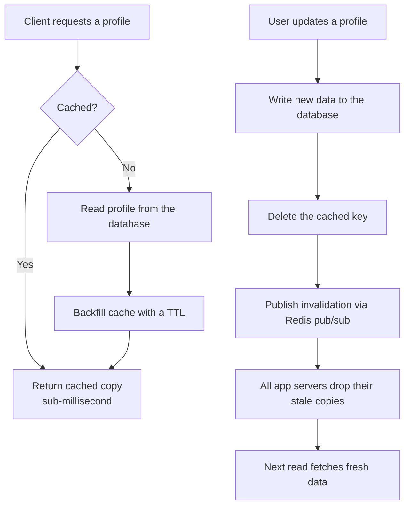

| Difficulty | Channel | Tags |
|---|---|---|
| beginner | backend | redis, memcached, cache-invalidation |

Somewhere in a data center, a cache key is lying to you. It is the same kind of lie that once confronted the engineers at Facebook, who were running one of the largest distributed caches ever built — a memcached fleet serving billions of requests per second [1]. On the surface, cache invalidation looks like a one-liner: delete the key and move on. In practice, that one-liner can silently serve stale profiles, trigger stampedes, and — at the worst possible moment — collapse onto your database. This is the story of why “just delete it” is not nearly enough.

---

> ### Real-World Case — Facebook
>
> Facebook runs one of the world's largest memcached deployments to serve user-profile and social-graph reads, processing billions of requests per second. But keeping cached profile data correct after writes became the core hard problem: the naive 'delete on update' approach opened the door to stale-set races and thundering-herd stampedes that collapsed onto the database.
>
> | | |
> |---|---|
> | **Challenge** | They needed cache invalidation at unprecedented scale — without the coordination primitives (like Redis pub/sub) they consciously gave up by choosing memcached. Specifically: prevent stale cached data written by a late-arriving client from overwriting newer profile data, and avoid read-stampede thundering herds when a hot profile key was evicted on update. |
> | **Solution** | Facebook kept memcached as the read-optimized tier for its simplicity and memory efficiency, then built the coordination around it. An out-of-band daemon called 'mcsqueal' tails MySQL commit logs and broadcasts deletions to every cache tier across all regions, automating invalidation the way pub/sub would. They added memcached 'leases' (CAS-style tokens) so only the first client to miss after a delete may refill the key — eliminating stale sets and herd effects — plus a 'gutter' pool of spare servers to absorb keys served by failed machines. |
> | **Outcome** | At peak, the memcache tier serviced billions of requests per second and transferred tens of gigabits of data per second, with sub-millisecond median read latency (vs. hundreds of ms for database fetches). The lease mechanism alone cut stale-value rates dramatically, and the gutter pool removed nearly all of the extra latency otherwise caused by server failures. |
> | **Lesson** | Staleness is a consistency problem to be engineered around, not eliminated: slightly stale profile data is often acceptable, but racing writes and read stampedes are not. Choosing the simplest, fastest primitive (memcached) doesn't forfeit advanced invalidation — you simply build a distributed invalidation bus (mcsqueal) and leases around it, the same coordination Redis bakes in. |

---

## Hook — The Billion-Requests-Per-Second Question

It starts with a single line of code that every engineer writes without a second thought: `cache.delete(key)`. Harmless, right? Here is what that harmless line is actually doing at scale. Your user-profile service caches profiles because a cache hit answers in under a millisecond while a database fetch costs hundreds of milliseconds — a two-order-of-magnitude gap that your users can feel on every page load. The moment a profile updates, though, that one deletion opens a race. A request that fetched the old profile a microsecond earlier can quietly write it back, and suddenly your “freshest” cache is serving a ghost that no amount of deleting can remove. There is a documented scale where those two bugs went from annoying to existential, and it belongs to a company you have heard of [1]. By the end of this post, you will not just know the interview answer — you will know the war stories that shaped it.

## Problem — The Naive “Just Delete It” Trap

Here is a scenario you will recognize. Your team launches a user-profile service and, naturally, caches profiles, because every uncached read hits a database that answers in hundreds of milliseconds. Then a user updates their name. And suddenly — for some users, for a while — the old name is still there. Worse, it is not even consistently old: one server serves fresh data, another serves stale data, and support tickets start mentioning “ghost profiles.” The naive playbook goes like this: cache-aside reads, backfill on a miss, and on every update, delete the key and let the next read rebuild it [2]. Then two things go wrong. First, the stale-set race: a read that loaded the old profile is still in flight, and when it lands after your delete, it plants stale data back into the cache. Second, the thundering herd: the instant you delete a hot key, every concurrent request misses and stampedes toward the database in one synchronized traffic spike. Tune the TTL too long and users see ghosts; too short and the cache is just an expensive hobby [4]. This is the crux of the interview question, and it is why the answer is never “delete the key and move on.”

## Real-World Case — Facebook

Building on that problem, take a look at the case that defines this entire topic. Every time you scroll a profile on Facebook, you are touching one of the largest distributed caches ever assembled: a memcached tier that, at peak, serviced billions of requests per second and transferred tens of gigabits per second, with median read latencies below a millisecond — versus hundreds of milliseconds for a database fetch [1]. The hard part, as the Facebook team documented in their NSDI 2013 paper, was keeping cached profile and social-graph data correct after writes [1]. Delete-on-update produced stale-set races that were subtle precisely because they were rare — but at Facebook's scale, “rare” still means millions of users. The team also hit a third failure mode: when a memcached server died, the keys it held evaporated, and thousands of simultaneous requests stampeded to the database in a thundering herd. Two ideas fixed most of it: a **lease mechanism** that lets one requester re-heat a deleted key before the herd forms, and a **gutter pool** of spare memcached servers that absorb traffic after failures, cutting the added latency down to nearly nothing [1]. The connection to your work is direct: the invalidation bug you are debugging tonight is the same one that took a fleet of engineers and a peer-reviewed paper to tame.

## Deep Dive — Redis vs Memcached and the Write-Through Pattern

This leads to the two decisions hiding inside “implement cache invalidation.” Decision one is the pattern. The **write-through** approach handles profile updates like this: commit the new data to the database, invalidate the cache entry, and set a TTL as a safety net [2]. That TTL is not decoration — it is your last line of defense against every race described above, and for profile data a window of 5 to 30 minutes balances freshness against cache efficiency [4]. Reads should run **cache-aside**: check the cache, backfill on a miss, and never block the write path on the cache [9]. Decision two is the engine, and this is where interview answers usually collapse into headline bullet points instead of a real tradeoff table. Here is the honest version [5]:

## Workflow — From Update to Converged State

By now the pattern you are looking for is clear, so here is the full workflow for a profile service with write-through invalidation. **Step one — read path:** run cache-aside: serve from the cache, and backfill every miss with a TTL so the cache warms on real traffic [2]. **Step two — write path:** transactionally update the database, then DELETE the cache key rather than writing a new value into it — writing is how stale values are born [9]. **Step three — distributed invalidation:** publish the change on a channel so every app server drops its local copy instantly, instead of waiting for the next read [3]. **Step four — the safety net and the dashboard:** let the TTL sweep up anything weird, then watch cache hit rate, error rate, and database load like a hawk; a dip in hit rate is the first warning that a stampede is approaching [6]. The diagram below shows the entire system at a glance — the split between the read path and the write path makes the design self-evident.

## Code Example — Write-Through Invalidation in Python

Now translate the theory into something you can ship. This Python implementation runs the full workflow against a Redis cache: cache-aside reads with backfill, a write-through update that deletes before it publishes, and a subscriber loop so every app server invalidates in lockstep. The comments mark precisely the moments where naive implementations fail — read them twice.

## Lessons Learned — Battle Scars from the Cache Wars

Let us collect the battle scars so you do not earn them yourself. — **Rule one:** delete, do not blindly write-through the cache; writing new values into the write path is how stale data quietly survives a purge [9]. — **Rule two:** never skip the TTL; it is not overhead, it is the parachute that catches every race you have not thought of yet [4]. — **Rule three:** with more than one app server, local invalidation is not enough — use pub/sub or a message bus, because nobody enjoys a server confidently serving a deleted ghost [3]. — **Rule four:** your “fixed” invalidation will look correct in tests and break in production; that is why you monitor hit rate and database load, and why you load-test the delete path against a hot key [6]. 🎯 Key Point: cache correctness is a distributed problem, and your cache is only as trustworthy as the discipline around its writes. The fastest cache is not the one with the best hit rate — it is the one you trust.

---

## Read and write paths for write-through cache invalidation

<strong>Original Interview Question</strong>

**Q:** You're building a user profile service that caches frequently accessed profiles. How would you implement cache invalidation when a user updates their profile, and what trade-offs would you consider between Redis and Memcached?

**A:** Implement write-through caching with TTL-based expiration. On profile update, invalidate the cache by deleting the key and writing new data to both the database and cache. Redis offers pub/sub for automatic distributed invalidation, while Memcached requires manual coordination across nodes.

## Conclusion

The interview question was never really about Redis versus Memcached. It was about recognizing that correctness is a distributed problem, and your cache is only as trustworthy as the discipline around its writes — the same discipline Facebook had to harden across billions of requests per second before the answer felt simple [1]. Tomorrow, when you touch that profile service, check three things: does every cache entry carry a TTL, does every write invalidate instead of mutate, and does every node hear about every change? Spend an hour on any one of those and you will have done more for your users than a year of caching features. The one insight worth sharing with your team: the fastest cache is not the one with the best hit rate — it is the one you trust.

---

## References

1. [Facebook incident report — Scaling Memcache at Facebook (USENIX NSDI 13)](https://www.usenix.org/conference/nsdi13/technical-sessions/presentation/nishtala) — article
2. [Redis cache invalidation and caching patterns](https://redis.io/docs/latest/develop/use/patterns/caching/) — documentation
3. [Redis Pub/Sub documentation](https://redis.io/docs/latest/develop/interact/pubsub/) — documentation
4. [Redis EXPIRE command reference](https://redis.io/docs/latest/commands/expire/) — documentation
5. [Memcached — Wikipedia](https://en.wikipedia.org/wiki/Memcached) — article
6. [Distributed cache — Wikipedia](https://en.wikipedia.org/wiki/Distributed_cache) — article
7. [memcached GitHub repository](https://github.com/memcached/memcached) — documentation
8. [Python functools — lru_cache for local caching](https://docs.python.org/3/library/functools.html) — documentation
9. [AWS ElastiCache — caching strategies (lazy loading and write-through)](https://docs.aws.amazon.com/AmazonElastiCache/latest/dg/Strategies.html) — documentation

---

**Author:** Satishkumar Dhule — [GitHub](https://github.com/satishkumar-dhule) · [LinkedIn](https://linkedin.com/in/satishkumar-dhule) · [Website](https://satishkumar-dhule.github.io)
