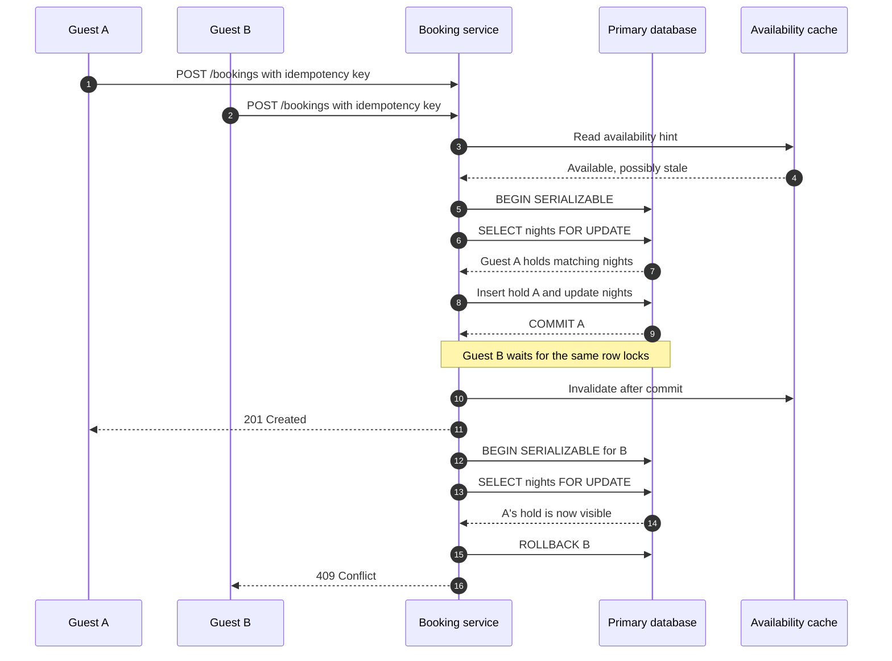

| Difficulty | Channel | Tags |
|---|---|---|
| intermediate | database | acid, isolation-levels, mvcc |

During Black Friday 2025, Shopify merchants peaked at $5.1 million in sales per minute, and every checkout touched inventory [1]. At that scale, an availability check becomes a promise: one guest gets the room, and the other gets a clean rejection—not an overbooking, an undersold night, or a surprise refund. The hard part is that a fast read, a temporary hold, and a committed booking can land in different systems. The same race appears in an Airbnb-style property booking when multiple users tap Confirm at the same second.

---

> ### Real-World Case — Shopify
>
> During Black Friday 2025, Shopify merchants peaked at $5.1 million in sales per minute, and every checkout touched inventory. Its Redis reservation system could not atomically coordinate temporary holds with the MySQL inventory ledger, creating windows for both overselling and underselling.
>
> | | |
> |---|---|
> | **Challenge** | Prevent concurrent checkouts from claiming the same inventory while keeping reservation transactions fast during massive flash-sale bursts. |
> | **Solution** | Shopify moved reservations into the MySQL inventory database and replaced each contended quantity row with a bounded pool of one row per sellable unit. Transactions claim rows using SELECT FOR UPDATE SKIP LOCKED under READ COMMITTED, allowing buyers to skip busy rows instead of queueing. Composite keys reduced two locks per row to one, consistent lock ordering eliminated deadlocks, and shadow-mode validation tested MySQL against real traffic before cutover. |
> | **Outcome** | The system met peak throughput targets while keeping writer CPU below 50% and reader CPU below 16%. Checkout-path cleanup reduced primary-database reads by 50% and transactions by 33%; Shopify reports that the redesign eliminated oversells and improved successful purchases. |
> | **Lesson** | Maximum isolation is not automatically the best concurrency solution. Shopify combined ACID transactions with non-blocking row claims and deliberately chose READ COMMITTED over stronger isolation; the unexpected bottleneck was connection time consumed by neighboring checkout code, not reservation-query speed. |

---

## Hook — Two Green Checks, One Room

At that scale, a clean-looking availability screen can lie without returning an error. Two requests can both read “available,” then race to create a booking; the database returns valid snapshots, not a business decision. The twist is that the database may be behaving perfectly while the system is still wrong. Once the first write commits, one guest has a home and the other has a support ticket.

This is the tiny race hiding inside a large promise: a booking system must preserve inventory correctness without turning every search into a global traffic jam. What should actually become atomic?

## Problem — The Check-Then-Act Race

Building on the opening scene, the failure is a classic check-then-act race. Guest A reads the property as available. Guest B reads it as available. Both insert a booking before either transaction commits. A property-level count can even look correct inside each isolated query.

Here is the uncomfortable part: payment makes the bug expensive. Two captures, one host, two support escalations, and a refund workflow that starts only after the customer has already received a confirmation.

Many developers discover the first battle scar quickly: `if (available) { insert(); }` is application validation, not mutual exclusion. An availability check from Redis or a read replica is useful for discovery, but it cannot be the final authority.

MVCC provides a consistent snapshot [2], not a reservation. Optimistic concurrency control can reject stale state with a version check [3], but neither mechanism makes a check across Redis and the database atomic by itself.

Therefore, the design must name the invariant first: a property may have zero or one active hold or booking for any particular night. Once that rule is explicit, the lock boundary becomes much easier to choose.

## Real-World Case — Shopify

That failure mode is not theoretical: Shopify’s Black Friday 2025 case involved a Redis reservation system that could not atomically coordinate temporary holds with a MySQL inventory ledger. The coordination gap created windows for both overselling and underselling during a peak of $5.1 million in sales per minute [1].

Shopify reports that the redesigned system met peak throughput targets while keeping writer CPU below 50% and reader CPU below 16%. Checkout-path cleanup reduced primary-database reads by 50% and transactions by 33%; Shopify also reports that the redesign eliminated oversells and improved successful purchases [1].

The plot twist is that performance and correctness were not opposing goals. Separating the fast read path from the authoritative write path made the system both faster and safer.

## Deep Dive — Lock the Right Thing

Shopify’s cross-system coordination gap leads to the sharper design question: which database state is allowed to decide the winner?

Separate the fast path from the commit path. Caches and read replicas can answer “can this property be shown?” quickly. The primary database must answer “can this guest acquire these exact nights?” authoritatively. Every request crosses back through that authoritative check before becoming a hold.

MVCC snapshot reads are valuable because they avoid dirty reads, yet a snapshot cannot lock a row that another transaction will write later. `SERIALIZABLE` strengthens ordering through serialization checks, and a short explicit lock narrows the contested set even further.

| Strategy | What it protects | Availability trade-off | Use it when |
| --- | --- | --- | --- |
| Cache or read-replica check | Fast discovery | High, but approximate | Showing availability before committing |
| `SERIALIZABLE` plus precise row locks | The booking invariant | Medium, but contention is localized | A booking spans several related rows |
| Optimistic version or compare-and-swap | Stale aggregate updates | High when conflicts are rare | Workers edit independent records or retry cheaply |

🔥 Hot Take: `SELECT ... FOR UPDATE` is pessimistic locking, not optimistic concurrency control. OCC is the version or compare-and-swap pattern [3]. You can use both, but label them accurately. A version column that is incremented without comparing an expected value is not concurrency control; it is decorative bookkeeping.

Use `SERIALIZABLE` when the booking invariant spans multiple nights or several rows. For a simpler schema, one row per property and night with a unique constraint may be enough. Do not pay for blanket serializability without measuring a real anomaly such as write skew, where separate transactions can each satisfy their local reads while violating a shared multi-row rule [4].

A cache still has a place. Invalidate or refresh it after commit, never before a transaction that can roll back. If an outbox feeds cache invalidation, remember that an SQS-style queue can deliver events more than once, so consumers need idempotent handlers [6]. Cache invalidation is an optimization, never the source of truth [7].

For a first production budget, start with a 150 ms lock timeout, three bounded retries, and a p99 lock-wait target below 50 ms. These are starting numbers, not guarantees. If a hot property repeatedly exceeds the budget, open a circuit breaker and return a controlled `429` with `Retry-After` instead of amplifying contention [8].

## Workflow — From Hint to Commit

Building on the source-of-truth boundary, the booking flow should look like this:

- Normalize the request: sort and deduplicate every requested night, then attach an idempotency key to the same request fingerprint.
- Read a cache or replica for an immediate availability hint. A stale “available” result is allowed; a false “sold out” result merely routes the request to the primary database.
- Begin a short `SERIALIZABLE` transaction on the primary database.
- Lock all requested `property_nights` rows in a deterministic order with `SELECT ... FOR UPDATE`.
- Recheck the locked rows and the idempotency record inside the transaction.
- Insert the booking or hold and update every night atomically. Emit an outbox event in the same commit.
- Invalidate the affected cache entries after commit, then return `201 Created`. Return `409 Conflict` for a genuine availability loss and a bounded overload response for contention.

The Mermaid diagram titled “Atomic Booking Sequence” shows the important twist: both guests can read the same optimistic hint, but only the primary-database transaction decides which guest wins.

If the cache invalidation fails, the database remains correct and a reconciler repairs the cache. If a worker receives the same outbox event twice, idempotent consumption prevents a second side effect. The booking stays safe even when the surrounding infrastructure is noisy.

## Code Example — A Transaction That Claims Every Night

Now the workflow reaches its decisive step: one transaction must claim every requested night or claim none. The following TypeScript example uses node-postgres for explicit client-scoped transactions [5]. It assumes that `property_nights` contains one row per property and night, has a `version` column, and that `bookings` enforces a unique `(guest_id, idempotency_key)` constraint.

The example deliberately uses row locks for the overlap invariant. An OCC version comparison is an alternative for independently updated records, but it should not be presented as a substitute for a multi-night overlap constraint.

The complete illustrative implementation is in the `codeExample` field below. The important production pieces are the lock, the all-or-nothing validation, the idempotency check, and the bounded retry loop.

## Lessons Learned — Make the Commitment Explicit

After this journey from a high-volume warning to a single database commitment, the battle scars are clear:

- Lock before checking. A read followed by a later lock leaves a time-of-check/time-of-use gap.
- Lock all nights in one transaction. Claiming three nights and rolling back only the fourth is still an overbooking bug.
- Keep cache and replica reads off the correctness path. They are excellent traffic controls, not reservation authorities.
- Retry only transient database failures. Serialization failures, deadlocks, and lock timeouts can use bounded exponential backoff with jitter; unavailable inventory should not enter a retry storm.
- Store an idempotency key and request fingerprint. A retry must return the original result, not create a second hold.
- Never hold a database lock while calling a payment provider. Use a short transaction plus a saga or outbox for payment and confirmation.
- Watch lock wait time, retry rate, conflict rate, cache invalidation lag, and duplicate-booking attempts. A circuit breaker is useful when a hot property cannot absorb more contention.

The memorable rule is simple: availability is a read; inventory is a commitment. Make the commitment atomic, recoverable, and observable.

---

## Atomic Booking Sequence

<strong>Original Interview Question</strong>

**Q:** You're building a booking system for Airbnb where multiple users can reserve the same property simultaneously. How would you design the transaction handling to prevent double bookings while maintaining high availability?

**A:** Use SERIALIZABLE isolation with optimistic concurrency control. Implement row-level locks on property availability tables, use MVCC snapshot reads for checking availability, and apply application-level validation to ensure atomic booking operations.

## Conclusion

Tomorrow, do not start by turning every query into `SERIALIZABLE`. Start with an explicit inventory invariant, a primary-database arbiter, precise locks, and bounded recovery. Shopify’s lesson is that correctness and availability can improve together when the coordination boundary is designed deliberately [1]. The insight to share with the team is simple: availability is a read; inventory is a commitment. Commit the commitment.

---

## References

1. [Shopify incident report](https://shopify.engineering/scaling-inventory-reservations) — article
2. [Multiversion concurrency control](https://en.wikipedia.org/wiki/Multiversion_concurrency_control) — documentation
3. [Optimistic concurrency control](https://en.wikipedia.org/wiki/Optimistic_concurrency_control) — documentation
4. [Write skew](https://en.wikipedia.org/wiki/Write_skew) — documentation
5. [node-postgres](https://github.com/brianc/node-postgres) — documentation
6. [Exactly-once processing in Amazon SQS](https://docs.aws.amazon.com/AWSSimpleQueueService/latest/SQSDeveloperGuide/standard-queues-at-least-once-delivery.html) — documentation
7. [Invalidating CloudFront caches](https://docs.aws.amazon.com/AmazonCloudFront/latest/DeveloperGuide/Invalidation.html) — documentation
8. [Additional HTTP Status Codes](https://datatracker.ietf.org/doc/html/rfc6585) — documentation

---

**Author:** Satishkumar Dhule — [GitHub](https://github.com/satishkumar-dhule) · [LinkedIn](https://linkedin.com/in/satishkumar-dhule) · [Website](https://satishkumar-dhule.github.io)
