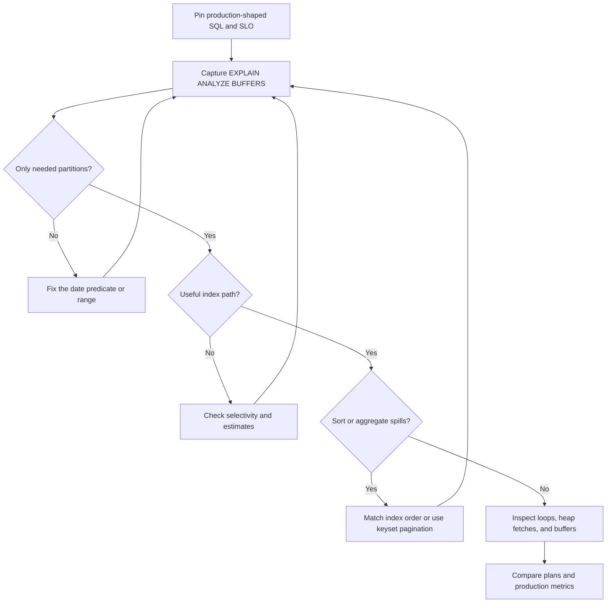

| Difficulty | Channel | Tags |
|---|---|---|
| intermediate | database | explain, query-plan, partitioning |

At GitLab, a 112 GB `audit_events` table turned one project’s 560,000-event audit view into a 1.4-second detour. In the documented before-and-after plans, a paged query fell from 1,415.139 ms to 30.471 ms—about 46 times faster—while a bounded count fell from 127.571 ms to 6.042 ms, about 21 times faster [1]. The surprise: partitioning helped dramatically only when the query carried the date key. The real lesson is not “partition everything”; it is how to read a PostgreSQL plan and remove the exact node still doing unnecessary work.

---

> ### Real-World Case — GitLab
>
> GitLab's production `audit_events` table was approximately 112 GB, and one project's audit view contained 560,000 events. The table served paginated event views and filtered counts, making it a strong real-world test of date-partitioned PostgreSQL workloads.
>
> | | |
> |---|---|
> | **Challenge** | Before partitioning, the last page of the unpartitioned project view hit a 72,000 ms timeout. A `created_at`-filtered count took over 60 seconds when cold, returning HTTP 500, and 1,663 ms when warm; the first page took 496 ms. The existing composite index was not enough: the documented plan spent 1,411.7 ms in an index scan over `audit_events_archived` before a small top-N sort. |
> | **Solution** | GitLab replaced it with monthly `RANGE` partitions on `created_at`, using partition-local composite indexes aligned with the entity and author filters plus the date range. It also changed access patterns to require bounded date windows of up to 30 days and process larger exports month by month. With a partition-key predicate, PostgreSQL pruned irrelevant months and ran local `Index Scan` and `Index Only Scan` nodes under `Append` instead of searching the full unpartitioned table. |
> | **Outcome** | In the documented before-and-after plans, a paged query fell from 1,415.139 ms to 30.471 ms, about 46 times faster, and a count fell from 127.571 ms to 6.042 ms, about 21 times faster. GitLab reported 10x–100x improvements when the partitioning key was available; production `pg_stat_statements` means were 0.508 ms for the paged query and 2.182 ms for the bounded count. |
> | **Lesson** | Partitioning is an access-pattern contract, not a universal index fix: pruning only helps when predicates constrain the partition key, and local indexes must match the remaining selective columns. GitLab's strongest result came from changing both the physical layout and the query contract, then validating the real workload with `pg_stat_statements`. |

---

## Hook — The 46× speedup hiding in a plain-looking plan

Building on GitLab’s result, a 46× speedup can look like database sorcery until the plan reveals what actually changed: PostgreSQL touched far less data.

Consider a 100-million-row table partitioned by month. A query for January can still cross dozens of child partitions, read millions of index entries, spill a sort to disk, or fetch thousands of heap pages. Partitioning divides the table; it does not automatically make the surviving rows cheap to access [3].

The useful question is therefore not, “Is this table partitioned?” It is, “Which partitions survived, which index was chosen, and which node consumed the milliseconds?” Get those three answers, and the mystery becomes an engineering task. Get them wrong, and adding indexes becomes database shotgun roulette.

So where does the time actually go?

## Problem — Why one month can still be painfully slow

However, date partitioning is a powerful filter, not a performance spell. In a 100-million-row table, a slow date-range query usually has one of five culprits.

- **Pruning failed:** the predicate does not match the partition key directly, the range is unexpectedly broad, or prepared-statement parameters prevent useful planning-time pruning.
- **No useful index exists:** a B-tree index can locate a small set quickly, but an unsuitable column order may leave the database scanning or filtering most of a month [2].
- **The index does not match the workload:** a query filtering by `project_id`, `status`, and date needs its equality predicates, range, and ordering represented in that sequence.
- **The expensive node comes later:** `ORDER BY` triggers a sort, `COUNT(*)` traverses many matching entries, and deep `OFFSET` pagination repeatedly discards earlier rows.
- **The planner estimated badly:** stale statistics or a skewed hot tenant can make PostgreSQL choose a plan that looked cheap on paper [4].

A sequential scan deserves special mention. It is not automatically a failure. If the query returns a large fraction of a month’s rows, a sequential scan may read fewer pages than hundreds of random index lookups. The battle scar is declaring victory from the node name alone while ignoring rows, buffers, and loops.

🔥 Hot Take: the fastest plan is not the prettiest plan. It is the plan whose actual work matches the query’s real parameters.

## Real-World Case — GitLab

This leads to GitLab’s production `audit_events` table, which reached approximately 112 GB. One project’s audit view contained roughly 560,000 events and served paginated event pages plus filtered counts—a realistic test of both index navigation and aggregation [1].

GitLab’s documented before-and-after plans showed a paged query improving from 1,415.139 ms to 30.471 ms, about 46 times faster. The bounded count improved from 127.571 ms to 6.042 ms, about 21 times faster. The broader result was a reported 10×–100× improvement whenever the partitioning key was available [1].

The production evidence matched the plans. In `pg_stat_statements`, the paged query averaged 0.508 ms and the bounded count averaged 2.182 ms. Those are mean latencies, not universal guarantees, but they show what the optimized access pattern delivered in production [1].

However, the real plot twist was architectural: every relevant application query had to include a bounded `created_at` range, capped at 30 days. The table was partitioned, but the query contract made pruning possible. GitLab also treated partitioning as a requirement for future access patterns, not a one-time migration. The public GitLab repository lets readers trace the surrounding implementation beyond the incident report [8].

That is the key question for any partitioned table: does the application reliably supply the key that unlocks the performance?

## Deep Dive — Reading the plan like an incident timeline

Following the evidence, inspect the plan from the bottom upward. A useful starting point is `EXPLAIN (ANALYZE, BUFFERS, VERBOSE, SETTINGS, FORMAT TEXT)`. Plain `EXPLAIN` shows estimates, `ANALYZE` executes the statement and reports actual rows and times, and `BUFFERS` exposes shared, local, and temporary I/O [6]. PostgreSQL represents the chosen strategy as a tree of scan, join, aggregate, and sort nodes [5].

⚠️ Watch Out: `EXPLAIN ANALYZE` runs the query. Test an expensive statement on staging or a read replica with production-shaped parameters.

**1. Verify partition pruning first**

Count the child scans under the partitioned `Append`. Irrelevant partitions should disappear, or execution-time pruning should show evidence such as `Subplans Removed`. A prepared query with parameters can require runtime pruning, so test the bound users actually send. Predicates such as `DATE(event_date) = ...` or `event_date::text LIKE ...` are harder to optimize than direct comparisons.

Use a half-open range—`event_date >= start AND event_date < end`—instead of an inclusive `BETWEEN`. It handles timestamp boundaries cleanly and avoids accidentally touching the next partition.

**2. Check whether the index matches the query shape**

Look for `Index Scan`, `Index Only Scan`, or `Bitmap Index Scan`, then inspect `Index Cond`, `Rows Removed by Filter`, `Heap Fetches`, `loops`, and buffers. An index can be used and still disappoint if it performs thousands of random heap accesses. An `Index Only Scan` can also degrade into frequent heap fetches when rows are not sufficiently visible.

**3. Hunt for expensive sorts and aggregates**

A `Sort Method` of `external merge Disk` means PostgreSQL wrote beyond `work_mem`. A hash aggregate that falls back to batches or disk indicates a similar memory-bound problem. Better index order can eliminate an avoidable sort; keyset pagination can eliminate deep-offset work. For repeated counts, a maintained summary table may be better than asking PostgreSQL to count the same rows repeatedly.

**4. Compare estimates with reality**

For each node, compare `rows=...` with `actual rows=...`, and remember that actual rows are reported per loop. Large differences suggest stale statistics, correlated predicates, skewed data, or unsuitable generic prepared plans. Refresh statistics when justified, but do not use `ANALYZE` as a ritual performed blindly on the primary.

| Plan evidence | Likely diagnosis | Action to test |
|---|---|---|
| Every partition appears under `Append` | Predicate is non-sargable, unbounded, or too broad | Make the date comparison direct and bounded |
| `Seq Scan` with a large matching fraction | Index would require excessive random reads | Keep sequential access or reshape the query |
| Estimated rows differ sharply from actual rows | Stale or misleading statistics | Investigate skew, then refresh statistics |
| `external merge Disk` or `temp read/written` | Sort or hash exceeded memory | Match index order, reduce work, or pre-aggregate |
| Many `Heap Fetches` | Index-only path still needs table visibility | Vacuum appropriately or cover only small selected columns |

The original advice—composite indexes around the date filter—is a starting point, not a law. B-tree predicates work from left to right: place selective equality columns first, the range next, and ordering columns after that.

| Index candidate | Best when | Main tradeoff |
|---|---|---|
| `(event_date, status)` | Date ranges and date ordering dominate | `status` is filtered after a date range, not used as an independent search bound |
| `(status, event_date)` | `status` is selective inside already-pruned partitions | Queries that omit or frequently vary `status` lose the prefix |
| `(project_id, status, event_date DESC, id DESC)` | One tenant, status, date page, and stable order dominate | Extra write and storage cost from a wider index |

💡 Insight: because pruning already handles the date boundary, an equality-first local index can outperform a date-first index inside each month.

Finally, question the partition key. Date partitioning fits retention, reporting, and time-bounded access. If most queries retrieve one tenant without a date restriction, tenant-first or composite partitioning may make more sense. Also avoid creating hundreds of tiny partitions: planning and maintenance overhead can eventually outweigh their pruning benefit [3].

`CLUSTER` deserves a similarly skeptical look. It can improve physical locality, but it rewrites the relation and requires disruptive locking. Use it only when measured heap access justifies the operation. For append-only, naturally time-ordered data, `BRIN` is often the better experiment because it stores compact block summaries, though it may recheck rows rather than return exact index locations.

## Workflow — A repeatable PostgreSQL tuning loop

Building on the diagnosis, use a loop rather than a one-shot index change. The Mermaid diagram labeled “PostgreSQL Query Optimization Loop” maps the path from production-shaped SQL to verified improvement.

1. **Pin the workload.** Record the exact SQL, parameter types, date range, page size, sort order, and latency target. Test the common path and at least one hostile bound.

2. **Capture the baseline.** Run `EXPLAIN (ANALYZE, BUFFERS, VERBOSE, SETTINGS)` safely and save the plan [6]. Note `Execution Time`, actual rows, loops, buffers, and temporary I/O—not only the planner’s estimated cost.

3. **Prove pruning.** Verify the expected partitions are absent or skipped at execution. If they are not, fix the predicate or application contract before touching indexes.

4. **Repair index access.** Reorder existing indexes or add one matching the real equality, range, and pagination pattern. Force an alternative plan only as a diagnostic experiment; permanently disabling sequential scans hides the cost instead of removing it.

5. **Remove downstream work.** Eliminate sorts with compatible index order, replace deep `OFFSET` pagination with keyset pagination, and pre-aggregate only when repeated counts justify the consistency cost.

6. **Deploy safely.** Account for index build locks, write amplification, replica lag, and rollback. PostgreSQL does not support `CREATE INDEX CONCURRENTLY` directly on a partitioned parent; low-lock workflows create concurrent child indexes and attach them [7].

7. **Verify reality.** Repeat the same plan and compare production metrics. Use `pg_stat_statements` for mean execution time and calls, then check p95, p99, errors, and write latency in the application stack.

The loop matters because plans can change after statistics, data skew, or parameter shifts. A fast Tuesday plan does not sign off on Friday traffic.

🎯 Key Point: change one bottleneck at a time. Otherwise, a faster plan may simply move the pain to inserts, vacuum, memory, or replicas.

## Code Example — Capture evidence, then shape the index

Putting that workflow into practice, the Bash script below uses `psql` to capture a production-shaped plan, create a query-aligned composite index, and refresh statistics only when the plan shows they are stale.

The index places `project_id` and `status` first because they are equality filters. It then places `event_date DESC, id DESC` to support the bounded range and pagination order. This is a better fit than blindly copying `(event_date, filtered_column)` when date partitioning has already reduced the candidate set.

The script deliberately uses a half-open January range. It also limits output to 50 rows, matching the GitLab-style paginated workload rather than hiding the problem behind `SELECT *` over a month.

One production battle scar: `CREATE INDEX IF NOT EXISTS` notices the name; it does not prove that an existing index has the same definition. Review the catalog before treating it as a successful migration. After the build, rerun the same `EXPLAIN`; the index name, reduced rows, lower buffer count, and removal of an external sort must appear together. If not, roll it back rather than keeping a large index because it looked fashionable.

## Lessons Learned — From a slow partition to a performance contract

Returning to GitLab, the transformation was not merely a faster index. The team turned partitioning into a measurable application contract: always provide the partition key, keep the range bounded, inspect real plans, and verify production behavior [1].

The durable lessons are simple:

- **Pruning first:** partition only around a key the workload reliably supplies. Partitioning without a query contract is decorative architecture.
- **Actual data over estimates:** compare estimated rows, actual rows, loops, buffers, and temporary I/O. PostgreSQL’s optimizer is cost-based, not clairvoyant [4].
- **Index order over index count:** create indexes for measured query shapes. Multiple overlapping indexes increase storage, cache pressure, and write cost.
- **Optimize the whole operation:** a perfect index still loses when the query sorts, deeply paginates, or repeatedly counts the same range.
- **Treat DDL as production work:** a parent-level index build can lock writes. Build leaf indexes concurrently and attach them when the rollout requires lower blocking [7].
- **Avoid reflex clustering:** `CLUSTER` rewrites data. Use it only when physical order is a measured problem, not because a blog post once said “clustering fixes everything.”

Tomorrow, capture one representative plan, confirm the pruned partitions, inspect the dominant node and its buffers, and make one reversible change. GitLab’s 46× improvement came from that discipline.

The line worth sharing with the team is: **partitioning opens the door, pruning finds the room, and `EXPLAIN` turns on the light.**

---

## PostgreSQL Query Optimization Loop

<strong>Original Interview Question</strong>

**Q:** You have a PostgreSQL table with 100M rows partitioned by date. A query filtering on a specific date range is still slow. What would you check in the EXPLAIN plan and how would you optimize it?

**A:** Check partition pruning effectiveness, index utilization patterns, and expensive sort operations. Create composite indexes on (date, filtered_columns) and evaluate clustering strategies for optimal data access.

## Conclusion

GitLab’s 1,415.139 ms query did not fail because dates were a poor idea; it exposed an incomplete performance contract [1]. Tomorrow, capture one production-shaped plan, prove pruning, inspect the dominant scan or sort, and change one reversible bottleneck. Keep the memorable rule: partitioning opens the door, pruning finds the room, and `EXPLAIN` turns on the light.

---

## References

1. [GitLab incident report](https://gitlab.com/gitlab-org/gitlab/-/work_items/238223) — article
2. [Database index](https://en.wikipedia.org/wiki/Database_index) — documentation
3. [Managing high object counts in Amazon RDS for PostgreSQL](https://docs.aws.amazon.com/AmazonRDS/latest/UserGuide/PostgreSQL.HighObjectCount.html) — documentation
4. [Query optimization](https://en.wikipedia.org/wiki/Query_optimization) — documentation
5. [PostgreSQL](https://en.wikipedia.org/wiki/PostgreSQL) — documentation
6. [The EXPLAIN query plan](https://docs.aws.amazon.com/prescriptive-guidance/latest/postgresql-query-tuning/explain-query-plan.html) — documentation
7. [PostgreSQL source repository](https://github.com/postgres/postgres) — documentation
8. [GitLab source repository](https://github.com/gitlabhq/gitlabhq) — documentation

---

**Author:** Satishkumar Dhule — [GitHub](https://github.com/satishkumar-dhule) · [LinkedIn](https://linkedin.com/in/satishkumar-dhule) · [Website](https://satishkumar-dhule.github.io)
