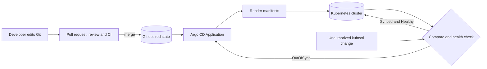

| Difficulty | Channel | Tags |
|---|---|---|
| beginner | devops | argocd, flux, declarative |

At Intuit, roughly 2,000 Kubernetes services, 150+ clusters, and a recovery time that fell from 45 minutes to under five exposed a hard truth: Kubernetes scale does not fix delivery by itself [1]. The turning point was making Git the desired state and Argo CD the continuous reconciler. Once that loop existed, QuickBooks deployment cycles shrank from days to minutes, while creating or upgrading a service with automated build and deployment pipelines took less than 10 minutes [1]. This is the GitOps story: not replacing Kubernetes, but replacing heroics and hidden cluster changes with software that can notice, explain, and repair drift.

---

> ### Real-World Case — Intuit
>
> Intuit used Argo CD within its Modern SaaS platform to deliver Kubernetes-based financial software to thousands of developers.
>
> | | |
> |---|---|
> | **Challenge** | Its lift-and-shift cloud migration barely improved delivery speed; teams still needed days or weeks to create and deploy releases, relying on fragile manual scripts. |
> | **Solution** | Intuit adopted Kubernetes, acquired Applatix, creator of Argo, and introduced Argo CD. Git became the source of truth for application deployments: developers declared the desired state, and Argo CD reconciled clusters to it instead of engineers issuing imperative changes and maintaining manual scripts. |
> | **Outcome** | Intuit moved roughly 2,000 services onto Kubernetes in 18 months and operated 150+ clusters. For QuickBooks, deployment cycles fell from days to minutes, MTTR dropped from 45 minutes to under 5 minutes, and creating or upgrading a service with automated build and deployment pipelines took less than 10 minutes. |
> | **Lesson** | At enterprise scale, GitOps is not merely another deployment tool: it removes fragile manual automation, makes production state auditable and reproducible, and turns rapid, safe recovery into a platform capability rather than an emergency procedure. |

---

## Hook — The green deploy was only half the story

At Intuit, the numbers were impossible to ignore: about 2,000 services reached Kubernetes in 18 months, the company operated more than 150 clusters, and QuickBooks mean time to recovery fell from 45 minutes to under five [1]. Behind those gains was not one heroic command. It was a loop that behaved almost boringly: read intent from Git, compare it with Kubernetes, and act on every difference. That boring part is the plot twist. Many developers discover that a successful CI pipeline proves only that code was built and published. It says nothing about whether a cluster silently drifted, a rollback remains possible, or a replica count still matches the repository. Sound familiar? A terminal can turn a temporary fix into permanent state. Then, at 2:13 a.m., the only reliable map is a developer’s memory. GitOps begins by moving that memory into version control.

## Problem — Production has more than one source of truth

Building on that contrast, the real problem is not applying YAML. It is deciding who owns production state after a successful deployment. Microservices multiply services, clusters, and environment combinations, so every untracked change becomes another decision future teams cannot reproduce. Kubernetes exposes both imperative commands such as `kubectl set` and `kubectl scale` and declarative configuration files [5]. Its guidance recommends declarative management for repeatable production resources while retaining imperative tools for exploration and troubleshooting [3]. That boundary matters.

The classic drift story is painfully ordinary:

- CI publishes a new image and updates a manifest.
- An engineer patches production during an incident.
- The dashboard stays green, so nobody notices the difference.
- Weeks later, another deploy fails because the live state no longer matches Git.
- Recovery depends on terminal history, screenshots, and whoever remembers the trick.

| Dimension | Declarative GitOps | Imperative cluster changes |
|---|---|---|
| Source of truth | Versioned manifests, values, or configuration | Operator memory and command history |
| Change path | Branch, review, merge, and sync | `kubectl` or `helm` command |
| Drift detection | Continuous comparison | Usually discovered during an incident |
| Audit trail | Commit history, pull request, CI evidence | Manual logs or missing records |
| Rollback | Revert the Git change and reconcile | Reconstruct and replay earlier commands |
| Best fit | Repeatable, long-lived production resources | Diagnosis, bootstrap, and temporary experiments |

💡 **Insight:** GitOps is a control model, not a YAML format. Plain manifests, Helm, and Kustomize are different tools, but the decisive behavior is continuous reconciliation [6][7].

⚠️ **Watch Out:** If developers can freely mutate production, Git is merely a suggestion. Self-healing can repair drift, but Kubernetes RBAC is what prevents unauthorized changes in the first place [8].

🔥 **Hot Take:** Imperative tooling is not the villain. A permanent imperative change to production is.

## Real-World Case — Intuit

Building on this pressure, the documented Intuit case shows why the operating model mattered as much as the Kubernetes migration. Intuit acquired Applatix, the company behind Argo, in early 2018 and used that expertise to build its Modern SaaS platform. The CNCF case study reports that 2018 alone brought more than 100 production and pre-production clusters and 500 services into operation. Over an 18-month journey, the company moved from zero to roughly 2,000 services on Kubernetes and eventually operated more than 150 clusters [1].

The payoff was not merely technical elegance. Creating or upgrading a service with automated build and deployment pipelines took less than 10 minutes. QuickBooks deployment cycles dropped from days to minutes, and rollback or roll-forward recovery fell from 45 minutes to less than five [1]. Thousands of developers gained a faster path from finishing code to receiving customer feedback.

However, the deeper battle was against hidden operational state. Intuit described Git as the source of truth for builds, applications, and production deployments, while Argo CD automated continuous delivery. The company also contributed projects and declarative cluster-management resources such as Keikoproj after operating more than 150 clusters for over a year [1].

🔥 **Hot Take:** Intuit’s transformation did not happen because teams memorized 2,000 `kubectl` commands. It happened because a paved road turned every service into a repeatable, reviewable workflow.

## Deep Dive — Declarative intent, imperative escape hatch

That transformation leads to the central distinction: declarative management describes the state that should exist, while imperative management requests a particular action. Declarative Kubernetes configuration states the outcome; the system decides which operations reach that outcome. Imperative `kubectl` usage says, `set this field now` or `create these resources now` [5].

GitOps adds three layers to that distinction:

1. **Git stores desired state.** Manifests, a Helm chart, and environment values are versioned and reviewed.
2. **Argo CD reconciles desired with live state.** An `Application` binds a repository, revision, path, and destination to a cluster [2].
3. **Kubernetes controllers complete the desired outcome.** Controllers continuously observe resources and move the cluster toward their declared specifications [4].

Building on that model, automated sync has an important nuance: a three-minute interval is not an `Application` field called `healthCheckInterval`. Current Argo CD behavior uses a controller-level reconciliation setting, documented as a 120-second default plus jitter, producing a worst-case polling period of up to three minutes [2]. If a fixed 180-second reconciliation target is required, configure `timeout.reconciliation` in `argocd-cm` and measure the actual result. Detection time is also not application health time; a workload can be perfectly healthy but remain `OutOfSync`.

Three controls determine how aggressively reconciliation acts:

- `automated.enabled` applies Git changes when Argo CD detects `OutOfSync` [2].
- `selfHeal` restores live resources that diverge from the declared state [2].
- `prune` deletes live resources that no longer exist in Git [2].

⚠️ **Watch Out:** `prune` is deletion authority. Accidentally removing a resource from the correct branch can propagate that mistake. Enable it only after repository review, policy checks, and environment-specific safeguards are working.

Self-healing is powerful, but it is not a backup. It cannot reverse a database migration, recover persistent data, or prevent a bad Git commit from spreading. Without automated sync enabled, Argo CD also blocks its CLI rollback operation [2]. Production teams therefore need a deliberate emergency process: pause automation, restore a known-safe declaration or approved artifact, recover the data if necessary, and then reconcile the repository with reality.

Use declarative GitOps whenever a resource is production-owned, long-lived, or shared. Use imperative commands for diagnosis, one-off sandbox experiments, and controlled break-glass access. Flux is another valid GitOps implementation, but never let Argo CD and Flux fight over the same resources [9]. Ownership must be singular.

💡 **Insight:** The safest GitOps setup is not the most automated one. It is the one where automation, permissions, observability, and rollback are designed together.

## Workflow — From commit to continuous reconciliation

Working from that model, the workflow should make Git the normal commit path and Kubernetes the controlled output. Wiring this correctly feels less like installing a robot and more like defining exactly what the robot is allowed to touch.

Here is what you need to know:

1. **Install Argo CD and establish access boundaries.** Give the application controller only the permissions required by the managed applications. Restrict human mutation through RBAC rather than relying on everyone remembering policy [8].
2. **Create a production declaration.** Use plain YAML for a small service, Helm when a reusable chart provides clear value, and Kustomize overlays when environment differences dominate. Store the chart, values, overlays, and image references together.
3. **Validate before merge.** CI should render the exact production files, run schema or policy checks, and show the expected diff. A syntactically valid YAML file can still represent a dangerous release.
4. **Merge through a pull request.** The pipeline builds and tests the image, updates the immutable image reference, and commits the result. It does not need direct access to the Argo CD API because Argo CD can detect the Git change itself [2].
5. **Define an Argo CD `Application`.** Specify the repository URL, target revision, manifest path, destination namespace, and project. Keep this custom resource under Git as well; otherwise the controller configuration can drift too.
6. **Enable synchronization deliberately.** Start with a low-risk stateless service, validate manual synchronization, then enable automated sync and self-healing. Add pruning only when Git deletion should mean production deletion.
7. **Test the unhappy path.** In staging, change a live replica count outside Git and verify that Argo CD restores it. Create a bad commit, confirm the failure is visible, rehearse the rollback, and measure how quickly the team can recover.

The Mermaid diagram below shows the visual story: Git defines intent, Argo CD renders and compares, Kubernetes executes through controllers, and a manual cluster change becomes another drift signal.

A three-minute detection ceiling sounds fast, but it is not a deployment latency guarantee. Rendering time, API calls, image pulls, health checks, and progressive delivery can each dominate the total. Measure the complete path.

## Code Example — Declare an Argo CD Application

Walking this flow leads to a small production pattern: keep the application definition in version control, then use a bootstrap pipeline to create it. The example below connects Argo CD to an environment-specific Kustomize overlay, enables automated synchronization, restores manual drift, creates the destination namespace, and applies the `Application` with server-side apply.

The retry policy matters too. Kubernetes API conflicts and transient failures are normal at scale; five bounded retries with exponential backoff are more useful than either infinite immediate retries or one brittle attempt. The `Application` also includes Argo CD’s resource finalizer so deleting the application can cascade to its managed resources. That is convenient for ownership, but dangerous by accident—remove the finalizer when cascade deletion is not intended.

⚠️ **Watch Out:** The script assumes an authenticated `kubectl` context, access to the `argocd` namespace, the Argo CD CLI, and a repository containing the referenced overlay. Keep the temporary manifest implementation detail only if the exact YAML is also versioned and reviewed in Git.

After creation, inspect both sync status and revision history. The meaningful evidence is not that `kubectl apply` returned successfully; it is that Argo CD reports the expected commit, health state, and resources as `Synced`.

## Lessons Learned — Make Git non-negotiable

By this point, the transformation is clear: GitOps is not merely moving YAML into Git. It is establishing a dependable path from reviewed intent to reconciled production state.

The battle scars worth remembering are straightforward:

- **Start small.** Pilot one low-risk stateless service before enabling automation across hundreds of workloads.
- **Render exactly what ships.** CI must validate the same chart, values, and overlay Argo CD renders; otherwise preview and production are different products wearing similar filenames.
- **Make the `Application` versioned.** An automated system whose configuration is edited only in the cluster has reintroduced the original problem.
- **Treat pruning as a separate permission.** Deploying a changed image and deleting an omitted production resource have very different consequences.
- **Enforce ownership with RBAC.** Self-healing repairs mistakes, but least-privilege access prevents them [8].
- **Never commit plaintext secrets.** Keep sensitive values in an approved secret store and use an external-secrets pattern.
- **Test drift and rollback deliberately.** A game day should prove that a reverted Git commit restores the correct release and that monitoring reveals the failure quickly.
- **Watch the controller, not just workloads.** Application health, sync status, reconciliation latency, failed operations, and unexpected resources matter as much as pod readiness.
- **Use one controller per resource.** Argo CD and Helm are fine together; two GitOps engines reconciling the same object are not.

💡 **Pro tip:** Start auto-sync with self-healing, but require explicit review signals for destructive changes. Production maturity comes from controlled automation, not maximum autonomy.

The memorable rule is simple: every permanent production change should leave the same audit trail as application code. If someone can alter a managed resource from a terminal and leave no durable declaration behind, the system has not completed its GitOps journey.

---

## Argo CD GitOps Reconciliation Flow

<strong>Original Interview Question</strong>

**Q:** You're setting up GitOps for a microservices deployment. How would you configure ArgoCD to automatically sync changes from your Git repository to Kubernetes, and what's the difference between declarative and imperative approaches in this context?

**A:** I'd configure ArgoCD by setting up a Git repository containing Kubernetes manifests or Helm charts, creating an Application CRD that points to the Git repository, enabling auto-sync with a health check interval of 3 minutes, and implementing self-healing to automatically revert any manual changes. The declarative approach involves defining the desired state in Git through YAML manifests, Helm charts, or Kustomize configurations, where ArgoCD continuously reconciles the actual state with the desired state. In contrast, the imperative approach uses kubectl commands to make direct changes to the cluster, bypassing the Git repository as the single source of truth.

## Conclusion

Intuit’s transformation did not begin with a clever command. It began with a desired state that could scale from one service to roughly 2,000 without losing ownership or recovery speed. Tomorrow, choose one low-risk service, store its manifests and Argo CD `Application` in Git, render and validate them in CI, enable automated sync with self-healing, and then rehearse drift and rollback in staging. The rule to share with the team is simple: every permanent production change should leave the same audit trail as application code. If a terminal command can change production without a durable declaration, GitOps is not finished yet.

---

## References

1. [Intuit incident report](https://www.cncf.io/case-studies/intuit/) — article
2. [Argo CD source repository](https://github.com/argoproj/argo-cd) — documentation
3. [Declarative Management of Kubernetes Objects Using Configuration Files](https://kubernetes.io/docs/tasks/manage-kubernetes-objects/declarative-config/) — documentation
4. [Kubernetes Controllers](https://kubernetes.io/docs/concepts/architecture/controller/) — documentation
5. [kubectl Quick Reference](https://kubernetes.io/docs/reference/kubectl/quick-reference/) — documentation
6. [Helm source repository](https://github.com/helm/helm) — documentation
7. [Kustomize source repository](https://github.com/kubernetes-sigs/kustomize) — documentation
8. [RBAC Good Practices](https://kubernetes.io/docs/concepts/security/rbac-good-practices/) — documentation
9. [Flux source repository](https://github.com/fluxcd/flux2) — documentation

---

**Author:** Satishkumar Dhule — [GitHub](https://github.com/satishkumar-dhule) · [LinkedIn](https://linkedin.com/in/satishkumar-dhule) · [Website](https://satishkumar-dhule.github.io)
