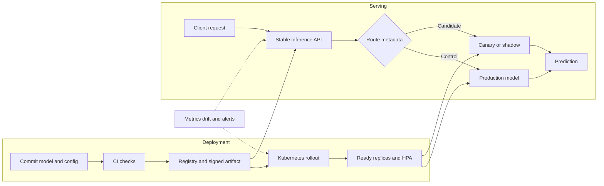

| Difficulty | Channel | Tags |
|---|---|---|
| beginner | devops | mlops, deployment |

At Netflix, more than 30 microservices needed one inference interface that could select the right model version, experiment cohort, and serving-cluster shard without exposing deployment details to clients. The mandatory Switchboard proxy solved that coordination problem, but it added 10–20 ms of serialization overhead and created a potential single point of failure as traffic reached 1 million requests per second [1]. By 2025, the platform was serving hundreds of model types and versions, so the fix had to preserve canaries, shadow testing, A/B experiments, and instant rollback without making clients know how serving worked. That tension is the heart of model deployment versus model serving.

---

> ### Real-World Case — Netflix
>
> Netflix needed a single inference interface for 30+ microservices to select the correct model version, experiment cohort, and serving-cluster shard without exposing deployment details to clients. As usage grew, its mandatory Switchboard proxy added 10–20 ms per request and became a potential single point of failure across every model.
>
> | | |
> |---|---|
> | **Challenge** | Serve hundreds of model types and versions at 1 million requests per second while supporting canaries, A/B tests, shadow traffic, instant rollback, and model-shard changes without making a central routing layer dominate latency and failure risk. |
> | **Solution** | Netflix first built Switchboard, an Objective-based gRPC abstraction backed by versioned routing rules, model validation, cluster assignment, and dynamic traffic splitting. It later split model selection from placement with Lightbulb, passed only routing metadata through that service, and moved actual traffic routing to Netflix's existing Envoy data plane. |
> | **Outcome** | By 2025, the platform served hundreds of model types and versions at 1 million requests per second. Removing Switchboard's payload proxy hop eliminated its documented 10–20 ms serialization overhead from the request path while preserving canaries, shadow testing, A/B experiments, instant rollback, and the unified client interface. |
> | **Lesson** | Centralize model selection and deployment policy, but keep it out of the inference data path; separating the control plane from direct routing provides abstraction and safety without converting a shared gateway into a latency bottleneck or system-wide failure point. |

---

## Hook — The deploy looked fine. Then the request path grew a tax

Following Netflix's 10–20 ms surprise, the deploy looked fine. The container booted, the smoke test passed, and the dashboard showed plenty of headroom. Then a real request arrived carrying a feature payload, an experiment assignment, and a deadline—and the request spent 10–20 ms in a hop that nobody had budgeted for [1].

🔥 **Hot Take:** A successful rollout proves reachability, not readiness. Deployment can be green while serving is already too slow.

Sound familiar? Many developers discover that a model which is easy to release can still be hard to route, warm, scale, and roll back. The question is not “Which framework should a team pick?” It is “Which boundary keeps release machinery out of the hot path?”

The next answer begins with the distinction that makes the rest of the journey possible. What is actually being managed when a model ships?

## Problem — Two clocks behind one ML system

Building on that first surprise, the vocabulary hides two different clocks. **Deployment** is the control-plane story: build an immutable artifact, provision infrastructure, wire CI/CD, publish metadata, observe rollout health, and make rollback possible. Kubernetes Deployments describe desired Pod state and support controlled rollouts; MLflow and managed registries connect an artifact to its lineage [2][12].

Moreover, deployment is usually reviewed in minutes or hours, while serving is judged by every request. Therefore, a green pipeline cannot stand in for a healthy endpoint.

**Serving** is the data-plane story: accept a request, load the right model, route traffic, batch when appropriate, enforce a deadline, and return a prediction. TensorFlow Serving, for example, exposes versioned HTTP and gRPC inference endpoints and supports canary or A/B traffic [8].

Here is the distinction that prevents the 2 a.m. incident:

| Question | Deployment | Serving |
|---|---|---|
| Main job | Move a known artifact into an environment | Turn an incoming request into a prediction |
| Clock | Build, review, release, roll back | Milliseconds, queue depth, concurrency, deadlines |
| State | Image, config, infrastructure, rollout status | Loaded model, cache, batch, traffic policy |
| Common tools | Docker, Terraform, Kubernetes, GitHub Actions, Jenkins, MLflow, SageMaker, Vertex AI | TensorFlow Serving, TorchServe, BentoML, KServe, FastAPI, Flask, gRPC, NGINX, Envoy |
| Success signal | Artifact promoted and revision healthy | Correct prediction, stable p99, acceptable errors and cost |

**When to use each:** use deployment machinery when releases must move through environments and approvals; use serving machinery when requests arrive continuously and replicas need to stay ready. They are partners, not substitutes.

⚠️ **Watch Out:** Do not expose `model-version`, shard, or cluster names in the public client contract just because serving needs them internally. That turns an implementation detail into a future outage.

Here is the thing though: the same model can need both systems, and neither one should own the other's failure modes. If the boundary is fuzzy, autoscaling and rollback become guesswork. Where should the line be drawn when one model serves several experiments?

## Real-World Case — Netflix

This leads directly to Netflix, where the serving platform had to coordinate 30+ microservices rather than host one tidy endpoint. Switchboard provided a unified client interface and context-aware routing: it selected the model version, experiment cohort, and serving-cluster shard while clients stayed insulated from deployment details. But the proxy sat in every request path. Netflix documented 10–20 ms of added latency from serialization and deserialization, plus tail-latency amplification and a single-point-of-failure risk; at 1 million requests per second, even a small percentage of slow requests becomes a product problem [1].

By 2025, the platform served hundreds of model types and versions. The plot twist is that routing itself was not the enemy. The team separated routing metadata from the full payload, used Lightbulb to resolve context and Envoy to route the actual request, and preserved canaries, shadow testing, A/B experiments, instant rollback, and the unified interface [1]. The lesson is precise: centralize policy, not necessarily payload bytes. A proxy can be the right control plane while still being the wrong data-plane hop.

Consequently, a central router can make deployment details easy to manage and latency expensive to ignore. Measure the hop before defending it. What would you move off the hot path first?

## Deep Dive — The trade-offs that decide the architecture

However, the Netflix lesson is not “remove all gateways.” It is to choose each hop deliberately. Deployment and serving overlap at artifacts, configs, and observability, yet their optimization goals differ. Therefore, a tool can belong in the release plane, the runtime plane, or both—and that classification matters more than its logo.

**Runtime choices.** Use TensorFlow Serving when a framework-native, versioned runtime fits and batching is valuable [8]. Use BentoML when a team wants a Python service layer that packages APIs, dependencies, and model versions [11]. Use KServe for Kubernetes-native routing, autoscaling, canaries, and multi-model patterns [10]. TorchServe is a recognizable PyTorch option, but its repository is archived, so maintenance status deserves a check before adoption [9]. A custom FastAPI or gRPC layer is useful for business logic; it still needs model loading, backpressure, health checks, and a rollout strategy.

**The four trade-offs:**

| Decision | Choose it when | Watch out for |
|---|---|---|
| Latency vs throughput | Interactive scoring needs a p99 deadline | Larger batches improve utilization but add queue wait |
| Online vs batch | The user needs an immediate answer | Long jobs and large payloads belong behind an asynchronous queue [6] |
| Horizontal vs vertical | Traffic is variable across replicas | More CPU or GPU memory raises the per-replica ceiling and cost |
| Cold start vs efficiency | Models are infrequent or memory-heavy | Preloading improves latency but holds scarce memory [7] |

**Scaling, cost, and ownership.** Horizontal scaling adds replicas; Kubernetes HPA can adjust replica count from CPU, memory, or custom metrics [3]. Vertical scaling gives a pod more CPU or GPU memory, useful when a model cannot fit but expensive when the fleet must grow. For an illustrative 10K QPS target at 50 requests per second per healthy replica, 200 replicas are the floor before headroom, failure domains, and traffic skew. A sub-50 ms p99 goal needs an end-to-end budget, not a faster GPU alone: routing, queueing, preprocessing, compute, serialization, and network each get a slice.

In a hypothetical 100-model estate with only 10 models hot at once, shared capacity is a better hypothesis than 100 dedicated GPUs; measure cost per 1,000 predictions before claiming savings. Multi-model endpoints can improve utilization, but cold starts are the trade [7]. For a two-person platform group, name separate deployment and serving responsibilities, even when one person wears both hats.

**Versioning and rollback.** Publish immutable artifacts, then move a stable alias or traffic split from one version to another. Keep experiment assignment sticky, record the resolved version in internal telemetry, and make rollback a routing change rather than a rebuild. KServe documents canary and advanced deployment patterns; MLflow supplies lifecycle and lineage context [10][12]. **When to use it:** any time a model change needs comparison, staged exposure, or a fast return to a known-good revision.

**Observability.** Track two planes together:
- Request health: QPS, p50/p95/p99 latency, timeouts, error rate, queue depth, and batch size.
- Runtime health: CPU, GPU memory, model-load time, cache hit rate, Pod readiness, restarts, and saturation.
- Model health: input distribution, prediction distribution, drift, quality proxies, and the business outcome that makes the prediction valuable.

Specifically, Kubernetes readiness probes keep unready Pods out of Service traffic, while liveness and startup probes separate restart behavior from traffic readiness [4][5]. 💡 **Insight:** p99 is often a queueing problem wearing an inference costume.

🔥 **Hot Take:** “The model is loaded” is not a health signal. A useful readiness check proves the artifact is loaded, the runtime is warm, dependencies are reachable, and a tiny inference can succeed.

Which side owns the next bottleneck: release machinery or request handling?

## Workflow — A safe path from artifact to prediction

With the boundary clear, the workflow should make the safe path the easy path. The Mermaid flowchart in the `diagram` field shows two connected planes: deployment creates ready replicas, while serving keeps the client contract stable and resolves the route at request time.

Follow this sequence:

1. **Define the workload.** Record online or batch mode, QPS, payload size, p99 target, availability target, and cost ceiling. This step prevents a GPU decision based on optimism. For a two-person group, assign one responsibility to deployment and one to serving; this can be a shared on-call rotation, not a staffing requirement.
2. **Package an immutable artifact.** Bundle model weights, preprocessing, dependencies, input signature, evaluation results, and a version. Register the artifact and lineage in MLflow or a managed registry [12].
3. **Deploy progressively.** Run unit, contract, smoke, and load tests in CI; then use a rolling update or canary on Kubernetes. Readiness and startup probes keep warming Pods out of traffic [2][5].
4. **Expose one contract.** Clients send business data, not deployment details. A Service, NGINX, or Envoy layer exposes a stable endpoint while backends change [4].
5. **Resolve and warm.** Select version, experiment cohort, and shard from minimal request context; preload hot models; let HPA react to request rate, queue depth, GPU saturation, or a custom metric [3].
6. **Observe, shift, or roll back.** Compare canary and control cohorts, watch p99 and quality signals, then move the alias or traffic split back to the last known-good artifact. Shadow traffic should never affect the user-facing response.

Consequently, a 10K QPS rehearsal should include cold starts, pod termination, GPU memory pressure, an unavailable model shard, and a rollback while traffic continues. The Mermaid diagram is the visual version of this flow; its key edge is `C --> G`: the registry can publish policy without becoming the payload proxy.

🎯 **Key Point:** If changing a model requires changing client code, deployment and serving have become one tangled system. Can a bad version be removed without touching the client?

## Code Example — A stable client contract with internal routing

Putting the pattern into code, the client sends only `customer_id` and `features`; the service selects a route internally. The example uses FastAPI, Pydantic, deterministic hashing, and an in-process cache. It is a serving skeleton rather than a model implementation: replace `load_model` and `infer` with TensorFlow Serving, BentoML, TorchServe, or a native runtime [8][9][11].

Read it in four moves:
- `Route` keeps model version, cohort, and shard on the server side.
- `stable_bucket` assigns the same customer to the same 90/10 cohort, which keeps experiment comparisons sane.
- `load_model` caches a route-specific artifact, modeling warm replicas and exposing the cold-start decision.
- `/predict` returns only the prediction, so a routing change stays invisible to callers.

Therefore, the snippet is small on purpose: it demonstrates the boundary without pretending a toy prediction is a production model. **Pro tip:** Load the production model during process startup, publish readiness only after warmup, and keep route configuration in a control-plane store rather than hard-coding it in the image. What happens when the selected shard disappears halfway through a request?

## Lessons Learned — The boundary to keep

Finally, the hard-won lesson is to separate promises from runtime behavior. The deployment promise is “this immutable artifact can be promoted safely.” The serving promise is “this request gets the right prediction, within its deadline, without exposing cluster mechanics.” Netflix's Switchboard showed that a unified interface can be valuable even when a payload proxy is harmful; the fix was to keep policy centralized and move the data path lean [1].

Many developers think a larger GPU solves serving. It solves one constraint while making every other constraint more expensive. If this feels overwhelming, you are not alone: the boundary becomes simple once it is written down.

**Battle scars to avoid:**
- Treating a green deployment as proof that the endpoint is warm.
- Scaling on CPU only when request queues or GPU saturation are the real bottleneck.
- Sending a large payload through a control-plane router when a routing key would suffice.
- Letting a client choose a model version, experiment, or cluster shard.
- Measuring average latency while p99 quietly drives timeouts.
- Calling rollback safe without rehearsing it under live traffic.

**Tomorrow's checklist:**
- Write the inference SLO beside the release plan.
- Assign separate owners for deployment and serving, then define the handoff contract.
- Use immutable versions, aliases, canaries, shadow traffic, and a rehearsed rollback.
- Choose asynchronous inference for large or slow jobs; choose online serving for interactive deadlines [6].
- Load-test cold starts, capacity, and failure—not just average throughput.

💡 **Insight:** The best serving layer is boring to clients and ruthless about latency. Which part of your current path is control-plane policy, and which part is payload work?

---

## Deployment and Serving Architecture

<strong>Original Interview Question</strong>

**Q:** Explain the key differences between model serving and model deployment in ML systems, including specific technologies, scaling considerations, and real-world implementation patterns?

**A:** Deployment encompasses CI/CD pipelines, infrastructure setup, and monitoring using tools like Kubernetes, MLflow, and SageMaker. Serving focuses on runtime inference APIs with frameworks like TensorFlow Serving, TorchServe, or BentoML, handling request routing, model versioning, and autoscaling. Key trade-offs include latency vs throughput, batch vs real-time inference, and cold start optimization.

## Conclusion

Netflix's journey from Switchboard to a lighter routing design is the blueprint: centralize decisions, not bytes; deploy immutable versions, but keep the runtime path stable; scale the serving fleet without making clients understand it. Tomorrow, write down the inference SLO, separate deployment from serving ownership, and test a cold start plus rollback before shipping. The takeaway to share: a model is not production until a request can reach the right version safely under load. That is the difference between a successful demo and a dependable system.

---

## References

1. [Netflix incident report](https://netflixtechblog.com/state-of-routing-in-model-serving-16e22fe18741) — blog
2. [Kubernetes Deployments](https://kubernetes.io/docs/concepts/workloads/controllers/deployment/) — documentation
3. [Kubernetes Horizontal Pod Autoscaling](https://kubernetes.io/docs/tasks/run-application/horizontal-pod-autoscale/) — documentation
4. [Kubernetes Service](https://kubernetes.io/docs/concepts/services-networking/service/) — documentation
5. [Kubernetes Liveness, Readiness, and Startup Probes](https://kubernetes.io/docs/tasks/configure-pod-container/configure-liveness-readiness-startup-probes/) — documentation
6. [Amazon SageMaker Asynchronous Inference](https://docs.aws.amazon.com/sagemaker/latest/dg/async-inference.html) — documentation
7. [Amazon SageMaker Multi-Model Endpoints](https://docs.aws.amazon.com/sagemaker/latest/dg/multi-model-endpoints.html) — documentation
8. [TensorFlow Serving](https://github.com/tensorflow/serving) — documentation
9. [TorchServe](https://github.com/pytorch/serve) — documentation
10. [KServe](https://github.com/kserve/kserve) — documentation
11. [BentoML](https://github.com/bentoml/BentoML) — documentation
12. [MLflow](https://github.com/mlflow/mlflow) — documentation

---

**Author:** Satishkumar Dhule — [GitHub](https://github.com/satishkumar-dhule) · [LinkedIn](https://linkedin.com/in/satishkumar-dhule) · [Website](https://satishkumar-dhule.github.io)
