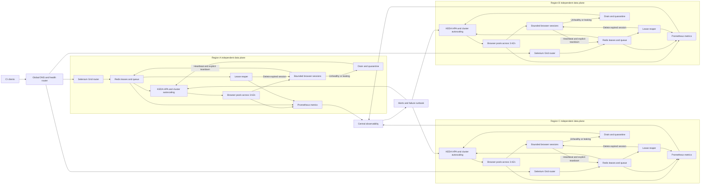

| Difficulty | Channel | Tags |
|---|---|---|
| advanced | system-design | selenium, webdriver, grid |

At Netflix, device testing once crossed a chain of gateway services and partner-network boundaries so unreliable that a setup-to-teardown run could take roughly 60 seconds; rebuilding Netflix Test Studio cut that below 5 seconds, while a load test sustained more than 10,900 live WebSocket connections on three AWS m4.xlarge instances [1]. NTS was not Selenium Grid, but its lesson lands squarely on browser automation: capacity is a lifecycle problem before it becomes a Kubernetes problem. Designing for 10,000 concurrent Selenium sessions with 99.9% uptime means surviving orphaned browsers, dead nodes, network partitions, and regional failures without letting memory creep quietly become an outage. The hard part is not reaching 10,000 sessions; it is making every session accountable from admission to verified teardown.

---

> ### Real-World Case — Netflix
>
> Netflix needed its Netflix Test Studio (NTS) platform to orchestrate SDK and partner-device certification reliably across hundreds of smart-TV and streaming-device types, including devices inside partner networks.
>
> | | |
> |---|---|
> | **Challenge** | NTS 1.0 split execution state across three services, kept executors in thread-local memory, and relied on fragile multi-hop RPC between cloud and edge. This caused inconsistent job semantics, lost state after failures, resource-intensive WebSocket console initialization, and poor scalability. |
> | **Solution** | NTS 2.0 moved execution next to the devices, replaced RPC with MQTT and Kafka, defined one job-execution model, persisted immutable ordered events in CockroachDB, used Akka actors for WebSocket sessions, and added scheduled job supervision, logging, metrics, and distributed tracing. |
> | **Outcome** | A load test sustained more than 10,900 simultaneous live WebSocket connections on three AWS m4.xlarge instances. A setup-to-teardown device test fell from roughly 60 seconds to under 5 seconds, Netflix deprecated 10 microservices, and maintainer development velocity increased by an order of magnitude. |
> | **Lesson** | At extreme concurrency, reliable lifecycle management depends on explicit state models, durable event history, execution locality, and supervision of every stage—not merely increasing the number of worker nodes. |

---

## Hook — 10,000 Sessions Are a Queue, Not a Victory

At 09:00, a 10,000-session capacity run looks glorious: green launches, rising throughput, and a dashboard polished enough to frame. Netflix's NTS story exposes the less glamorous reality—its earlier point-to-point control plane suffered stability, reliability, and latency problems because execution, communication, and state were spread across fragile boundaries [1]. Selenium Grid has the same trap.

A browser can crash after claiming a slot. A worker can disappear between allocation and startup. A WebSocket can vanish while the router still believes the session exists. One leaked browser at 10,000 concurrency is not one small defect; it is capacity that never comes back.

🔥 Hot Take: A green node can be more dangerous than a red node because it keeps accepting new sessions while leaking the old ones. If a worker disappears at 09:07, which process kills the browser, which component releases the slot, and which record tells the next operator what happened?

## Problem — The Green Dashboard Can Still Be Melting

Building on that failure mode, the design problem has four coupled constraints:

- **Concurrency:** Support 10,000 simultaneous browser sessions while keeping P99 session initiation below 2 seconds.
- **Availability:** Sustain 99.9% uptime, which permits roughly 43 minutes and 50 seconds of unavailability in an average 30.44-day month.
- **Lifecycle integrity:** Kill browser processes, remove temporary profiles, release Grid slots, and expire orchestration records even when the initiating client disappears.
- **Failure isolation:** Recover from unhealthy nodes, unavailable availability zones, network partitions, and an entire regional failure without creating competing authorities.

The hidden battle scar is the phrase zero memory leaks. Absolute zero is not a useful production claim because browsers, drivers, JVMs, allocators, and kernels all retain memory under different conditions. A measurable objective is stronger: no orphan browser process or live session lease remains 60 seconds after teardown, and memory returns to a warmed baseline after workers quiesce and recycle.

Moreover, an active WebDriver session cannot teleport between data centers. Regional failover protects new session creation and permits abandoned tests to retry; it does not preserve a live Chrome process in another region. Sound familiar? Infrastructure diagrams usually promise seamless migration, while the browser quietly ignores the slide transition.

So which architecture can coordinate at least 15,000 provisioned session slots across regions without making one hub or one shared database the new single point of failure?

## Real-World Case — Netflix

However, before drawing that architecture, consider what Netflix actually documented. Netflix Test Studio had to orchestrate SDK and partner-device certification across hundreds of smart-TV and streaming-device types, including devices operating inside partner networks. Its original point-to-point control plane accumulated reliability and latency problems, so NTS 2.0 moved execution into a Local Execution Context near the device and replaced opaque request chains with MQTT and Kafka, append-only execution state, and lifecycle supervision [1].

The reported results were concrete:

- More than **10,900 simultaneous live WebSocket connections** on three AWS m4.xlarge instances during load testing.
- Setup-to-teardown device testing reduced from roughly **60 seconds to under 5 seconds**.
- **10 microservices deprecated** after their responsibilities were consolidated.
- Maintainer development velocity increased by approximately **one order of magnitude** [1].

The source does not publish a team size, incident year, or dollar saving, so none should be invented. Fan fiction with a Kubernetes logo is still fan fiction.

💡 Insight: NTS was not a Selenium performance benchmark, but its redesign demonstrates three transferable rules: keep execution close to its resources, make state explicit and replayable, and supervise cleanup after crashes or disconnects. Those rules—not Netflix's WebSocket numbers—form the foundation of a resilient Selenium Grid.

## Deep Dive — The Architecture That Survives the Leak

Building on Netflix's local-execution model, use active-active regional data planes rather than one heroic global hub. Selenium Grid itself organizes components around routers, distributors, sessions, and nodes [2], but the Kubernetes control plane and session lifecycle registry need an explicit ownership model.

| Architecture | Advantage | Failure mode | Verdict |
|---|---|---|---|
| One global Grid hub and shared Redis | Simple capacity view | A network or database fault becomes a global outage; leader races create split-brain cleanup | Reject |
| One region across three availability zones | Lower latency and simpler operations | A regional failure cannot satisfy the 99.9% objective | Use only with a lower SLO |
| Three active regions, each able to sustain 5,000 sessions | Any two regions can absorb the 10,000-session peak; sessions stay near clients and devices | Requires 15,000 provisioned slots and disciplined fleet operations | Recommended |

**Capacity must be measured in browser sessions, not node count.** The tempting calculation of 200 nodes for 10,000 sessions assumes 50 browsers per node. But if a node has only 2GB total, every browser receives roughly 40MB before Chrome, the driver, page content, and JavaScript heap ask for coffee. That configuration collapses under the first realistic test.

An illustrative Chrome-only envelope is 40 sessions per worker with 40 vCPUs and 256GiB of RAM. The 10,000-session peak then requires 250 workers, 10TiB of memory, and 10,000 vCPUs. Three regions with 5,000-session failover capacity each require 375 workers and a 15TiB baseline. Reserving 30% scheduler headroom raises the requested envelope to 19,500 vCPUs and 124.8TiB. The exact numbers must come from a browser and workload matrix; the point is that 10,000 concurrency is an infrastructure budget, not an autoscaling trick.

**Regional Kubernetes clusters** should each span three availability zones, use topology-spread constraints to prevent worker concentration, and set memory and CPU requests from measured browser profiles [10][11]. KEDA can scale from queue depth and oldest-request age, while HPA scales worker pods and cluster autoscaling adds machines when the pod pool runs short [3][9][13]. A central lifecycle service per region, not a global sidecar fleet, reduces the failure surface.

**Redis is the lifecycle registry, not the WebDriver session store.** The browser command channel remains Selenium Grid. Redis holds a regional lease containing the session ID, node URI, owner, state, and expiration. Every 10 seconds, the worker refreshes a 30-second lease. A sorted-set deadline makes expired sessions immediately discoverable, while Redis TTL acts as a second safety boundary [8].

💡 Insight: TTL is a fire alarm, not the cleanup crew. When a Redis key expires, nothing automatically invokes Selenium's delete-session endpoint. A reconciler must claim the expired lease, call `DELETE /session/{id}`, verify the browser is gone, and only then release orchestration state.

**Health checks need intent.** Probe Grid status every 10 seconds and remove a node after three consecutive failures, but treat high memory, rising process count, and open file descriptors as stronger leak signals than CPU alone. Kubernetes separates startup, liveness, and readiness probes for precisely these different decisions [4]. A pod over 80% memory with a positive 15-minute slope should become unready, drain, and recycle rather than accept one more browser.

| Failure | Detection | Recovery action | User-visible guarantee |
|---|---|---|---|
| Leaking browser or driver | Memory slope, process count, slot mismatch | Drain node, kill residual processes, recycle profile | Other sessions remain isolated |
| Lost worker | Missed heartbeats and expired lease | Call delete, quarantine node, replace capacity, retry idempotently | At most one controlled session retry |
| Regional loss | Global health and capacity routing | Send new sessions to a surviving region; invalidate interrupted tests | New-session availability continues |
| Network partition | Lease-based leader election [6] | Permit one cleanup leader per region | Competing reapers cannot erase live work |
| Bad browser release | Canary error and memory metrics | Stop rollout, drain canary, restore previous pool | Existing sessions finish on a stable pool |

**Failure containment also needs guardrails.** A circuit breaker should remove a failing node for 30 seconds, then permit a single half-open probe. Pod Disruption Budgets protect an 85% service floor during voluntary disruption, but they do not create capacity [5]. Canary browser images at 1%, 10%, 50%, and 100% traffic, combined with rolling updates and topology spreading, keeps a bad driver release from becoming a synchronized failure [12].

⚠️ Watch Out: Weekly rolling restarts can hide leaks but cannot prove the system is leak-free. Recycle on memory slope, process-count drift, age, and observed failures; then verify that post-teardown memory returns to baseline.

Prometheus should collect queue depth, oldest-request age, P99 start latency, active sessions, retry rate, circuit state, Redis lease count, reaper lag, browser-process count, working-set memory, OOM kills, and pod churn [7]. Dashboards explain what happened; burn-rate alerts decide who gets paged. Use the active-active design when cross-region latency or a contractual 99.9% SLO matters. For an internal suite capped at 200 sessions, three regions are financial theater; one multi-AZ cluster may be the more honest design.

## Workflow — From Request to Reaped Session

Now turn those decisions into the `Regional Selenium Grid lifecycle and recovery flow` Mermaid diagram. The important movement is not client-to-node; it is the return path from failure to a verified empty slot.

1. **Route by health and capacity.** Global DNS or an Anycast load balancer selects a healthy region. Each region reserves enough failover capacity for the global peak, and clients can express data-residency or device-location constraints.
2. **Admit idempotently.** A `POST /session` request includes an idempotency key. The regional router rejects a duplicate instead of allocating another browser, writes the session to the local queue, and returns a session identifier.
3. **Scale before latency melts.** KEDA watches queue depth and the oldest request age. HPA adds browser workers, and cluster autoscaling adds machines when the node pool cannot satisfy the new pod requests. If a safe browser cannot be ready within 1.5 seconds, return a retryable 503 instead of hiding a breach behind an unbounded queue.
4. **Assign and lease atomically.** Selenium reserves a node slot, the worker starts an isolated browser profile, and Redis records the assignment. A reaper lock prevents cleanup from racing with startup.
5. **Heartbeat continuously.** The worker refreshes its lease every 10 seconds while the session is alive. The 30-second expiration is deliberately shorter than the time required to reschedule a replacement.
6. **Close deliberately.** A normal test sends delete-session, collects artifacts, terminates the driver and browser, removes the temporary profile, and only then releases the slot and lease.
7. **Reconcile failures.** If a lease expires, one reaper claims it, calls delete-session, waits for process cleanup, quarantines the node, and makes the capacity available again. Failed cleanup retains a short reaper lock that expires automatically, allowing a later retry.
8. **Observe and operate.** Prometheus updates dashboards continuously. Queue P99 above 1.5 seconds for five minutes triggers capacity investigation; reaper lag above 30 seconds pages the on-call owner; an 80% memory threshold plus positive slope drains the worker.

This flow is what converts graceful recovery from a runbook aspiration into a state transition. However, one race can still undo the whole design: a heartbeat arriving just as a reaper decides that a session is dead. How can cleanup be atomic without becoming another source of leaks?

## Code Example — An Atomic Lease Reaper

However, scanning Redis every five minutes feels practical and is still the wrong cleanup model. Expiration can remove metadata while the browser keeps running, and a scan gives no guarantee that a live session will not be deleted during a heartbeat race.

The `codeExample` below uses four production-oriented pieces:

- A Redis sorted set exposes due leases without repeatedly scanning every key.
- Redis TTL remains a secondary expiration guard.
- Lua scripts make registration, heartbeat, and reaper ownership atomic.
- A reaper lock allows one cleanup attempt at a time; a 404 from Selenium counts as already cleaned.

The keys include a common Redis hash tag within each bucket, keeping related keys in the same cluster slot. Run one reaper replica per region and use leader election so two active reapers cannot claim the same lease simultaneously.

⚠️ Battle scar: Marking a session closed before its browser exits hides the leak instead of fixing it. Release capacity only after delete-session succeeds or returns not found; otherwise let the lock expire and retry.

## Lessons Learned — What to Change Tomorrow

Coming out of the reaper, the architecture becomes much less mysterious. Netflix improved device testing not by making every connection immortal, but by making execution observable, state explicit, and cleanup supervised [1]. Selenium Grid needs the same discipline.

- **Scale slots, not nodes:** Browser memory dominates capacity, so benchmark Chrome, Firefox, WebKit, video, and download profiles separately.
- **Treat TTL as a safety net:** A lease index plus an idempotent reaper owns lifecycle cleanup.
- **Page on symptoms and burn rate:** Memory slope, orphan processes, reaper lag, and session-start latency matter more than average CPU.
- **Separate drain from termination:** Stop assigning new sessions, finish or expire existing work, then terminate the pod.
- **Remember that PDBs do not scale:** Disruption budgets protect capacity; autoscaling and prewarmed pools provide it [5].
- **Design regional failure honestly:** New sessions survive; active browser sessions may require an explicit retry.
- **Canary the whole stack:** Browser, driver, Grid, and container versions must move together, not independently.

Tomorrow, run four game days before launch: kill workers at 50% load, remove one availability zone, shift all traffic to a second region, and deploy a deliberately bad canary. The acceptance bar is specific: P99 session start remains below 2 seconds, teardown P99 remains below 60 seconds, and the orphan-process count is zero after every fault. Give the Grid control plane, browser fleet, and data-observability stack separate on-call ownership; shared ownership at this scale usually means shared ambiguity.

The memorable insight is simple: availability depends on knowing how to forget safely.

---

## Regional Selenium Grid Lifecycle and Recovery Flow

<strong>Original Interview Question</strong>

**Q:** Design a scalable Selenium Grid architecture to handle 10,000 concurrent test sessions with 99.9% uptime, ensuring zero memory leaks through automatic session lifecycle management, real-time monitoring, and graceful node failure recovery across multiple data centers?

**A:** Deploy Kubernetes cluster with auto-scaling node pools, Redis session store with TTL policies, Prometheus metrics for memory monitoring, circuit breakers for node isolation, and sidecar containers for session cleanup. Implement health checks, resource quotas, and rolling updates.

## Conclusion

Netflix improved device testing not by making every connection immortal, but by replacing opaque gateways with explicit state, event streams, and supervision [1]. Build Selenium Grid the same way: regional data planes, atomic leases, verified teardown, and a reaper that treats browser processes as resources rather than hopes. Tomorrow, prove three numbers before launch: P99 session start below 2 seconds, teardown P99 below 60 seconds, and zero orphan processes after a node-kill test. The line to share with the team is simple: a session is not done when the test passes; it is done when the browser is gone.

---

## References

1. [Netflix incident report](https://netflixtechblog.com/nts-reliable-device-testing-at-scale-43139ae05382) — article
2. [SeleniumHQ Selenium](https://github.com/SeleniumHQ/selenium) — documentation
3. [Horizontal Pod Autoscaling](https://kubernetes.io/docs/tasks/run-application/horizontal-pod-autoscale/) — documentation
4. [Configure Liveness, Readiness and Startup Probes](https://kubernetes.io/docs/concepts/configuration/liveness-readiness-startup-probes/) — documentation
5. [Pod Disruption Budgets](https://kubernetes.io/docs/tasks/run-application/configure-pdb/) — documentation
6. [Leases](https://kubernetes.io/docs/concepts/architecture/leases/) — documentation
7. [Prometheus](https://github.com/prometheus/prometheus) — documentation
8. [Redis](https://github.com/redis/redis) — documentation
9. [Cluster Autoscaling](https://kubernetes.io/docs/tasks/administer-cluster/cluster-autoscaling/) — documentation
10. [Pod Topology Spread Constraints](https://kubernetes.io/docs/concepts/scheduling-eviction/topology-spread-constraints/) — documentation
11. [Managing Resources for Containers](https://kubernetes.io/docs/concepts/configuration/manage-resources-containers/) — documentation
12. [Deployments](https://kubernetes.io/docs/concepts/workloads/controllers/deployment/) — documentation

---

**Author:** Satishkumar Dhule — [GitHub](https://github.com/satishkumar-dhule) · [LinkedIn](https://linkedin.com/in/satishkumar-dhule) · [Website](https://satishkumar-dhule.github.io)
