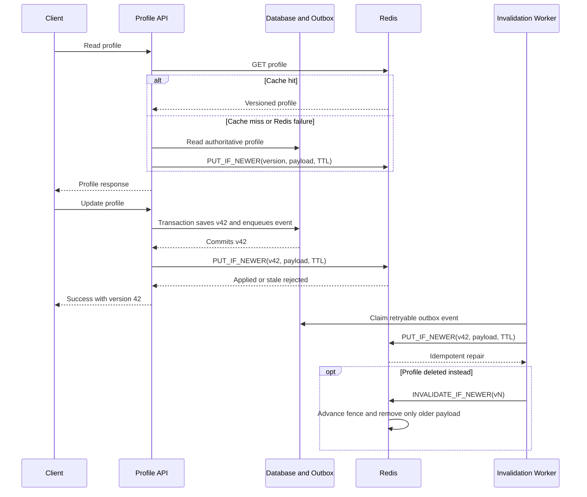

| Difficulty | Channel | Tags |
|---|---|---|
| beginner | backend | redis, memcached, cache-invalidation |

At Meta, one cache delete executed exactly as intended—and still left a newer value stranded behind stale data [1]. Across TAO and Memcache deployments serving more than one quadrillion queries per day, a rare race let an in-flight fill overwrite a mutation, while a defensive error handler silently declined to remove the damaged entry. The lesson for any profile service is blunt: TTL is a safety net, Redis is not a consistency strategy, and deletion alone cannot win a race with an old request still in flight.

---

> ### Real-World Case — Meta
>
> Meta operates massive TAO and Memcache deployments serving user and social-graph data at more than one quadrillion queries per day. Because cache fills and invalidations happen concurrently, an in-flight stale fill could overwrite a newer value and leave the cache inconsistent indefinitely; Meta even found a rare bug where an error handler silently failed to remove the stale entry.
>
> | | |
> |---|---|
> | **Challenge** | Make active cache invalidation reliable across concurrent reads, writes, replication, and failure handling without logging every cache fill or introducing unacceptable overhead. |
> | **Solution** | Meta built Polaris, a client-observable consistency checker that samples invalidations, retries checks at multiple time horizons, and distinguishes transient replication lag from permanent stale data. It also added stateful tracing around the small window where fills, invalidations, evictions, and error handling interact, enabling engineers to reconstruct rare races and fix their root causes. |
> | **Outcome** | TAO cache consistency improved from 99.9999% to 99.99999999% on Meta's five-minute measure, meaning fewer than 1 in 10 billion cache writes remained inconsistent after five minutes. Polaris and tracing reduced diagnosis of a particularly intricate production inconsistency bug to less than 30 minutes. |
> | **Lesson** | A simple delete or Redis Pub/Sub notification does not solve cache consistency by itself; the difficult parts are message delivery, in-flight fill races, version ordering, and observability. The cache technology matters, but the validation and coordination system around it matters more. |

---

## Hook — The Delete Succeeded. The Profile Was Still Wrong.

At a 99% cache-hit rate, TAO still fills its cache more than 10 trillion times per day [1]. That sounds impossible until one request begins reading profile version 41 just as another commits version 42. The update deletes the cached key; the delayed read then writes version 41, leaving the database correct and the cache confidently serving yesterday's profile.

The delete succeeded. That is the scary part.

Here is the thing though: many developers discover that `DEL` is a command, not a concurrency barrier. Cache invalidation removes entries or replaces stale copies, but several independent operations must cooperate to keep a distributed cache coherent [2]. A 15-minute TTL can bound staleness when every fill receives an expiry, yet it cannot stop an old request from arriving after the delete.

Use this cache for display names, bios, and avatars when five to thirty minutes of bounded staleness is acceptable. Bypass it for authorization roles, privacy settings, or any field that must disappear immediately.

⚠️ Watch Out: The dangerous request is not necessarily the slow request. It is any request whose database read began before your update but whose cache write finished afterward.

So what makes that late arrival harmless?

## Problem — The Database Committed. The Cache Disagreed.

Building on that race, a profile service coordinates three states: the authoritative database row, one or more cached representations, and any invalidation events traveling between application instances. A normal update crosses all three, but no ordinary network call makes them atomic.

The familiar implementation looks innocent:

1. Update the database.
2. Delete `profile:123` from the cache.
3. Return success.

The hidden sequence is less innocent: an old read starts, a new write commits, the key is deleted, and then the old read writes its result. The result is a read–write conflict, where a value read before a concurrent write later overwrites newer state [3]. Sound familiar? Distributed systems have excellent comic strips, mostly drawn by on-call engineers.

The main failure modes are:

- **Late fill:** An in-flight read restores data invalidated during its database query.
- **Partial dual write:** The database commits, but the cache write fails—or the reverse.
- **Lost event:** A consumer is offline when an invalidation is published.
- **Missed representation:** A profile summary changes, but a separate avatar or search-view key remains stale.
- **Cache stampede:** A popular key is deleted, and hundreds of requests hit the database simultaneously [8].

Therefore, the question is not merely where the profile is stored. It is which staleness window the product can tolerate, how failure is retried, and how an engineer proves that a supposedly fresh entry is not lying.

The naive delete looks complete. Which exact event makes it incomplete?

## Real-World Case — Meta

Building on that hypothetical race, Meta's production system provides a documented case study. TAO serves more than one quadrillion queries per day, and Meta operates massive TAO and Memcache deployments for user and social-graph data [1]. At a 99% hit rate, TAO would still perform more than ten trillion cache fills each day, so an extremely narrow timing window eventually becomes an extremely busy window.

Meta found one system where the cache held `metadata=0` at version 4 while the database held `metadata=1` at version 4. A rare sequence involved an old cache fill, a transactional update, another fill, and then a transient error during invalidation. The error handler attempted to remove an entry only when its version was older than the supplied version. Because the inconsistent payload already carried the latest version, the handler correctly concluded that there was nothing older to drop—and silently left the stale metadata in place.

The stale entry could remain indefinitely. Meta's Polaris monitoring detected violations of client-observable consistency, while specialized tracing recorded the narrow period where fills, invalidations, evictions, and errors could interact. That observability reduced diagnosis of the intricate production bug to less than 30 minutes [1].

The result was not perfection, but a dramatic improvement: TAO's five-minute consistency measure rose from 99.9999% to 99.99999999%, leaving fewer than one inconsistent write in ten billion [1].

Here is the plot twist: this is not a Redis-versus-Memcached benchmark. Meta's TAO and Memcache systems teach a protocol lesson—successful commands do not guarantee correct distributed state. The profile service can borrow that lesson without copying Meta's scale. So what mechanism rejects both late fills and late invalidations?

## Deep Dive — Version the Race Away

Therefore, a robust profile cache needs three things: a source of truth, monotonic ordering, and observability. The database remains authoritative. Every profile update receives a monotonically increasing version. Cache operations then compare versions before writing, and stale operations become harmless no-ops.

A practical design uses three keys:

- `profile:{id}:fence` records the newest version the cache has observed.
- `profile:{id}:data` stores the serialized profile.
- `profile:{id}:data-version` identifies the payload currently stored.

A Redis Lua script can perform the compare and write atomically. If an incoming version is older than the fence, it is rejected. Otherwise, the script advances the fence and stores the payload with a TTL. This directly addresses the race where version 41 arrives after version 42. TTL controls freshness duration; the version fence controls ordering.

💡 Insight: After invalidating a payload, retain a version tombstone or fence. Deleting every trace of the previous version throws away the memory needed to recognize an old arrival.

The read path can remain cache-aside: read the cache, fall back to the database on a miss, and conditionally fill the result. The update path can use write-through behavior: commit the database first, then conditionally place the new profile into the cache. A blind `DEL` followed by `SET` is usually weaker because it creates both a miss window and a race with old fills. A tombstone-based delete is still appropriate when a row disappears or visibility rules change. Eventual consistency helps only if updates eventually settle and replicas converge [4].

**Option A vs Option B — the real trade-off**

| Decision | Redis | Memcached | What it means |
|---|---|---|---|
| Primary strength | Data structures, TTLs, scripting, Pub/Sub, and Streams | Focused distributed key-value caching with a small operational surface | Redis fits coordination-heavy caches; Memcached fits straightforward object caching [5][6]. |
| Update primitive | Atomic scripts can compare versions and reject stale writes | Clients issue `get`, `set`, and `delete` through a consistent-hash client | Version fencing remains an application responsibility in both systems. |
| Messaging | Pub/Sub can broadcast hints; Streams can retain events for consumer groups | No built-in server-to-server event bus | Memcached deployments need an application-managed broker or event consumer. |
| Durability | Optional persistence exists, but a cache should still not become the source of truth | Ephemeral by default | Persistence can aid recovery; it does not repair a logically stale cache entry. |
| Operations | More features, memory overhead, and tuning choices | Simpler configuration and often a smaller metadata footprint | Benchmark the actual payload, clients, hardware, and eviction rate rather than trusting generic benchmarks. |
| Best fit | Versioned invalidation, locks, repair queues, sessions, and complex coordination | High-volume, stable-key profile caching with an existing event system | Choose the simplest system that satisfies the correctness protocol. |

🔥 Hot Take: Redis Pub/Sub is a signal flare, not a durable ledger. A subscriber that is disconnected can miss the flare. Use a transactional outbox plus a durable stream or queue when invalidation delivery matters; Redis supports Streams and server-side scripting, while Memcached expects the application to provide equivalent coordination [5][6].

The Memcached comparison also needs a nuance. One logical key normally lives on one selected server, so deleting that key does not require contacting every Memcached node. Manual coordination becomes necessary when multiple regional caches, local replicas, or related keys must be updated together.

For a concrete benchmark—not a universal target—use 10,000 profile keys averaging 2 KB, 50 concurrent clients, and a 90% read workload. Record hit ratio, p50, p95, and p99 latency, CPU, network bytes, and evictions; candidate service-level objectives might be p95 below 20 ms and p99 below 100 ms. Cache replacement policy materially affects hit ratio under pressure [7].

Cost deserves the same discipline. A 2% reduction in a 1 TB working set releases 20 GB; at an assumed $0.10 per GB-month, that is $2 per month before replication and operational costs. Treat that as arithmetic, not a benchmark. Even a three-person team should name one cache-protocol owner and one backup; undocumented cache logic becomes archaeology very quickly.

With the comparison settled, how should the update travel safely from the database to every cache?

## Workflow — From Commit to Consistent Cache

Building on this design, the update should travel through a retryable path rather than relying on one best-effort network call.

1. **Add ordering:** Give every profile row a monotonic `version` and include it in update requests.
2. **Commit atomically:** In one database transaction, save the profile, increment its version, and insert a `profile.changed` outbox event.
3. **Write through safely:** After commit, execute `PUT_IF_NEWER(fence, payload, TTL)`. Redis performs the version comparison and write atomically; Memcached requires a compare-then-set discipline or single-writer routing.
4. **Retry independently:** An outbox consumer republishes or repairs the event until the cache confirms it. Redis unavailable must not roll back a successful profile update.
5. **Invalidate safely:** For deletion or visibility changes, execute `INVALIDATE_IF_NEWER`. Advance the fence and remove the payload only when its version is not newer than the event.
6. **Protect reads:** Use cache-aside loads, bounded TTLs, request coalescing, and occasional stale-while-revalidate behavior to prevent a stampede [8].
7. **Observe reality:** Track hit ratio, database fallback rate, p95 and p99 latency, invalidation lag, stale-entry age, rejected late fills, evictions, and outbox backlog.

The Mermaid sequence diagram named `Versioned Cache Update Flow` shows the read, write-through, outbox repair, and deletion paths together.

For strict read-your-writes behavior, return the committed version to the client. A sensitive follow-up request can then require at least that version or bypass the cache. Without that check, the design promises bounded staleness—not instant global visibility.

The next question is practical: can those rules survive a Redis timeout and a delayed old request?

## Code Example — The Late Request Loses

Building on the workflow, the following illustrative TypeScript shows the two operations that matter: conditional write-through and version-aware invalidation. It expects a repository whose `updateWithOutbox` method commits the profile, increments its version, and records the outbox event atomically.

`PUT_IF_NEWER` rejects an old fill after a newer fence exists. `INVALIDATE_IF_NEWER` advances the fence but refuses to delete a payload that has already moved beyond the invalidation event. The database update remains successful when Redis is unavailable; the outbox provides the retry path.

The profile payload uses a fifteen-minute TTL, matching the common five-to-thirty-minute range for frequently accessed profiles. The version fence lasts 24 hours because it must outlive every legitimate in-flight request. In production, cap request duration well below that window and keep fence keys under a non-evicting policy or a dedicated Redis instance.

## Lessons Learned — The Cache Must Remember

Consequently, the four-line delete becomes a system-wide contract with several battle scars:

- **`DEL` is not a fence:** A delayed fill can recreate the entry after deletion.
- **TTL is not ordering:** Expiration limits staleness only when every write applies it correctly.
- **Dual writes are not atomic:** The database and cache need an outbox, retry policy, or another reconciliation mechanism.
- **Pub/Sub is not proof of delivery:** Use durable events when a missed invalidation matters.
- **Persistence is not consistency:** Redis snapshots can preserve data without guaranteeing that it is logically current.
- **Metrics are not decoration:** A high hit ratio can hide a small population of permanently stale entries.

Start tomorrow by adding a monotonic version, a retryable outbox, conditional cache writes, and a race test that forces an old fill to arrive after a new commit. Then add dashboards for stale age, invalidation lag, rejected fills, database fallbacks, p95 latency, and p99 latency. Meta learned that consistency could not be improved merely by deleting more entries; the protocol had to become observable and version-aware [1].

If that race test fails, do not immediately shorten the TTL. Find the missing ordering rule.

---

## Versioned Cache Update Flow

<strong>Original Interview Question</strong>

**Q:** You're building a user profile service that caches frequently accessed profiles. How would you implement cache invalidation when a user updates their profile, and what trade-offs would you consider between Redis and Memcached?

**A:** Implement write-through caching with TTL-based expiration. On profile update, invalidate the cache by deleting the key and writing new data to both the database and cache. Redis offers pub/sub for automatic distributed invalidation, while Memcached requires manual coordination across nodes.

## Conclusion

Meta's story begins with a successful delete and ends with a different definition of success: a cache operation must respect ordering, survive retries, and expose its own failures. Tomorrow, add a monotonic version, transactional outbox, version-fenced cache write, and deterministic race test to one profile update path. Then watch stale age, invalidation lag, rejected fills, fallback rate, hit ratio, and p95 latency. Memcached may be the simpler cache, while Redis may offer the richer coordination toolkit, but neither supplies correctness by itself. The memorable rule is simple: a safe cache remembers the newest version it has seen, not merely the value it happens to hold.

---

## References

1. [Meta incident report](https://engineering.fb.com/2022/06/08/core-infra/cache-made-consistent/) — article
2. [Cache invalidation](https://en.wikipedia.org/wiki/Cache_invalidation) — documentation
3. [Read-write conflict](https://en.wikipedia.org/wiki/Read%E2%80%93write_conflict) — documentation
4. [Eventual consistency](https://en.wikipedia.org/wiki/Eventual_consistency) — documentation
5. [Redis](https://en.wikipedia.org/wiki/Redis) — documentation
6. [Memcached](https://en.wikipedia.org/wiki/Memcached) — documentation
7. [Cache replacement policies](https://en.wikipedia.org/wiki/Cache_replacement_policies) — documentation
8. [Cache stampede](https://en.wikipedia.org/wiki/Cache_stampede) — documentation

---

**Author:** Satishkumar Dhule — [GitHub](https://github.com/satishkumar-dhule) · [LinkedIn](https://linkedin.com/in/satishkumar-dhule) · [Website](https://satishkumar-dhule.github.io)
