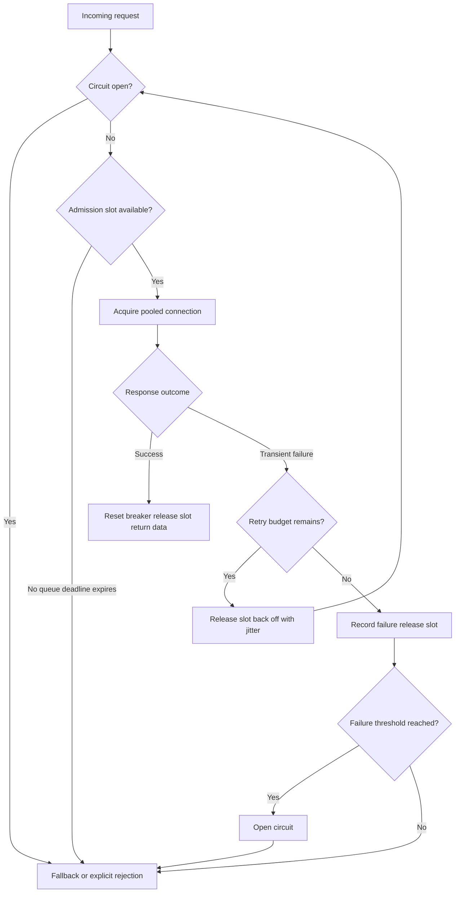

| Difficulty | Channel | Tags |
|---|---|---|
| advanced | backend | asyncio, aiohttp, concurrency |

At Netflix, one slow dependency was enough to turn a local latency spike into a cascading API failure: more than 100 Hystrix command types ran across 40+ thread pools, handling 10+ billion thread-isolated and 200+ billion semaphore-isolated executions per day [1]. In one documented episode, 99.5th-percentile dependency latency caused nearly every machine’s breaker to trip and most traffic to be short-circuited, while a flat 500-error dashboard concealed the damage because users received fallback responses [1]. That is the twist behind resilient connection pools: survival depends less on adding capacity than on releasing pressure before a slow dependency consumes the whole service. The journey from one asyncio semaphore to a production-grade aiohttp safety system starts with a surprisingly uncomfortable question: what should your service refuse to do?

---

> ### Real-World Case — Netflix
>
> Netflix's production API ran more than 100 Hystrix command types across 40+ thread pools, processing 10+ billion thread-isolated and 200+ billion semaphore-isolated command executions per day. When one dependency became slow, held connections and blocked workers could consume shared capacity and turn a local latency spike into a cascading API failure.
>
> | | |
> |---|---|
> | **Challenge** | A failing dependency could exhaust connection and worker capacity, trigger retry storms, and starve healthy services. The system needed hard concurrency limits, aggressive timeouts, circuit breaking, and a safe degraded response while the dependency recovered. |
> | **Solution** | Netflix used Hystrix bulkheads with per-dependency thread pools, queues, and semaphores, plus execution/network timeouts, circuit breakers, rolling health counters, periodic half-open checks, and local fallbacks. The aiohttp analogue is a per-origin semaphore-bounded pool, explicit connect/read/total timeouts, capped exponential backoff with jitter for idempotent requests, bounded admission queues, and open/half-open states that return stale-cache, null, or default data without another remote call. |
> | **Outcome** | In one documented Netflix API incident, 99.5th-percentile dependency latency caused nearly every machine's breaker to trip and most traffic to be short-circuited, yet the dashboard showed no increase in 500s because users received degraded fallback responses. Netflix also documents that increasing pools, queues, timeouts, or semaphores during latency can make the incident worse. |
> | **Lesson** | When a dependency is unhealthy, releasing pressure is more reliable than adding capacity: bound concurrency, retry only within a strict budget, fail fast or serve stale/local data, and restore traffic gradually through health probes. |

---

## Hook — The dashboard is green, but the service is struggling

Building on Netflix’s lesson, picture the greenest incident dashboard in the world: users are still receiving responses, but most contain stale recommendations, default data, or partial results instead of live data. One dependency slows down, connections remain occupied, and every new request joins a queue that nobody bounded. The pool did not crash. It became a very efficient machine for delivering disappointment.

With 100 occupied slots and a 30-second timeout, useful throughput can collapse toward roughly 3.3 calls per second while every connection looks busy. Pool utilization appears healthy, yet users wait longer and the dependency receives less useful work. That is the plot twist: maximum occupancy can be evidence that a pool is failing.

🔥 **Hot Take:** Increasing timeouts, queues, retries, or connection limits during an incident can amplify the outage. Capacity is not resilience; controlled pressure is.

## Problem — Async concurrency still runs out of room

That failure starts with a comforting assumption: because aiohttp is asynchronous, more tasks can safely mean more throughput. Unfortunately, every network call still consumes a connection, a deadline, memory, and some share of downstream capacity. A slow dependency turns those resources into an occupancy problem rather than a throughput problem.

Many developers assume aiohttp does not pool connections. In reality, a long-lived `ClientSession` and its connector already manage reusable connections [2]. The missing layer is usually policy: how many logical calls may run, how long they may wait, which failures justify a retry, and when the service should stop calling a struggling dependency.

| Control | Use it when | Failure it prevents |
|---|---|---|
| Connector limit | Physical connections threaten a host | Socket, file-descriptor, or downstream exhaustion |
| Semaphore | Logical calls overwhelm one dependency | Unbounded task accumulation |
| Queue deadline | Waiting is worse than degrading | Requests lingering past their useful lifetime |
| Retry policy | An idempotent call meets a transient failure | A single blip becoming a user-visible error |
| Circuit breaker | A dependency is broadly unhealthy | Every request paying the same timeout |
| Fallback | A reduced answer is useful | Turning dependency pain into total failure |

However, each control also has a failure mode. A semaphore without a timeout becomes another unbounded queue. Retries without jitter synchronize clients into a thundering herd. A circuit breaker without observability becomes a mysterious source of empty responses. Sound familiar? The difficult part is not adding mechanisms; it is making them cooperate.

## Real-World Case — Netflix

Netflix turns that abstract failure into a documented production story. Its Hystrix operations page describes more than 100 command types, 40+ thread pools, 10+ billion thread-isolated executions, and 200+ billion semaphore-isolated executions every day [1]. In one incident, very high 99.5th-percentile latency caused all but one machine’s breaker to trip. Most traffic was short-circuited, while the remaining machine experienced repeated timeouts [1].

The alarming part was the dashboard: there was no increase in 500s because the failing circuit returned a fallback. The service remained functional, but its product quality had collapsed. Protocol success masked business failure, which is the sort of false green signal that surprises teams during postmortems.

Netflix also documents a revealing capacity example: 100 servers with 10 connections each allow 1,000 concurrent connections, but raising the limit to 20 immediately permits 2,000. If the original 10 were already saturated because the backend was slow, the additional connections do not create capacity; they increase pressure [1]. The operations page does not assign a calendar year to the incident, so none is invented here.

Consequently, the lesson is sharper than ‘open a circuit’: stop spending local resources on work the dependency cannot complete, and make the degraded outcome visible. How should your own dashboard recognize failure when HTTP still returns 200?

## Deep Dive — The five controls and their boundaries

Netflix’s lesson exposes a broader rule: a connection pool is a resource governor, not merely a collection of sockets. Aiohttp’s `TCPConnector` owns physical connection reuse, DNS caching, and per-host limits; the manager adds admission control, deadlines, retries, circuit state, and fallback policy [2].

**1. Connector limits protect transport resources.** Use them to cap sockets and per-host pressure. Keep one `ClientSession` for the application lifecycle rather than creating one per request, because session construction defeats connection reuse [2].

**2. A semaphore protects logical concurrency.** An `asyncio.Semaphore` admits a fixed number of tasks and makes other tasks wait [3]. That is useful when one dependency receives a fan-out, but the wait needs a deadline. With no queue timeout, a semaphore merely converts immediate congestion into indefinite latent work.

**3. Timeouts express the service’s promise.** Use a total request budget, a shorter connect budget, and a read budget. `asyncio.wait_for` can bound semaphore acquisition, while aiohttp’s `ClientTimeout` bounds the network operation. The deadline must be shorter than the caller’s remaining budget; otherwise, the dependency can consume time the application no longer has [4].

**4. Retries need a budget and a purpose.** Retry transient connection errors, timeouts, and selected 5xx responses, preferably only for idempotent operations. HTTP defines GET as safe and specifies that idempotent methods may be retried automatically when failures occur before a response is received [5]. Use exponential backoff with full jitter so clients do not retry in synchronized waves. Honor `Retry-After`, especially for 429 responses [5][8].

**5. A circuit breaker protects the caller.** Closed permits normal traffic, open rejects immediately, and half-open permits a small recovery probe [7]. Production systems should evaluate failures over a rolling window and minimum request volume rather than opening because three unrelated 400 responses happened during a traffic spike. The implementation below uses a simpler consecutive-failure counter.

Moreover, fallback is part of the pool’s contract. A stale cache, reduced response, queued notification, or explicit 503 may be more useful than an indefinite wait. Tag every fallback so dashboards measure degraded results, not just HTTP status codes.

⚠️ **Watch Out:** Retries multiply load exactly when the dependency is least able to absorb it. Never retry a non-idempotent write merely because the exception looks scary. And do not turn a TLS verification failure into a retry storm; that usually signals a certificate or trust configuration problem.

## Workflow — Follow the failure path, not the happy path

Building on those mechanics, the implementation follows seven steps:

1. **Create one long-lived session during application startup.** Configure connector limits, DNS caching, verified TLS, and layered timeouts once.
2. **Check the circuit before joining the concurrency queue.** An open circuit should reject immediately rather than consume admission capacity.
3. **Acquire a bounded admission slot with a queue deadline.** A short wait preserves useful traffic; a long wait only increases latency.
4. **Execute the request through the connector.** Keep every response inside an `async with` block and consume or release it before leaving that block.
5. **Classify the outcome.** Separate non-retriable client errors from transient transport failures, timeouts, and selected server errors.
6. **Retry with exponential backoff and jitter.** Release the admission slot during the delay, enforce an attempt budget, and stop when the caller’s deadline is near.
7. **Return data, a defined fallback, or an explicit rejection.** Emit metrics for queue time, retries, short circuits, fallbacks, and breaker state.

The Mermaid **Graceful Degradation Flow** diagram shows how those decisions connect:

Health checks require the same restraint. The connector detects unusable transports, while a service-level health probe should verify that the dependency can complete meaningful work. Warm only critical dependencies during startup; speculative warm-up can create the same pressure the pool is meant to prevent. Finally, close the session during application shutdown and release semaphore capacity in `finally` blocks, following asyncio cleanup guidance [4][6].

## Code Example — A manager that can say no

Now the workflow becomes executable. The implementation deliberately returns parsed JSON rather than a live `ClientResponse`: once an `async with session.get()` block exits, the response is released, so returning that object creates a classic battle scar.

The admission semaphore and connector share the same maximum because every admitted request can consume at most one connection. The queue wait has its own deadline, while aiohttp applies connect, read, and total network limits. A half-open circuit allows one probe; other callers receive `CircuitOpen` immediately.

The failure path records the attempt, releases the slot, backs off with jitter, and tries again only within the configured budget. A caller can then translate `PoolSaturated`, `CircuitOpen`, or `UpstreamUnavailable` into cached data or a reduced response. That translation belongs in application policy because only the application knows whether stale data, partial data, or no data is acceptable.

For production, create the manager once during the application lifespan. Also replace the consecutive-failure counter with rolling-window metrics, distribute breaker decisions appropriately across replicas, honor `Retry-After`, and attach a global deadline spanning all attempts.

## Lessons Learned — The pool must know when enough is enough

The code is only the beginning; Netflix’s green 500 chart supplies the final lesson. A dependency can be failing operationally while the HTTP layer remains perfectly successful, so resilience requires observability of user outcomes.

| Battle scar | Repair |
|---|---|
| Semaphore capacity is never released | Acquire manually and release in `finally` |
| Queue waits have no deadline | Bound admission with `asyncio.wait_for` |
| Every `ClientError` is retried | Classify errors and retry only transient, safe work |
| Retries use fixed delays | Apply exponential backoff with jitter |
| Breaker opens on three unrelated errors | Require minimum volume and a rolling failure window |
| Session is created per request | Reuse one session for the application lifecycle |
| Response escapes its context manager | Read data before the block exits |
| Only 500-rate alerts exist | Alert on fallback rate, queue time, and short circuits |

Tomorrow, pick one critical outbound dependency and measure healthy p50, p95, p99, and p99.5 latency, connection occupancy, queue delay, retry count, and fallback rate. Use those measurements to set a queue deadline and request timeout. Then run three tests: a slow-body test, a connection-reset test, and a test that sends more calls than the semaphore can accept. Verify that slots return to zero, the circuit opens, fallbacks remain labeled, and shutdown closes cleanly.

💡 **Insight:** The best pool is not the one that keeps every connection occupied. It is the one that preserves the service’s ability to respond while a dependency cannot.

The memorable line for your team is simple: **A connection pool is not a bucket; it is a promise about when to wait, when to retry, and when to stop asking.**

---

## Graceful Degradation Flow

<strong>Original Interview Question</strong>

**Q:** How would you implement a connection pool manager for aiohttp that handles graceful degradation under high load and connection timeouts?

**A:** Implement a connection pool manager for aiohttp using a semaphore to limit concurrent connections, exponential backoff for retrying failed requests, and circuit breaker pattern to gracefully degrade under high load and connection timeouts.

## Conclusion

Netflix’s green 500 chart shows the future every connection-pool design must anticipate: the protocol can succeed while the product fails. Tomorrow, choose one critical aiohttp dependency, measure its healthy latency distribution, bound its queue, classify its failures, and prove that retries, circuit breaking, and fallback work under saturation. The goal is not to keep every request alive at any cost; it is to keep the service useful when the dependency cannot. Remember the line worth sharing: a resilient pool knows when to stop waiting, stop retrying, and return a trustworthy degraded result.

---

## References

1. [Netflix incident report](https://github.com/Netflix/Hystrix/wiki/Operations) — article
2. [aiohttp asynchronous HTTP client and server framework](https://github.com/aio-libs/aiohttp) — documentation
3. [Python asyncio synchronization primitives](https://docs.python.org/3/library/asyncio-sync.html) — documentation
4. [Python asyncio coroutines, tasks, and timeouts](https://docs.python.org/3/library/asyncio-task.html) — documentation
5. [RFC 9110: HTTP Semantics](https://datatracker.ietf.org/doc/html/rfc9110) — documentation
6. [Kubernetes Pod Lifecycle](https://kubernetes.io/docs/concepts/workloads/pods/pod-lifecycle/) — documentation
7. [Circuit breaker design pattern](https://en.wikipedia.org/wiki/Circuit_breaker_design_pattern) — documentation
8. [RFC 6585: Additional HTTP Status Codes](https://datatracker.ietf.org/doc/html/rfc6585) — documentation

---

**Author:** Satishkumar Dhule — [GitHub](https://github.com/satishkumar-dhule) · [LinkedIn](https://linkedin.com/in/satishkumar-dhule) · [Website](https://satishkumar-dhule.github.io)
