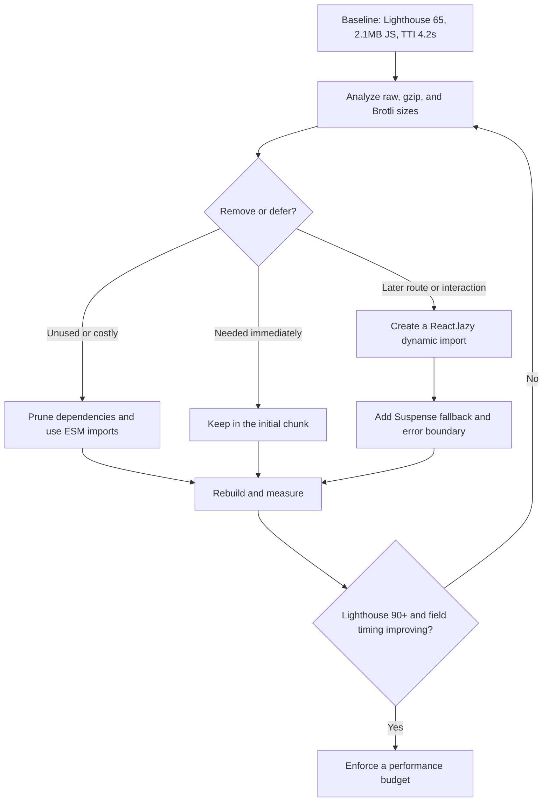

| Difficulty | Channel | Tags |
|---|---|---|
| intermediate | frontend | lighthouse, bundle, lazy-loading |

In 2018, Netflix’s logged-out homepage still shipped roughly 300KB of JavaScript—including client-side React, Lodash, hydration data, and application code—before a prospective customer could sign up or sign in [1](https://medium.com/dev-channel/a-netflix-web-performance-case-study-c0bcde26a9d9). The page looked ready; the critical path was not. Netflix’s response showed that a better Lighthouse score starts with sending less code at the moment it matters. The same playbook can move a 2.1MB, 4.2-second-to-interactive React app toward 90+ without turning the app into a collection of loading spinners.

---

> ### Real-World Case — Netflix
>
> Netflix's logged-out homepage shipped roughly 300KB of JavaScript, including client-side React, Lodash, hydration data, and application code. This delayed interaction on the critical path for prospective customers signing up or signing in.
>
> | | |
> |---|---|
> | **Challenge** | Reduce initial-page JavaScript and Time to Interactive without abandoning Netflix's React-based development model or slowing the subsequent sign-up flow. |
> | **Solution** | Netflix kept React for server rendering but replaced client-side React on the landing page with minimal vanilla JavaScript, cutting over 200KB. It also deferred and prefetched the full React signup bundle using browser prefetch APIs and XHR, allowing the framework to load during idle time before navigation. |
> | **Outcome** | Initial loading and Time to Interactive fell by more than 50%, JavaScript dropped by over 200KB, and prefetching reduced Time to Interactive by 30% for the next-page signup flow. Lighthouse also confirmed the optimized desktop homepage became interactive in under 3.5 seconds. |
> | **Lesson** | The biggest lazy-loading win can come from deferring the framework itself, not merely splitting components. React can remain an excellent server-rendering tool without being shipped to browsers that do not need it immediately. |

---

## Hook — The 2.1MB Cliff

Building on that opening warning, a Lighthouse score of 65 is not a shiny-badge problem. It is a queue: 2.1MB must be downloaded, parsed, compiled, and executed before a user can comfortably click, type, or navigate. A 4.2-second TTI is the visible symptom; the hidden cost is blocked main-thread work, slow devices, and a first impression that can evaporate before the first meaningful interaction.

Many developers reach for React.lazy immediately. That is the plot twist: lazy-loading a giant dependency is like hiding a parachute until the plane is falling. It changes when bytes arrive, not whether the browser eventually needs to process them. The win comes from measuring, removing, and sequencing the right work.

The first question, then, is not “Which component should be lazy?” It is “What does a new customer actually need in the first five seconds?”

## Problem — A Score Is Not a Diagnosis

However, the 2.1MB figure is a symptom, not a diagnosis. Start by separating raw JavaScript from compressed transfer size and parsed size. A bundle that looks enormous in one report may be modest after Brotli, but the browser still has to parse and execute it. Confirm whether the bottleneck is download, long tasks, hydration, oversized images, or a third-party script that quietly arrived with a single import.

Here is what you need to know:
- The initial route matters more than every route combined.
- A dependency is a suspect, not automatically a culprit; inspect its compressed and parsed contribution.
- A large chart library may matter more than a large home page, depending on user intent.
- A lab score is a clue, not a contract with reality.

Pair Lighthouse with browser performance entries and production measurements. PerformanceObserver can expose long tasks and navigation measurements outside a synthetic lab run [4]. That matters because a fast office desktop can hide a painful mid-range Android phone.

Without that map, a team can spend a week making beautiful bundles nobody needed and still miss the one component blocking the first click. So where does a proven optimization begin?

## Real-World Case — Netflix

This leads to the most useful war story in frontend performance: Netflix in 2018 [1]. Its logged-out homepage carried roughly 300KB of JavaScript, including client-side React, Lodash, hydration data, and application code. The delay sat directly on the path for prospective customers trying to sign up or sign in.

Instead of trying to make a huge client application smaller everywhere at once, Netflix server-rendered the first experience, delivered only the minimal JavaScript needed to make that experience interactive, and deferred or prefetched the heavier React application for the signup flow. Initial loading and Time to Interactive fell by more than 50%, JavaScript dropped by more than 200KB, and prefetching reduced Time to Interactive by 30% for the next-page signup flow. Lighthouse showed the optimized desktop homepage becoming interactive in under 3.5 seconds [1].

🔥 Hot Take: The clever move was not adding a fashionable library. It was refusing to ship a framework to people who had not yet needed the framework. That is the principle behind a well-placed React.lazy() boundary: preserve the first useful interaction, then earn the right to load complexity.

The transformation begins with a bundle you can explain. Which module is on that critical path?

## Deep Dive — Split by Intent, Not by Fashion

Building on Netflix’s outcome, optimization becomes a sequence of decisions, not a single lazy() wrapper.

| Option | Use it when | Hidden cost |
| --- | --- | --- |
| Route-based splitting | Dashboard, analytics, settings, and reports are separate destinations | Navigation may wait for its chunk, so likely next routes may need prefetching |
| Component-based splitting | A chart, map, editor, or PDF exporter is below the fold or behind a click | More loading states and boundaries; tiny components do not justify extra requests |

Route-based splitting is usually the first high-leverage move because it aligns code delivery with navigation. Component-based splitting is the scalpel for a heavy feature inside a route. Dynamic import() returns a promise and lets a bundler create a separate chunk, but static imports are easier for analysis and tree-shaking [2]. Use dynamic imports when work is genuinely later, not because the syntax looks advanced.

Next comes tree shaking. Use ES modules and named imports so the bundler can prove which exports are unused [3]. Replace a full utility-library import when only one function is required with a tree-shakeable equivalent, or remove the package entirely. Treat sideEffects as a contract: marking every file false can discard CSS or registration code that the app still needs.

💡 Insight: Lazy loading is not only for JavaScript. For offscreen images, use native loading="lazy" behavior, set dimensions, and keep the hero image eager; the browser can postpone off-screen image work until it is likely needed [5]. When would you use either technique? When the resource is not required for the first useful view. A signup field, primary navigation, and LCP image are poor candidates simply because they are important or large.

Now the question becomes operational: in what order should a team attack a 2.1MB bundle?

## Workflow — From 65 to 90+ Without Guesswork

Therefore, the strategy should be an ordered loop with a budget, not a one-time cleanup. The accompanying Mermaid diagram follows the journey from baseline to release gate.

1. Establish a baseline. Record Lighthouse on a consistent production-like build, note mobile and desktop separately, and save initial-route bytes, LCP, long tasks, and TTI. Do not compare a hot development server with a compressed production build.

2. Find the weight. For a webpack build, run webpack-bundle-analyzer against production stats. It visualizes module composition and compressed sizes, making it easier to find a chart library imported by one menu, a duplicated utility package, or a shared chunk that has become everyone’s least favorite roommate [8].

3. Remove before deferring. Delete unused packages, prefer exact ESM-compatible imports, audit dependencies, and enable safe tree shaking. This is the least glamorous step and often the biggest win because the bytes never reach the network.

4. Split by user intent. Lazy-load route entry points, then isolate heavy widgets such as editors, maps, charting, and PDF generation. Keep fallbacks small and stable so Suspense boundaries do not become new layout-shift factories.

5. Prefetch selectively. When navigation intent is visible, warm the likely chunk. Netflix’s signup result shows the value of prefetching, but prefetching every route recreates the original problem with extra steps. Respect bandwidth and prioritize the next likely action.

6. Cover the rest of the critical path. Lazy-load offscreen images, serve responsive modern formats, preload only the hero asset, and give hashed static assets long-lived Cache-Control headers [6]. Treat a service worker as repeat-visit infrastructure, not a first-visit rescue: cache versioned chunks carefully and remove stale caches during activation [7].

7. Verify in the real world. Re-run Lighthouse, test a throttled mid-range phone, inspect the Network waterfall for a waterfall of tiny requests, and compare production timing entries with the lab result. A performance budget should fail CI when the initial route grows beyond the agreed transfer or parse-size ceiling.

🎯 Key Point: Measure, remove, split, verify, repeat. That is how a 4.2-second wait becomes a sequence a team can control. What should the first implementation look like?

## Code Example — A Route Boundary That Earns Its Keep

Following that flow, the implementation can stay pleasantly boring. React.lazy() turns a dynamic import into a lazy component, while Suspense supplies a fallback while the chunk is fetched. The route boundary keeps unrelated screens out of the initial chunk; the nested boundary keeps a heavyweight report tool out of the reports route until that route actually renders.

⚠️ Watch Out: Suspense handles waiting, not a rejected import or a component crash. Put an error boundary around route chunks and offer a retry or a useful fallback. Also, do not lazy-load a tiny button to hit a chunk-count metric; split by cost and user intent.

## Lessons Learned — Ship the First Interaction, Not the Whole App

Building on that implementation, the final transformation is not a clever trick. It is a team habit: make the first screen small, make deferred work explicit, and make regressions visible.

- Measure compressed, parsed, and real-user timings. A bundle analyzer shows where bytes live; field measurements show what users experience.
- Remove before lazy-loading. The best deferred code is code deleted.
- Keep critical UI eager. Lazy-load a 450KB chart, not the primary call to action.
- Split by expensive boundaries, not arbitrary component counts. Route and intent are better boundaries than fashion.
- Protect caching. Content-hashed chunks and correct Cache-Control headers make repeat visits cheaper.
- Test failure states. Suspense is not an error boundary, imports can fail, and service workers can serve stale assets.
- Watch for waterfalls. Splitting too aggressively turns one large download into a network-request buffet.

Tomorrow, open the production bundle report, list the top five initial-route modules, and give each one a label: delete, replace, eager, or defer. Then rerun Lighthouse on a throttled mobile profile and add a CI performance budget. That single afternoon creates a clearer roadmap than a week of micro-optimizing individual components.

The memorable rule: the best bundle is the one a customer never has to download just to receive value.

---

## Bundle-to-Interaction Optimization Flow

<strong>Original Interview Question</strong>

**Q:** You're tasked with improving a React app's Lighthouse performance score from 65 to 90+. The bundle size is 2.1MB and Time to Interactive is 4.2s. What specific steps would you take to optimize the bundle and implement lazy loading?

**A:** Implement code splitting with React.lazy() and Suspense, analyze bundle composition with webpack-bundle-analyzer to identify largest chunks, remove unused dependencies and optimize imports, add dynamic imports for heavy components and third-party libraries, implement route-based splitting for better initial load times, and utilize tree shaking with proper ES module configuration.

## Conclusion

Netflix’s homepage moved from a JavaScript-heavy first impression to a focused one: the signup flow remained fast, and the heavy experience arrived when it had value [1]. The same playbook can move a React app toward Lighthouse 90+ by analyzing first, removing waste, splitting by route and intent, and enforcing a performance budget. Tomorrow, do not start by wrapping the largest component in React.lazy(); start by asking which code a new customer must not wait for. The memorable rule: optimize the journey, not the bundle screenshot.

---

## References

1. [Netflix incident report](https://medium.com/dev-channel/a-netflix-web-performance-case-study-c0bcde26a9d9) — article
2. [import() - JavaScript | MDN](https://developer.mozilla.org/en-US/docs/Web/JavaScript/Reference/Operators/import) — documentation
3. [JavaScript modules - JavaScript | MDN](https://developer.mozilla.org/en-US/docs/Web/JavaScript/Guide/Modules) — documentation
4. [PerformanceObserver - Web APIs | MDN](https://developer.mozilla.org/en-US/docs/Web/API/PerformanceObserver) — documentation
5. [Lazy loading - Performance | MDN](https://developer.mozilla.org/en-US/docs/Web/Performance/Guides/Lazy_loading) — documentation
6. [Cache-Control header - HTTP | MDN](https://developer.mozilla.org/en-US/docs/Web/HTTP/Reference/Headers/Cache-Control) — documentation
7. [Service Worker API - Web APIs | MDN](https://developer.mozilla.org/en-US/docs/Web/API/Service_Worker_API) — documentation
8. [webpack-bundle-analyzer](https://github.com/webpack-contrib/webpack-bundle-analyzer) — documentation

---

**Author:** Satishkumar Dhule — [GitHub](https://github.com/satishkumar-dhule) · [LinkedIn](https://linkedin.com/in/satishkumar-dhule) · [Website](https://satishkumar-dhule.github.io)
