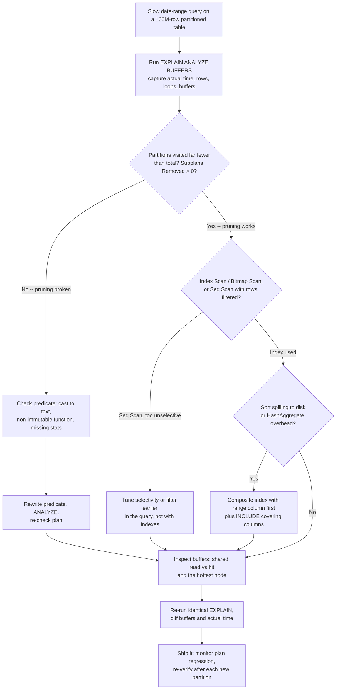

| Difficulty | Channel | Tags |
|---|---|---|
| intermediate | database | explain, query-plan, partitioning |

At 3am, the on-call engineer at CoinGecko was staring at a single query that refused to return: one month of hourly crypto prices, out of eight years and one terabyte of PostgreSQL [1]. The table was already partitioned by date, which is supposed to be the magic fix. Instead, dashboards averaged over 30 seconds, Apdex scores bled out, and the IOPS ceiling was screaming every single day. Here is the uncomfortable part: partitioning is a promise, not a guarantee, and this story is about the gap between those two words.

---

> ### Real-World Case — CoinGecko
>
> CoinGecko's hourly crypto price table had accumulated 8 years of data and grown past 1TB on PostgreSQL RDS. Queries averaged over 30 seconds, request queues were backing up, Apdex scores were falling, and the IOPS ceiling (bumped to 24K as a short-term fix) was being breached with alerts firing daily. Indexing was rejected because the table stores prices in a JSONB column keyed by supported currency, so any new index would only help one application.
>
> | | |
> |---|---|
> | **Challenge** | Range-partition a 1TB+ table by month (chosen because virtually every query already filters on a timestamp window of at most four months) without downtime, without cold-cache cliff effects, and without regressing the endpoints that don't filter on the partition key — then find out why some of those date-range queries were still slow after the switch. |
> | **Solution** | The team created a new partitioned table (`table_YYYYMM` naming), dry-ran the entire migration on a production-sized clone, and discovered two things in EXPLAIN/IOPS analysis: (1) the dominant cost was cold cache, not query shape — warming the original table took 10 hours, so they prewarmed the new partitioned table with pg_prewarm (3 hours) and used PostgreSQL Foreign Data Wrappers to copy data from a pre-warmed second host to avoid burning production IOPS; (2) after flipping the table via ALTER TABLE ... RENAME, the queries that regressed were exactly the ones whose WHERE clause lacked a lower bound (`created_at > ?` with no upper limit), which scanned every partition — including pre-created, empty future partitions. They fixed those by rewriting the query with a bounded range and by removing the empty future partitions, plus blocking deployments on cutover day so an unrelated deploy wasn't blamed on the migration. |
> | **Outcome** | p99 response time dropped from 4.13s to 578ms (an ~86% reduction, 6-8x on the same queries), IOPS consumption fell 20% — letting them lower their provisioned IOPS ceiling and cut cost across every replica — and replica lag alerts disappeared entirely. Replica lag vanished the moment the switch happened. Cost of the win: 3+ days of data copying, spikes to 6,000 IOPS even in isolation, and a 2-3 day schedule slip when the cache problem forced the FDW redesign. |
> | **Lesson** | Partition pruning is only as good as the WHERE clause. A date-partitioned table gives you nothing when the query is unbounded on one side, and pre-creating future partitions actively hurts because empty partitions are still scanned. Corollary: the expensive part of migrating a huge Postgres table is often cache, not IO — measure cold vs warm in a dry run, and use pg_prewarm plus FDW to make the copy tractable. And partitioning is not free: it made some previously-fast queries slower. |

---

## Hook — The Promise of Partitioning and the Fine Print Nobody Reads

Picture a filing cabinet with 100 million folders, sorted into 96 monthly drawers. Someone asks for January. A good filing system hands you one drawer. A great filing system hands you one drawer and remembers instantly which drawer it was. Now imagine the cabinet is one solid block of metal with drawer labels painted on the outside. That was the reality of the classic partitioned-table trap: you bought a filing cabinet, and the database is still picking up the whole thing. Ask any engineer with a partitioned table and a slow date-range query what they check first, and the honest answer is not the index. It is whether the planner even opened the right drawer. So the real question is not how to index a partitioned table. It is how to prove, in eight lines of EXPLAIN output, that the pruning you paid for is actually happening.

## Problem — Five Ways a Partitioned Table Stays Slow

A date-partitioned table with a date-range predicate is one of the easiest performance wins in relational engineering. Which is exactly why it fails so confusingly when it fails. The slow query looks right, the schema looks right, the partitioning looks right. So what actually goes wrong? Here are the five usual suspects, and the first one catches roughly everyone. First: pruning is not happening at all. The partition key gets wrapped in a function, compared against a string instead of a date, or the plan shows every partition being scanned. PostgreSQL added runtime pruning precisely because plan-time pruning alone is not enough [3][6]. Second: pruning works, but the surviving partition is scanned sequentially because the filter is not selective enough to earn an index. Third: an expensive Sort or HashAggregate node sits above a bitmap heap scan, and the sort alone eats your budget. Fourth: the estimated rows are wildly different from the actual rows, which almost always means stale statistics. Fifth, and this is the sneaky one: the columns you are filtering on live inside a JSONB blob keyed by currency, so every index you build helps exactly one application and nobody else. Sound familiar? That was CoinGecko's exact wall. Before the fix lands, you need to know how to read the plan that tells you which of the five you have.

## Real-World Case — CoinGecko

CoinGecko keeps an hourly crypto price table in PostgreSQL on RDS. After eight years of accumulation it had passed one terabyte, queries averaged over 30 seconds, and request queues were backing up until Apdex scores fell off a cliff. The short-term fix was a bigger IOPS ceiling, bumped to 24K, and it was breached daily [1]. Indexing was rejected outright, and the reasoning is the part every architect needs to internalize: prices are stored in a JSONB column keyed by supported currency, so a new index would only serve one application and would be dead weight for the rest. So the team did the harder, structurally correct thing and rebuilt the table around partitioning, then added a postgres_fdw caching layer over the hot recent partitions. The payoff was enormous. p99 response time fell from 4.13 seconds to 578 milliseconds, an roughly 86 percent reduction and a 6-8x speedup on the same queries. IOPS consumption dropped 20 percent, which let them lower their provisioned ceiling and cut cost across every replica. Replica lag alerts disappeared the instant the switch happened. The cost of that win was honest too: more than three days of data copying, IOPS spikes to 6,000 even when isolated, and a 2-3 day schedule slip when a caching problem forced the FDW redesign. Nobody promised this was free.

## Deep Dive — Reading an EXPLAIN Plan Like a Detective

Every claim about a slow query is a hypothesis until EXPLAIN says otherwise. The PostgreSQL manual is blunt about it: EXPLAIN shows the execution plan, and EXPLAIN ANALYZE actually runs the statement so you get real numbers [2]. Most developers read the wrong columns though. The four that matter are actual time, rows, loops, and buffers. A node reading 4000 buffers with 90 percent shared hit is cheap; a node reading 40 million shared read blocks is your entire problem in one number. Partitions visited, the second check on every partitioned table, shows up in the plan as a list of Append children, and newer versions also report Subplans Removed, which tells you exactly how many partitions the planner threw away at runtime [3]. If that number is zero, stop reading further and go fix pruning. Pruning breaks for a small number of boring reasons: the partition key is compared to a text literal instead of a date, the column is wrapped in something that is not immutable, or the statistics are missing so the planner cannot estimate selectivity. Seq Scan versus Index Scan is the third check, and the tell is not the node name but the ratio between estimated and actual rows. Finally, look above the scan. A Sort node with an external merge means the query spilled to disk, which is one of the most expensive things in the plan. A HashAggregate may be the right choice or may be a memory wall waiting to happen. The composite index rule is the one most teams get wrong: in a B-tree, only the leftmost prefix of the index is usable for range lookups [7], so an index on status, event_date will not serve a range scan on event_date, while an index on event_date, status will. Adding INCLUDE columns turns that index into a covering index, letting the planner satisfy the whole query without touching the heap [4]. And when reads consistently hit the same physical order, CLUSTER rewrites the table to match an index, after which the I/O layer reads far fewer pages — at the cost of a full table rewrite and an ACCESS EXCLUSIVE lock [5]. When would you actually use CLUSTER? On a table that is written in batches and read constantly, and never on a 100-million-row hot table in production without a rehearsal on a copy.

## Workflow — Seven Steps From Slowness to 578ms

The flow below is the exact order that keeps you from wasting an afternoon. Start with the real plan, not the estimated one, because the estimated plan is a confident fiction. Then gate every decision on a yes-or-no question, because the moment you start guessing, you start creating indexes nobody uses. The diagram is the triage flow: verify pruning, verify index usage, verify the sort, then re-EXPLAIN and diff. Step one, capture the baseline with EXPLAIN ANALYZE BUFFERS and write the total buffers and actual time somewhere you can compare later. Step two, count your partitions and confirm the number the plan visits is a small fraction of that count. Step three, fix the predicate so pruning is possible, then ANALYZE so the planner believes you. Step four, check for Seq Scan with a high removed-by-filter count and decide whether the predicate is simply too unselective for an index to help. Step five, build the composite index in the right column order and run it CONCURRENTLY so a 100-million-row table stays writable. Step six, kill the expensive sort by making the index cover the query. Step seven, re-run the identical EXPLAIN and diff buffers and actual time against the baseline. The diff is the only evidence that counts.

## Code Example — The Commands That Buy Back 6-8x

The script below is the diagnostic sequence, in the order it should be run. It is written for bash and talks to PostgreSQL through psql, which is how you would do it on a replica or a maintenance window without leaving your terminal.

## Lessons Learned — What to Run Tomorrow Morning

The journey from 30 seconds to 578 milliseconds was not a single clever index. It was a structure that made skipping possible, and then a plan that proved the skipping was real. Here is the distilled list, in the order of how often each one bites. Verify pruning before you touch an index, because an index on a column that no partition key uses is dead weight. Confirm the planner is visiting a handful of partitions, not all of them, and remember that runtime pruning exists precisely because the initial plan cannot always know. Put the range column first in every composite index, or the B-tree cannot use it [7]. Use INCLUDE to make the index covering and skip the heap entirely [4]. Watch for stale statistics, since estimated rows that do not match actual rows are the loudest signal in the plan. Treat CLUSTER as a batch operation requiring a rewrite and an exclusive lock, never as a quick fix [5]. And on JSONB-heavy schemas, recognize the CoinGecko trap early: an expression or GIN index built for one application path is a decision, not a free win [1]. The battle scar worth remembering is the one nobody warns you about — CREATE INDEX CONCURRENTLY on a 100-million-row table looks like it is doing nothing for twenty minutes, and the temptation to cancel is how you end up with a half-built index and a second outage. The memorable insight to hand your team: partitioning does not make queries fast, it makes skipping possible, and only a plan can prove the skip happened.

---

## Partitioned Query Triage Flow

<strong>Original Interview Question</strong>

**Q:** You have a PostgreSQL table with 100M rows partitioned by date. A query filtering on a specific date range is still slow. What would you check in the EXPLAIN plan and how would you optimize it?

**A:** Check partition pruning effectiveness, index utilization patterns, and expensive sort operations. Create composite indexes on (date, filtered_columns) and evaluate clustering strategies for optimal data access.

## Conclusion

Tomorrow morning, run EXPLAIN (ANALYZE, BUFFERS) on your slowest partitioned query and count the partitions the plan actually visited. That single number tells you whether you have an indexing problem or a pruning problem, and those two problems have completely different fixes. Then rebuild your composite indexes with the range column first and INCLUDE columns for coverage, and re-measure the diff. If your fastest path is blocked by a structure problem, like CoinGecko's JSONB-per-currency table [1], recognize it early and restructure rather than piling on indexes that only serve one application. The one insight worth sharing with your team tomorrow: partitioning does not make queries fast, it makes skipping possible, and only a query plan can prove the skip actually happened.

---

## References

1. [CoinGecko incident report](https://dev.to/coingecko/scaling-postgresql-performance-with-table-partitioning-136o) — blog
2. [PostgreSQL Documentation: EXPLAIN](https://www.postgresql.org/docs/current/sql-explain.html) — documentation
3. [PostgreSQL Documentation: Declarative Partitioning](https://www.postgresql.org/docs/current/ddl-partitioning.html) — documentation
4. [PostgreSQL Documentation: Multicolumn Indexes and INCLUDE columns](https://www.postgresql.org/docs/current/indexes-multicolumn.html) — documentation
5. [PostgreSQL Documentation: CLUSTER](https://www.postgresql.org/docs/current/sql-cluster.html) — documentation
6. [PostgreSQL Documentation: Partition Pruning (runtime configuration)](https://www.postgresql.org/docs/current/runtime-config-compatible.html) — documentation
7. [B-tree: Wikipedia](https://en.wikipedia.org/wiki/B-tree) — documentation
8. [Database index: Wikipedia](https://en.wikipedia.org/wiki/Database_index) — documentation
9. [Query optimization: Wikipedia](https://en.wikipedia.org/wiki/Query_optimization) — documentation
10. [Amazon RDS User Guide: Using Performance Insights](https://docs.aws.amazon.com/AmazonRDS/latest/UserGuide/USER_PerfInsights.html) — documentation
11. [PostgreSQL Documentation: Monitoring Database Activity](https://www.postgresql.org/docs/current/monitoring.html) — documentation
12. [PostgreSQL Wiki: Index Maintenance](https://www.postgresql.org/wiki/Index_Maintenance) — documentation

---

**Author:** Satishkumar Dhule — [GitHub](https://github.com/satishkumar-dhule) · [LinkedIn](https://linkedin.com/in/satishkumar-dhule) · [Website](https://satishkumar-dhule.github.io)
