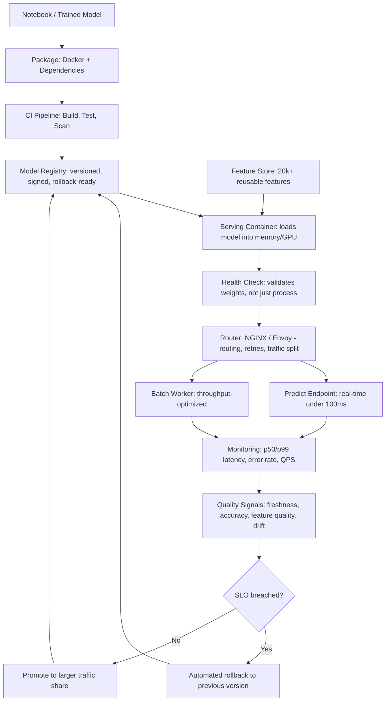

| Difficulty | Channel | Tags |
|---|---|---|
| beginner | devops | mlops, deployment |

Before 2016, Uber's applied scientists prototyped in Jupyter notebooks while every engineer hand-rolled bespoke pipelines to get a model into production. The platform had no established path to deploying a model without creating a custom serving container, and no reproducible way to manage training and prediction workflows at scale [1]. By 2019–2023, business-critical models like Maps ETA, Eats homefeed ranking, and fraud detection had to move from XGBoost to deep learning — and Michelangelo 1.0 had no end-to-end DL support. Teams like Maps ETA spent months building private DL toolkits before shipping a single model. The lesson buried in that story is the one most ML interview questions dance around: deployment and serving are not synonyms, and confusing them is how teams end up with 20,000 models and zero visibility into whether any of them work. This is the mental model that separates teams shipping 10 million real-time predictions per second from teams stuck debugging a Docker build at 2am.

---

> ### Real-World Case — Uber
>
> Before 2016, Uber's applied scientists prototyped in Jupyter notebooks while every engineer hand-rolled bespoke pipelines to get a model into production — the platform explicitly had "no established path to deploying a model into production without creating a custom serving container," and no reproducible way to manage training/prediction workflows at scale. By 2019–2023, business-critical models (Maps ETA, Eats homefeed ranking, fraud detection) needed to move from XGBoost to deep learning, but Michelangelo 1.0 had no end-to-end DL support, so teams like Maps ETA spent months building their own DL toolkits before shipping a first model.
>
> | | |
> |---|---|
> | **Challenge** | Two distinct problems had to be solved separately: (1) deployment — a reliable, reproducible, CI/CD-driven path from a commit to a running model artifact, with versioning, rollback, monitoring and governance, and (2) serving — a low-latency online inference plane for latency-sensitive models. Uber also had to support TensorFlow *and* PyTorch while hiding framework details, and allocate GPUs across 5,000+ GPUs spanning on-prem, OCI and GCP during a Peloton/Mesos-to-Kubernetes migration. |
> | **Solution** | Michelangelo 2.0 split the stack into an explicit control plane + offline data plane + online data plane, with the control plane adopting the Kubernetes Operator pattern and Kubernetes API conventions (Project, Pipeline, Model, Revision, InferenceServer, Deployment as CRDs) so the platform reused the API server, etcd and controller manager. Deployment got solved by "Project Canvas": ML monorepo, Bazel-built immutable Docker images bundling training *and* serving code, declarative pipelines, CI on master, artifact/lineage tracking, plus MA Studio's safe incremental zonal rollout with automatic rollback triggers and production runtime validation. Serving got solved in the online prediction service (OPS): GPU-native feature transforms fused into the TF/TorchScript inference graph to kill training-serving skew, Horovod elastic training, and a migration from Uber's own Neuropod engine to NVIDIA Triton as the multi-framework (TF, PyTorch, Python, XGBoost) GPU-optimized inference engine, layered over Kubernetes with declarative Model/Deployment APIs. |
> | **Outcome** | Roughly 400 active ML projects on the platform, 20,000+ model training jobs per month, 5,000+ models in production serving 10 million real-time predictions per second at peak, 20,000+ reusable features in Palette, and 5,000+ GPUs managed across on-prem and cloud. Deep learning adoption in tier-1 projects went from ~0 to over 60% after the end-to-end support landed (DeepETA alone has 100M+ parameters trained on 1B+ trips), and operational pain that previously caused "stale models in production, poor dataset coverage" and little visibility into online model performance was addressed by the Model Excellence Score framework, which imports SRE/SLA concepts (accuracy, prediction accuracy, model freshness, feature quality) into ML quality management. |
> | **Lesson** | Deployment and serving are genuinely different engineering disciplines, and conflating them is why ML platforms fail. Deployment is about immutability, reproducibility and safe rollout (a model is just a Docker image built from a git commit and promoted through CI/CD with automatic rollback); serving is about latency, batching, framework abstraction and GPU economics. Two counterintuitive lessons: (1) Uber's biggest serving win came from *not* running a bigger model — the platform team concluded that "in several cases, XGBoost outperforms DL in both performance and cost," so tiering models and standardizing the runtime beats chasing deep learning; (2) the serving engine is disposable — they deprecated their own Neuropod and swapped in Triton without changing the platform's API surface, which is only possible because the control plane owns the Kubernetes-style abstraction and the online data plane is a plug-and-play component. Also note the failure mode nobody plans for: a full 8-year journey to make 'deploy a model' a single button, which is exactly the cost teams underestimate when they assume serving frameworks are the hard part. |

---

## Hook — The Model That Trained Fine and Served Nothing

Picture the moment every ML engineer dreads: the training job finished, the loss curve looks beautiful, the notebook output is a printout of shimmering metrics, and then nothing ships. Because the hard part was never the model. It was everything around the model. This is the quiet trap in ML systems work — you can be extremely good at training something and completely unable to make it answer a request in under 100 milliseconds at peak traffic. Uber's own platform team discovered this the expensive way. The stated bottleneck wasn't accuracy, it was the fact that there was "no established path to deploying a model into production without creating a custom serving container" [1]. Sound familiar? Many developers assume the ML work ends when the model is trained. Actually, that is precisely when the engineering gets serious. Uber's eventual footprint makes the stakes concrete: roughly 400 active ML projects, 20,000+ model training jobs per month, 5,000+ models in production, and 10 million real-time predictions per second at peak [1]. That is not a research lab. That is a load-bearing service. And load-bearing services have very different rules than notebooks.

## Problem — Two Words People Confuse, Two Very Different Jobs

Here is the thing though. The words "model deployment" and "model serving" get used interchangeably in job descriptions, conference talks, and Stack Overflow threads — and using them interchangeably is exactly the mistake that costs teams months. Think of it as a two-stage film production. Deployment is everything that happens before the audience takes their seats: the CI/CD pipeline, the container build, the infrastructure provisioning, the model registry, the monitoring and alerting wiring, the rollback plan, the feature store schema. It is the entire machinery of getting the thing into the building. Serving is what happens once the lights go down: the HTTP or gRPC endpoint, request routing, batching under load, model loading into memory or GPU, version selection, autoscaling, and the relentless optimization of tail latency. You can have a flawless deployment pipeline and a terrible serving layer — the model is in production, and it times out anyway. Conversely, a beautiful serving layer with no CI/CD story means a fix takes three days to reach users. Uber's early platform was strong on neither axis, which is why the fix had to be built on both. The symptom everyone complains about is a direct result: "stale models in production, poor dataset coverage" and, critically, almost no visibility into how models behaved once they were actually online [1]. A model that trains beautifully and then quietly degrades in production is not a modeling problem. It is an observability problem. And observability, unlike accuracy, is something you build before you need it.

## Real-World Case — Uber's Michelangelo, From Custom Containers to an End-to-End Platform

Uber's ML platform, Michelangelo, is one of the better-documented cases of this exact transition, and the numbers explain why the deployment/serving distinction is not academic. By the later period, Michelangelo was carrying roughly 400 active ML projects and 20,000+ training jobs per month, with 5,000+ models in production serving 10 million real-time predictions per second at peak, 20,000+ reusable features curated in the Palette feature store, and 5,000+ GPUs managed across on-prem and cloud infrastructure [1]. Here is the twist: none of that scale made the core problem go away, it amplified it. When business-critical models such as Maps ETA, Eats homefeed ranking, and fraud detection needed to graduate from gradient-boosted trees to deep learning, Michelangelo 1.0 simply had no end-to-end DL support. So teams built their own. Maps ETA in particular spent months constructing its own deep learning toolkit before shipping a first model [1] — months of duplicated infrastructure work, the exact waste that platform teams exist to eliminate. The fix was to make the platform cover the whole path rather than just the training path: end-to-end DL support, reusable feature definitions, and an explicit quality framework. That last piece matters most for this conversation. Uber introduced the Model Excellence Score, which imports SRE and SLA concepts — accuracy, prediction accuracy, model freshness, feature quality — into ML quality management [1]. Read that again: they created a monitoring and alerting discipline, an SLO for models. Once that landed, deep learning adoption in tier-1 projects went from roughly zero to over 60% [1]. Models like DeepETA carry 100M+ parameters trained on more than a billion trips [1] — which is exactly the class of model that cannot survive a hand-rolled serving container. Battle scar: the teams that lost the most time were not the ones with the worst models. They were the ones who treated the platform as a training tool and left the serving path to be improvised per project.

## Deep Dive — The Actual Trade-offs Nobody Mentions in the Docs

Now that the shape of the problem is clear, let's get technical. Deployment's job is to make the artifact trustworthy: reproducible builds, immutable versioning, staged rollouts, and a rollback that takes minutes rather than a coffee break. Its vocabulary is Kubernetes, Docker, Terraform, MLflow, SageMaker, Vertex AI, and CI/CD runners like GitHub Actions or Jenkins [1]. Serving's job is to make the endpoint fast and unkillable: request routing, model loading into memory or GPU, autoscaling, and response optimization. Its vocabulary is FastAPI, Flask, gRPC, model servers like TorchServe and TensorFlow Serving, and proxies like NGINX and Envoy [1]. The toolboxes barely overlap, and that is the whole point. Now for the trade-offs that actually decide your architecture. There is a table worth internalizing: on latency versus throughput, a GPU is superb at throughput (cramming thousands of predictions through in parallel) and terrible at latency (any single request waits behind its neighbors in a batch). Real-time traffic under 100ms wants latency-optimized serving; batch work tolerating minutes wants throughput-optimized serving. On batch versus real-time, batch inference amortizes data movement and often gets better GPU economics per prediction, while real-time inference wins when the prediction is worthless the moment it is late — an ETA that arrives 400ms late is worse than no ETA at all. On horizontal versus vertical scaling, horizontal (more pod replicas) gives you elasticity and failure isolation but can hit model-loading cost on every new replica; vertical (more GPU memory, more CPU) is simpler and avoids reload costs but has a hard ceiling and no graceful degradation. On cold starts, the tension is brutal: a scale-to-zero policy saves money when traffic is spiky, but a model that takes 30 seconds to load and warm up will blow your p99 the first time a new replica enters the load balancer. This is where many developers discover the counterintuitive part — autoscaling is not a scaling decision, it is a cold start decision. And the fourth axis is A/B testing, which ties both halves together: traffic splitting and gradual rollouts only work if your registry can address distinct model versions and your router can send a percentage of traffic to each. That means the deployment layer's version discipline is a prerequisite for the serving layer's experimentation ability. Nobody ever mentions that dependency in a tutorial, and yet it is the reason version-naming mistakes become outage causes. Finally, batch versus streaming, and hot reload versus immutable instances: loading a new model into a live process is memory-safe on paper and a latency spike in practice. Blue-green or canary rollouts avoid that spike, at the cost of double capacity during the cutover. Pick deliberately.

## Workflow — From Notebook to Live Endpoint Without the 2am Pager

Building on the trade-offs, here is the sequence that keeps the two concerns from tangling. The Mermaid diagram below tells the story visually: the deployment path (top) produces a versioned, monitored artifact, and the serving path (bottom) consumes it behind a router. Read it left to right — the critical handoff is the registry, because that is where deployment hands off responsibility to serving. Step one, package the model with its dependencies into an immutable container. Step two, register it with a version number, a model signature, and a pointer to the feature definitions it needs. Step three, stand up the serving container with a health check that validates the model actually loads — a liveness probe that only checks the process is running will happily route traffic to a container whose weights failed to deserialize. Step four, put a router in front to handle traffic splitting, retries, and A/B percentages. Step five, wire the monitoring: latency percentiles, error rate, throughput, prediction distribution drift, and freshness of the underlying data. This leads directly to the question that separates good teams from great ones — once the endpoint is live, how do you know the predictions are still good? That is not a serving question, it is a quality question, and it is where Uber's Model Excellence Score came from [1]. Notice the loop at the bottom of the diagram: monitoring feeds back into the registry, so a model whose prediction accuracy silently degrades gets rolled back without a human noticing first. Here is the thing though — step five is the step everyone defers, and it is the step that determines whether your serving system is trusted six months later. 💡 Insight: the router is where serving stops being a library and starts being a system. Whatever sits in front of your model owns retries, timeouts, and traffic policy — and therefore owns your tail latency.

## Code Example — A Serving Layer With Versioned Routing and a Real Cold Start Path

The code below ties the concepts together in a form you can adapt: a small serving process that loads a model by version from a registry-style directory, exposes a versioned predict endpoint, and reports both latency and the inference payload shape so drift is observable. Run it with any lightweight ASGI server, and the pattern translates directly to TorchServe or a containerized BentoML service. The key design decisions are all about the serving half — versions in the URL so traffic splitting is possible, load timing captured so cold start is measurable, and a health endpoint that actually verifies weights rather than just process liveness.

## Lessons Learned — Battle Scars Worth Not Repeating

Pulling the threads together: deployment gets a model safely into the world, serving keeps it alive and fast once it is there, and the two are only as good as the handoff between them. Uber's trajectory from "no established path to deploy a model without a custom serving container" to 5,000+ production models at 10 million real-time predictions per second [1] is the clearest available proof that investing in the platform path beats investing in per-project improvisation. Here is what to take into work tomorrow. First, decide your latency target before you pick hardware — under 100ms for real-time, seconds-to-minutes for batch — because every downstream decision follows from it [1]. Second, treat model loading as a first-class metric; if you cannot see cold start time, you cannot tune autoscaling, and if you cannot tune autoscaling, your p99 is a coin flip. Third, version models explicitly and make the router version-aware from day one, because retrofitting A/B testing into an unversioned serving layer is a rewrite. Fourth, borrow from the SRE playbook that Uber imported into ML quality management [1]: freshness, accuracy, and feature quality deserve SLOs and alerts, not vibes. Watch out for the classic battle scars — a liveness probe that checks only the process, a scale-to-zero policy paired with a 30-second model load, a canary rollout without a rollback rehearsed in advance, and a golden dataset that quietly went stale six months ago. Many developers assume deploying more often is inherently risky; in practice, well-versioned automated deploys are safer than the quarterly heroics they replace. So what should you do differently tomorrow? Pick exactly one production model and write down its latency target, its version, its rollback path, and its freshness signal. If any of those four is blank, you do not have a serving system yet — you have a demo. The one insight worth sharing with your team: the model is not the product. The dependable, observable, reversible path to a prediction is the product.

---

## Deployment to Serving System Flow

<strong>Original Interview Question</strong>

**Q:** Explain the key differences between model serving and model deployment in ML systems, including specific technologies, scaling considerations, and real-world implementation patterns?

**A:** Deployment encompasses CI/CD pipelines, infrastructure setup, and monitoring using tools like Kubernetes, MLflow, and SageMaker. Serving focuses on runtime inference APIs with frameworks like TensorFlow Serving, TorchServe, or BentoML, handling request routing, model versioning, and autoscaling. Key trade-offs include latency vs throughput, batch vs real-time inference, and cold start optimization.

## Conclusion

Uber's arc from hand-rolled custom serving containers to 5,000+ production models at 10 million real-time predictions per second [1] is really a story about refusing to conflate two jobs. Deployment earns the right to ship: reproducible builds, immutable versions, staged rollouts, rehearsed rollbacks. Serving keeps the lights on: low-latency routing, warm models, autoscaling that knows what it costs, and metrics that tell the truth. The one habit worth adopting tomorrow is embarrassingly simple — pick one production model and write down four things: its latency target, its version, its rollback path, and its freshness signal. If any of those is blank, you do not have a serving system, you have a demo that happens to be running. Teams that do this end up spending months less building private toolkits and years more improving the models themselves. Share the framing with your team: the model is not the product; the dependable, observable, reversible path to a prediction is.

---

## References

1. [Uber incident report](https://www.uber.com/us/en/blog/from-predictive-to-generative-ai) — article
2. [Kubernetes Documentation: Concepts, Workloads, and Deployments](https://kubernetes.io/docs/concepts/workloads/controllers/deployment/) — documentation
3. [Kubernetes Documentation: Horizontal Pod Autoscaling](https://kubernetes.io/docs/tasks/run-application/horizontal-pod-autoscale/) — documentation
4. [Kubernetes Documentation: Configure Liveness, Readiness and Startup Probes](https://kubernetes.io/docs/tasks/configure-pod-container/configure-liveness-readiness-startup-probes/) — documentation
5. [TorchServe on GitHub (model serving for PyTorch)](https://github.com/pytorch/serve) — documentation
6. [MLflow: Tracking and Model Registry Documentation](https://github.com/mlflow/mlflow) — documentation
7. [BentoML: Online Serving for Machine Learning Models](https://github.com/bentoml/BentoML) — documentation
8. [FastAPI: High Performance, Python Web APIs](https://github.com/fastapi/fastapi) — documentation
9. [Envoy Proxy Documentation](https://www.envoyproxy.io/docs/envoy/latest/configuration/http/http_conn_man/overview) — documentation
10. [SageMaker Inference Documentation (real-time and async inference)](https://docs.aws.amazon.com/sagemaker/latest/dg/realtime-endpoints.html) — documentation
11. [Hidden Technical Debt in Machine Learning Systems](https://arxiv.org/abs/1706.05347) — paper
12. [Serving ML models in the real-time world: TheMLServer and low latency considerations](https://arxiv.org/abs/2111.14157) — paper

---

**Author:** Satishkumar Dhule — [GitHub](https://github.com/satishkumar-dhule) · [LinkedIn](https://linkedin.com/in/satishkumar-dhule) · [Website](https://satishkumar-dhule.github.io)
