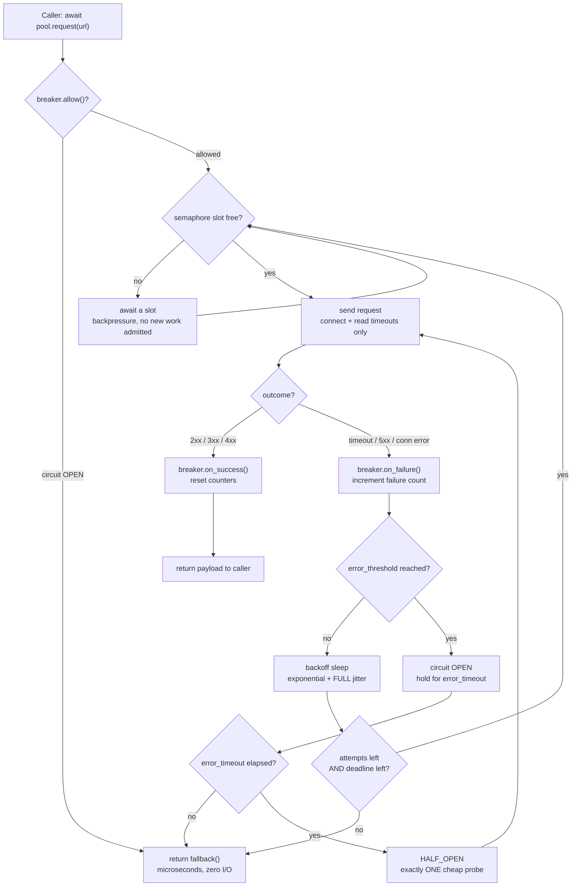

| Difficulty | Channel | Tags |
|---|---|---|
| advanced | backend | asyncio, aiohttp, concurrency |

A worker that had been comfortably handling 5 requests per second suddenly managed 0.5. Nothing was throwing, nothing was alerting on error rates, and the service holding user sessions had simply stopped answering — every connection attempt hung until it timed out [1]. The strangest part of that story is that the team already owned a circuit breaker, and tuning it the way most guides suggest made the worst case require 263% of a thread's capacity — a number that is mathematically impossible, and therefore worse than having no circuit breaker at all [1]. This is the story of how the most trusted pattern in distributed systems became the thing that melted down, and what aiohttp developers should actually build instead.

---

> ### Real-World Case — Shopify
>
> When Shopify's Redis (which stores user sessions) went down, every connection attempt simply hung until it timed out. Because each timeout burned a worker thread while doing zero useful work, request queues grew until the workers were 100% saturated: a worker that normally processed 5 requests/second dropped to 0.5 requests/second — a 10x throughput collapse, with utilization climbing indefinitely. Shopify needed the system to fail fast and degrade gracefully (render the page with sessions soft-disabled) instead of melting down.
>
> | | |
> |---|---|
> | **Challenge** | Containing 'wasted utilization' when a dependency times out, across a fan-out of up to 42 Redis instances per worker. With N dependencies each burning a full service timeout per error_threshold, the pool of connections/threads could be consumed entirely by I/O waiting — so the circuit breaker itself had to be sized mathematically, not by feel. |
> | **Solution** | Shopify wrapped every dependency in its own in-house circuit breaker (Semian) with a bulkhead (concurrency limit per dependency) and a separate breaker per Redis instance, so one bad node couldn't open the whole pool. Damian Polan then derived a 'Circuit Breaker Equation' modeling the steady-state cost of the open/half-open flip-flop: the breaker periodically goes half-open, lets one real request through, and that request eats a full timeout. The fix was to decouple the half-open probe timeout from the service timeout: half_open_resource_timeout 0.25s -> 50ms (justified by production data showing p99 Redis latency  30s, plus success_threshold 2 to prevent flip-flopping during partial outages. |
> | **Outcome** | Required *additional* utilization for the worst case (all 42 Redis instances down, 2-thread Rails worker) fell from 263% — mathematically impossible, i.e. total outage and worse than having no circuit breaker at all — down to 4%. Secondary numbers from the analysis: the naive 5s error_timeout / 1s probe config wasted 37% of total capacity on I/O, and 40 Redis instances with a 1s timeout meant ~40 seconds of pure waiting wasted per recovery cycle. The circuit breaker turned a runaway utilization curve into a stable plateau, leaving users with 'slight request delays' instead of errors. |
> | **Lesson** | A circuit breaker with plausible-looking defaults can be worse than no circuit breaker, because the half-open probe re-injects a full-timeout I/O wait into a worker that has no spare capacity. Size the probe timeout from the dependency's measured healthy p99 (not the client-facing timeout), keep success_threshold >= 2, and remember that a longer open window buys availability at the cost of recovery speed. The identical math applies to an aiohttp pool: bound it with a semaphore/TCPConnector limit, give each host its own breaker state, and never let the probe path hold a pooled connection for the full service timeout. |

---

## Hook — 263%: the utilization that cannot exist

3am pager, healthy-looking error rates, a straight diagonal utilization line off the top of the chart. Redis died silently; nothing threw. 5 rps → 0.5 rps, a 10x collapse [1]. The twist: they already had a circuit breaker, and the worst case (42 Redis instances, 2-thread worker) required 263% additional capacity [1] — mathematically impossible, i.e. worse than no breaker. Hot Take: the most-copied resilience pattern in backend engineering is also the most often shipped with numbers nobody checked.

## Problem — the pool that quietly lies about your capacity

Little's law: concurrency = throughput × latency [11]. A semaphore caps work but not waiting — bounding one without the other relocates the collapse into event-loop latency. Plot twist: aiohttp already has a pool [2][3]; what's missing is the policy layer. Warning: the `async with ClientSession()` per-request antipattern. Then the async twist — no thread burns, but p99, retry stampedes, loop starvation, and late failure signals all do. Bulleted list of the four real costs.

## Real-World Case — Shopify

Sessions soft-disabled [1]. Semian's five parameters and why `name` must be per-instance [7][8]. The 263% → 4% table: `error_timeout` 2s→30s, `half_open_resource_timeout` 0.25s→50ms (justified by 99% of healthy responses under 50ms) [1]. Why raising error_timeout helps: 37% of capacity burned on I/O in an 8s period [1]; 40 instances × 1s = ~40s wasted per cycle [1]. Plus Hystrix's missing knobs and the author's-edit footnote.

## Deep Dive — five dials, and the three most teams never turn

Comparison table (semaphore, deadline, backoff+jitter, breaker, health checks) with 'reach for it when / reach past it when'. A semaphore is not a circuit breaker. Timeout layering: per-hop timeouts are multipliers, not budgets — put one `asyncio.timeout()` outside the retry loop [5]. Retries under load are a self-inflicted load test [9][10]. Hot Take: 4xx is not a failure. Half-open probe budgets. SSL/cleanup/readiness hygiene [12][13][14].

## Workflow — the seven-step request path

Mermaid flowchart (state transitions, guard-first, single cheap probe). Seven numbered decisions: check breaker first, never queue unbounded, align semaphore with connector limit, classify 4xx vs 5xx, release the slot before backoff, check the budget not just the attempt counter, probe with a timeout below healthy p99.

## Code Example — a fail-fast pool manager for aiohttp

225-line annotated walkthrough of the Breaker state machine (one probe via `_probe_in_flight`, one error reopens half-open per Shopify's author edit), session lifecycle, outer `asyncio.timeout` deadline, full-jitter backoff outside the semaphore, 5xx classification, `warmup()`. Battle scars mapped to fixes.

## Lessons Learned — battle scars and Monday morning actions

Eight scars, six concrete actions, and the closer: a breaker with error_threshold=50 isn't lenient, it's a pattern that lets the outage bill you 50 timeouts first. Shareable line: a circuit breaker is not a switch, it is a budget.

---

## Fail-Fast Request Path: Bulkhead, Circuit Breaker and Bounded Retries

<strong>Original Interview Question</strong>

**Q:** How would you implement a connection pool manager for aiohttp that handles graceful degradation under high load and connection timeouts?

**A:** Implement a connection pool manager for aiohttp using a semaphore to limit concurrent connections, exponential backoff for retrying failed requests, and circuit breaker pattern to gracefully degrade under high load and connection timeouts.

## Conclusion

Shopify didn't rewrite their service or buy capacity — they changed two numbers (250ms probe → 50ms, 2s open → 30s) and the worst case went from 263% to 4% [1]. The system had the circuit breaker all along; it had just never been told how much capacity it was allowed to spend failing. Graceful degradation isn't a library you import, it's a set of numbers you choose while everything is green. Measure p99 per upstream, count worst-case failing instances, multiply timeout × retries against your SLA, then break the dependency in staging and watch p99 — not the error rate, which is the metric that looked fine while throughput fell 10x [1].

---

## References

1. [Your Circuit Breaker is Misconfigured — Shopify Engineering (Shopify incident report)](https://shopify.engineering/circuit-breaker-misconfigured) — blog
2. [aiohttp — Client Advanced Usage: connection pooling, keep-alive and timeouts](https://docs.aiohttp.org/en/stable/client_advanced.html) — documentation
3. [aiohttp — Client Reference: TCPConnector, ClientTimeout and ClientSession](https://docs.aiohttp.org/en/stable/client_reference.html) — documentation
4. [Python docs — Synchronization Primitives: asyncio.Semaphore](https://docs.python.org/3/library/asyncio-sync.html) — documentation
5. [Python docs — Coroutines and Tasks: asyncio.timeout and deadline management](https://docs.python.org/3/library/asyncio-task.html) — documentation
6. [Circuit breaker design pattern — closed, open and half-open states](https://en.wikipedia.org/wiki/Circuit_breaker_design_pattern) — documentation
7. [Shopify/semian — Ruby resiliency toolkit for failing fast (Shopify's circuit breaker)](https://github.com/Shopify/semian) — documentation
8. [Netflix/Hystrix — latency and fault tolerance library with a circuit breaker](https://github.com/Netflix/Hystrix) — documentation
9. [Exponential backoff — capped growth and jitter for retry storms](https://en.wikipedia.org/wiki/Exponential_backoff) — documentation
10. [AWS Prescriptive Guidance — Timeout, backoff and jitter with jittered retries](https://docs.aws.amazon.com/prescriptive-guidance/latest/cloud-design-patterns/timeout.html) — documentation
11. [Little's law — L = λW, the math behind concurrency and latency](https://en.wikipedia.org/wiki/Little%27s_law) — documentation
12. [Google SRE Book — Handling Overload: load shedding and queue management](https://sre.google/sre-book/handling-overload/) — documentation

---

**Author:** Satishkumar Dhule — [GitHub](https://github.com/satishkumar-dhule) · [LinkedIn](https://linkedin.com/in/satishkumar-dhule) · [Website](https://satishkumar-dhule.github.io)
