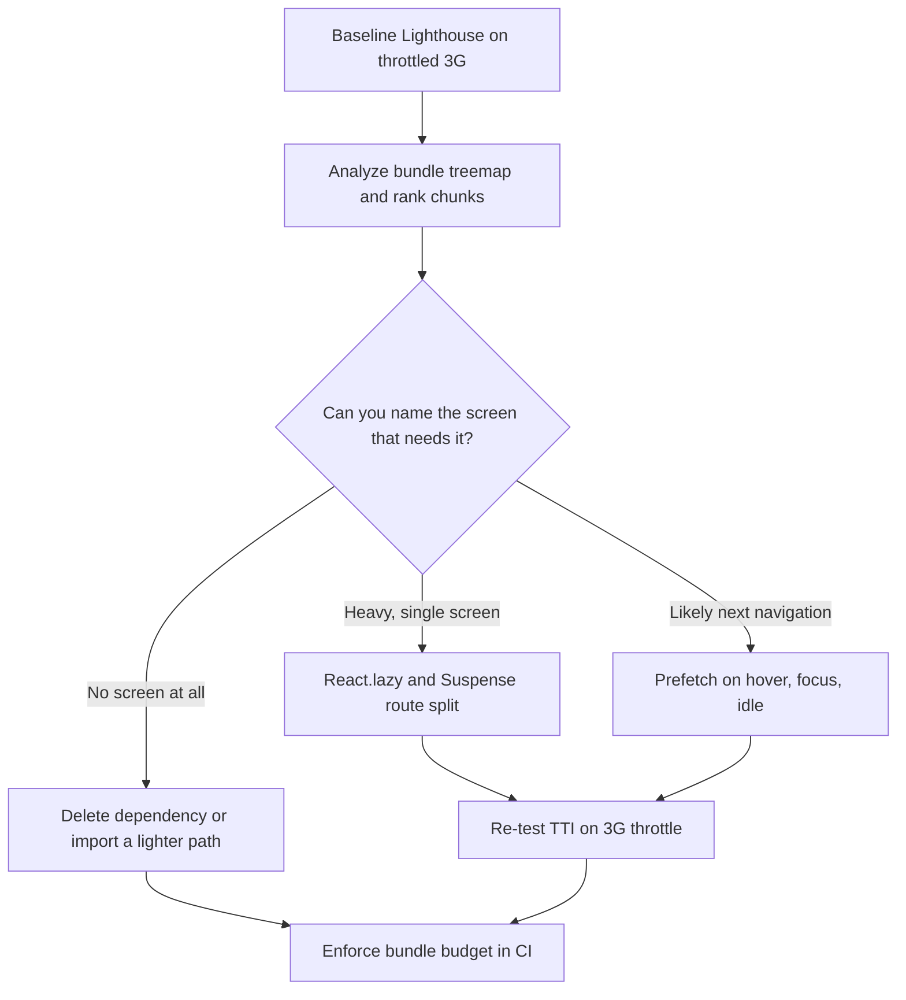

| Difficulty | Channel | Tags |
|---|---|---|
| intermediate | frontend | lighthouse, bundle, lazy-loading |

A landing page that is 95% static HTML should be instant. Netflix's logged-out homepage was not: it shipped roughly 300kB of JavaScript and needed nearly 7 seconds to become interactive on a 3G connection [1]. Here is the twist — React itself was only 45kB of that. This is the playbook for taking a Lighthouse score from 65 to 90+ with bundle splitting, React.lazy, and tree shaking.

---

> ### Real-World Case — Netflix
>
> Netflix.com's logged-out homepage — the landing page where every new subscriber starts their journey — shipped roughly 300kB of JavaScript and took about 7 seconds to become interactive on a 3G connection. Performance audits showed that the page was overwhelmingly static HTML, yet React, Lodash, app code, and the JSON context needed to hydrate React's state dominated the payload. A landing page that hard is a landing page that leaks signups.
>
> | | |
> |---|---|
> | **Challenge** | Cut Time to Interactive and JS payload on the single most commercially critical page of the site (the signup funnel) without rewriting the app or regressing the sign-up flow that follows, using real-user throttling rather than local dev-machine numbers. |
> | **Solution** | Netflix did almost the opposite of the textbook answer: instead of splitting React into more chunks, they quarantined it to the server. React stayed in the stack as a server-side templating engine producing the initial HTML, but React, Lodash, and the app code were stripped out of the client bundle entirely. The few interactions that actually mattered (tab switching halfway down the page, the language switcher — rebuilt in under 300 lines) were reimplemented in plain JavaScript. They evaluated Preact but chose vanilla JS because the page's interactivity was so low. Then they inverted lazy loading: instead of shipping React up front, they XHR-prefetched the HTML, CSS, and the full React bundle needed for the next step, so the framework only arrived over the wire once a user was actually moving toward sign-up. They also experimented with service workers for static resource caching. |
> | **Outcome** | Total JavaScript cut by over 200kB (from ~300kB down to roughly 100kB), which produced a >50% reduction in loading and Time-to-Interactive for the logged-out desktop homepage — validated with Chrome DevTools network throttling and Lighthouse traces, taking TTI from ~7s to under 3.5s on simulated 3G. The prefetch strategy cut Time-to-Interactive by a further ~30% for the subsequent sign-up navigation. Context that surprised everyone: React's own footprint was only 45kB — the libraries and the hydration state data were the real cost. |
> | **Lesson** | Bundle size is not just a bundler problem. The most effective 'code split' can be along the server/client boundary: use the framework to render, then ship the framework only when a user action needs it. Before optimizing imports, measure the payload on throttled 3G and find out whether your framework is the bottleneck or merely the messenger carrying libraries and hydration data you didn't need. Netflix's follow-on work (lazy-loading the video-preview rows as the member scrolls) shows the same principle applied to DOM: render the first few rows, defer the rest. |

---

## Hook — 7 seconds to become interactive on a page with no content

Picture a subscriber who has never seen Netflix. They type the URL on a phone, a throttled 3G connection, and… watch a spinner. That logged-out homepage was overwhelmingly static HTML, yet it shipped roughly 300kB of JavaScript and needed about 7 seconds before content became interactive [1].

Now scale that up in your head. A mid-sized React app sits at a 2.1MB bundle and a 4.2 second Time to Interactive. Lighthouse says 65. Everyone knows the score is bad, and almost nobody can name which kilobyte is guilty.

Here is the part that keeps teams stuck for weeks: the guilt is almost never React. In Netflix's breakdown, React accounted for 45kB of that 300kB. The rest was Lodash, app code, and the JSON context blob that hydrates client state [1]. Optimizing the framework would have moved the needle by a rounding error.

So what actually works? Not a rewrite. A carve-up. This is how a 2.1MB bundle gets cut into pieces the browser downloads only when a human needs them — and why the biggest wins come from a boring analyzer screenshot, not from clever code.

## Problem — 2.1MB of JavaScript, 4.2s to interactive, one Lighthouse score blocking the roadmap

A Lighthouse performance score is not a vibe. It is a bundle of measurements, and two of them dominate: how many kilobytes must arrive before the page can paint, and how long the main thread stays busy afterwards [8].

The classic symptom set looks like this:
- A 2.1MB compressed bundle, mostly one giant chunk
- TTI at 4.2s because a 900kB vendor chunk blocks hydration
- Mid-range Android users bouncing before the spinner even finishes

Here is why it feels so hard to fix. Bundle size is a team-level metric, not a file-level one. One engineer adds a date library, another imports a 400kB icon set through a barrel file, and a JSON context payload quietly grows 30% in a sprint nobody remembers. Nobody broke anything. Performance just bled.

💡 Insight: if a dependency ships in your bundle and you cannot name the screen that renders it, it is dead weight waiting for a ticket.

⚠️ Watch out: TTI punishes long tasks, not just big files. A 300kB chunk that parses fast can be fine. A 120kB chunk running a 900ms synchronous task is the real villain. The analyzer finds bytes; the Performance panel finds jank.

## Real-World Case — Netflix

Netflix ran the numbers on exactly this problem. The logged-out desktop homepage — the very first thing every prospective subscriber sees — carried about 300kB of JavaScript and took roughly 7 seconds to become interactive on simulated 3G. Audits showed a page that was mostly static markup, yet React, Lodash, first-party app code, and the JSON context needed to hydrate React state dominated the payload [1].

The counterintuitive finding: React's own footprint was just 45kB. Libraries and hydration state were the real cost. That single data point reframed the whole effort — the goal stopped being "ship less React" and became "ship less JavaScript nobody asked for yet."

The measured result: total JavaScript dropped by more than 200kB, from about 300kB to roughly 100kB. Loading and Time to Interactive both fell by more than 50% on the logged-out desktop homepage, validated with Chrome DevTools network throttling and Lighthouse traces — TTI moving from about 7 seconds to under 3.5s on simulated 3G [1] [8].

Then came the second win. Prefetching the next step of the sign-up journey cut Time to Interactive by a further ~30% for that following navigation. Once bytes split correctly, latency becomes a scheduling problem — and scheduling is solvable. Sound familiar? Most performance wins are like that.

## Deep Dive — Route-based vs component-based splitting, and the trap in between

Two splitting strategies exist, and choosing wrong is how teams end up with 40 tiny chunks and a worse score than when they started.

| Strategy | Split boundary | Use when | Cost |
| --- | --- | --- | --- |
| Route-based | URL boundary | Every screen is a distinct URL | Extra round trip per navigation unless prefetched |
| Component-based | One heavy widget inside a screen | A chart, editor, or map dominates a page | Suspense boundaries everywhere; easy to over-split |
| Vendor split | Third-party code | A heavy library is used on nearly every route | Churns on every dependency bump |

Route-based splitting wins on app shells and marketing pages: the home route ships the home route. Component-based splitting is the escape hatch for a 300kB charting library that only matters after a user opens a tab.

Here is the plot twist. Tree shaking [6] and code splitting are different tools. Shaking deletes unused exports at build time, but only when packages ship real ES modules and the build respects side-effect metadata. Many CommonJS-era packages simply cannot be shaken, and no amount of lazy loading fixes that.

Dynamic import() is what makes both possible, and it is native JavaScript syntax rather than a library [4] — which is why the same pattern behaves in webpack, Vite, and Rollup alike.

⚠️ Watch out: over-splitting is real. 300 requests of 2kB each loses to one 300kB chunk on cold 3G. Split on user intent, not file boundaries. React.lazy returns a loadable component for precisely this pattern [2] [3].

## Workflow — the six-step surgery, in the order that actually works

The diagram below traces one route from "everything ships at once" to "only intent pays." Follow it left to right.

1. Baseline honestly. Run Lighthouse on the throttled preset and record TTI, bundle bytes, and long-task count [8]. Numbers first, opinions later.
2. Map the bundle. Generate an analyzer treemap and rank chunks by parsed size [7]. Anything in the top ten you cannot name gets a ticket.
3. Kill dead weight. Drop unused dependencies, replace barrel imports with direct paths, and trade a full icon set for the twelve icons actually rendered.
4. Split on intent. Lazy-load routes and heavy widgets, but keep the shared shell eager so navigation never feels hollow [2] [3].
5. Warm the next step. Prefetch the likely-next chunk on hover, focus, and idle — while respecting Save-Data so metered users are not punished [11].
6. Lock it in. Add a bundle-size budget to CI and fail the build when the main chunk regresses. A score nobody guards is a score that gets lost.

🔥 Hot take: step 6 is the one teams skip, and the only one that keeps the win. Every later dependency bump is a fresh chance to undo the entire refactor unless something automated says no.

## Code Example — lazy loading with prefetch, Save-Data guards, and retries

Below is the boring 80% that survives production: lazy loading, intent-based prefetch, data-saver respect, and a retry so one flaky chunk never white-screens the app.

**What each block does:**
- `loadChartEngine()` — dynamic import() of the heaviest library, fetched only when someone opens the analytics tab.
- `routes` — one loader per URL, the unit of route-based splitting.
- `prefetchOnIntent()` — warms chunks on hover, focus, and idle, but returns early for data-saver connections.
- `loadWithRetry()` — a rejected chunk (a deploy landing mid-navigation) retries with backoff before an error boundary catches it.

The subtle part: prefetch reuses the same loader as render, so warmed chunks come from cache instead of being fetched twice. And `once: true` stops listeners stacking up on every re-render — a classic leak in single-page dashboards.

For webpack, pair this with a `splitChunks` rule that isolates `node_modules` into its own long-lived chunk, and mark pure packages with `sideEffects: false` so shaking actually runs [6] [7].

## Lessons Learned — battle scars and the one question that fixes most of it

Scars from teams that learned this the hard way:
- Splitting by file produced 90 requests and a worse TTI. Split on user intent [4].
- Tree shaking silently did nothing because the config lacked side-effect metadata and a dependency shipped CommonJS [6].
- `React.lazy` without a Suspense boundary above it turned a fast page into a blank one. Boundaries are not optional [3].
- Optimizing for a fast developer laptop is how 4.2-second TTI survives. Test on throttled 3G, every time [8].
- Chasing the score instead of the user is the trap. Core Web Vitals thresholds exist for a reason [10].

So what changes tomorrow? Run one analyzer report, name the five largest chunks, and ask of each: which human action requires it? Everything else gets deleted, split, or deferred. That one question beats a week of micro-optimization.

💡 The insight worth sharing with your team: your framework is almost never the culprit. On Netflix's homepage, React was 45kB of a 300kB payload [1]. Measure the bytes nobody asked for, then stop shipping them.

---

## Bundle Optimization Flow

<strong>Original Interview Question</strong>

**Q:** You're tasked with improving a React app's Lighthouse performance score from 65 to 90+. The bundle size is 2.1MB and Time to Interactive is 4.2s. What specific steps would you take to optimize the bundle and implement lazy loading?

**A:** Implement code splitting with React.lazy() and Suspense, analyze bundle composition with webpack-bundle-analyzer to identify largest chunks, remove unused dependencies and optimize imports, add dynamic imports for heavy components and third-party libraries, implement route-based splitting for better initial load times, and utilize tree shaking with proper ES module configuration.

## Conclusion

Netflix's landing page went from roughly 300kB of JavaScript and 7 seconds to interactive down to about 100kB and under 3.5s, with no framework rewrite [1]. A 2.1MB bundle follows the same playbook: measure, split on intent, prefetch, then guard the budget in CI. Tomorrow's first step is one analyzer report and one question — which screen needs this chunk? Answer that for the top ten, and the Lighthouse score moves on its own.

---

## References

1. [Netflix incident report](https://medium.com/dev-channel/a-netflix-web-performance-case-study-c0bcde26a9d9) — article
2. [React.lazy() API reference](https://react.dev/reference/react/lazy) — documentation
3. [<Suspense> reference for React](https://react.dev/reference/react/Suspense) — documentation
4. [MDN: Dynamic import() in JavaScript modules](https://developer.mozilla.org/en-US/docs/Web/JavaScript/Reference/Operators/import) — documentation
5. [MDN: Lazy loading guide for web performance](https://developer.mozilla.org/en-US/docs/Web/Performance/Guides/Lazy_loading) — documentation
6. [Wikipedia: Tree shaking](https://en.wikipedia.org/wiki/Tree_shaking) — documentation
7. [webpack-bundle-analyzer (GitHub)](https://github.com/webpack-contrib/webpack-bundle-analyzer) — documentation
8. [Chrome for Developers: Audit performance with Lighthouse](https://developer.chrome.com/docs/lighthouse/performance) — documentation
9. [MDN: Cache-Control HTTP header](https://developer.mozilla.org/en-US/docs/Web/HTTP/Reference/Headers/Cache-Control) — documentation
10. [web.dev: Defining Core Web Vitals thresholds](https://web.dev/articles/defining-core-web-vitals-thresholds) — documentation
11. [MDN: The <link> element (preload and prefetch)](https://developer.mozilla.org/en-US/docs/Web/HTML/Reference/Elements/link) — documentation
12. [MDN: HTTP caching guide](https://developer.mozilla.org/en-US/docs/Web/HTTP/Guides/Caching) — documentation

---

**Author:** Satishkumar Dhule — [GitHub](https://github.com/satishkumar-dhule) · [LinkedIn](https://linkedin.com/in/satishkumar-dhule) · [Website](https://satishkumar-dhule.github.io)
