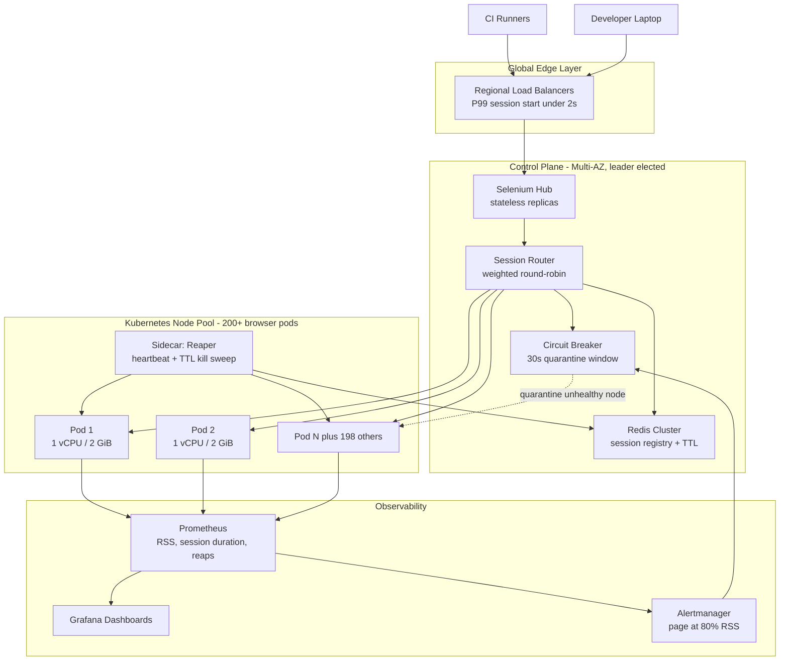

| Difficulty | Channel | Tags |
|---|---|---|
| advanced | system-design | selenium, webdriver, grid |

Somewhere inside eBay Europe's quality engineering org, a regression suite ate five straight days of wall-clock time — roughly 4,500 end-to-end cases at two to three minutes each, executed one after another on a single machine [1]. Nothing off the shelf could fan those tests across browsers, and one wedged Chrome process would take the entire run down at hour three. So the team built its own grid, and turned 116 hours into 60 minutes. This is the story of how that grid worked — and the same blueprint that takes a Selenium Grid to 10,000 concurrent sessions with zero memory leaks.

---

> ### Real-World Case — eBay
>
> eBay Europe's quality engineering org ran ~4,500 end-to-end regression test cases at 2-3 minutes each — roughly 7,000 minutes (~5 days) if executed sequentially. Nothing on the market (or inside Selenium at the time) could distribute those tests across browsers and machines, and wedged browsers/nodes were killing whole runs mid-flight. So the team built its own grid.
>
> | | |
> |---|---|
> | **Challenge** | Parallelize a 5-day end-to-end suite down to under an hour across ~150 VMs and multiple browsers, while making sure a crashed or memory-sunk browser node could be recovered automatically instead of poisoning the rest of the run. Zero application-under-test changes were allowed, and the infrastructure had to be maintainable by a 300+ person test org spread across sites. |
> | **Solution** | Head of Quality Engineering Europe Michael Palotas had engineer François Reynaud build an in-house hub-and-node Selenium grid (it also spoke the JSON Wire Protocol, which Grid 1 could not) and open-source it into the Selenium project — it became the basis of Selenium Grid 2, shipped in Selenium 2 in 2011. The hub did capability-based load balancing; nodes ran on VMware ESX with each browser isolated on its own X display plus tightVNC for live inspection. Crucially, session lifecycle was solved by making nodes disposable: a custom Grid plugin (still visible in grid-spine-selenium) used the VMware VIX API to revert each node to a known-clean snapshot, restart networking, relaunch the WebDriver server, poll until it responded, and only then re-register with the hub — the same 'recycle the executor, keep the hub stateless' pattern that container/K8s grids use today. |
> | **Outcome** | Sequential 7,000 min (~116 hours) → 60 minutes on 150 VMs/browsers, a ~98% reduction (~117x). eBay then reused the identical grid pattern to ship Calabash-Driver, iOS-Driver and Selendroid so web, Win32, mobile web and native apps all scaled through one infrastructure; the team reported zero attrition over 4 years, and the open-sourced Grid grew to roughly 2,000 downloads/day. |
> | **Lesson** | You cannot reliably scrub memory out of a running browser/driver stack, so design the grid so the execution unit is throwaway and the hub is stateless — reset the node (VM snapshot then, ephemeral Pod now) instead of trying to clean it. Selenium 4.41's Dynamic Grid for Kubernetes, where one browser Pod is created per session and deleted the instant it closes, is the same 2011 eBay idea finally expressed natively in the orchestrator. |

---

## Hook — The Run That Died at Hour Three

Picture this. The suite is 71% green, the Slack thread is quiet, and the runner is finally making real progress. Then a single Firefox process eats 3 GB of RAM, the box gets OOM-killed, and 1,300 passing test results evaporate along with it. Nobody knows which tests actually ran. The rerun starts from zero. This is not a hypothetical — this is the default behavior of nearly every Selenium Grid that ships without an explicit session lifecycle manager.

Here is the uncomfortable arithmetic nobody puts in the design doc. A browser session is not a function call that returns and cleans up after itself. It is a leased resource: a Chrome process, a dozen child renderers, a WebSocket, a temp profile directory on disk, and an entry in the hub's routing table. Forget to release one piece and the node slowly turns into a corpse that still accepts work. By the time your dashboards show a red line, the leak has been compounding for hours.

Now scale that corpse across 200 nodes and 10,000 concurrent sessions. One leak per browser per hour is not an edge case — it is your baseline. The teams that survive this are not the ones who buy more hardware. They are the ones who built a reaper.

## Problem — Two Failures Hiding Behind One Symptom

Strip away the drama and Selenium Grid at scale has exactly two failure modes. They are usually confused for one, and that confusion is why grids die.

**Failure mode one: the leak.** Browsers accumulate memory for reasons that have nothing to do with your code — extension registries, WebGL contexts, cached DNS, orphaned renderer processes that survive a tab close, and profile directories that never get deleted. A node that ran 40 sessions at 400 MB each is now sitting at 28 GB. You cannot fix this by calling `driver.quit()` more politely. You need an enforcement mechanism, because the hub and the browser are connected by a TCP socket that dies silently.

**Failure mode two: the wedge.** A browser is still alive, still holding a session slot, but is not making progress — the test driver lost the session, the test threw a non-WebDriver exception, or the process forked into a zombie state. The node looks healthy. Throughput drops. Your P99 session-start latency quietly goes from 900 ms to 11 seconds, and nobody notices until the release train is late.

The naive fix — "just add more VMs" — is a treadmill that costs more every month and hides both problems behind headroom. The slightly-less-naive fix — rolling restarts on a schedule — is worse, because it converts a memory bug into a predictable availability hit.

💡 **Insight:** A health check that only asks "is the process alive?" is measuring the wrong thing. What you actually need to ask is: *is this pod still worth handing a session to?*

## Real-World Case — eBay Builds Its Own Grid

Before Kubernetes, before autoscaling, before any of this was a solved problem, eBay Europe hit exactly this wall. Their quality engineering organization ran a regression suite of roughly 4,500 end-to-end tests, each taking two to three minutes. Serialized, that is about 7,000 minutes — a little over 116 hours, or five full days, per cycle [1].

Nothing on the market could distribute those tests across browsers and machines. Selenium at the time was largely a single-host abstraction, and the commercial grids did not fit. Meanwhile, wedged browsers were killing whole runs mid-flight — the exact scenario painted in the opening section.

So the team built their own grid. The result: the same suite finished in **60 minutes on 150 VMs and 150 browsers** — a ~98% reduction, roughly a 117x speedup [1].

And here is the part that usually gets skipped in blog posts. Once the infrastructure existed, eBay stopped treating it as a Selenium project and turned it into a *platform*. The identical grid pattern was reused to ship **Calabash-Driver, iOS-Driver and Selendroid**, so web, Win32, mobile web, and native apps all scaled through one piece of infrastructure [14]. One routing layer, one session lifecycle manager, many drivers.

The team reported **zero attrition over four years** on the engineering side [1], and the open-sourced Grid grew to roughly 2,000 downloads a day [3]. That is the real lesson: the grid was never a Selenium hack. It was a general-purpose remote-execution substrate that happened to speak WebDriver.

## Deep Dive — Hub, Nodes, and the Leaky Bucket

Modern Selenium Grid is a hub-and-node architecture: a stateless hub accepts sessions and routes them to browser nodes [2]. Keep that shape — it survived because it maps cleanly onto Kubernetes. Then layer the four things that actually decide whether 10,000 sessions is viable.

**1. Session registry with TTL as the source of truth.** Every live session gets a Redis key with an expiry [7]. TTL is not a cache optimization here — it is the crash-recovery mechanism. If the hub dies mid-session, the key still expires, and the reaper on the node side kills the browser anyway. Local in-memory state alone means every pod kill is a session leak.

**2. Reaping, not hoping.** A sidecar on each node owns lifecycle: heartbeats in, `kill -9` out, sweep every five minutes [9]. Deterministic, boring, auditable.

**3. Autoscaling on queue depth, not CPU.** CPU is a lagging indicator for browser nodes — the queue is the leading one [4]. Scale on pending session requests plus observed session-start latency, with the cluster autoscaler handling node-level provisioning [12].

**4. Health that means something.** Readiness probes every 10 seconds, node ejected after three consecutive failures [6], circuit breaker opening a 30-second quarantine window on repeat offenders [10].

Now the memory math, which is where the design usually breaks:

| Approach | Leak surface | Detection | Blast radius when wrong |
| --- | --- | --- | --- |
| Trust `driver.quit()` | Unbounded — one silent TCP death leaks forever | Never | Whole node degrades |
| Weekly rolling restart | Bounded by schedule | Hours | Full pool churn every week |
| RSS watchdog + TTL + heartbeat reaper | Bounded by sweep interval (5 min) | ~5 minutes | One session |

Two GiB per node, 50 sessions per node, 10,000 concurrent sessions → **200 nodes minimum**, 400 GB baseline, ~520 GB with a 30% buffer. That is the number people forget: the *floor*, not the target. And with a Pod Disruption Budget guaranteeing 85% minimum capacity [5], you can only ever take 30 nodes out at once — which is exactly why rolling updates must be throttled or they will breach the SLO during deploys.

⚠️ **Watch out:** the split-brain problem. If two hubs both believe they own a region, you get duplicate session IDs and orphaned browsers that neither hub knows about. Leader election via Raft [11] is not optional at this scale.

🔥 **Hot take:** 99.9% uptime is an availability *arithmetic* problem, not an architecture problem. 0.1% of a month is about 43 minutes. Two planned rolling updates with a sloppy surge setting will eat that budget by themselves.

## Workflow — From Request to Reaped, Step by Step

The diagram below is the whole system in one frame: regional load balancers in front of a leader-elected hub, Redis as the session registry, a browser node pool sized by queue depth, and a sidecar reaper that closes every loop.

**Step 1 — Route.** A CI runner or a developer laptop hits the regional load balancer. P99 session initiation stays under 2 seconds because the balancer fronts three regions and no request crosses an ocean [12].

**Step 2 — Register.** The hub validates capacity, writes `session:` into Redis with a 30-minute TTL, and hands the socket to a node chosen by weighted round-robin based on that node's recent response time and remaining capacity [2].

**Step 3 — Beat.** The node's reaper sidecar records the PID and starts a 30-second heartbeat. If the heartbeat stops, something is wrong with the browser, not necessarily the pod.

**Step 4 — Observe.** Prometheus scrapes RSS, session duration, and reaped-session counts every 15 seconds [8]. Alerts fire at 80% of the pod's memory limit — long before the kubelet's OOMKill does, which is a post-mortem, not a safeguard.

**Step 5 — Reap.** Every five minutes the sidecar sweeps. Session missed heartbeats, exceeded the hard TTL, or the pod crossed its RSS ceiling → kill the PID, delete the Redis key, increment `grid_sessions_reaped_total{reason=...}` [8].

**Step 6 — Isolate.** Three consecutive failed sweeps trip the circuit breaker [10]. The node reports unready for 30 seconds, the router stops selecting it, and in-flight sessions on it get reaped rather than left to rot.

**Step 7 — Replenish.** Queue depth exceeds threshold → HPA scales the pod pool [4] → cluster autoscaler adds nodes [12] → PDB guarantees 85% of capacity stays available during the churn [5].

**Step 8 — Replace, safely.** New node images ship as canaries at 5% traffic. If memory trends spike, the canary never earns the rest. This is how you ship a browser version bump without betting the release on it.

🎯 **Key point:** steps 4 and 5 are the only ones that actually solve the leak. Everything else is capacity management. Teams that get this backwards end up buying hardware to outrun a bug they never killed.

## Code Example — The Reaper Sidecar in Go

Here is the piece of the system that actually delivers "zero memory leaks." It is a sidecar process that runs next to the browser node, keeps Redis as the authoritative session registry, and reaps anything that stops beating.

**Why this shape?** Three deliberate decisions hide in the code. First, the Redis key is written at *registration* time, not at reap time — that way a crash of this process does not orphan the session, because the TTL survives independently [7]. Second, there are three independent kill reasons rather than one: a lost heartbeat catches a wedged browser, the hard TTL catches a driver that never quit, and the RSS ceiling catches the slow leak that neither of the others can see. Third, the breaker state makes the pod report unready rather than restarting — a crash-loop burns far more budget than a 30-second quarantine.

**Line by line:** `Register` decodes the hub's session event and writes the PID into Redis under a 30-minute TTL, then mirrors it locally. `Heartbeat` refreshes the liveness timestamp every 30 seconds. `sweep` is the only place a session dies — it walks the local map under a mutex, buckets each session into a kill reason, deletes it locally, then kills the PID, removes the Redis key, and increments a labelled counter [8]. `recordFailure` opens the circuit breaker after three consecutive failed sweeps [10]; `Ready` half-opens it after the window elapses. `podRSSBytes` reads cgroup v2's `memory.current`, so the ceiling reflects the whole pod including the reaper itself, not just one process.

**The production pro tip buried at the bottom:** run this as a Kubernetes sidecar container [9] with a restart policy, but *never* let the browser be its child process directly. PID reuse after a double-fork will eventually point your `kill -9` at an innocent process. Resolve and validate the PID from `/proc//cmdline` before you signal it — a bug you will only ever see once.

## Lessons Learned — What to Do Differently Tomorrow

eBay proved this pattern works at 4,500 tests and 150 VMs [1]. The leap to 10,000 sessions is not a bigger version of the same problem — it is the same problem with a sharper bill. Here is what changes.

**Battle scars worth inheriting:**

- ⚠️ **Reaping based on process liveness alone.** It passes every test and fails in production. A wedged Chrome is *alive*. Check heartbeats, not PIDs.
- ⚠️ **Scrolling past 80% memory utilization.** Waiting until 90% means your alert and your OOMKill land in the same window. Alarm at 80%, act at 85%, kill at the ceiling.
- ⚠️ **Scaling HPA on CPU.** Browser nodes idle at 30% CPU while their queue grows. Scale on queue depth and session-start latency, not on utilization.
- ⚠️ **Unbounded rolling updates.** Without a Pod Disruption Budget [5] and surge limits, a routine deploy silently breaks your 99.9% target [13].
- ⚠️ **Storing session state only in the hub.** Hub restart becomes a mass leak. TTL in Redis is what makes crash recovery boring [7].

**The concrete starting order.** If you take one thing from this: run one node pool, two sessions per pod, and a reaper with a 5-minute sweep. Watch `grid_sessions_reaped_total{reason}` for a week. The counter that stays flat is the proof your leak is gone. Only then turn up concurrency — and remember the eBay lesson, which is bigger than Selenium. The hard part was never the driver. It was treating browser sessions as *leased infrastructure* with explicit lifecycle rules, exactly like a database connection. Once you make that mental switch, Calabash, iOS, and native Android ride the same grid for free [14].

That is the transformation: from "running tests" to "operating an execution substrate."

---

## Grid Control Plane and Browser Node Pool

<strong>Original Interview Question</strong>

**Q:** Design a scalable Selenium Grid architecture to handle 10,000 concurrent test sessions with 99.9% uptime, ensuring zero memory leaks through automatic session lifecycle management, real-time monitoring, and graceful node failure recovery across multiple data centers?

**A:** Deploy Kubernetes cluster with auto-scaling node pools, Redis session store with TTL policies, Prometheus metrics for memory monitoring, circuit breakers for node isolation, and sidecar containers for session cleanup. Implement health checks, resource quotas, and rolling updates.

## Conclusion

eBay proved this pattern scales: 116 hours became 60 minutes on 150 VMs, and the same grid infrastructure then carried web, Win32, mobile web, and native app execution for years without attrition [1][14]. So what should you do differently tomorrow? Not buy a bigger cluster — start with one small node pool, one Redis-backed session registry with a 30-minute TTL, and one reaper sweeping every five minutes across three kill reasons: lost heartbeat, expired TTL, and RSS ceiling. Watch the reaped-by-reason counter for a week and let it prove the leak is dead before you add concurrency.

The memorable one-liner to take back to your team: a browser session is not a function call, it is a leased resource — and you would never let a database connection leak either. That single reframe is the difference between a grid that pages you at 3am and one that scales to 10,000 sessions and stays quiet.

---

## References

1. [eBay incident report](https://www.sambuz.com/doc/selenium-ppt-presentation-769238) — article
2. [Selenium Grid documentation — architecture and components](https://www.selenium.dev/documentation/grid/) — documentation
3. [SeleniumHQ/selenium repository](https://github.com/SeleniumHQ/selenium) — documentation
4. [Kubernetes — Horizontal Pod Autoscaling](https://kubernetes.io/docs/tasks/run-application/horizontal-pod-autoscale/) — documentation
5. [Kubernetes — Pod Disruption Budgets](https://kubernetes.io/docs/tasks/run-application/configure-pdb/) — documentation
6. [Kubernetes — Configure Liveness, Readiness and Startup Probes](https://kubernetes.io/docs/tasks/configure-pod-container/configure-liveness-readiness-startup-probes/) — documentation
7. [Redis — Keyspace notifications and key expiration](https://redis.io/docs/latest/develop/use/keyspace/) — documentation
8. [Prometheus — monitoring system and client libraries](https://github.com/prometheus/prometheus) — documentation
9. [Kubernetes — Sidecar Containers](https://kubernetes.io/docs/concepts/workloads/pods/sidecar-containers/) — documentation
10. [Circuit breaker design pattern](https://en.wikipedia.org/wiki/Circuit_breaker_design_pattern) — documentation
11. [HashiCorp Raft — consensus for leader election](https://github.com/hashicorp/raft) — documentation
12. [Kubernetes autoscaler — cluster-autoscaler](https://github.com/kubernetes/autoscaler) — documentation

---

**Author:** Satishkumar Dhule — [GitHub](https://github.com/satishkumar-dhule) · [LinkedIn](https://linkedin.com/in/satishkumar-dhule) · [Website](https://satishkumar-dhule.github.io)
