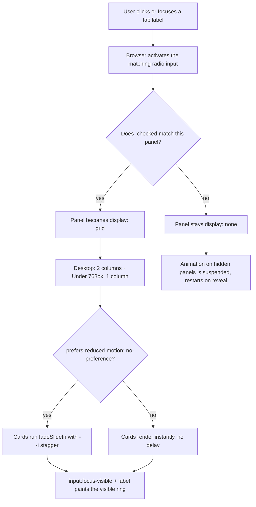

| Difficulty | Channel | Tags |
|---|---|---|
| beginner | frontend | css, flexbox, grid, animations |

On 24 May 2018, a working group of GDS, HMRC, DWP, the Home Office and the EA signed off on a single Tabs component, and then the awkward question came: pure CSS, JavaScript, or something in between? [1] The answer reshaped how millions of UK citizens interact with government services — and it turns out the pattern they chose is the one most developers discover on their own after an hour of wrestling with `:checked` and `:nth-child()`. Here is how a pure-CSS tab panel works, where it breaks, and the accessibility scar that took five years to fully document.

---

> ### Real-World Case — UK Government Digital Service (GOV.UK Design System / govuk-frontend)
>
> The GOV.UK Design System needed a single, audited Tabs component that every UK government service (HMRC, DWP, Home Office, Companies House, GOV.UK Pay) would adopt. Tabs are exactly the widget most often built with the radio-input + `:checked` CSS-only trick, so the team had to decide whether the design system's flagship pattern would be pure CSS, JavaScript, or something in between — and defend that choice with accessibility criteria and user research across 6 browsers and multiple screen readers.
>
> | | |
> |---|---|
> | **Challenge** | Ship tabbed content that degrades gracefully when JavaScript fails, is fully keyboard and screen-reader accessible, keeps the selected tab in browser history and bookmarkable, works on small screens, and doesn't confuse users — while a documented ~1.1% of GOV.UK visits never execute the JavaScript at all. |
> | **Solution** | GDS chose a JS-enhanced, not CSS-only, component: the tabs render as plain links to in-page panels so the no-JS / mobile view is one continuous document with a 'Contents' jump list, and govuk-frontend's `Tabs` module progressively injects `role=tablist`/`tab`/`tabpanel`, `aria-selected`, `tabindex` roving focus, arrow-key handling and `history.replaceState` hash entries. In the public backlog discussion, a service team explicitly asked 'couldn't we just do this in CSS with radio inputs and labels?' and the Design System team replied that they are 'personally wary of using radio inputs against their semantic intent and introducing risk, especially for accessibility, just so that we don't have to ship JS' — noting the technique was originally avoided because older IE lacked the CSS needed to support it. |
> | **Outcome** | Pattern approved by a cross-government working group (GDS, HMRC, DWP, EA, Home Office) on 24 May 2018 and adopted by HMRC, DWP, Home Office, Rural Payments, Reform and the Citizen's Advice design systems. On the DVLA 'Drive in a Clean Air Zone' check-and-pay service, 122 of 136 tested users (89.7%) used the tabbed design to independently select and pay for multiple vehicles across 13 payment dates — the only layout that worked. GDS's own instrumented homepage study showed 509,314 visits, of which 1,113 were explicit `noscript` but 4,329 simply failed to execute JS, proving ~1.1% of visits lose the enhancement and only ~0.2% chose to. A 2023 external WCAG audit still found a AAA issue in the no-JS/mobile view (tab panels lack headings, making the contents skip links meaningless to screen reader and magnifier users). |
> | **Lesson** | Progressive enhancement is not the same as 'never ship JavaScript.' The platform's own form controls (radio groups) are accessible primitives, but repurposing them as tabs hijacks semantics, loses ARIA roles, and — critically — the radio pattern cannot persist state, write history, or keep the page from jumping, so you trade a small bundle for real usability losses. The better fallback is not a fake tab: it is a linear document with a table of contents. And measure your fallback population rather than assuming opt-outs — most missing-JS visits are failures, not choices. |

---

## Hook — The 4,329 Visits Where The Tabs Silently Stopped Existing

Picture a resident of Leeds trying to pay a Clean Air Zone charge. The service shows a grid of vehicles, each needing a separate payment date. In usability testing on DVLA's "Drive in a Clean Air Zone" service, 122 of 136 testers — 89.7% — used the tabbed layout to select and pay for multiple vehicles across 13 different payment dates. It was the only layout that worked.

Now consider what happens when the enhancement that powers those tabs never arrives. GDS instrumented its own homepage and found 509,314 visits, of which 1,113 visitors explicitly opted out of JavaScript and 4,329 more simply had their scripts fail to execute. That is roughly 1.1% of visits losing the enhancement, and only about 0.2% who cared enough to opt out. A pattern used by 1.1% of real traffic is a first-class accessibility requirement, not a nice-to-have.

But the twist arrives later. A 2023 external WCAG audit still flagged a AAA problem in the no-JavaScript and mobile view: the tab panels had no headings, which made the contents skip links meaningless to screen reader and magnifier users. The component was approved, shipped, adopted by six government design systems — and still had a hole in it five years on.

So which pattern survives both a broken CDN and a 2023 audit? That is the question this article answers.

## Problem — Four Widgets, One Spreadsheet, Zero Tolerance

Strip the design system down and the brief looks deceptively small: radio inputs switching panels, a 2×2 card grid on desktop, single column on mobile, fixed 16:9 image areas, a title and a meta line per card, a subtle staggered entrance, visible keyboard focus, and motion that respects `prefers-reduced-motion`. Every one of those is a two-liner in isolation. Together they are where most hand-rolled tabs go to die.

The real problem is not the animation. It is state. Tabs are a stateful widget wearing a stateless costume. A user has to know where focus is, which tab is active, whether the panel below belongs to the tab they just pressed, and how to leave. Radio inputs hand you most of that for free — arrow keys move between them, the browser announces a group, `:checked` is a real state you can select on — and that free accessibility is exactly why the pure-CSS trick keeps resurfacing.

What you do not get for free is hiding the radios without breaking the tab order, restarting an animation when a panel becomes visible again, applying a focus ring to something the user cannot see, and making a mobile grid that does not need a media query for orientation. So here is the design space, honestly labelled:

| Option | JS needed | Keyboard | Screen reader | Survives JS failure |
| --- | --- | --- | --- | --- |
| Radio + `:checked` (pure CSS) | No | Free (radio group) | Adequate, missing headings | Yes |
| Anchor links + `:target` | No | Awkward, no group semantics | Poor | Yes |
| WAI-ARIA APG tabs | Yes | Manual roving tabindex | Best, if implemented correctly | No |
| Progressive enhancement (links, upgraded by JS) | Optional | Best of both | Best of both | Yes |

The APG pattern is the gold standard for an ARIA-implemented tab widget [9], but it only exists if JavaScript runs. The pure-CSS pattern always exists. That trade-off is precisely what the UK government had to defend.

## Real-World Case — GOV.UK Design System and the 2018 Approval

The GOV.UK Design System needed one Tabs component that HMRC, DWP, the Home Office, Companies House and GOV.UK Pay would all adopt, defended against a cross-government working group spanning GDS, HMRC, DWP, the EA and the Home Office [1]. Approval landed on 24 May 2018, and the pattern was subsequently adopted by HMRC, DWP, Home Office, Rural Payments, Reform and the Citizen's Advice design systems.

The payoff was measurable, not theoretical. On the DVLA Clean Air Zone check-and-pay service, tabbed navigation was the only layout out of the alternatives tested where a user could independently select and pay for multiple vehicles across 13 payment dates — 122 of 136 testers, 89.7%, succeeded [1]. Meanwhile the no-JavaScript telemetry (1.1% of 509,314 visits lost the enhancement; only 0.2% opted out) gave the team hard evidence that any enhancement worth shipping has to degrade gracefully.

The uncomfortable coda is the 2023 WCAG audit, which still found a AAA issue: without JavaScript, the tab panels expose no headings, so the contents skip links point at nothing useful for screen reader and magnifier users [1]. Pure CSS solved "the tabs exist." It did not solve "the tabs are comprehensible to everyone." That distinction is the whole lesson, and the code that follows is written with it in mind.

## Deep Dive — The Four Tricks Nobody Tells You

**Trick one: hide the radio, never `display: none` it.** The single most common battle scar is `input { display: none }`. That removes the element from the accessibility tree and the tab order entirely, so the entire keyboard experience dies silently. Use the visually-hidden clip pattern — position it absolute, 1×1px, with negative margins and `clip-path` — and it stays focusable. WCAG's animation-from-interactions criterion, 2.3.3, sits at AAA precisely because the details like this are where implementations fail [8].

**Trick two: the focus ring has to move to the label.** A 1×1px clipped input with `:focus-visible { outline: 2px solid }` [6] draws a 2px ring around a pixel nobody can see. Because each input is immediately followed by its own label, the adjacent sibling combinator [10] hands you a perfect solution: `input:focus-visible + label { outline: 2px solid ... }`. No `:has()`, no JavaScript.

**Trick three: specificity decides who wins.** `.tabs .panel { display: grid }` and `.tabs input:not(:checked) ~ .panel { display: none }` — the second selector scores (0,3,1) against the first's (0,2,0), so the hidden rule wins. If you "simplify" it to `#tab-overview:not(:checked) ~ .panel`, the ID flips the score and every panel renders at once. This is why people copy a working snippet, change one selector, and get a page with four visible panels.

**Trick four: the stagger must not need `:nth-child`.** `.card:nth-child(2) { animation-delay: 0.1s }` works right up to the moment a panel has five cards. A custom property — `--i` set inline, `animation-delay: calc(var(--i) * 60ms)` — scales forever. And the whole animation block belongs inside `@media (prefers-reduced-motion: no-preference)` [5], so the opt-out is enforced by omission rather than by a `reduce` override you might forget. `backwards` fill is non-negotiable; without it, the first frame renders at full opacity and the stagger collapses into a flash.

Finally, `aspect-ratio: 16 / 9` [4] on the image area means zero padding hacks, zero intrinsic-height race conditions, and a grid where every card reserves its space before the image loads. That is the entire reason to use it over a 56.25% `padding-top`.

## Workflow — From Empty Container to Accessible Tabs in Seven Steps

The Mermaid diagram below traces a single click from pointer to pixels, including the two branches where the answer diverges — motion preference and focus visibility. Read it top to bottom and it is also your build order.



Building on that flow, the order matters. **First**, lay out the DOM with all radios and labels as direct siblings, before any panel — the general sibling combinator only reaches forward. **Second**, give every input a shared `name`, because that shared name is what creates the group and gives you arrow-key navigation for free. **Third**, mark the first input `checked` in HTML so the component works with zero CSS applied (a nice progressive-enhancement property, and the reason GDS could hand it to six design systems). **Fourth**, write the grid with `grid-template-columns: repeat(2, 1fr)` and collapse it in a single `@media (max-width: 768px)` block. **Fifth**, hide inactive panels with the higher-specificity sibling rule. **Sixth**, add the motion inside a `no-preference` query. **Seventh**, wire the focus ring to the label.

Here is the thing though — the diagram is missing the step GDS learned the hard way. Add an eighth: give every panel a real heading, even the no-JavaScript one, or your skip links are decorative.

## Code Example — A Build-Step Generator That Emits the Markup and the CSS

For a design-system docs page the markup is repetitive: several tabs, each with a 2×2 grid of near-identical cards. Rather than hand-writing it (and mis-numbering a `--i`), the production-friendly move is to generate the HTML at build time and ship the stylesheet as a string. Run the snippet below with `node build-tabs.js` to get a complete, dependency-free component.

```javascript
/**
 * build-tabs.js — emits a CSS-only tab panel (no runtime JavaScript).
 * Node 18+. Run: node build-tabs.js > tabs.html
 */

// 1. Data drives everything; cards become a 2x2 grid by CSS, not by hand.
const TABS = [
  {
    id: 'overview',
    label: 'Overview',
    cards: [
      { title: 'Set a personal budget', meta: '3 min read · Money & tax' },
      { title: 'Check your Council Tax', meta: '5 min read · Council tax' },
      { title: 'Universal Credit account', meta: '4 min read · Benefits' },
      { title: 'Check your State Pension', meta: '2 min read · Working' }
    ]
  },
  {
    id: 'popular',
    label: 'Most read',
    cards: [
      { title: 'Renew your passport', meta: '8 min · Passports, travel' },
      { title: 'Register to vote', meta: '6 min · Voting, elections' },
      { title: 'Check your VAT refund', meta: '7 min · Business and self-employed' },
      { title: 'Find a job', meta: '9 min · Working, jobs and pensions' }
    ]
  }
];

// 2. One template function per concern keeps the inline --i index honest.
const esc = (s) => String(s).replace(/[&<>]/g, (c) => ({ '&': '&amp;', '<': '&lt;', '>': '&gt;' }[c]));

const cardHtml = (card, i) => `      <article class="card" style="--i:${i}">
        <div class="card__image" role="img" aria-label="Illustration for ${esc(card.title)}"></div>
        <h3 class="card__title">${esc(card.title)}</h3>
        <p class="card__meta">${esc(card.meta)}</p>
      </article>`;

const panelHtml = (tab) => {
  // The panel heading is the fix for the AAA no-JS finding in the 2023 audit.
  const cards = tab.cards.map(cardHtml).join('\n');
  return `  <section class="panel" id="panel-${tab.id}" aria-labelledby="tab-${tab.id}">
    <h2 class="panel__heading" id="heading-${tab.id}">${esc(tab.label)}</h2>
${cards}
  </section>`;
};

const buildTabs = (tabs) => {
  const first = tabs[0].id;
  const inputs = tabs.map((t) =>
    `  <input class="tabs__input" type="radio" name="docs-tabs" id="tab-${t.id}"${t.id === first ? ' checked' : ''}>`).join('\n');
  const labels = tabs.map((t) =>
    `  <label class="tabs__tab" for="tab-${t.id}">${esc(t.label)}</label>`).join('\n');
  // Inputs and labels are siblings first; panels come after so ~ can reach them.
  return `<div class="tabs">
${inputs}
${labels}
${tabs.map(panelHtml).join('\n')}
</div>\n`;
};

const CSS = `
.tabs { display: grid; grid-template-columns: repeat(4, auto); gap: .5rem; }
.tabs__tab { padding: .75rem 1.25rem; border: 1px solid #b1b4b6; border-bottom: 0; cursor: pointer; }

/* 1x1 clip, NOT display:none — the radio must stay in the tab order. */
.tabs__input { position: absolute; width: 1px; height: 1px; margin: -1px; overflow: hidden; clip-path: inset(50%); white-space: nowrap; }

/* Focus ring moves from the invisible input to its visible label. */
.tabs__input:focus-visible + .tabs__tab { outline: 3px solid #1d70b8; outline-offset: 2px; }

.panel { grid-column: 1 / -1; display: grid; grid-template-columns: repeat(2, 1fr); gap: 1.5rem; }
.tabs__input:not(:checked) ~ .panel { display: none; }

.card__image { aspect-ratio: 16 / 9; background: #f3f2f1; border: 1px solid #b1b4b6; }
.card__title { margin: .75rem 0 .25rem; font-size: 1.125rem; }
.card__meta { margin: 0; color: #505a5f; font-size: .875rem; }

/* Motion lives inside no-preference: the opt-out is structural, not an override. */
@media (prefers-reduced-motion: no-preference) {
  .card { animation: fadeSlideIn 300ms ease-out backwards; animation-delay: calc(var(--i, 0) * 60ms); }
  @keyframes fadeSlideIn { from { opacity: 0; transform: translateY(10px); } to { opacity: 1; transform: none; } }
}

@media (max-width: 768px) { .panel { grid-template-columns: 1fr; } }

@media (forced-colors: active) { .tabs__tab { border-color: CanvasText; } }
`;

process.stdout.write(buildTabs(TABS));
process.stdout.write(`<style>\n${CSS}</style>\n`);
```

The generated HTML is complete and valid before a single line of CSS loads — radios, labels, four cards per panel, real headings. The CSS then does exactly four jobs: hide the radios without killing focus, move the focus ring onto the label, switch panels via `:checked` [3] plus the general sibling combinator [10], and reserve image space with `aspect-ratio: 16 / 9` [4]. The animation is scoped inside `@media (prefers-reduced-motion: no-preference)` [5] and driven by `--i`, so it never fires for motion-sensitive users and never needs `:nth-child` bookkeeping. The `forced-colors` block is the quiet Windows High Contrast Mode courtesy nobody remembers to add.

## Lessons Learned — What Survives the Audit

The GOV.UK Tabs component [1][7] shipped in a compiled form in govuk-frontend [2], and the cross-government working group still had to litigate the pure-CSS-versus-JavaScript question with numbers rather than taste. Here is what to carry into your own component library:

- **Pure CSS is a legitimate production choice, not a compromise.** It is the only tab widget that works when the CDN 500s, a corporate proxy strips scripts, or a reader has JS disabled. Argue for it with resilience data, not with ideology.
- **`display: none` on the radio is the classic self-inflicted wound.** It deletes the widget from the tab order. Use the 1×1 clip, always.
- **An invisible focus ring is the same bug in a different costume.** Attach the outline to the label via `input:focus-visible + label`, or you have shipped an invisible ring and claimed it as a11y [6].
- **Reduced motion should be an opt-in, not a patch.** Wrapping animations in `(prefers-reduced-motion: no-preference)` [5] means new animations are motion-safe by default.
- **Use `--i` instead of `:nth-child`.** Four cards today, five next quarter, zero selector edits.
- **Ship headings in every panel.** This is the AAA finding the 2023 audit surfaced [1], and it is free to fix now.
- **Documented intent beats clever code.** Follow the WAI-ARIA APG tab pattern's semantics [9] even when you cannot afford the JavaScript.

So what should change tomorrow? Audit your own components for the two silent failures this pattern hides: an outline drawn on a clipped element, and a panel with no heading for a skip link to land on. Neither throws an error. Both are invisible in a screenshot review.

The one insight worth passing to your team: **a CSS-only tab is not a lesser ARIA tab — it is a radio group with layout, and every accessibility benefit of the platform comes free with the `name` attribute.** The code is thirty lines. The judgement about whether to add JavaScript on top is the actual engineering work.

---

## CSS-Only Tab State Flow


<details>
<summary><strong>Original Interview Question</strong></summary>

**Q:** Build a CSS-only tab panel for a design-system docs page. Use radio inputs to switch tabs (no JavaScript). Desktop: a 2x2 grid of cards under each tab; mobile: single column. Each card has a fixed 16:9 image area, a title, and a short meta line. Add a subtle entrance animation with a stagger and keep focus-visible outlines; ensure prefers-reduced-motion is respected?

**A:** Use a set of radio inputs with a shared `name` attribute and corresponding `` elements for each tab section. The `:checked` state of each radio controls visibility of its associated panel via adjacent sibling selectors. Each panel renders a 2×2 card grid on desktop and collapses to a single column on mobile. Cards use `aspect-ratio: 16/9` for fixed image containers, with a title and meta line below.

</details>

## Conclusion

The most instructive thing about the GOV.UK Tabs component is not the CSS. It is that a component approved in 2018 by five government departments still had a AAA accessibility gap logged in 2023, and nobody noticed for five years — because nothing errors, nothing flashes red, and no screenshot review catches a missing heading.

So here is the Tuesday-morning checklist. Ship the radio-input pattern when the content is small, the tab count is low, and resilience matters more than perfect ARIA semantics — it is genuinely a first-class choice, not a budget compromise, and 1.1% of traffic is a real audience. But give every panel a real heading, move the focus ring to the label, use `--i` instead of `:nth-child`, keep motion inside `no-preference`, and respect `forced-colors`. Then test it with JavaScript disabled, because roughly 1 in 90 visits on a government site will be exactly that.

The one insight to share with your team: **a CSS-only tab is not a lesser ARIA tab. It is a radio group with layout — the accessibility comes free from the `name` attribute, and the only thing left to earn is whether the panels are comprehensible to everyone who lands in them.**

---

## References

1. [UK Government Digital Service (GOV.UK Design System / govuk-frontend) incident report](https://github.com/alphagov/govuk-design-system-backlog/issues/100) — article
2. [govuk-frontend — the GOV.UK Design System frontend library source](https://github.com/alphagov/govuk-frontend) — documentation
3. [MDN — :checked pseudo-class](https://developer.mozilla.org/en-US/docs/Web/CSS/:checked) — documentation
4. [MDN — aspect-ratio](https://developer.mozilla.org/en-US/docs/Web/CSS/aspect-ratio) — documentation
5. [MDN — prefers-reduced-motion media feature](https://developer.mozilla.org/en-US/docs/Web/CSS/@media/prefers-reduced-motion) — documentation
6. [MDN — :focus-visible pseudo-class](https://developer.mozilla.org/en-US/docs/Web/CSS/:focus-visible) — documentation
7. [GOV.UK Design System — Tabs component guidance](https://design-system.service.gov.uk/components/tabs/) — documentation
8. [W3C WAI — Understanding SC 2.3.3: Animation from Interactions (AAA)](https://www.w3.org/WAI/WCAG22/Understanding/animation-from-interactions.html) — documentation
9. [WAI-ARIA Authoring Practices Guide — Tabs pattern](https://www.w3.org/WAI/ARIA/apg/patterns/tabs/) — documentation
10. [MDN — General sibling combinator (~)](https://developer.mozilla.org/en-US/docs/Web/CSS/General_sibling_combinator) — documentation
11. [MDN — CSS grid layout](https://developer.mozilla.org/en-US/docs/Web/CSS/CSS_grid_layout) — documentation
12. [Wikipedia — Progressive enhancement (web development)](https://en.wikipedia.org/wiki/Progressive_enhancement) — article

---

**Author:** Satishkumar Dhule — [GitHub](https://github.com/satishkumar-dhule) · [LinkedIn](https://linkedin.com/in/satishkumar-dhule) · [Website](https://satishkumar-dhule.github.io)
