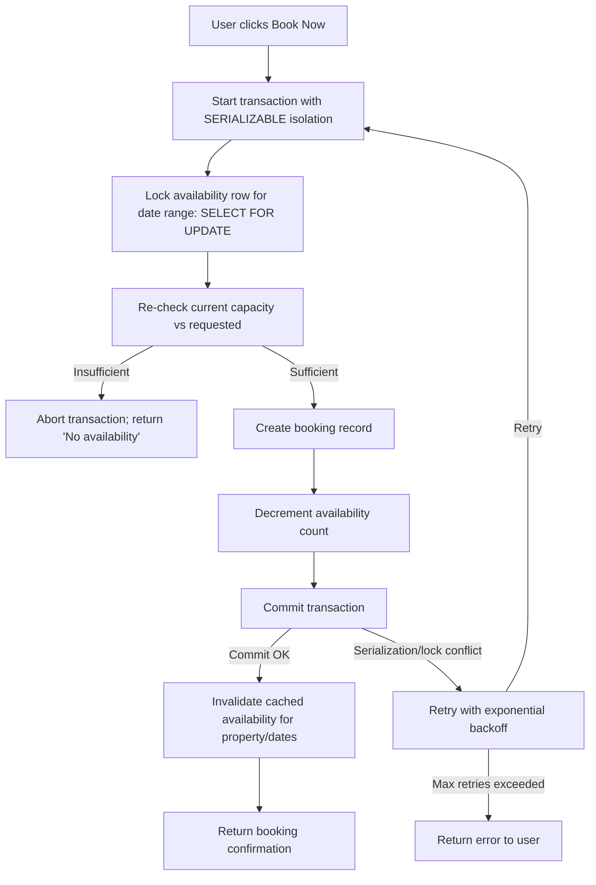

| Difficulty | Channel | Tags |
|---|---|---|
| intermediate | database | acid, isolation-levels, mvcc |

Picture a global travel platform processing thousands of reservations per minute across continents. When Booking.com rebuilt its reservation backbone to unify hotels, flights, and cars under one Order Platform, it faced a fundamental question: how do you guarantee no two people ever book the same room, even when clicks happen simultaneously? Their experience with a distributed system designed to avoid failover pain shows that strong serializable ACID guarantees at extreme scale remain not just possible, but practical for mission-critical booking flows [1].

---

> ### Real-World Case — Booking.com
>
> As part of its "Connected Trip" initiative, Booking.com built a centralized Order Platform to hold all reservation data (hotels, flights, cars, tickets) instead of siloed per-product systems. The platform was originally designed on Cassandra, chosen specifically to avoid the painful master-failover downtimes and application-layer complexity of their sharded MySQL estate. It now orchestrates checkout across payment and fulfillment systems, and its data feeds ML training, finance billing, and the guest-facing confirmation page.
>
> | | |
> |---|---|
> | **Challenge** | Reservation data is transactional by nature, but Cassandra has no real ACID transactions and only provides row-level isolation — which is useless for the multi-step read-modify-write spans (check availability across rows/partitions, then commit the reservation) that a booking flow requires. Booking.com's workaround was a locking layer built on Cassandra lightweight transactions (LWTs), plus a denormalized data model to fake atomicity, plus OpenSearch on the side for secondary indexes. |
> | **Solution** | They abandoned the Cassandra locking layer and migrated Order Platform to CockroachDB (distributed SQL with serializable/ACID guarantees and native CDC), running a single cluster across three regions — Frankfurt and London as primaries, Ireland for extra compute. The ~20TB migration was orchestrated slowly and wrapped in extra tooling to satisfy SOX compliance. Once the database guaranteed serializable ACID, they deleted the application-level "extra cross checks" and compensating services entirely. |
> | **Outcome** | Strong serializable ACID guarantees at a 99.99998% write SLI — which Booking.com's principal engineer explicitly says is "still acceptable for their use case." The system now holds ~20TB across 3 regions, the ambiguous-timeout and OpenSearch-replication costs are gone, and the team is extending CockroachDB as source of truth for streaming to fully "remove some of the components that are actually causing havoc." |
> | **Lesson** | If your store only gives you row-level isolation, you will hand-roll locks and compensating cross-checks in the application layer — and that layer is exactly where double bookings and silent corruption live. Moving the guarantee into the database (serializable + ACID + CDC) let Booking.com *delete* application code rather than maintain it. Two surprises developers rarely expect: (1) CAP ran backwards for them — Cassandra was more available for writes but unsafe, and moving to consistency still bought ~99.99998% write availability; (2) CAS-based optimistic locking fails not by being wrong but by being *ambiguous* — a lightweight-transaction timeout means "unknown," and they could never tell a legitimate precondition failure from an underlying fault, which no retry loop can safely paper over. |

---

## Hook — The Click That Should Never Create Two Bookings

It happens faster than you can blink: two travelers on opposite sides of the world both spot the last room at a beachfront property. They click 'Book Now' at the exact same moment. One expects confirmation; the other expects disappointment. But behind the scenes, without the right safeguards, both could get confirmed — and that's the kind of mistake that turns five-star reviews into one-star nightmares. The stakes are real: overbookings erode trust, create costly reconciliation work, and can damage a platform's reputation overnight. You might think this is an edge case, but for high-traffic booking systems, it's a daily certainty. This tension between correctness and availability is where transaction design becomes make-or-break.

## Problem — Why 'Preventing Double Bookings' Is Harder Than It Looks

At first glance, checking availability and inserting a booking feels trivial: query for remaining inventory, if available, write the reservation. But when many requests hit the same property simultaneously, those operations interleave. Without proper isolation, two transactions can both read 'one room left' and both insert bookings — creating double bookings. The core challenge is maintaining ACID properties [2] while keeping the system fast and available under load. You need strong consistency to avoid conflicts, but strong consistency can introduce contention and latency. The question isn't whether race conditions exist — they do. The question is how you design transactions so that correctness doesn't come at the cost of the experience travelers expect. This is why choosing the right isolation level and concurrency control strategy [3] is critical.

## Real-World Case — Booking.com

Booking.com faced this exact problem at massive scale. As part of its 'Connected Trip' initiative, Booking.com built a centralized Order Platform to hold all reservation data (hotels, flights, cars, tickets) instead of siloed per-product systems [1]. The platform was originally built on Cassandra to avoid master-failover downtimes and application-layer complexity from their sharded MySQL estate. Today it orchestrates checkout across payment and fulfillment systems and feeds ML training, finance billing, and the guest-facing confirmation page. Despite the move to a strongly consistent foundation, the system delivers ~99.99998% write SLI — which Booking.com's principal engineer explicitly calls "still acceptable for their use case." The result: ~20TB across 3 regions, eliminated ambiguous-timeout and OpenSearch-replication costs, and ongoing extension of CockroachDB as the source of truth for streaming to remove components causing instability [1].

## Deep Dive — Isolation, Locks, and MVCC: The Tools That Save You

To prevent double bookings, you need to understand the mechanics of concurrent access. Database isolation levels determine what anomalies are possible [3]. SERIALIZABLE is the strongest level — transactions execute as if serialized, eliminating race conditions. But achieving SERIALIZABLE efficiently often requires a combination of strategies. Multiversion concurrency control (MVCC) [4] lets readers see consistent snapshots without blocking writers, improving availability. Optimistic concurrency control [5] detects conflicts at commit time using version columns, retrying when conflicts occur. Pessimistic approaches like row-level locks (e.g., SELECT FOR UPDATE in PostgreSQL [6]) reserve specific rows/ranges so only one transaction can modify them. The trade-off is clear: pessimistic locking gives strong guarantees but can create contention on hot properties; optimistic locking reduces contention but requires retry logic on conflicts. Exponential backoff [7] helps retries behave gracefully under contention. Finally, caching availability reads can improve latency, but only with correct invalidation on successful bookings to avoid serving stale state. The key insight: combine mechanisms — strong isolation, targeted locking of availability windows, version checks, and resilient retry — to get correctness without sacrificing availability.

## Workflow — How a Safe Booking Actually Happens

A robust booking transaction follows a deliberate sequence that prevents races. First, identify the property and the specific date range being booked. Second, acquire a lock on the availability record for those dates (SELECT FOR UPDATE) to serialize modifications. Third, re-check availability against current state to ensure capacity hasn't changed. Fourth, if available, create the booking record and decrement availability atomically in the same transaction. Fifth, commit; if the transaction fails due to serialization conflict or lock contention, retry with exponential backoff. Sixth, on success, invalidate any cached availability views for that property/dates. The diagram below visualizes this flow, highlighting where conflicts are detected and retried. This pattern balances correctness and resilience even under heavy load [6][7].

## Code Example — Implementing Safe Transactions in Practice

The code example demonstrates a practical pattern: start a transaction with SERIALIZABLE (or equivalent), lock the availability row for the target dates, validate capacity, write the booking, commit, and retry on serialization failures. Inline comments explain each step, and the structure mirrors production patterns where you separate availability checks from booking creation but tie them together atomically. The example shows how retry with backoff is essential when using optimistic/serializable strategies under contention.

## Lessons Learned — What to Do Differently Tomorrow

Strong correctness doesn't require sacrificing availability if you choose the right combination of tools. You should use SERIALIZABLE where correctness is non-negotiable, but pair it with targeted locking (e.g., SELECT FOR UPDATE on specific date ranges) to minimize contention. Implement retry with exponential backoff for serialization failures. Embrace MVCC for read-heavy availability checks, and be disciplined about cache invalidation after successful writes. Monitor lock contention on hot properties and consider sharding/partitioning strategies when contention spikes. Most importantly, design for conflict as a normal case under load — not an exception. If you internalize this, you'll build booking systems that protect both your users' trust and your platform's reputation.

---

## Booking Transaction Flow with Conflict Handling

<strong>Original Interview Question</strong>

**Q:** You're building a booking system for Airbnb where multiple users can reserve the same property simultaneously. How would you design the transaction handling to prevent double bookings while maintaining high availability?

**A:** Use SERIALIZABLE isolation with optimistic concurrency control. Implement row-level locks on property availability tables, use MVCC snapshot reads for checking availability, and apply application-level validation to ensure atomic booking operations.

## Conclusion

Double bookings aren't caused by bad luck — they're caused by unsynchronized access to shared state. By combining SERIALIZABLE isolation, targeted row locking, MVCC-aware reads, optimistic version checks, and retry with backoff, you can prevent races without grinding your system to a halt. The Booking.com story shows this balance is achievable at extreme scale. So tomorrow, when you design a booking flow, don't just check availability — design the transaction as if two people will click at the same millisecond. Your users (and your on-call rotation) will thank you.

---

## References

1. [Booking.com incident report](https://www.cockroachlabs.com/customers/booking-com) — article
2. [ACID (database transactions)](https://en.wikipedia.org/wiki/ACID) — documentation
3. [Isolation (database systems)](https://en.wikipedia.org/wiki/Isolation_(database_systems)) — documentation
4. [Multiversion concurrency control (MVCC)](https://en.wikipedia.org/wiki/Multiversion_concurrency_control) — documentation
5. [Optimistic concurrency control](https://en.wikipedia.org/wiki/Optimistic_concurrency_control) — documentation
6. [PostgreSQL: Explicit locking (SELECT FOR UPDATE)](https://www.postgresql.org/docs/current/explicit-locking.html#LOCKING-ROWS) — documentation
7. [Exponential backoff](https://en.wikipedia.org/wiki/Exponential_backoff) — documentation
8. [PostgreSQL: Transaction Isolation](https://www.postgresql.org/docs/current/transaction-iso.html) — documentation

---

**Author:** Satishkumar Dhule — [GitHub](https://github.com/satishkumar-dhule) · [LinkedIn](https://linkedin.com/in/satishkumar-dhule) · [Website](https://satishkumar-dhule.github.io)
