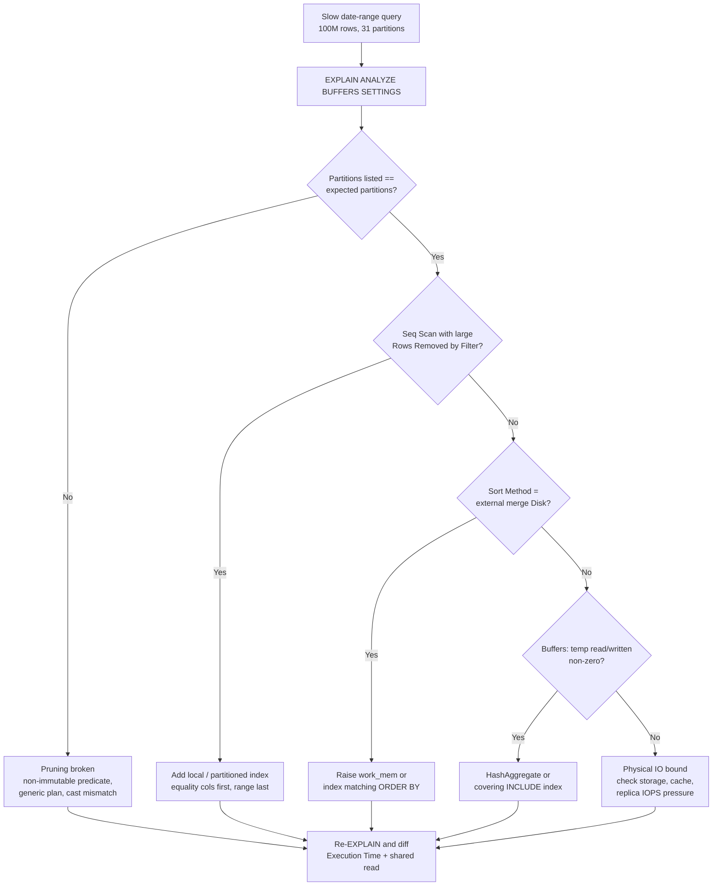

| Difficulty | Channel | Tags |
|---|---|---|
| intermediate | database | explain, query-plan, partitioning |

CoinGecko's `prices` table had grown past 1 terabyte after eight years of hourly crypto data, and price queries had quietly crept past 30 seconds on average. Every traffic burst to a price endpoint sent IOPS over the cliff, request queues grew, and Apdex dropped while daily IOPS threshold alerts kept firing even after provisioned IOPS were pushed to 24,000 [1]. What made it genuinely scary was not the slow query — it was that a table already partitioned by date was supposed to make exactly this problem disappear. The fix took p99 response time from 4.13s to 578ms, an 86% reduction [1], and the lesson underneath it is one every Postgres engineer learns the hard way: partitioning is a promise, and EXPLAIN is where you find out whether the database kept it.

---

> ### Real-World Case — CoinGecko
>
> After 8 years of accumulating hourly crypto price data, CoinGecko's `prices` table had grown past 1TB and queries took over 30 seconds on average. IOPS spiked with every traffic burst to price endpoints, request queues grew, Apdex dropped, and daily IOPS threshold alerts fired — they'd already bumped provisioned IOPS to 24K and were still breaching it. This was now an SLO/SLA risk, not just a slow query.
>
> | | |
> |---|---|
> | **Challenge** | Diagnose whether the problem was index coverage or table structure, and get a 1.2TB hot table onto date-range partitioning in production with no downtime and no SLO violation. Adding indexes was the obvious first move but failed: the payload was a JSONB column keyed by supported currency, so any useful index would only serve one consumer application. |
> | **Solution** | Range partitioning by month, chosen because almost every query on this table already filters on a timestamp range and never needs more than ~4 months — so month granularity caps each query at ~4 partitions. They rehearsed the entire migration on a production-identical database first to measure before/after query time, copy duration, warm-up time, and CPU/IOPS. Key findings from the dry run: 6-8x speedup on the same queries, 3+ days to copy data, 6,000 IOPS of read traffic (equal to their entire normal production load), and 10 hours to prewarm the old table vs 3 hours for the partitioned one. Go-live then blew up because production's cache was far too cold to copy even one day of data (killed at 15 min). Their fix was to provision a second production-grade database, prewarm it there, and use a Postgres foreign data wrapper to read from the warm host and write into the partitioned table on production — sidestepping the IOPS ceiling entirely and costing 2-3 extra days. Cutover was a rename-swap inside a transaction, keeping the old table plus triggers as a rollback path. |
> | **Outcome** | p99 response time dropped from 4.13s to 578ms — an 86% reduction — and IOPS fell 20% right after the switch, letting them right-size IOPS across multiple replicas (multiplied cost savings). Replica lag disappeared at cutover. The rollback path also became expensive, since reverting would require re-prewarming the old table from cold. |
> | **Lesson** | Partitioning is not a universal accelerator — it can make a specific query dramatically slower. CoinGecko found one query that got worse after cutover because it had no upper bound on the date range, so it scanned every partition, and the identical query was fast on the unpartitioned table. A second regression came from their own operational shortcut: pre-creating all of 2025's partitions so a `created_at > ?` query with no upper limit began scanning empty future partitions. The real lesson is that you must audit every query's WHERE clause for a bounded partition key BEFORE migrating, and stage the migration on a production-identical database — because their dry run predicted a 6-8x win while production's cold cache produced a copy job they couldn't finish, and a concurrent deployment muddied their metrics badly enough that rollback was nearly called. |

---

## Hook — The Plan That Looked Perfect and Was Not

Here is the number that should keep a Postgres engineer awake: 86% of the response time disappeared from one structural change to how a single table was organized [1]. Not 86% faster hardware. Not 86% more RAM. Eighty-six percent, from finally getting the database to touch the rows it needed and nothing else.

Sound familiar? The uncomfortable truth about slow-query debugging is that the plan almost always looks reasonable. `Index Scan using idx_events_date` — of course, that is the good one, right? The trap is that a plan can be textbook-correct and still push 40 million rows through a filter. And when a table is partitioned, three quiet things decide whether a date-range query is fast or glacial: which partitions survived pruning, whether the surviving partitions used indexes at all, and whether the sort spilled to disk. All three are printed by `EXPLAIN (ANALYZE, BUFFERS)`, the plan a cost-based optimizer like Postgres builds to estimate the cheapest path [2]. All three are routinely ignored.

The deeper lesson from CoinGecko is not "partition harder." It is that a 1TB table does not care about your data modeling. It cares about how many 8KB pages your query had to read, and it bills you for every one of them [1].

## Problem — Partitioning Is a Promise, Not a Guarantee

Here is the trap. Teams partition a 100M-row table by day, deploy it, declare victory — and then a filter on a specific date range is still slow. Why? Because partitioning only does one job: it lets the planner throw away entire partitions before any rows are touched. That is genuinely powerful, but it is a narrow power, and it collapses under a handful of very common conditions.

Common failure modes, all of them invisible unless you read the plan:

- **Pruning silently did not happen.** A non-`IMMUTABLE` expression, a function-wrapped column, or a type mismatch that forces a cast can stop partition elimination cold.
- **Prepared statements hid it.** A generic plan chosen after five executions can lose the specific constant values that made pruning possible.
- **`EXPLAIN` without `ANALYZE` lies a little.** It shows plan-time pruning. Runtime pruning — where the scan discovers mid-execution that it can skip a subplan — only appears with `ANALYZE` and a line reading `Subplans Removed: N`.
- **The index was on the wrong table.** A b-tree [4] built on the parent of a partitioned table does not exist for the children until you attach it. New partitions created overnight often arrive with zero indexes, which is why automated tools like pg_partman exist [9].
- **The surviving partitions were scanned anyway.** A `Seq Scan` with `Rows Removed by Filter: 8,412,993` is a sequential scan wearing a filter as a disguise.
- **The sort spilled.** `Sort Method: external merge  Disk: 41208kB` means the sort outgrew `work_mem` and hit disk, right inside your per-partition query loop.

Plot twist number one, before the fix even shows up: a 100M-row table can have *perfect* partition pruning and still crawl. Pruning narrows the blast radius. It does not make a 30M-row filter cheap. Many developers treat pruning as the finish line; it is the starting gun.

## Real-World Case — CoinGecko's 1TB `prices` Table

CoinGecko had been accumulating hourly crypto price data for roughly eight years. By the time anyone looked closely, the `prices` table had crossed 1 terabyte, and average query time on price endpoints had ballooned past 30 seconds [1]. The symptoms were the classic IOPS death spiral:

- IOPS spiked with every traffic burst hitting price endpoints.
- Request queues grew, Apdex fell, and daily IOPS threshold alerts fired.
- Provisioned IOPS were already pushed to 24,000 — and still breaching.
- What started as "a slow query" had become an SLO and SLA risk, not a performance annoyance.

The team reorganized the table around its access pattern rather than around the calendar, and the numbers moved immediately [1]:

| Metric | Before | After | Change |
| --- | --- | --- | --- |
| Table size | >1TB | reorganized by access pattern | — |
| p99 response time | 4.13s | 578ms | **-86%** |
| IOPS | breaching daily thresholds | down 20% | -20% |
| Provisioned IOPS | 24,000 (still insufficient) | right-sized across replicas | multi-replica savings |
| Replica lag | present during load | gone at cutover | resolved |

Two details in that table are worth more than the headline number. First, the 20% IOPS drop let them right-size IOPS across multiple replicas — a cost win multiplied by replica count [1]. Second, the cutover was one-way in practice: replica lag vanished at switch, but reverting meant re-prewarming the old table from cold, which made rollback a decision rather than a reflex.

That is the real shape of a performance fix at scale. Not one clever index. A table restructure that makes the right answer cheap, a measurable cliff-edge metric, and an explicit eye on how you get back.

## Deep Dive — Four Things to Read in the Plan, In This Order

Once you accept that the plan is the evidence, the investigation gets mechanical. Read it in this order, because each step tells you which step is worth running next.

### 1. Did pruning actually eliminate partitions?

Run `EXPLAIN (ANALYZE, BUFFERS, SETTINGS)`. If pruning worked, the plan names only the partitions your date range touches, and you will see a line like `Subplans Removed: 366`. If you see every partition listed, stop — every other optimization is wasted until pruning is fixed. Then check `SETTINGS` output for anything that was overridden (`enable_partition_pruning`, `constraint_exclusion`, `seq_page_cost`) and confirm the `WHERE` clause uses plain constants, not a function or a mismatched cast. Keep the date range as a half-open interval — `>= DATE '2024-01-01' AND < DATE '2024-02-01'` — because it is sargable and sidesteps timezone surprises on `timestamptz`.

### 2. Index or a filter in disguise?

Every `Seq Scan` on a big partition deserves a hard look at two fields: `Rows Removed by Filter` and the `Buffers: shared hit=/read=` line. Sequential reads on a B-tree [4] are exactly what indexes exist to avoid, and an index [3] that gets used still pays a write-ahead logging cost on every insert [7]. Huge `Rows Removed by Filter` with a `Filter:` on a status or user column means the filter is doing the work that an index should have done. `Buffers` tells you the physical cost: a buffer cache *hit* is cheap, a *read* is a trip to storage — and on a 1TB table, that is the difference between a 578ms p99 and a 4.13s one [1].

| Access method | Index size | Best fit | Trade-off |
| --- | --- | --- | --- |
| b-tree | large | selective equality + range, high-cardinality | writes cost more, vacuum overhead |
| BRIN | tiny (~KB) | append-only data with physical order (time series) | useless if rows land out of order |
| Hash | small | equality only | no range support |
| Bitmap [5] | small | medium-selectivity, many matching rows | loses to b-tree on highly selective queries |

CRYPTO price history is the textbook BRIN case: append-only, roughly sorted by time, huge and boring [1]. A BRIN index on `event_date` is orders of magnitude smaller than a b-tree and still prunes whole block ranges.

### 3. Did the sort or aggregate spill to disk?

`Sort Method: external merge  Disk: 41208kB` is a disk write hiding inside your read query, a fallback the engine only reaches when an in-memory sort [6] runs out of room. `HashAggregate` in memory is often the better answer than `GroupAggregate` fed by a sorted `Sort` node. If the sort is unavoidable, either raise `work_mem` for that session — a per-statement override beats a global config change, which is a well-known server-tuning lever [10] — or remove the sort entirely by making an index match the `ORDER BY`.

### 4. Is the composite index in the right column order?

Here is plot twist number two, and it stuns people. The intuitive index for a query filtering `status = 'completed'` over a date range is `(event_date, status)`. That is the wrong order.

An index built on `(date_column, status)` is sorted by date first, so after the range predicate on the date column the `status` values are no longer ordered — the planner cannot use it as a lookup, only as a filter it must re-check for every row. Equality columns first, range columns last. For a date-range-plus-equality query, that means `(status, event_date)`.

This is not a preference; it is the single most common index design mistake in partitioned time-series workloads, and it is invisible in the plan because the plan looks reasonable. It just quietly scans more rows than it should.

On managed services the same rules apply to partitioned tables generally, not just hand-rolled setups [11], and teams that outgrow hand-maintained partitions often move to a time-series extension that automates chunking [12].

Finally, battle scar territory: `CLUSTER` cannot run on a partitioned table in the classic sense. Clusters are per-partition, and rewrites take an `ACCESS EXCLUSIVE` lock plus a full table rewrite — on 1TB, plan a maintenance window, or reach for `pg_repack` to avoid the long lock. And remember that attaching a b-tree to the parent does not retroactively index partitions you already created unless you attach each one.

## Workflow — The Five-Step Diagnostic Loop

This is the loop to internalize, and the Mermaid diagram below is the whole thing on one screen. The critical property is that each step's *output* is the next step's *input* — you are not running a checklist, you are following evidence.

1. **Capture the truth.** `EXPLAIN (ANALYZE, BUFFERS, SETTINGS)`. Without `ANALYZE` you get a guess. Without `BUFFERS` you get no physical cost. Add `SETTINGS` so overridden planner GUCs stop being invisible.
2. **Verify pruning.** Compare the partitions listed in the plan against the ones your date range implies. Look for `Subplans Removed`.
3. **Classify the access method.** `Seq Scan` + big `Rows Removed by Filter` = index problem. `Index Scan` = keep going, you are past the easy win.
4. **Check the write side.** `temp read/written` and `external merge` in `BUFFERS` mean spill. Fix with `work_mem`, a covering index, or a hash aggregate.
5. **Fix, then re-`EXPLAIN` and diff.** If the numbers are debatable, the planner's source is public and the reasoning is traceable [8]. Never trust a fix you did not measure with the same command. Compare `Execution Time` and `Buffers: shared read`.

The flowchart shows the branching: a pruning failure short-circuits everything else, and a spill problem sends you down a completely different path than a missing index.

```text
flowchart TD
    A["Slow date-range query<br/>100M rows, 31 partitions"] --> B["EXPLAIN ANALYZE BUFFERS SETTINGS"]
    B --> C{"Partitions listed ==<br/>expected partitions?"}
    C -- "No" --> D["Pruning broken<br/>non-immutable predicate,<br/>generic plan, cast mismatch"]
    C -- "Yes" --> E{"Seq Scan with large<br/>Rows Removed by Filter?"}
    E -- "Yes" --> F["Add local / partitioned index<br/>equality cols first, range last"]
    E -- "No" --> G{"Sort Method =<br/>external merge Disk?"}
    G -- "Yes" --> H["Raise work_mem or<br/>index matching ORDER BY"]
    G -- "No" --> J{"Buffers: temp read/written<br/>non-zero?"}
    J -- "Yes" --> K["HashAggregate or<br/>covering INCLUDE index"]
    J -- "No" --> L["Physical IO bound<br/>check storage, cache,<br/>replica IOPS pressure"]
    D --> M["Re-EXPLAIN and diff<br/>Execution Time + shared read"]
    F --> M
    H --> M
    K --> M
    L --> M
```

Chart type: `flowchart` — the EXPLAIN diagnostic decision tree. The diagram is a flowchart, so if you are rendering this in a docs pipeline or a slide deck, a top-down flowchart renderer is the one to pick.

## Code Example — The Loop, Scripted in Bash

Diagnosis that depends on remembering eight flags stops happening. The script below wraps the loop in `psql` so the same measurement runs before and after every change — which is the only way to know the change helped.

What to notice in the design:

- **The query lives in one array.** Same text before and after means the diff is meaningful.
- **`EXPLAIN (ANALYZE, BUFFERS, SETTINGS)` only.** The bold flags, deliberately: `ANALYZE` for real numbers, `BUFFERS` for physical IO, `SETTINGS` so nobody can quietly change `work_mem` or disable pruning between runs.
- **The index is `(status, event_date, user_id)`.** Equality column, then range column, then a payload column to enable index-only scans. This is the column-ordering fix from the deep dive, and it is the part most teams get wrong.
- **Both a b-tree and a BRIN.** The b-tree serves selective lookups; the BRIN gives the whole-table time-range pruning a few megabytes instead of gigabytes. On append-only data, that combination is the one that scales.
- **`CREATE INDEX CONCURRENTLY`.** Non-blocking on a 1TB table, though it cannot run inside a transaction block and it still takes a moment to finish.
- **`ANALYZE events` last.** New statistics on the parent so the planner sees the indexes. Skipping this is why fixes sometimes look like they did nothing.

## Lessons Learned — What to Do Differently Tomorrow

CoinGecko got 86% back by rearranging a table around how it is actually read [1]. You do not need a 1TB table to have that problem. You need a date range, an equality filter, and a sort.

The battle scars, gathered:

- **`Rows Removed by Filter` in the millions is a bug report.** So is `Sort Method: external merge` and any non-zero `temp read`. Read those two lines before anything else.
- **Index column order is not a detail.** `(date, status)` gives you a filter. `(status, date)` gives you a lookup. It is a one-line difference in a `CREATE INDEX` and a one-order-of-magnitude difference in a plan.
- **`CLUSTER` is a rewrite, not a hint.** It locks, it rewrites, and it does not behave the way you expect on a partitioned table. Budget the maintenance window.
- **A fast query is not a verified query.** If you did not re-run `EXPLAIN (ANALYZE, BUFFERS)` after the change and diffed the numbers, you did not fix it — you got lucky.
- **Design for the rollback cost.** CoinGecko's cutover made reverting expensive enough to be a real decision [1]. Know your re-prewarm cost before you cut, not after.

So what tomorrow? Run `EXPLAIN (ANALYZE, BUFFERS, SETTINGS)` on your single slowest production query, and answer three questions in writing: which partitions survived, which access method ran per partition, and did anything spill to disk. Most teams find the answer in under five minutes — and most of the time, the answer is not where they were looking.

The one insight worth passing to your team: **partitioning tells you which pages to never open. An index tells you which pages to open quickly. You need both — pruning is the starting gun, not the finish line.**

---

## EXPLAIN Diagnostic Decision Tree



<details>
<summary><strong>Original Interview Question</strong></summary>

**Q:** You have a PostgreSQL table with 100M rows partitioned by date. A query filtering on a specific date range is still slow. What would you check in the EXPLAIN plan and how would you optimize it?

**A:** Check partition pruning effectiveness, index utilization patterns, and expensive sort operations. Create composite indexes on (date, filtered_columns) and evaluate clustering strategies for optimal data access.

</details>

## Conclusion

A 1TB table, 24,000 provisioned IOPS, and 30-second queries — CoinGecko got 86% of that time back not by buying a bigger server, but by making the database stop reading pages it never needed [1]. The transferable part is the loop: `EXPLAIN (ANALYZE, BUFFERS, SETTINGS)`, confirm pruning, name the access method, look for disk spills, fix, re-measure with the same command. Do that tomorrow morning on your single slowest production query, and write down the three answers. Then tell your team the one rule that prevents most of this class of bug forever: equality columns first, range columns last — partitioning keeps pages you should never open, and the index is what makes the remaining ones cheap. The next time someone declares a query fixed, hand them `EXPLAIN (ANALYZE, BUFFERS)` and let the output settle the argument.

---

## References

1. [CoinGecko incident report](https://dev.to/coingecko/scaling-postgresql-performance-with-table-partitioning-136o) — blog
2. [Query optimization](https://en.wikipedia.org/wiki/Query_optimization) — documentation
3. [Index (database)](https://en.wikipedia.org/wiki/Index_(database)) — documentation
4. [B+ tree](https://en.wikipedia.org/wiki/B%2B_tree) — documentation
5. [Bitmap index](https://en.wikipedia.org/wiki/Bitmap_index) — documentation
6. [Comparison sorting algorithm](https://en.wikipedia.org/wiki/Sorting_algorithm) — documentation
7. [Write-ahead logging](https://en.wikipedia.org/wiki/Write-ahead_logging) — documentation
8. [PostgreSQL source repository](https://github.com/postgres/postgres) — documentation
9. [pg_partman — automated partition maintenance for PostgreSQL](https://github.com/pgpartman/pg_partman) — documentation
10. [Amazon RDS: Understanding autotuning and performance optimization](https://docs.aws.amazon.com/AmazonRDS/latest/DeveloperGuide/USER_PerfOptim.Introduction.html) — documentation
11. [Amazon RDS: Working with partitioned tables](https://docs.aws.amazon.com/AmazonRDS/latest/DeveloperGuide/USER_PartitionedTable.html) — documentation
12. [TimescaleDB hypertables for time-series data](https://github.com/timescale/timescaledb) — documentation

---

**Author:** Satishkumar Dhule — [GitHub](https://github.com/satishkumar-dhule) · [LinkedIn](https://linkedin.com/in/satishkumar-dhule) · [Website](https://satishkumar-dhule.github.io)
