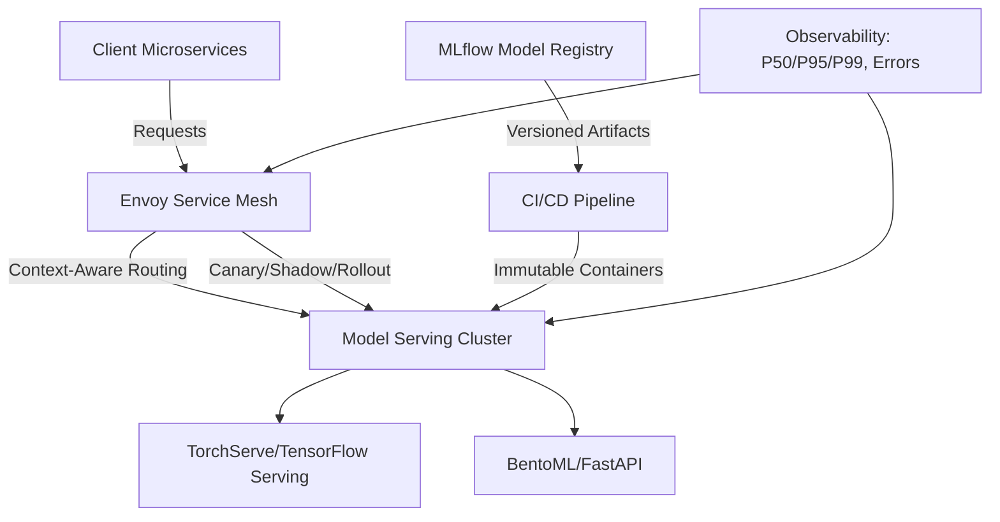

| Difficulty | Channel | Tags |
|---|---|---|
| beginner | devops | mlops, deployment |

Picture this: you are tasked with shipping machine learning features faster than ever before. To do it, your team centralizes all traffic through one magical routing layer that promises instant rollbacks, canaries, and A/B tests for every client with zero integration work. It sounds like a dream come true, until that dream starts adding 10 to 20 milliseconds to every single request [1]. This is exactly the lesson Netflix learned when the very layer built to accelerate their ML deployment velocity slowly morphed into the largest liability in their entire serving infrastructure.

---

> ### Real-World Case — Netflix
>
> Netflix centralized all member-facing ML inference into one platform serving hundreds of model types and versions at 1M+ requests/second, and inserted a custom proxy layer called Switchboard as a mandatory hop between every client service and the serving clusters. The goal was deployment velocity: make A/B experiments, canaries, shadow mode, and instant rollbacks fully invisible to 30+ client microservices. Once at that scale, the layer built to accelerate deployment became the serving system's biggest liability.
>
> | | |
> |---|---|
> | **Challenge** | Routing 1M+ RPS to the right model version, on the right cluster shard (each with its own VIP), for the right user and A/B cell — while decoupling clients from model sharding, supporting concurrent model versions for shadowing, and keeping rollout/rollback config on a release cycle independent of client code. |
> | **Solution** | Switchboard exposed an 'Objective' enum (business use case, e.g. ContinueWatchingRanking) as the client contract, plus 'Switchboard Rules' — JavaScript configs compiled to JSON, published via the internal Gutenberg pub-sub system and subscribed to by both Switchboard and the serving hosts, so model deployment config ships independently of code. The control plane assigned models to shard VIPs and validated models on the target cluster; the data plane looked up the user's A/B cell, selected the model, then routed. When scaling exposed the proxy's cost, Netflix split it: Lightbulb now resolves only routing metadata (a routingKey in a header + ObjectiveConfig in the body) and Envoy — already Netflix's universal egress mesh — performs the actual routing, taking the control service out of the request path entirely. |
> | **Outcome** | Switchboard handled 1M+ RPS for 30+ service clients, but added 10–20ms per request purely from serialize/deserialize of large payloads, amplified tail latency enough to cause user-facing timeouts on latency-sensitive clients, and made it a single point of failure capable of degrading multiple ML experiences at once. It also masked client origin, making it nearly impossible to distinguish real vs. shadow/synthetic traffic for training. The Lightbulb + Envoy split keeps the deployment benefits (one integration point, context-aware routing, config-independent experimentation rollout, client-side caching fallback) while removing the extra hop and the SPOF. |
> | **Lesson** | Deployment and serving concerns look separable until you measure them. The abstraction that gives you safe, client-transparent model rollout is itself in the hot request path, and at 1M RPS a deserialize-and-reroute hop is a latency and availability tax that dwarfs its convenience. Keep routing decisions as out-of-band metadata and let a purpose-built proxy (Envoy) move the payload — never make a shared control-plane service mandatory in the serving path. Also expect the serving layer to leak back into training data quality: once your router obscures traffic origin, shadow-mode and real-traffic data become hard to separate. |

---

## Hook — The Layer That Was Meant to Set You Free

It was 3 AM when the first latency alerts began firing. For most developers, this scene is all too familiar. You build a clever abstraction to solve an organizational pain, and for a while, it feels like pure magic. Then, as scale creeps past a million requests per second, that magic starts to tax every interaction your users have with your product [1]. The hidden cost of convenience is a lesson that every team working with machine learning in production must eventually learn for themselves.

## Problem — The Growing Rift Between Shipping and Serving

Building on this harsh reality, you are left with a deceptively simple question: what exactly is the difference between getting a model into production, and actually serving predictions to your users? Many developers think these two terms are interchangeable, but in practice, they are two entirely different disciplines with opposing goals. Deployment is all about velocity, safety, and reproducibility. It focuses on packaging models, running CI/CD, and safely rolling out new versions [2]. Serving, on the other hand, is all about speed, reliability, and efficiency at runtime. It must route requests, load the correct model, and return predictions within tight latency budgets [3]. The tension between these goals is where most ML systems begin to crack. You need to ship fast, but you also need to respond fast. Optimizing for one often comes at the direct expense of the other.

## Real-World Case — Netflix

To see this tension play out on a massive scale, look no further than Netflix. In their pursuit of deployment velocity, Netflix centralized all member-facing ML inference into a single platform serving hundreds of model types and versions at over 1M+ requests per second [1]. They inserted a custom proxy layer, called Switchboard, as a mandatory hop between every one of their 30+ client microservices and the serving clusters. This gave them incredible power: A/B experiments, canaries, shadow mode, and instant rollbacks were completely invisible to their clients. However, this power came with a brutal trade-off. Switchboard added 10–20ms of serialization and deserialization overhead to every request, amplifying tail latency to the point of causing user-facing timeouts for their most latency-sensitive experiences [1]. Even worse, it became a single point of failure that could degrade multiple ML features at once, and it masked client origin, making it nearly impossible to distinguish real user traffic from shadow or synthetic traffic for training purposes. Netflix's solution was to split the responsibilities: they kept the deployment benefits of a single integration point and context-aware routing, but removed the extra hop and SPOF by leveraging a combination of Lightbulb and Envoy [1].

## Deep Dive — Understanding The Two Worlds

This leads to an important realization: you do not need to choose between safety and speed, but you do need to draw clear boundaries. Specifically, deployment and serving solve different problems with different tools. **Deployment** is your delivery pipeline. It focuses on infrastructure as code, containerization, model registries, and automated rollouts to prevent regressions [2][4]. Tools like Kubernetes, MLflow, Docker, and SageMaker exist to ensure that when you ship a model, you can do so repeatably and roll it back with confidence [2][4]. **Serving** is your runtime engine. It focuses on efficiently loading models, batching requests, versioning, and routing traffic with strict latency constraints [3][5]. Frameworks like TorchServe, TensorFlow Serving, BentoML, and high-performance APIs built with FastAPI or gRPC are designed to squeeze every millisecond out of inference [3][5][6]. These differing priorities create very real trade-offs. Horizontal scaling gives you throughput, but can introduce cold starts. Batching improves GPU utilization, but increases tail latency for real-time use cases. A/B testing unlocks experimentation, but if implemented as a blocking proxy, it can crush your P99 metrics [1][7]. The key is not to blindly centralize, but to distribute these responsibilities to the layers best equipped to handle them.

## Workflow — Architecting For Speed Without Sacrificing Safety

With these trade-offs in mind, how can you apply Netflix's hard-earned lesson to your own systems? The goal is to keep the superpowers of safe rollouts while shedding the overhead. A robust workflow often looks like this: first, version and register your models in a central registry to ensure reproducibility [4]. Second, package them into immutable artifacts using containers to guarantee consistency across environments [2]. Third, leverage a service mesh or edge proxy like Envoy to handle context-aware routing, traffic splitting, and shadowing directly, rather than forcing all traffic through a bespoke serialization-heavy layer [1][6]. Fourth, deploy these model servers with autoscaling to gracefully handle bursty traffic [8]. Finally, instrument everything. Track P50, P95, P99 latency, error rates, queue depth, GPU utilization, and model drift to catch issues before they impact your users [4]. This architecture keeps experimentation close to the data plane without adding an unnecessary hop, striking the balance that Netflix ultimately arrived at. The diagram below visualizes this split approach.

## Code Example — Building a Version-Aware Serving Endpoint

Theory only gets you so far. To put this into practice, you can build a lightweight, version-aware inference service using FastAPI. This pattern allows you to expose multiple model versions behind a single API, while keeping your routing logic simple and testable. By loading models at startup and avoiding per-request serialization bottlenecks in business logic, you mirror the serving principles discussed above [3][5]. The following example showcases a clean approach to model registration and request handling.

## Lessons Learned — Avoid Paying The Tax Tomorrow

As you reflect on this journey, a few hard-earned lessons rise to the top. First, never conflate deployment with serving. Treat them as separate contracts with their own SLAs [1][2][3]. Second, be skeptical of abstractions that add mandatory hops. Convenience at 10 requests per second can become catastrophe at 1 million [1]. Third, push cross-cutting concerns like routing and experimentation to battle-tested infrastructure, such as service meshes, instead of building custom serialization layers from scratch [1][6]. Fourth, always optimize for tail latency, not just averages. Your P99 is what your most frustrated users feel [1][8]. Finally, instrument early and often. If you cannot distinguish real traffic from shadow traffic or trace a request back to its originating client, you are flying blind [1][4]. The next time you are tempted by a "one layer to rule them all", remember Netflix's Switchboard. The best architectures are not the ones with the fewest moving parts on day one, but the ones that can evolve without taxing every user request along the way.

---

## Split Routing Architecture (Inspired by Netflix)

<strong>Original Interview Question</strong>

**Q:** Explain the key differences between model serving and model deployment in ML systems, including specific technologies, scaling considerations, and real-world implementation patterns?

**A:** Deployment encompasses CI/CD pipelines, infrastructure setup, and monitoring using tools like Kubernetes, MLflow, and SageMaker. Serving focuses on runtime inference APIs with frameworks like TensorFlow Serving, TorchServe, or BentoML, handling request routing, model versioning, and autoscaling. Key trade-offs include latency vs throughput, batch vs real-time inference, and cold start optimization.

## Conclusion

The moral of the story is simple: speed and safety do not have to be enemies. By drawing a hard line between your deployment pipeline and your serving runtime, you can ship with confidence without forcing your users to pay the hidden tax of convenience. So tomorrow, audit your own ML architecture. If there is a mandatory hop adding latency to every prediction, ask yourself if it is truly necessary, or if a battle-tested service mesh could do the job better. Your P99, and your users, will thank you for it.

---

## References

1. [Netflix incident report](https://netflixtechblog.com/state-of-routing-in-model-serving-16e22fe18741) — blog
2. [Kubernetes Deployments](https://kubernetes.io/docs/concepts/workloads/controllers/deployment/) — documentation
3. [MLflow Documentation](https://mlflow.org/docs/latest/index.html) — documentation
4. [PyTorch TorchServe](https://pytorch.org/serve/) — documentation
5. [TensorFlow Serving Guide](https://www.tensorflow.org/tfx/guide/serving) — documentation
6. [gRPC Documentation](https://grpc.io/docs/) — documentation
7. [A/B Testing](https://en.wikipedia.org/wiki/A/B_testing) — documentation
8. [Kubernetes Horizontal Pod Autoscaling](https://kubernetes.io/docs/tasks/run-application/horizontal-pod-autoscale/) — documentation

---

**Author:** Satishkumar Dhule — [GitHub](https://github.com/satishkumar-dhule) · [LinkedIn](https://linkedin.com/in/satishkumar-dhule) · [Website](https://satishkumar-dhule.github.io)
