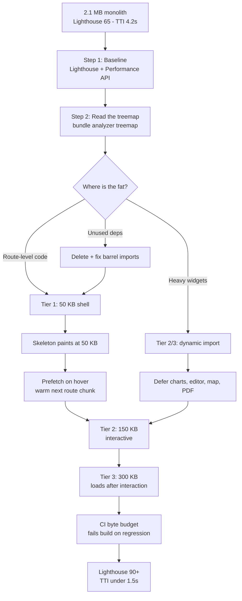

| Difficulty | Channel | Tags |
|---|---|---|
| intermediate | frontend | lighthouse, bundle, lazy-loading |

When Meta rebuilt Facebook.com as a client-side React app, the team found something brutal: the homepage shipped over 400 KB of compressed CSS (about 2 MB uncompressed) while only roughly 10% of it was needed for the first render [1]. That is the exact wall most product teams hit — a JavaScript bundle balloons on features nobody touches on load, and Lighthouse keeps scoring the result like a permanently failing exam. Now put the interview numbers on the table: a 2.1 MB bundle, a 4.2 second Time to Interactive, and a performance score of 65. The fix is not guesswork; it is a repeatable, measurable workflow — and Meta already published the blueprint for it [1].

---

> ### Real-World Case — Meta (Facebook)
>
> When Meta set out to rewrite Facebook.com as a client-side React SPA, the existing stack was a legacy PHP/JS hybrid whose homepage shipped over 400 KB of compressed CSS (2 MB uncompressed) even though only ~10% of it was used for the initial render. Code size was the single biggest threat to page-load performance for a client-driven React app, so code splitting was a load-bearing architectural requirement, not an afterthought.
>
> | | |
> |---|---|
> | **Challenge** | Ship a fast-loading client-side React app without the naive anti-pattern everyone reaches for first. Meta's team explicitly found that doing code splitting the obvious way — dynamic `import()` calls fired during render (the pattern behind `React.lazy` + `Suspense`) — would actually *hurt* performance by creating render-blocking waterfalls, and that A/B test variants and post-type branches (PhotoPost vs VideoPost) forced shipping code that was never executed. |
> | **Solution** | Instead of React.lazy-at-render, they built a declarative, statically analyzable 'JavaScript Loading Tiers' API: Tier 1 uses normal `import` for the above-the-fold skeleton, Tier 2 uses a custom `importForDisplay()` for code needed to fully render above the fold, and Tier 3 uses `importForAfterDisplay()` for code that doesn't affect pixels (analytics, live subscriptions). On top of that they added `importCond()` so the server sends only the A/B variant a user is actually in, Relay's `@module` annotations for data-driven code splitting, EntryPoints so route code and its data fetch in a single round trip instead of two serial ones, hover/focus/mousedown prefetching instead of waiting for render, atomic CSS (StyleX) with build-time splitting, and per-product/team JavaScript budgets enforced by MR size-diff tooling and dashboards. |
> | **Outcome** | Homepage CSS cut 80% (413 KB -> 73 KB compressed; from >400 KB / 2 MB uncompressed where only 10% was used). JavaScript restructured so a 500 KB page becomes 50 KB in Tier 1, 150 KB in Tier 2, and 300 KB in Tier 3 — meaning the loading skeleton paints after only 50 KB instead of 500 KB, and the app is fully interactive before the Tier 3 code has even downloaded. The rewrite shipped gradually to all of Facebook.com in 2020. |
> | **Lesson** | The counter-intuitive part: the industry-standard fix (dynamic import during render, i.e. `React.lazy` + `Suspense`) can be *slower* than the bundle it replaces, because each split point adds a render-blocking round trip. Code splitting only pays off if the split boundary is statically analyzable at build time and aligned to a render milestone. Second lesson: code-splitting is a one-time win that decays unless you pair it with enforcement — Meta added per-team JS budgets, dependency-graph tooling, and merge-request size regression alerts, which is the industrial-scale version of running webpack-bundle-analyzer and failing CI when a chunk regresses. |

---

## Hook — The Deploy That Nobody Blamed, and the Score Everybody Saw

It never arrives with a warning. Tuesday morning a product manager ships a rich-text editor, a date library, a charting package and a map SDK in one release. Nothing in the pull request looks alarming. Two sprints later the bundle sits at 2.1 MB, Time to Interactive has crept to 4.2 seconds, and Lighthouse is handing out a 65 like a report card nobody wants to take home.

Here is the uncomfortable part: nothing crashed. No stack trace, no failed deploy, no Slack channel full of red. The regression was invisible in staging on a laptop with gigabit fiber, and then it hit production where most users are on a mid-range Android over LTE. The score dropped, conversion followed, and now everyone is looking at you.

So the question becomes: what do you actually do first? Not `minify` — that ship sailed years ago. Not `preload everything` — that just moves the wall. The real move is to stop shipping code the user does not need yet, and that is exactly the lesson Meta learned the expensive way while rewriting the biggest social network on the planet [1]. Buckle up, because the first tool on the list (the one nobody reaches for first) is the one that determines whether the next six hours are productive or a guessing game.

## Problem — Why 2.1 MB Hurts Far More Than the Download Time

The instinct is to add up the bytes: 2.1 MB at, say, 5 Mbps is roughly 3.4 seconds on a good connection and a coffee break on a bad one. But bytes are only the visible invoice. The hidden cost is CPU time. Every byte must be parsed, compiled and executed on the main thread before your app can respond to a click, and Lighthouse punishes exactly that blocking work through Total Blocking Time and its composite performance score [2].

| Symptom you see | What the profiler actually says | Cost multiplier |
| --- | --- | --- |
| Slow first paint | Render-blocking CSS + hydration work before first interaction | x1 |
| Spinner that won't go away | Main thread busy parsing/executing unused modules | x2 |
| Low Lighthouse score | TBT and LCP weighted heavily in the performance metric [2] | x3 |
| Cached updates feel slow | The entire 2.1 MB revalidates when one chunk changes [9] | x4 |

That last row is the sneaky one. A monolith does not just download slowly — it invalidates slowly. Change one component, ship one fix, and every returning user re-downloads a megabyte they already had.

🔥 Hot Take: most of a mature React bundle is code for screens the current user will never open. A reporting dashboard, an admin panel, an export-to-PDF flow, a date library with 200 locales, an icon set of 1,500 glyphs you use 12 of. Many developers discover this only when they open a bundle analyzer for the first time and laugh out loud — or cry a little.

## Real-World Case — Meta (Facebook)

Before the rewrite, Facebook.com was a legacy PHP/JS hybrid whose homepage shipped more than 400 KB of compressed CSS — around 2 MB uncompressed — even though only about 10% of that CSS was used to render the initial page [1]. For a server-rendered site that waste was painful. For a client-driven React app it was existential: every wasted byte is main-thread work the browser does before the page responds.

Meta's team treated code splitting as a load-bearing architectural requirement rather than a late-stage optimization. The result:

- **CSS: 413 KB → 73 KB compressed**, an 80% cut, by splitting and deferring what the first render does not need [1]
- **JavaScript restructured into tiers** — a 500 KB page became 50 KB in Tier 1, 150 KB in Tier 2 and 300 KB in Tier 3 [1]
- **The loading skeleton paints after roughly 50 KB** instead of 500 KB, and the app is fully interactive before the Tier 3 payload has even finished downloading [1]
- Shipped gradually to all of Facebook.com in 2020 [1]

The counter-intuitive part, and the one worth stealing: the win did not come from writing faster code. It came from deciding what does *not* need to exist yet. That is a design decision wearing a performance costume.

## Deep Dive — Three Levers, One Annoying Tradeoff

Bundle size is a three-lever problem. Understanding which lever does what is the difference between a two-hour fix and a two-week rewrite.

**Lever 1 — Code splitting.** Splitting one monolithic bundle into a graph of smaller chunks is the core technique [6]. Two axes matter:

| Option | How it works | Real tradeoff |
| --- | --- | --- |
| Route-based splitting | One chunk per URL/route | Best ratio of effort to gain; the router boundary is a natural, safe seam |
| Component-based splitting | Heavy widget behind `lazy()` | Great for charts, editors, maps; risks Suspense flashes on interaction |
| Vendor chunking (manual) | One `vendor` chunk you control | Predictable long-term caching, but manual maintenance forever |
| Vendor chunking (automatic) | Bundler picks shared modules | Zero maintenance, chunk graphs get harder to reason about |

**Lever 2 — Tree shaking.** With ES modules [5], a bundler can drop exports nobody imports, so `import { debounce } from 'lodash'` can shrink dramatically versus `import _ from 'lodash'` [7]. The plot twist: tree shaking quietly fails on CommonJS packages, and it cannot help a side-effectful import at all.

**Lever 3 — Pruning.** Deleting a dependency beats optimizing it. The most common wins are barrel files (`import { Button } from './components'`) that drag an entire index into the graph, `lodash`/`moment` pulled in wholesale, and icon libraries shipped as one giant file.

⚠️ Watch Out: splitting is not free. Every chunk boundary is a request (or a few, thanks to HTTP/2 [9]), plus a scheduling hop. Split the wrong thing and the chart library lands on the critical path of the very first render — your Lighthouse score gets *worse* while your bundle chart looks beautiful. Measure, do not admire.

## Workflow — Seven Steps, In This Order

The flowchart below is the whole playbook: measure, find the fat, split along natural seams, defer the heavy stuff, then lock it in with a budget so it never comes back.

1. **Baseline first.** Record the bundle size, LCP [10], TBT, INP and Lighthouse score *before* touching anything [2]. Use the Performance API in the field, not just a laptop trace [11]. Without a baseline, every later win is a rumor.
2. **Read the composition, not the total.** Run `webpack-bundle-analyzer` (or `rollup-plugin-visualizer` on Vite) to see the treemap [3]. Look for: giant node_modules islands, one file nobody owns, and libraries imported in a single place used by two screens.
3. **Delete before you optimize.** Remove the dead dependency. Replace the wholesale import with a subpath import. This is free performance.
4. **Split at route boundaries.** Every route becomes its own chunk [6]. This is where most of the 500 KB → 50 KB style wins live.
5. **Defer the heavy widgets.** Charts, editors, maps, PDF export, and vendor SDKs load on interaction, not on boot.
6. **Prefetch on intent.** When a user hovers or focuses a link, start the chunk download. A `prefetch` in the router manifest plus a tiny on-hover loader takes ~100 ms out of perceived navigation.
7. **Enforce budgets in CI.** Fail the build when the entry chunk exceeds a threshold. A budget nobody enforces is a wish.

🎯 Key Point: step 7 is the one teams skip and then regret. A threshold in CI (for example, 250 KB for the initial route) turns this from cleanup you do once into an architectural constraint that protects itself.

## Code Example — Lazy Routes, Retry on Chunk Failure, and a Budget That Bites

The snippet below is plain, framework-agnostic JavaScript so you can lift it into an existing codebase in minutes. It has five deliberate pieces.

**1. Retry on dynamic import.** A CDN blip during a `import()` currently produces a hard crash and a white screen. Wrapping the factory adds one bounded retry — the single most valuable line in the whole file for a real production app.

**2. Route-level `lazy()` calls.** Each screen is its own chunk [6][8]. Nothing here is imported until the router asks for it, which is the JavaScript twin of Meta's tiered loading [1].

**3. Prefetch on intent.** The prefetch map lets a link component warm the chunk on hover/focus, so navigation feels instant even though the code arrived late.

**4. `assertBudgets()`.** Walk the build stats, sum the entry + async chunks, and throw when a limit is blown. Wire it into CI and step 7 stops being optional.

| Where the code runs | When the chunk is fetched | User-visible effect |
| --- | --- | --- |
| First paint | Entry + Tier 1 only | Skeleton appears in ~1s instead of ~4s |
| Hover on a nav link | Route chunk, in parallel with reading | Navigation feels instant |
| Click a chart tab | Heavy widget chunk + deps | One spinner instead of a frozen main thread |
| CI | Nothing | Build fails loudly if the budget regresses |

Note what is *not* in the file: no manual vendor chunk config, no barrel imports, no monolith. The bundle graph is an emergent property of how the app is written.

## Lessons Learned — Battle Scars, and What to Do Monday Morning

The scars are more useful than the wins. Here is what goes wrong most often.

**Splitting above the fold.** If the header, hero and nav are lazy, the skeleton *is* the page. Users see a spinner where content used to be, and conversion falls even though the score improves. Split at the seams users can wait through.

**A Suspense boundary without an error boundary.** A failed chunk fetch becomes a blank page. Always pair them.

**Spraying `prefetch` everywhere.** Prefetch everything and you have rebuilt the monolith, just with extra requests and extra battery drain.

**Trusting your own laptop.** The tester's machine is a lie. Test on a throttled mid-tier device profile [2], and track field data [11].

**Optimizing what is cheap to fix first.** Deleting one stray `moment` import is satisfying and moves the score by 2 points. Route splitting moves it by 25. Sort by bytes-per-hour-of-effort, not by how easy the fix feels.

**Monday morning checklist:** baseline the numbers, generate a treemap, delete what nobody uses, split every route, defer the three heaviest widgets, and put a byte budget in CI. Do that sequence against the interview scenario — 2.1 MB and TTI 4.2s — and the 65-to-90+ jump stops being a story and becomes a diff.

💡 Insight to share with your team: *performance is not a cleanup task, it is a delivery contract.* Meta made that contract explicit with 50 KB / 150 KB / 300 KB tiers [1]. Make yours explicit too — in a number, in CI, before the next framework migration quietly doubles the bundle again.

---

## Bundle Optimization Workflow

<strong>Original Interview Question</strong>

**Q:** You're tasked with improving a React app's Lighthouse performance score from 65 to 90+. The bundle size is 2.1MB and Time to Interactive is 4.2s. What specific steps would you take to optimize the bundle and implement lazy loading?

**A:** Implement code splitting with React.lazy() and Suspense, analyze bundle composition with webpack-bundle-analyzer to identify largest chunks, remove unused dependencies and optimize imports, add dynamic imports for heavy components and third-party libraries, implement route-based splitting for better initial load times, and utilize tree shaking with proper ES module configuration.

## Conclusion

Meta's rewrite is the proof that the 65-to-90+ jump is not a mystery: cut what the first render does not need, ship the rest in tiers, and enforce the result. Start tomorrow by running a bundle analyzer and writing down the baseline — Lighthouse score, TBT, LCP, bundle bytes. Then split every route with `lazy()`, defer the three heaviest widgets, add prefetch-on-hover, and put a byte budget in CI so the next dependency cannot quietly undo the work. Do not chase micro-optimizations first; delete before you optimize, and measure before you claim. The one insight worth repeating to your team: a bundle is a promise about what the user has to wait for, and keeping that promise is an engineering contract, not a cleanup task.

---

## References

1. [Meta (Facebook) incident report](https://engineering.fb.com/2020/05/08/web/facebook-redesign/) — blog
2. [Lighthouse (GoogleChrome) — performance auditing tool repository](https://github.com/GoogleChrome/lighthouse) — documentation
3. [webpack-bundle-analyzer — visualize your webpack bundle](https://github.com/webpack-contrib/webpack-bundle-analyzer) — documentation
4. [MDN — Lazy loading](https://developer.mozilla.org/en-US/docs/Web/Performance/Lazy_loading) — documentation
5. [MDN — JavaScript modules (import, dynamic import, tree shaking)](https://developer.mozilla.org/en-US/docs/Web/JavaScript/Guide/Modules) — documentation
6. [Wikipedia — Code splitting](https://en.wikipedia.org/wiki/Code_splitting) — documentation
7. [Wikipedia — Tree shaking](https://en.wikipedia.org/wiki/Tree_shaking) — documentation
8. [React — lazy() API reference](https://react.dev/reference/react/lazy) — documentation
9. [RFC 7234 — Hypertext Transfer Protocol (HTTP/1.1): Caching](https://datatracker.ietf.org/doc/html/rfc7234) — documentation
10. [MDN — Largest Contentful Paint (LCP)](https://developer.mozilla.org/en-US/docs/Web/Performance/Metrics/LCP) — documentation
11. [MDN — Performance API](https://developer.mozilla.org/en-US/docs/Web/API/Performance_API) — documentation
12. [Wikipedia — Brotli (compression)](https://en.wikipedia.org/wiki/Brotli) — documentation

---

**Author:** Satishkumar Dhule — [GitHub](https://github.com/satishkumar-dhule) · [LinkedIn](https://linkedin.com/in/satishkumar-dhule) · [Website](https://satishkumar-dhule.github.io)
