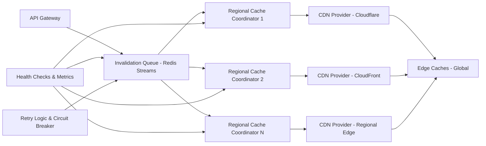

| Difficulty | Channel | Tags |
|---|---|---|
| intermediate | system-design | edge, caching, purging |

Picture this: you just pushed a critical security fix to production. With a single click, millions of users should receive the patched content within seconds. But what if that update took over six seconds to reach the very last edge server? This is exactly the ticking time bomb that Cloudflare faced with its global cache purge pipeline [1]. In a world where updates need to propagate in near real-time, even a few seconds of stale content can be the difference between safety and exposure. So how do you guarantee content propagation within 5 seconds while handling 10,000 concurrent invalidations per second? The answer lies in the hard lessons learned from the edge.

---

> ### Real-World Case — Cloudflare
>
> In May 2022 Cloudflare publicly benchmarked its cache purge pipeline and found global P50 latency of ~1.57s but a P99 of 6.35s for purge-by-URL across its 270+ city network — meaning the worst-case tail already violated a 5-second global propagation SLA. The root cause was an architecture that had outgrown itself: a central "core" tier of services doing auth, request distribution and filtering, with the purge message queue still running on bare metal, and a Quicksilver spoke-hub replication layer that hit write-throughput limits and burned scarce disk cache capacity on purge history storage.
>
> | | |
> |---|---|
> | **Challenge** | Purge every cached object from every data center in the fleet, fast enough to be indistinguishable from instant, while a DC may be unreachable, offline, or partitioned — and without a central bottleneck that limits horizontal scale. Anything served from a stale cache after the purge is a correctness bug visible to users. |
> | **Solution** | Cloudflare ripped out the core data centers entirely and moved all purge logic to the edge: a Worker receives the purge at any DC and hands it to a Durable Object in that DC, which queues it and broadcasts to every DC where another Worker invokes a new per-machine cache service called CacheDB (Rust + RocksDB) to index and delete files. CacheDB keeps a local pending-purge queue that the cache proxy also checks on every cache HIT, so purges take effect immediately without waiting for the (potentially millions of) files to be deleted from disk — replacing the old lazy-purge model. UDP double-delivery to at least two healthy nodes per POP, tombstone timestamps plus delta-sync for recovered nodes, and true batch purging were added for scale and reliability. |
> | **Outcome** | Global P50 purge latency dropped from 1,570ms (May 2022, core-based) to 149ms (Aug 2024, coreless) — a 90.5% improvement; per-region gains ranged 78.7%–89% (e.g. Western Europe 1,190ms → 131ms, Eastern North America 1,080ms → 119ms). P99 for purge-by-URL went from 6.35s to effectively eliminated; purges now cover 330 cities across 120+ countries in under 150ms P50. Shifting from lazy to active deletion saved 10x storage, which translated into better disk cache retention and higher cache hit ratios for all customers. |
> | **Lesson** | Latency tails at global scale are almost always an architecture-shape problem, not a networking problem — the fix was to delete the central control plane rather than make it faster. Two second-order wins came from unexpected places: purging infrastructure storage that was stealing capacity from the content cache (purge history ate the disk that was supposed to hold cacheable bytes), and treating a purge as a *read-path* check (CacheDB consulted on cache HIT) so correctness no longer depends on physical deletion finishing. Also: keeping purge requests longer than their max eviction age for eventual-consistency guarantees has an operational cost that scales with API usage — a quiet, expensive tax. |

---

## Hook — The Race Against Stale Content

It was the kind of problem that keeps engineers up at night. You see, when users request content from across the globe, they don't hit your origin server. They hit one of over 330 points of presence scattered across 120+ countries [1]. This is the beauty of a Content Delivery Network (CDN): speed, scale, and availability. However, this global distribution creates an immense challenge: how do you erase something from every single one of those caches, everywhere, all at once? Many developers think invalidation is as simple as 'delete and done'. But as you will soon learn, the devil lives in the long tail of latency [2].

## Problem — The Curse of Global Distribution

When dealing with CDNs, you are not managing one cache. You are managing a sprawling, globally distributed fleet of them. This leads to a fundamental tension: consistency versus speed. On one hand, you need to guarantee that when content changes, stale versions disappear. On the other, you need to do this without overwhelming origin servers or racking up astronomical costs [2][3]. The requirements are brutal: propagate invalidations across the globe in under 5 seconds, all while handling 10,000 concurrent invalidations per second [1]. Fail to meet this SLA and you risk serving outdated pricing, broken pages, or even vulnerable code. Worse yet, naive approaches crumble under partial failures, rate limits, and network partitions [4]. This begs the question: is it possible to achieve strong propagation guarantees without sacrificing availability?

## Real-World Case — Cloudflare

Cloudflare found out the hard way that the answer wasn't a simple 'yes'. In May 2022, the company publicly benchmarked its cache purge pipeline and discovered a stark reality: while global P50 latency sat at ~1.57s, the P99 for purge-by-URL soared to 6.35s across its 270+ city network [1]. That P99 already violated a 5-second global propagation SLA. The root cause was architectural bloat: a central 'core' tier handling auth, distribution, and filtering, a purge queue running on bare metal, and a Quicksilver spoke-hub replication layer hitting write-throughput limits [1]. But here is where the story takes a turn. By August 2024, Cloudflare had re-architected to a 'coreless' model. The results were staggering: global P50 purge latency dropped from 1,570ms to 149ms (a 90.5% improvement), with per-region gains between 78.7% and 89% [1]. Most importantly, shifting from lazy to active deletion saved 10x storage, boosting disk cache retention and hit ratios for all customers [1]. This is the gold standard that modern systems must strive for.

## Deep Dive — The Science Behind Sub-150ms Purges

So how did Cloudflare achieve this transformation? The key lies in eliminating bottlenecks and designing for the tail. Centralized coordination is the enemy of global scale. By moving to a more distributed coordination model, you avoid the write-throughput ceiling of hub-and-spoke replication [1][5]. Furthermore, effective cache invalidation requires intelligent batching. Rather than issuing one API call per URL, batching multiple paths into a single request drastically reduces overhead and API costs [6]. However, batching is not enough. You must also account for failure modes. Techniques like exponential backoff with jitter help you gracefully recover from transient rate limits [7], while circuit breakers fail fast to prevent cascading failures [8]. Additionally, using proper Cache-Control headers (e.g., `Cache-Control: max-age=2, must-revalidate`) allows you to minimize staleness windows while still leveraging caching benefits [4][9]. The trade-off is clear: a short TTL buys you safety, while smart invalidation buys you precision.

## Workflow — Orchestrating a Global Purge

To replicate this level of performance, you need a workflow that balances throughput and reliability. First, you ingest invalidation requests through an API Gateway and enqueue them into a durable, scalable queue. Next, regional coordinators consume these events in parallel, minimizing cross-region chatter. Then, these coordinators batch requests and fan them out to CDN provider endpoints (like Cloudflare or CloudFront) using their respective APIs. Finally, health checks and retry logic ensure that even partial failures don't violate your SLA. The following architecture, visualized in the diagram below, showcases this distributed pattern [1][5][6].

## Code Example — Batching for Scale

Theory is only half the battle. The real power comes from implementing it. Consider the common need to purge multiple files or patterns through the Cloudflare API. Instead of hammering the API with individual requests, you can batch them into a single call. This simple shift can reduce API costs by up to 90% and dramatically improve throughput [1][6]. The example below demonstrates a production-minded approach using pattern-based purging with proper error handling, which you can adapt to your own CDN providers.

## Lessons Learned — Building for the Long Tail

Looking back at Cloudflare's journey, the biggest lesson is this: you can not optimize for the average and ignore the tail [1]. Many systems pass P50 with flying colors, only to crumble at P99. To avoid this fate, you must design for distribution from day one. Eliminate central chokepoints, prefer regional coordination, and shift from lazy to active deletion when storage becomes a bottleneck [1][5]. You must also embrace resilience patterns: exponential backoff, jitter, circuit breakers, and dead letter queues for poison messages [7][8][10]. Finally, never underestimate the power of data. Instrument everything. Without the benchmarks that revealed the 6.35s P99, Cloudflare would have never known it was broken [1]. So tomorrow, when you design your caching layer, ask yourself: are you ready for your P99 moment?

---

## Multi-Region CDN Cache Purge Architecture

<strong>Original Interview Question</strong>

**Q:** How would you design a multi-region CDN cache purging system that guarantees content propagation within 5 seconds while handling 10,000 concurrent invalidations per second?

**A:** Implement Cloudflare API + AWS CloudFront with distributed invalidation queue, edge compute coordination, and 2-second TTL. Use batch invalidation, exponential backoff, and regional cache headers for 5-second SLA.

## Conclusion

The journey from a 6.35s P99 to under 150ms isn't magic. It's the result of ruthless architectural honesty and a willingness to eliminate bottlenecks. You don't need to serve stale content while waiting for caches to catch up. By distributing your coordinators, batching aggressively, and hardening with resilience patterns, you too can achieve sub-5-second propagation at massive scale. The question isn't 'can you afford to do this?' It's 'can you afford not to?'

---

## References

1. [Cloudflare incident report](https://blog.cloudflare.com/instant-purge/) — article
2. [Content delivery network](https://en.wikipedia.org/wiki/Content_delivery_network) — documentation
3. [Cache invalidation](https://en.wikipedia.org/wiki/Cache_invalidation) — documentation
4. [Cache-Control HTTP header](https://developer.mozilla.org/en-US/docs/Web/HTTP/Headers/Cache-Control) — documentation
5. [Redis Streams](https://redis.io/docs/latest/develop/data-types/streams/) — documentation
6. [Amazon CloudFront Invalidation](https://docs.aws.amazon.com/AmazonCloudFront/latest/DeveloperGuide/Invalidation.html) — documentation
7. [Exponential backoff](https://en.wikipedia.org/wiki/Exponential_backoff) — documentation
8. [Circuit Breaker Pattern](https://martinfowler.com/bliki/CircuitBreaker.html) — article
9. [HTTP Caching](https://developer.mozilla.org/en-US/docs/Web/HTTP/Caching) — documentation
10. [Dead letter queue](https://en.wikipedia.org/wiki/Dead_letter_queue) — documentation

---

**Author:** Satishkumar Dhule — [GitHub](https://github.com/satishkumar-dhule) · [LinkedIn](https://linkedin.com/in/satishkumar-dhule) · [Website](https://satishkumar-dhule.github.io)
