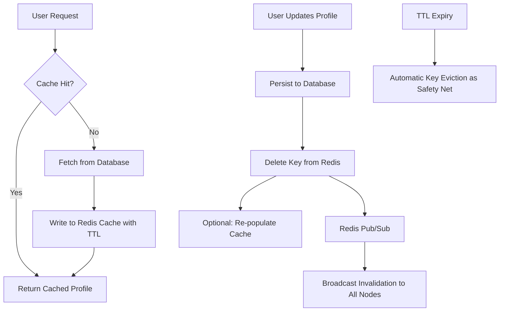

| Difficulty | Channel | Tags |
|---|---|---|
| beginner | backend | redis, memcached, cache-invalidation |

It was 3 a.m. when the first reports started trickling in. Requests were slipping through the cracks, limits were being ignored, and no one could explain why. This is exactly the kind of silent failure that GitHub encountered with their API rate limiter [1]. When the very system designed to protect your API can be tricked by something as simple as cache eviction, the stakes become painfully clear. You might think a simple 'delete the key' is enough to fix stale data, but the truth is far more nuanced.

---

> ### Real-World Case — GitHub
>
> GitHub's API rate limiter ran on a Memcached instance shared with other application caches, so the limiter's state was silently evicted whenever the cache filled up — letting users bypass their limits. Then, when GitHub moved from one shared Memcached to one instance per data center, requests routed to different DCs read divergent limiter state, so the same client got different answers depending on where it landed.
>
> | | |
> |---|---|
> | **Challenge** | Keeping distributed cache state correct when the cache is shared, when it is being restructured across regions, and when reads go to replicas that may be behind — i.e. invalidating/preserving state reliably across many nodes without a coordination mechanism. |
> | **Solution** | GitHub abandoned shared Memcached for a dedicated, client-side sharded Redis cluster (one primary for writes, several replicas for reads), implementing all storage logic in Lua scripts so read-modify-write of counter state is atomic. They also ruled out their own MySQL-backed GitHub::KV store because rate-limit updates require primary writes and would have added substantial write traffic to already-busy MySQL primaries. |
> | **Outcome** | Improved reliability, fixed client-visible bugs, and reduced GitHub's support load. The migration itself surfaced two distribution bugs — an X-RateLimit-Reset header that "wobbled" by a second between requests, and requests being rejected while headers still reported X-RateLimit-Remaining: 5000 — fixed by storing more state in Redis (larger footprint, guaranteed consistency) and by never mixing stale and fresh values within a single logical transaction. |
> | **Lesson** | A cache can lose your data without telling you: Memcached's silent LRU eviction is functionally identical to a failed invalidation — the key is simply gone and your next read repopulates it with wrong state. Redis wins not on raw speed but on atomic scripting, persistence, and sharding options that make cross-node coordination expressible; the corollary is that read replicas force you to choose a single consistent snapshot of state per request rather than mixing fresh and stale values. |

---

## Hook — When Your Safety Net Fails You

Picture this: you have spent weeks building a bulletproof rate limiter to protect your service from abuse. You sleep easy knowing that even the greediest client will hit a wall. Then, without warning, that wall disappears. This is not a hypothetical scenario, but the reality GitHub faced with their distributed rate limiting system [1]. The culprit? Not bad code or a failed deployment, but the invisible behavior of their caching layer. This silent corruption is what makes cache invalidation one of the trickiest problems you will ever have to solve in distributed systems.

## Problem — The Stale Data Time Bomb

At its core, caching is a beautiful trade-off. You sacrifice a sliver of consistency in exchange for blinding speed [2]. But this trade-off comes back to haunt you the moment data changes. When a user updates their profile, the cached copy becomes instantly outdated. If you serve that stale data to other users, you erode trust in your product. The real challenge, however, is scale. On a single machine, invalidating a key is trivial. Across dozens of servers spread across data centers, it becomes a race against time. Many developers think deleting a cache key is sufficient, until they learn that 'delete' messages can be lost, nodes can be out of sync, or worse, eviction can happen without any explicit command at all [1] [3].

## Real-World Case — GitHub

GitHub's experience perfectly illustrates these dangers. Their API rate limiter was running on a Memcached instance that was shared with other application caches. When the cache filled up, Memcached silently evicted the limiter's state to make room for other data. Just like that, clients could bypass their rate limits with no errors or warnings [1]. If that was not bad enough, GitHub then migrated to one Memcached instance per data center. This surfaced a second distribution bug: requests routed to different data centers were reading divergent limiter states. The same client would receive different answers depending on where their request landed. Even the response headers wobbled, with X-RateLimit-Reset shifting by a second between requests, and some requests being rejected while headers still claimed X-RateLimit-Remaining: 5000 [1]. To fix these issues, GitHub moved this critical state to Redis. This gave them a larger storage footprint, but most importantly, it provided guaranteed consistency for this mission-critical data [1] [4].

## Deep Dive — Choosing Your Weapon: Redis vs Memcached

So how do you avoid becoming the next cautionary tale? It starts with understanding your tools. While both Redis and Memcached are in-memory key-value stores, they behave very differently when it comes to consistency and invalidation [4] [5]. **Redis** shines in distributed environments. It offers Pub/Sub messaging, which allows you to broadcast invalidation events to all nodes in near real-time [4]. It also provides persistence, transactions, and more advanced data structures. This is why GitHub chose Redis to guarantee consistent rate limit state across their fleet [1]. **Memcached**, on the other hand, is brutally simple and incredibly fast for pure caching workloads [5]. It has lower memory overhead and is easy to scale horizontally. However, it offers no built-in pub/sub for coordination, and it evicts keys silently when memory is exhausted [1] [5]. This is the exact behavior that burned GitHub. You must also consider consistency models. In distributed systems, you cannot have perfect consistency, availability, and partition tolerance all at once [6]. Therefore, for data where correctness is non-negotiable (like auth, billing, or rate limiting), you need stronger guarantees. For volatile, read-heavy data like profile thumbnails, a small window of staleness may be acceptable. This is the nuance you need to weigh for your own use case [1] [6].

## Workflow — Building a Consistent Invalidation Strategy

The safest path forward is to pair the right pattern with the right tool. For user profiles, a combination of write-through caching and TTL-based expiration works well for most teams [7]. Here is how this workflow unfolds: 1) **On Read (Cache-Aside):** Check the cache first. If the key exists (cache hit), return it immediately. If not (cache miss), fetch from the database, write to cache, then return [7]. 2) **On Update (Write-Through + Invalidation):** When a profile changes, persist the new data to the database. Then, proactively delete the cached key to prevent serving stale data. Optionally, re-populate it with the fresh value to help the next read [7]. 3) **Safety Net (TTL):** Even if invalidation fails due to a network hiccup, the key will expire after a short TTL (5-30 minutes is common for profiles). This bounds how long stale data can live [4] [7]. 4) **Distributed Coordination:** If you run multiple cache nodes, use Redis Pub/Sub to broadcast 'profile:123:invalidated' events so every node drops that key. With Memcached, you must implement your own coordination or accept a higher risk of inconsistency [1] [4] [5]. This entire flow is visualized in the diagram below, showing how reads and writes interact to keep your system consistent.

## Code Example — Putting It Into Practice

Theory is great, but implementation is where the rubber meets the road. The following Python example demonstrates a write-through approach using Redis. Notice how it explicitly deletes the key on update, provides a cache-aside read path, and uses a TTL as a fallback. This mirrors the patterns GitHub ultimately adopted for their critical state [1] [4].

## Lessons Learned — Don't Let Eviction Be Your Enemy

Looking back at GitHub's hard-earned lessons, a few truths stand out. First, **shared caches are dangerous for critical state.** What works for generic objects can silently destroy deterministic systems like rate limiters [1]. Second, **simplicity can be deceptive.** Memcached's silent eviction is a feature for some workloads, but a catastrophic bug for others [1] [5]. Third, **guarantee consistency where it counts.** Pay the small cost in memory or complexity for Redis when correctness is non-negotiable [1] [4]. Finally, **never rely on a single invalidation mechanism.** Combine explicit key deletion, distributed coordination (via Pub/Sub), and TTL expiration. This layered approach means that even if one mechanism fails, the others will contain the blast radius [1] [7]. So as you build your next caching layer, ask yourself: 'If this cache silently lost this key, what would break?' If the answer is 'my security model' or 'my billing,' then you already know which tool you need.

---

## Cache-Aside with Write-Through Invalidation

<strong>Original Interview Question</strong>

**Q:** You're building a user profile service that caches frequently accessed profiles. How would you implement cache invalidation when a user updates their profile, and what trade-offs would you consider between Redis and Memcached?

**A:** Implement write-through caching with TTL-based expiration. On profile update, invalidate the cache by deleting the key and writing new data to both the database and cache. Redis offers pub/sub for automatic distributed invalidation, while Memcached requires manual coordination across nodes.

## Conclusion

Cache invalidation will never be glamorous, but it can be predictable. GitHub's painful lesson shows that silent eviction can undo your best efforts, and cross-datacenter divergence can erode user trust. The path forward is not to avoid caching, but to respect its trade-offs. Choose Redis when correctness is non-negotiable, layer your invalidation strategies, and always give stale data an expiration date. Do this tomorrow, and your on-call phone will thank you for it.

---

## References

1. [GitHub incident report](https://github.blog/engineering/how-we-scaled-github-api-sharded-replicated-rate-limiter-redis/) — article
2. [CAP Theorem](https://en.wikipedia.org/wiki/CAP_theorem) — documentation
3. [Cache-Aside Pattern](https://learn.microsoft.com/en-us/azure/architecture/patterns/cache-aside) — documentation
4. [Redis Documentation](https://redis.io/docs/latest/) — documentation
5. [Memcached Official Site](https://memcached.org/) — documentation
6. [Write-Through Cache Pattern](https://learn.microsoft.com/en-us/azure/architecture/patterns/write-through) — documentation
7. [Redis EXPIRE Command](https://redis.io/commands/expire/) — documentation
8. [Rate Limiting](https://en.wikipedia.org/wiki/Rate_limiting) — documentation

---

**Author:** Satishkumar Dhule — [GitHub](https://github.com/satishkumar-dhule) · [LinkedIn](https://linkedin.com/in/satishkumar-dhule) · [Website](https://satishkumar-dhule.github.io)
