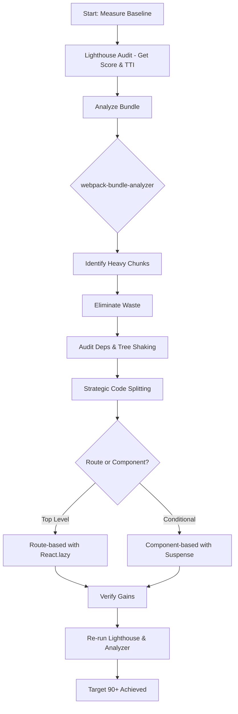

| Difficulty | Channel | Tags |
|---|---|---|
| intermediate | frontend | lighthouse, bundle, lazy-loading |

It started with a party no one asked for. A small 'onboarding progress bar' shipped to Wix's dashboard, complete with a flashy Lottie celebration animation. What seemed harmless on the surface quickly spiraled into a silent tax on every single user load [1]. Before the team knew it, a 190KB weight was being dragged across every page, whether users ever reached that 'happy moment' or not. The question is: could the same thing be happening in your React app right now?

---

> ### Real-World Case — Wix
>
> After shipping a new sidebar 'onboarding progress bar' feature to Wix's dashboard, the analytics team started reporting slower page loads. The engineer's bundle had quietly grown to 190KB — and it was being paid for by every user on every page load, even though most would never see the feature's payoff animation. Webpack Bundle Analyzer traced nearly half of it (94KB) to a single 'happy moment' celebration: the lottie-web library (61.45KB), the designer's 26KB After Effects JSON file, and transitive deps.
>
> | | |
> |---|---|
> | **Challenge** | Cut the initial bundle dramatically for a feature that was conditionally rendered (webSocket-triggered only when a user finished all setup steps) and hidden entirely for non-admin users — without deleting the feature, and without breaking tooltip positioning. |
> | **Solution** | 1) Ran webpack-bundle-analyzer to find the real culprit instead of guessing (lottie-web + its JSON animation). 2) Wrapped the animation component in React.lazy + Suspense so webpack emitted it as a separate chunk fetched only when render reaches it. 3) Hit a counterintuitive bug: the tooltip rendered in the wrong position, because the tooltip measured/positioned itself while Suspense was still rendering null, and since the lazy component's props never changed, it never re-measured. 4) Fixed it by 'cutting out the middle-man' — bypassing React.lazy and using a raw dynamic import() plus async/await, storing the loaded component on the instance and only setting state (which opens the tooltip) after the chunk had arrived. This also unlocked named exports, which React.lazy forbids. 5) Asked the PM 'the product defines the architecture': since the progress bar is pointless once setup is complete or for non-admins, they split into three independent chunks. |
> | **Outcome** | Bundle went 190KB → 96KB (~50% cut) from the first React.lazy/Suspense split, then down to 38KB after the three-way split — an 80% reduction. The 'sad moment' Lottie animation stopped shipping to users who never earned it, and the mispositioned-tooltip bug was resolved by ordering the dynamic import ahead of the state change. |
> | **Lesson** | Bundle analysis beats intuition — one 'celebration animation' was half the payload. More importantly, React.lazy + Suspense is not universally correct: Suspense's null/fallback render happens *before* the chunk arrives, so any component that measures DOM (tooltips, popovers, charts, virtualized lists) will miscalculate its layout and, if its props don't change, will never correct itself. In those cases use a bare dynamic import() with async/await and only flip state once the code is loaded. And the biggest wins come from a product question, not a build config: 'what must be visible on first paint, and for whom?' |

---

## Hook — The Celebration No One Paid For

Picture this: you just merged what feels like a tiny UI polish. It's delightful, it's on-brand, and the designer is thrilled. Yet, days later, your performance dashboards start to sag. This is the trap of modern frontend development. The smallest sparkle of delight can come with a hidden megabyte tax [1]. The stakes? Your users don't wait around. Studies have shown that performance has a direct impact on engagement, making those extra kilobytes far more expensive than they appear [2].

## Problem — When Delight Becomes Dead Weight

Most developers think in features, not in bytes. However, every dependency you add, every JSON animation you import, and every component you bundle contributes to your app's weight. Metrics like Lighthouse scores and Time to Interactive (TTI) are the canaries in the coal mine [2][3]. When your bundle balloons to 2.1MB and TTI creeps to 4.2 seconds, you're not just failing a synthetic test. You're failing your users. The struggle is real: how do you keep experiences delightful without sacrificing speed? The answer lies not in cutting features, but in cutting what your users never see.

## Real-World Case — Wix

This is exactly what the team at Wix encountered [1]. After shipping their new sidebar onboarding feature, analytics revealed a steep drop in page load performance. Webpack Bundle Analyzer painted a harsh picture: the entire bundle had grown to 190KB. Nearly half of that, 94KB, was attributed to a single 'happy moment' celebration: the `lottie-web` library (61.45KB), a hefty 26KB After Effects JSON file, and its transitive dependencies. By applying `React.lazy()` and `Suspense`, they slashed the bundle down to 96KB (a ~50% cut). Then, with a three-way split that stopped the 'sad moment' Lottie animation from shipping to users who would never earn it, they brought it all the way down to 38KB. That's an 80% reduction in size, alongside a fix for a mispositioned-tooltip bug. It was a transformation born not from removal, but from intelligent loading [1].

## Deep Dive — The Science Behind Trimming the Fat

So, how did this work? The magic lies in code splitting and loading only what's necessary, when it's necessary [4][5]. Code splitting allows you to break your JavaScript into smaller chunks that are fetched on demand, rather than forcing users to download your entire application upfront [7]. With `React.lazy()` and `Suspense`, you can dynamically import components, letting the browser prioritize critical code [4][5]. However, you can't fix what you can't see. Tools like webpack-bundle-analyzer expose your heaviest offenders, showing you exactly which libraries are eating your bytes [6]. From there, tree shaking comes into play. By ensuring your code uses ES modules and your bundler is properly configured, unused exports are eliminated during the build process [8]. This combination is what separates guesswork from surgical optimization.

## Workflow — Your Battle Plan for Going from 65 to 90+

Building on the lessons from Wix [1], you can take a methodical path towards a blazing-fast app. Start by measuring: use Lighthouse to capture your baseline score and identify bottlenecks like TTI [2][3]. Next, analyze: run webpack-bundle-analyzer to pinpoint your largest chunks and trace them back to the culprits [6]. From there, eliminate waste: audit dependencies, swap heavy libraries for lighter alternatives, and ensure tree shaking is active [8]. Then, split strategically: implement route-based splitting for your top-level views first, followed by component-based splitting for heavy, non-critical UI like charts, modals, or animations [4][5][7]. Finally, verify: re-run your Lighthouse audit and bundle analysis to confirm your gains. The flow below captures this journey from problem to victory.

## Code Example — Splitting With Surgical Precision

Theory is great, but implementation is where you win. The example below showcases a production-ready pattern that mirrors Wix's approach: prioritize routes, then lazily load heavy, conditional components. By doing this, you ensure that a user's initial load contains only what they need, while heavier experiences are fetched on demand with a graceful fallback [4][5].

## Lessons Learned — From Celebration to Optimization

Many developers discover that the biggest wins come from restraint, not rewrites. Here are the key takeaways: **Measure first.** Never optimize blindly. Tools like Lighthouse and bundle analyzers will save you hours [2][6]. **Split with intent.** Route-based splitting gives the biggest initial boost, while component-based splitting targets conditional bloat [7]. **Question the 'delight'.** If a feature only appears for a small subset of users, it should never be in your critical path, just as Wix proved with their animations [1]. **Verify everything.** Always re-test your scores after each change to avoid regressions [2]. Moving forward, treat bundle size as a feature metric, not an afterthought. Your users may never see the bytes you save, but they will feel every single one of them.

---

## Bundle Optimization Workflow

<strong>Original Interview Question</strong>

**Q:** You're tasked with improving a React app's Lighthouse performance score from 65 to 90+. The bundle size is 2.1MB and Time to Interactive is 4.2s. What specific steps would you take to optimize the bundle and implement lazy loading?

**A:** Implement code splitting with React.lazy() and Suspense, analyze bundle composition with webpack-bundle-analyzer to identify largest chunks, remove unused dependencies and optimize imports, add dynamic imports for heavy components and third-party libraries, implement route-based splitting for better initial load times, and utilize tree shaking with proper ES module configuration.

## Conclusion

The next time you're tempted to add that small 'celebration', pause and ask: does everyone need this on day one? As Wix proved, the path to a 90+ Lighthouse score isn't about cutting joy, it's about delivering it at the right time [1]. So, grab your bundle analyzer, split with intent, and give your users the speed they deserve. Your future Lighthouse score will thank you.

---

## References

1. [Wix incident report](https://www.wix.engineering/post/trim-the-fat-from-your-bundles-using-webpack-analyzer-react-lazy-suspense) — blog
2. [Lighthouse performance scoring](https://developer.mozilla.org/en-US/docs/Web/Performance/Lighthouse) — documentation
3. [Time to Interactive (TTI)](https://developer.mozilla.org/en-US/docs/Glossary/Time_to_Interactive) — documentation
4. [React.lazy() API reference](https://react.dev/reference/react/lazy) — documentation
5. [React Suspense API reference](https://react.dev/reference/react/Suspense) — documentation
6. [webpack-bundle-analyzer](https://www.npmjs.com/package/webpack-bundle-analyzer) — documentation
7. [Code splitting](https://developer.mozilla.org/en-US/docs/Glossary/Code_splitting) — documentation
8. [Tree shaking in webpack](https://webpack.js.org/guides/tree-shaking/) — documentation

---

**Author:** Satishkumar Dhule — [GitHub](https://github.com/satishkumar-dhule) · [LinkedIn](https://linkedin.com/in/satishkumar-dhule) · [Website](https://satishkumar-dhule.github.io)
