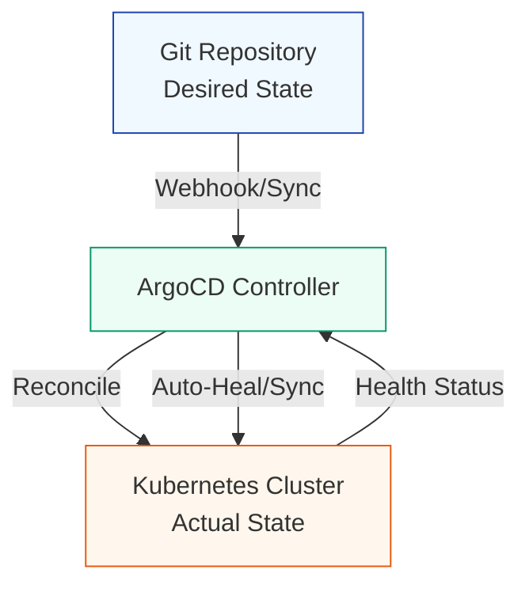

| Difficulty | Channel | Tags |
|---|---|---|
| beginner | devops | argocd, flux, declarative |

It was 3 AM when a team of engineers stared at the aftermath of yet another failed deployment, wondering how they would ever keep pace with their own growth. For Uber, this wasn't a one-off incident—it was the daily reality of operating thousands of microservices across the globe. As deployments stretched to an agonizing 45 minutes with a 12% failure rate, the team knew they needed a radical change. What they discovered about treating infrastructure as code would reshape not just their deployment pipeline, but the way an entire industry thinks about reliability [1].

---

> ### Real-World Case — Uber
>
> Uber was deploying thousands of microservices across multiple regions hundreds of times daily, pushing their traditional CI/CD pipelines past their breaking point. Deployment times averaged 45 minutes per service with a 12% failure rate, putting service reliability and developer velocity at risk.
>
> | | |
> |---|---|
> | **Challenge** | How to reliably synchronize configuration changes across a massive, multi-region microservices fleet while eliminating manual kubectl-driven deployments that caused configuration drift and slow, failure-prone rollouts. |
> | **Solution** | Uber adopted a GitOps model with ArgoCD as the core reconciler. ArgoCD was configured to continuously monitor Git repositories as the single source of truth and automatically sync changes to Kubernetes clusters in seconds. This replaced imperative workflows (direct kubectl commands) with a declarative approach where all desired state lived in Git. They also layered progressive delivery via feature flags (LaunchDarkly) to progressively roll out changes and catch issues before full deployment. |
> | **Outcome** | Deployment times dropped from 45 minutes to 12 minutes (73% improvement), deployment frequency increased from 3 to 15 per service per day, failed deployments fell from 12% to 2%, and Mean Time to Recovery dropped from 38 minutes to under 4 minutes. Feature flag gating caught 67% of potential issues before full rollout. |
> | **Lesson** | Declarative GitOps with ArgoCD's automated reconciliation eliminates configuration drift and human error, while progressive delivery provides the safety net needed to operate at extreme scale. The shift from imperative kubectl changes to Git-backed state transforms deployments from error-prone manual operations into reliable, auditable automation. |

---

## Hook — The Breaking Point No One Saw Coming

Picture this: your deployment pipeline is collapsing under its own success. Your company is growing exponentially, shipping features faster than ever, and every new service adds another straw to the camel's back. For Uber, that breaking point came as they juggled thousands of microservices deployed across multiple regions hundreds of times per day. The math was brutal: 45-minute deployment windows, 12% failure rates, and precious engineering hours lost to firefighting. This wasn't just inefficiency—it was a direct threat to developer velocity and system reliability. The question every team faces in this moment is simple: how do you scale deployments without sacrificing stability? This leads us to the heart of the problem.

## Problem — When Traditional CI/CD Hits the Wall

Most teams start with a straightforward approach: CI builds artifacts, CD pushes them to clusters. But as complexity multiplies, this imperative model begins to crack under pressure. Manual kubectl commands, configuration drift between environments, and tribal knowledge of "how things are deployed" create a minefield where a single typo can cascade into outages. You might think that faster pipelines are the answer, but speed without control is just recklessness at scale. The core challenge is trust: how do you ensure what's running in production matches what you intended? Without a single source of truth, every deployment becomes an act of faith rather than an automated, auditable process. This tension between velocity and safety is what makes GitOps so compelling.

## Real-World Case — Uber

Uber's deployment crisis is a textbook example of success breeding its own problems [1]. They were deploying thousands of microservices across multiple regions hundreds of times daily, pushing their traditional CI/CD pipelines past their breaking point. Deployment times averaged 45 minutes per service with a 12% failure rate, putting service reliability and developer velocity at risk. The transformation was dramatic: deployment times dropped from 45 minutes to 12 minutes (a 73% improvement), deployment frequency increased from 3 to 15 per service per day, failed deployments fell from 12% to 2%, and Mean Time to Recovery dropped from 38 minutes to under 4 minutes. Most tellingly, feature flag gating caught 67% of potential issues before full rollout. These numbers don't just reflect faster deployments—they reflect a fundamental shift in how Uber managed desired state at scale.

## Deep Dive — Declarative vs Imperative in GitOps

At the core of GitOps lies a philosophical shift: should you describe what you want, or tell the system how to do it? In the declarative approach, you define the complete desired state in Git using YAML manifests, Helm charts, or Kustomize configurations [2]. Tools like ArgoCD continuously reconcile the actual cluster state against this declared state, automatically correcting drift and rolling back unauthorized changes [3]. This creates a single source of truth where every change is versioned, auditable, and reproducible. In contrast, the imperative approach relies on kubectl commands to directly mutate the cluster state. While faster for ad-hoc fixes, this bypasses version control, invites configuration drift, and makes rollbacks painful and error-prone [4]. Many developers discover the hard way that imperative "quick fixes" at 2 AM often become the production bugs haunting them weeks later. The GitOps model flips the control loop: instead of pushing changes to the cluster, the cluster pulls changes from Git. This pull-based reconciliation is what enables self-healing and makes Git the source of truth [5].

## Workflow — How ArgoCD Orchestrates the Sync

So how does ArgoCD make this magic happen in practice? The workflow begins when you store your Kubernetes manifests—or Helm charts and Kustomize overlays—in a Git repository [3]. You then define an ArgoCD Application Custom Resource (CRD) that points to this repository, specifies the target cluster and namespace, and declares sync policies [2]. With auto-sync enabled (typically checking every 1-5 minutes), ArgoCD's controller continuously compares the live cluster state against what's in Git. When it detects drift—whether from a failed deployment, manual tampering, or a new commit—it reconciles the difference, applying only what's needed to reach the desired state. Self-healing ensures any unauthorized manual changes are automatically reverted, enforcing Git as the single source of truth. The diagram below visualizes this continuous reconciliation loop.

## Code Example — Defining an ArgoCD Application

To bring this workflow to life, you need to define an ArgoCD Application that tells ArgoCD what to sync and from where. The following example shows a minimal Application CRD configured for automatic syncing with self-healing enabled [2][3].

## Lessons Learned — Building Deployment Resilience

The Uber story teaches us that scale exposes weaknesses in even the best-intentioned pipelines. GitOps isn't just about faster deployments—it's about making deployments boring, predictable, and recoverable. Key lessons emerge: treat Git as the immutable source of truth; prefer declarative definitions over imperative commands; embrace self-healing to combat configuration drift; and instrument with health checks to catch issues early. Feature flagging, as Uber demonstrated, adds another safety layer by decoupling deploy from release [1]. But perhaps the most important insight is this: when you remove humans from the reconciliation loop and let machines enforce desired state, you trade manual heroics for systemic reliability. For teams drowning in deployment complexity, the path forward is clear: define it in Git, reconcile continuously, and let the system do the hard work of keeping reality aligned with intent.

---

## GitOps Sync Flow with ArgoCD

<strong>Original Interview Question</strong>

**Q:** You're setting up GitOps for a microservices deployment. How would you configure ArgoCD to automatically sync changes from your Git repository to Kubernetes, and what's the difference between declarative and imperative approaches in this context?

**A:** I'd configure ArgoCD by setting up a Git repository containing Kubernetes manifests or Helm charts, creating an Application CRD that points to the Git repository, enabling auto-sync with a health check interval of 3 minutes, and implementing self-healing to automatically revert any manual changes. The declarative approach involves defining the desired state in Git through YAML manifests, Helm charts, or Kustomize configurations, where ArgoCD continuously reconciles the actual state with the desired state. In contrast, the imperative approach uses kubectl commands to make direct changes to the cluster, bypassing the Git repository as the single source of truth.

## Conclusion

The journey from 45-minute deployments and 12% failure rates to sub-15-minute deploys with 2% failures isn't just about tooling—it's about embracing a fundamentally different mental model. By treating Git as the single source of truth and letting ArgoCD continuously reconcile desired state, teams transform deployment from a high-stakes event into a predictable, automated process. Tomorrow, take one step: pick a simple service, move its manifests to Git, and wire up an ArgoCD Application. You'll quickly discover what Uber learned—the real win isn't just speed, it's sleeping better knowing your cluster always matches what's in Git.

---

## References

1. [Uber incident report](https://drcodes.com/posts/how-uber-achieved-73-faster-deployments-with-gitops-argocd) — blog
2. [ArgoCD Documentation](https://argo-cd.readthedocs.io/) — documentation
3. [Kubernetes - Declarative Management of Objects](https://kubernetes.io/docs/tasks/manage-kubernetes-objects/declarative-config/) — documentation
4. [Kubernetes - Imperative Management of Objects](https://kubernetes.io/docs/tasks/manage-kubernetes-objects/imperative-command/) — documentation
5. [GitOps - What is GitOps?](https://about.gitlab.com/topics/gitops/) — documentation
6. [CNCF GitOps Definition](https://github.com/open-gitops/documents/blob/main/PRINCIPLES.md) — documentation
7. [Helm Documentation](https://helm.sh/docs/) — documentation
8. [Kustomize Documentation](https://kustomize.io/) — documentation

---

**Author:** Satishkumar Dhule — [GitHub](https://github.com/satishkumar-dhule) · [LinkedIn](https://linkedin.com/in/satishkumar-dhule) · [Website](https://satishkumar-dhule.github.io)
